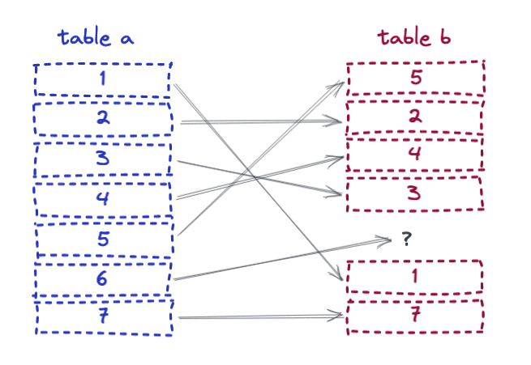
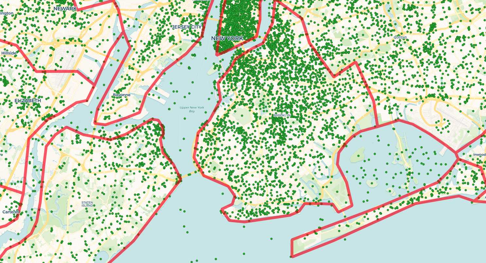
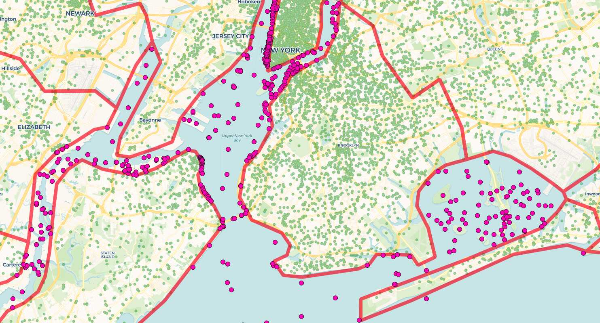

# Rise of the Anti-Join

Find me all the things in set "A" that are not in set "B". 



This is a pretty common query pattern, and it occurs in both non-spatial and spatial situations. As usual, there are multiple ways to express this query in SQL, but only a couple queries will result in the best possible performance.

## Setup

The non-spatial setup starts with two tables with the numbers 1 to 1,000,000 in them, then deletes two records from one of the tables.

```sql
CREATE TABLE a AS SELECT generate_series(1,1000000) AS i 
ORDER BY random();
CREATE INDEX a_x ON a (i);

CREATE TABLE b AS SELECT generate_series(1,1000000) AS i
ORDER BY random();
CREATE INDEX b_x ON b (i);

DELETE FROM b WHERE i = 444444;
DELETE FROM b WHERE i = 222222;

ANALYZE;
```

The spatial setup is a 2M record table of geographic names, and a 3K record table of county boundaries. Most of the geonames are inside counties (because we tend to names things on land) but some of them are not (because sometimes we name things in the ocean, or our boundaries are not detailed enough).




## Subqueries? No.

Since the problem statement includes the words "not in", this form of the query seems superficially plausible:

```sql
SELECT i 
  FROM a 
  WHERE i NOT IN (SELECT i FROM b);
```

Perfect! Give me everything from "A" that is not in "B"! Just what we want? In fact, running the query takes so long that I never got it to complete. The explain gives some hints.

```
                                  QUERY PLAN                                  
------------------------------------------------------------------------------
 Gather  (cost=1000.00..5381720008.33 rows=500000 width=4)
   Workers Planned: 2
   ->  Parallel Seq Scan on a  (cost=0.00..5381669008.33 rows=208333 width=4)
         Filter: (NOT (SubPlan 1))
         SubPlan 1
           ->  Materialize  (cost=0.00..23331.97 rows=999998 width=4)
                 ->  Seq Scan on b  (cost=0.00..14424.98 rows=999998 width=4)
```

Note that the subquery ends up materializing the whole second table into memory, where it is scanned **over and over and over** to test each key in table "A". Not good.


## Except? Maybe.

PostgreSQL supports some [set-based key words](https://www.postgresql.org/docs/current/queries-union.html) that allow you to find logical combinations of queries: `UNION`, `INTERSECT` and `EXCEPT`.

Here, we can make use of `EXCEPT`.

```sql
SELECT a.i FROM a
EXCEPT
SELECT b.i FROM b;
```

The SQL still matches our mental model of the problem statement: everything in "A" except for everything in "B".

And it returns a correct answer in about **2.3 seconds**.

```
   i    
--------
 222222
 444444
(2 rows)
```

The query plan is interesting: the two tables are appended and then sorted for duplicates and then only non-dupes are emitted!

```
                                         QUERY PLAN                                          
---------------------------------------------------------------------------------------------
 SetOp Except  (cost=322856.41..332856.40 rows=1000000 width=8)
   ->  Sort  (cost=322856.41..327856.41 rows=1999998 width=8)
         Sort Key: "*SELECT* 1".i
         ->  Append  (cost=0.00..58849.95 rows=1999998 width=8)
               ->  Subquery Scan on "*SELECT* 1"  (cost=0.00..24425.00 rows=1000000 width=8)
                     ->  Seq Scan on a  (cost=0.00..14425.00 rows=1000000 width=4)
               ->  Subquery Scan on "*SELECT* 2"  (cost=0.00..24424.96 rows=999998 width=8)
                     ->  Seq Scan on b  (cost=0.00..14424.98 rows=999998 width=4)
```

It's a big hammer, but it works.


## Anti-Join? Yes.

The best approach is the "anti-join". While not associated with the End Times, and not found in Revelations, the anti-join is nonetheless a powerful technique.


One way to express an anti-join is with a special "correlated subquery" syntax:

```sql
SELECT a.i 
  FROM a
  WHERE NOT EXISTS
    (SELECT b.i FROM b WHERE a.i = b.i);
```

So this returns results from "A" only where those results result in a no-record-returned subquery against "B".

It takes about **850 ms** on my test laptop, so **3 times** faster than using `EXCEPT` in this test, and gets the right answer. The query plan looks like this:

```
                                     QUERY PLAN                                     
------------------------------------------------------------------------------------
 Gather  (cost=16427.98..31466.36 rows=2 width=4)
   Workers Planned: 2
   ->  Parallel Hash Anti Join  (cost=15427.98..30466.16 rows=1 width=4)
         Hash Cond: (a.i = b.i)
         ->  Parallel Seq Scan on a  (cost=0.00..8591.67 rows=416667 width=4)
         ->  Parallel Hash  (cost=8591.66..8591.66 rows=416666 width=4)
               ->  Parallel Seq Scan on b  (cost=0.00..8591.66 rows=416666 width=4)
```

The same sentiment can be expressed without the `NOT EXISTS` construct, using only basic SQL and a `LEFT JOIN`:

```sql
SELECT a.i
  FROM a
  LEFT JOIN b ON (a.i = b.i)
  WHERE b.i IS NULL;
```

This also takes about **850 ms**. The `LEFT JOIN` is required to return a record for every row of "A". So what does it do if there's no record in "B" that satisfies the join condition? It returns `NULL` for the columns of "B" in the join relation for those records. That means any row with a `NULL` in a column of "B" that is normally non-`NULL` is a record in "A" that is not in "B".


## Now do Spatial

The nice thing about the `LEFT JOIN` expression of of the solution is that it generalizes nicely to arbitrary join conditions, like those using spatial predicate functions.

"Find the geonames points that are not inside counties"... OK, we will left join geonames with counties and find the records where counties are `NULL`.

```sql
SELECT g.name, g.geonameid, g.geom
  FROM geonames g
  LEFT JOIN counties c
    ON ST_Contains(c.geom, g.geom)
  WHERE g.geom IS NULL;
```

The answer pops out in about a minute.



Unsurprisingly, that's about how long a standard inner join takes to associated the 2M geonames with the 3K counties, since the anti-join has to do about that much work to determine which records do not match the join condition.


## Conclusion

* "Find the things in A that aren't in B" is a common use pattern.
* The "obvious" SQL patterns might not be the most efficient ones.
* The `WHERE NOT EXISTS` and `LEFT JOIN` patterns both result in the most efficient query plans and executions.

