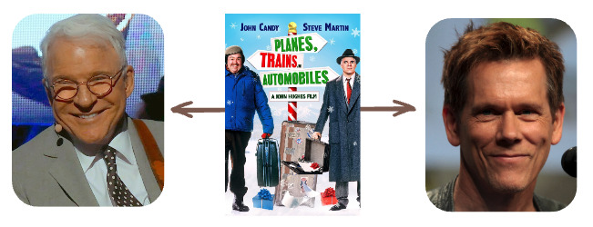
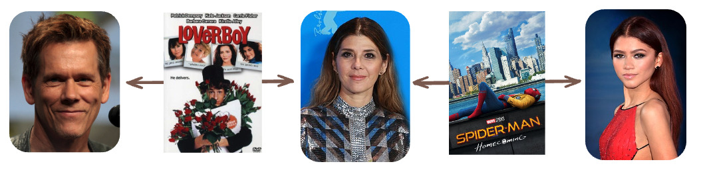
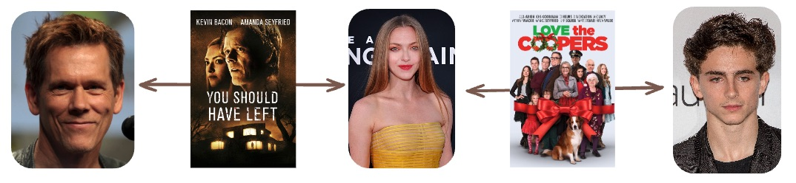
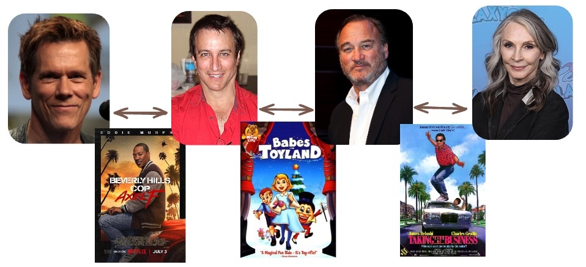

# Six Degrees of Kevin Bacon

Back in the 1990s, before anything was cool (or so my children tell me) and at the dawn of the Age of the Meme, a couple of college students invented a game they called the "[Six Degrees of Kevin Bacon](https://en.wikipedia.org/wiki/Six_Degrees_of_Kevin_Bacon)". 

The conceit behind the _Six Degrees of Kevin Bacon_ was that actor [Kevin Bacon](https://en.wikipedia.org/wiki/Kevin_Bacon) could be connected to any other actor, via a chain of association of no more than six steps.

Why Kevin Bacon? More or less arbitrarily, but the students had noted that Bacon said in an interview that "he had worked with everybody in Hollywood or someone who's worked with them" and took that statement as a challenge. 

## Bacon Number

The number of steps necessary to get from some actor to Kevin Bacon is their "Bacon Number". 

For example, comedy legend [Steve Martin](https://en.wikipedia.org/wiki/Steve_Martin) has a Bacon Number of 1, since Kevin Bacon appeared with him in the 1987 road trip comedy [Planes, Trains and Automobiles](https://en.wikipedia.org/wiki/Planes,_Trains_and_Automobiles).



Zendaya has as Bacon number of 2. In 2017 she appeared with [Marisa Tomei](https://en.wikipedia.org/wiki/Marisa_Tomei) in [Spider-Man: Homecoming](https://en.wikipedia.org/wiki/Spider-Man:_Homecoming), and in 2005 Tomei appeared with Bacon in [Loverboy](https://en.wikipedia.org/wiki/Loverboy_(2005_film)) (which Bacon also directed).



## IMDB Data

The challenge of the original '90s _Six Degrees of Kevin Bacon_ was to link up two actors using only the knowledge in your head. This seems improbably difficult to me, but perhaps people were smarter in the '90s.

In our modern age we don't need to be smart, we can attack the Bacon Number problem by combining data and algorithms.

The data half of the problem is relatively straightforward -- the [Internet Movie Database](https://www.imdb.com/) (aka IMDB) allows [direct download](https://datasets.imdbws.com/) of the information we need need. 

In particular, the

* `name.basics.tsv.gz` file for peoples names and jobs
* `title.basics.tsv.gz` file for movie names and dates    
* `title.principals.tsv.gz` file for relationships between people and movies

The IMDB database files actually include information about every job on a film (writers, directors, producers, casting, etc, etc) and we are only interested in **actors** for the Kevin Bacon game. 

<details><summary>ETL process to download and process raw data</summary>

```sql

CREATE SCHEMA imdb;

------------------------------------------------------------------------
-- Load the names from the raw file
--

CREATE TABLE imdb.name_basics (
    nconst  text,
    primaryName  text,
    birthYear integer,
    deathYear integer,
    primaryProfession text,
    knownForTitles text
);

COPY imdb.name_basics 
    FROM program 'curl https://datasets.imdbws.com/name.basics.tsv.gz | gunzip' 
    WITH (
        FORMAT csv,
        DELIMITER E'\t',
        NULL '\N',
        HEADER true,
        QUOTE E'\x01'
    );

CREATE INDEX name_basics_pk ON imdb.name_basics (nconst);

------------------------------------------------------------------------
-- Strip down the raw to just actors and actresses in an 'actors' table
--

CREATE TABLE actors AS 
    SELECT int4(substring(nconst, 3,15)) AS actor_id,
        nconst,
        primaryname AS name,
        int2(birthyear) AS birthyear,
        int2(deathyear) AS deathyear
    FROM imdb.name_basics
    WHERE (primaryProfession ~ '^act' OR primaryProfession ~ ',act')
    AND birthyear IS NOT NULL;

CREATE UNIQUE INDEX actors_pk ON actors (actor_id);
CREATE INDEX actors_nconst_x ON actors (nconst);

------------------------------------------------------------------------
-- Load the movie titles from the raw file
--

CREATE TABLE imdb.title_basics (
    tconst text,
    titleType text,       
    primaryTitle text,    
    originalTitle text,   
    isAdult boolean, 
    startYear integer,       
    endYear integer, 
    runtimeMinutes integer,  
    genres text
    );

COPY imdb.title_basics 
    FROM program 'curl https://datasets.imdbws.com/title.basics.tsv.gz | gunzip' 
    WITH (
        FORMAT csv,
        DELIMITER E'\t',
        NULL '\N',
        HEADER true,
        QUOTE E'\x01'
    );

------------------------------------------------------------------------
-- Strip down the raw table to just movies, no tv shows, etc.
--

CREATE TABLE movies AS 
    SELECT int4(substring(tconst, 3,15)) AS movie_id,
        tconst,
        primaryTitle AS title,
        int2(startyear) as startyear, int2(endyear) as endyear,
        runtimeminutes as runtimeminutes
    FROM imdb.title_basics
    WHERE titleType = 'movie'
      AND NOT isadult;

CREATE UNIQUE INDEX movies_pk ON movies (movie_id);
CREATE INDEX movies_tconst_x ON movies (tconst);

------------------------------------------------------------------------
-- Load the raw table of movie/job relationships
--

CREATE TABLE imdb.title_principals (
    tconst text,  
    ordering integer,        
    nconst text,  
    category text,        
    job text,     
    characters text
);

COPY imdb.title_principals 
    FROM program 'curl https://datasets.imdbws.com/title.principals.tsv.gz | gunzip title.principals.tsv.gz' 
    WITH (
        FORMAT csv,
        DELIMITER E'\t',
        NULL '\N',
        HEADER true,
        QUOTE E'\x01'
    );

CREATE INDEX title_principals_tx ON imdb.title_principals (tconst);
CREATE INDEX title_principals_nx ON imdb.title_principals (nconst);

------------------------------------------------------------------------
-- Strip down the raw table to just the ids defining the relationship
--

CREATE TABLE movie_actors AS 
    SELECT m.movie_id,
        a.actor_id
    FROM imdb.title_principals i
    JOIN actors a ON a.nconst = i.nconst 
    JOIN movies m ON m.tconst = i.tconst
    WHERE i.category ~ '^act';

CREATE INDEX movie_actors_ax ON movie_actors (actor_id);
CREATE INDEX movie_actors_mx ON movie_actors (movie_id);

```

</details>


In order to make the tables smaller and functions faster, the raw files are stripped down during the ETL process, and the result is three smaller tables.

* `actors` has 371,557 rows
* `movies` has 678,204 rows, and
* `movie_actors` has 1,866,533 rows.


## Graph Solver

So, what is the algorithm we need to calculate the Bacon Number for any given actor? Look at the example above, for Steve Martin and Zendaya. Actors are joined together by movies. Taken together, the actors and movies form a [graph](https://en.wikipedia.org/wiki/Graph_theory)! The actors are **nodes** of the graph and the movies are **edges** of the graph.


And fortunately PostgreSQL already has a **graph solver** available, [pgRouting](https://pgrouting.org/)!

(Wait, isn't pgRouting for solving transportation optimization problems? Well, that is what it is **mostly** used for, but it is built as a **completely generic graph solver**, suitable for all kinds of graph algorithms, including the [Dijkstra shortest path](https://en.wikipedia.org/wiki/Dijkstra%27s_algorithm) algorithm we need to calculate a Bacon Number.)

Alternately, we could approach the problem directly within core PostgreSQL using a "[recursive CTE](https://www.postgresql.org/docs/current/queries-with.html#QUERIES-WITH-RECURSIVE)" to walk the graph.

Let's look at both approaches.

## Build the Graph

For both approaches we need to expand out our table of movie/actor relationships into a table of **graph edges** where each edge is one pairing of actors in the same movie. 

```sql
CREATE TABLE actor_graph AS
SELECT 
  row_number() OVER () AS edge_id,
  a.actor_id AS actor_id, 
  a.movie_id AS movie_id, 
  b.actor_id AS other_actor_id
FROM movie_actors a
JOIN movie_actors b ON a.movie_id = b.movie_id 
WHERE a.actor_id != b.actor_id;

CREATE INDEX actor_graph_id_x ON actor_graph (actor_id);
CREATE INDEX actor_graph_other_id_x ON actor_graph (other_actor_id);
CREATE INDEX actor_graph_edge_id_x ON actor_graph (edge_id);
```

Self-joining the `movie_actors` table gets us a table of 11M edges that form the `actor_graph`.

```sql
SELECT * FROM actor_graph LIMIT 5;
```
```
 edge_id | actor_id | movie_id | other_actor_id 
---------+----------+----------+----------------
       1 |   951773 |  1861414 |         764895
       2 |   951773 |  1861414 |         618628
       3 |   951773 |  1861414 |         244428
       4 |   951773 |  1861414 |         258574
       5 |   951773 |  1861414 |         147923
```


## pgRouting

[pgRouting](https://pgrouting.org/) is a unique solver that allows you to dynamically create the graph you will be solving on. This makes a lot of sense for a solver built into the database, since the data in a database is presumed to be fairly **dynamic**. 

Every algorithm in pgRouting takes in a SQL query that generates the graph to be worked on, and  parameters suitable for the algorithm chosen. 

We are using the [Dijksta algorithm](https://docs.pgrouting.org/latest/en/pgr_dijkstra.html), so the parameters are just the graph **SQL**, the **start node** and the **end node**.

Everything works off integer keys, so we start by finding the keys for two actors, **Kevin Bacon** and **Timothée Chalamet**.

```sql
CREATE EXTENSION pgrouting

SELECT actor_id FROM actors WHERE name = 'Kevin Bacon';
SELECT actor_id FROM actors WHERE name = 'Timothée Chalamet';

SELECT seq, node, edge FROM pgr_dijkstra(
    'SELECT 
        a.movie_id AS id, 
        a.actor_id AS source, 
        b.other_actor_id AS target,
        1.0 AS cost
        FROM actor_graph a', 
    3154303, -- Timothée Chalamet
    102      -- Kevin Bacon
    );
```

What comes back (in about 5 seconds) is the list of edges that forms the shortest path.

```
 seq |  node   |   edge   
-----+---------+----------
   1 | 3154303 | 11286314
   2 | 2225369 |  1270798
   3 |     102 |       -1
```

This example is one that works against the strengths of pgRouting. We are asking for a route through a static graph, not a dynamic graph, and we are routing through a very large graph (11M edges). 

Each run of the function will pull the whole graph out of the database, form the graph using the node keys, and then finally run the Dijkstra algorithm. 

For our 11M record table, this takes about 5 seconds.


## Recursive CTE

For this particular problem, it turns out that recursive CTE is a great fit. The graph is static, and the number of steps needed to form a shortest path is quite small -- no more than 6, according to our rules.

The downside of [recursive CTE](https://www.postgresql.org/docs/current/queries-with.html#QUERIES-WITH-RECURSIVE) should be apparent from this example and the documentation. In a world of confusing SQL, recursive CTE SQL is the most confusing of all.

Here's a bare query to run the same search as we ran in pgRouting 

```sql
WITH RECURSIVE bacon_numbers AS (
-- Starting nodes
SELECT
  ag.actor_id, 
  ag.movie_id,
  ag.other_actor_id,
  1 AS bacon_number,
  ARRAY[ag.edge_id] AS path,
  false AS is_cycle
FROM actor_graph AS ag
WHERE actor_id = 102 -- Kevin Bacon

UNION ALL

-- Recursive set
SELECT
  bn.actor_id,
  ag.movie_id,
  ag.other_actor_id,
  bn.bacon_number + 1 AS bacon_number,
  path || ag.edge_id AS path,
  ag.edge_id = ANY(path) AS is_cycle
FROM actor_graph AS ag
JOIN bacon_numbers AS bn
  ON bn.other_actor_id = ag.actor_id
WHERE bn.bacon_number <= 5
  AND NOT is_cycle
)
SELECT path FROM bacon_numbers
WHERE other_actor_id = 3154303 -- Timothée Chalamet
LIMIT 1;
```

The `path` return array is an ordered list of edges the take us from the start node (Bacon) to the end node (Chalamet).

```
       path        
-------------------
 {2016551,4962882}
```

Join the edges and nodes back up to their human readable movies and actors.

```sql
SELECT a.name, m.title, m.startyear, o.name
FROM unnest('{2016551,4962882}'::integer[]) p
JOIN actor_graph ag ON ag.edge_id = p
JOIN actors a USING (actor_id)
JOIN actors o ON ag.other_actor_id = o.actor_id
JOIN movies m USING (movie_id)
```

And we see the second order path from Kevin Bacon to Timothée Chalamet.

```
      name       |        title         | startyear |       name        
-----------------+----------------------+-----------+-------------------
 Kevin Bacon     | You Should Have Left |      2020 | Amanda Seyfried
 Amanda Seyfried | Love the Coopers     |      2015 | Timothée Chalamet
```



If you want to play around and try and find higher numbers, here is a complete PL/PgSQL function to simplify the process.

<details><summary>PL/PgSQL Function for RCTE Bacon search</summary>

```sql

CREATE OR REPLACE FUNCTION bacon(query_name text)
RETURNS TABLE(name text, title text, year smallint, othername text, n bigint) AS $$
DECLARE
    bacon_id INTEGER := 102;
    query_id INTEGER;
    row_count INTEGER;
BEGIN
    SELECT actor_id INTO query_id
    FROM actors 
    WHERE actors.name = query_name;
    GET DIAGNOSTICS row_count = ROW_COUNT;

    IF (row_count != 1) THEN
        RAISE EXCEPTION 'Found % entries for actor %', row_count, query_name;
    END IF;

    RETURN QUERY
    WITH RECURSIVE bacon_numbers AS (
    SELECT
      ag.actor_id, 
      ag.movie_id,
      ag.other_actor_id,
      1 AS bacon_number,
      ARRAY[ag.edge_id] AS path,
      false AS is_cycle
    FROM actor_graph AS ag
    WHERE actor_id = 102 -- Kevin Bacon
    UNION ALL
    SELECT
      bn.actor_id,
      ag.movie_id,
      ag.other_actor_id,
      bn.bacon_number + 1 AS bacon_number,
      path || ag.edge_id AS path,
      ag.edge_id = ANY(path) AS is_cycle
    FROM actor_graph AS ag
    JOIN bacon_numbers AS bn
      ON bn.other_actor_id = ag.actor_id
    WHERE bn.bacon_number <= 5
      AND NOT is_cycle
    ),
    bacon_path AS (
        SELECT path, bacon_number FROM bacon_numbers
        WHERE other_actor_id = query_id 
        LIMIT 1
    )
    SELECT a.name, m.title, m.startyear, o.name, e.n
    FROM bacon_path, unnest(path) WITH ORDINALITY e(edge_id, n)
    JOIN actor_graph ag ON ag.edge_id = e.edge_id
    JOIN actors a ON ag.actor_id = a.actor_id
    JOIN actors o ON ag.other_actor_id = o.actor_id
    JOIN movies m ON ag.movie_id = m.movie_id
    ORDER BY e.n;

END;
$$ LANGUAGE 'plpgsql';
```

</details>

The highest number I have found so far is a *3* for Gates McFadden, who played _Doctor Crusher_ in _Star Trek: The Next Generation_. 

```sql
SELECT * FROM bacon('Gates McFadden');
```

```
      name       |           title           | year |    othername    | n 
-----------------+---------------------------+------+-----------------+---
 Kevin Bacon     | Beverly Hills Cop: Axel F | 2024 | Bronson Pinchot | 1
 Bronson Pinchot | Babes in Toyland          | 1997 | Jim Belushi     | 2
 Jim Belushi     | Taking Care of Business   | 1990 | Gates McFadden  | 3
```



## Conclusions

* Graph solving problems do not require special external software, you can attack those problems in PostgreSQL using pgRouting or a custom recursive CTE.
* pgRouting is good for smaller graphs and especially powerful for graphs that are generated dynamically, to reflect changes in data, or changes in the desired graph.
* Recursive CTEs can handle much larger graphs, but not large traversals of those graphs, as they tend to pile up very large intermediate results that grow with each recursion.
