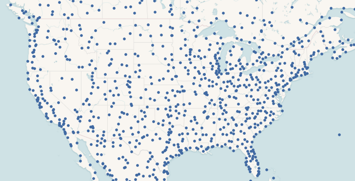

# PostGIS Raster and Crunchy Bridge

The PostGIS raster has a steep learning curve, but it opens up some unique possibilities for data analysis and accessing non-standard data from within PostgreSQL.
Here's an example that shows how to access raster data from PostGIS.

## When to use Raster

The raster data type in PostGIS can be used to store any kind of raster data: images, elevation grids, model outputs, and more. One band, four band, multi-band and anything in between.

This flexibility leads some beginners to dump all their imagery into the database as "step one" in a system design. **Don't do that.** If your use case of images or rasters is just "store and retrieve" you will probably be better served by a solution purpose built for raster serving. 

PostGIS raster is relatively slow at data access, but it makes up for that in flexibility. Because the language of access is SQL, and because you also have access to all the **other** data in your system, you can do analyses very simply that might be very complex in another environment, as we'll see below.

## In-DB vs Out-DB

There are actually two ways to store raster in the database: 

* "in-db" storage is, as it sounds, a loading of the actual raster byte stream into the database as an object. So if you have 2TB of rasters, and you load it into the database, you'll end up with a 2TB database. (Or more, "in-db" raster storage is rarely as well compressed as the source data.)
* "out-db" storage loads a pointer into the database, that includes a bounds and a reference to the location of an external file within which the data can be found. So if you load 2TB of rasters as "out-db" you'll end up with quite a small table in your database, and you'll still have to store your files somewhere the database can access them.

When PostGIS raster was first written, most people used "in-db" because it was more convenient for simple tasks: everything was in one place, you didn't have to manage both the database and the files.

Now, the most flexible way to work with rasters in the database is to store them in the cloud, and access them from a database as "out-db" rasters.

## Cloud Rasters

This "remote access" of rasters is made possible by the [GDAL](https://gdal.org) raster engine that underlies PostGIS raster. GDAL can read from rasters hosted at a web URL, using HTTP [byte-range](https://www.w3.org/Protocols/rfc2616/rfc2616-sec14.html#sec14.35) calls to pull small subsets out of the files.

For formats that allow "internal tiling", it is possible for GDAL to access a square subset of data in just a handful of HTTP requests. This property, taken to an extreme, has led to the "[cloud optimized geotiff](https://www.cogeo.org/)" standard, which is just a simple collection of internally tiled TIFF files.

Using nothing but this clever format, it's now possible to provide access to very large collections of raster data, using nothing but "object storage": [AWS S3](https://aws.amazon.com/s3/), [Google CS](https://cloud.google.com/storage/), [Azure Storage](https://azure.microsoft.com/en-us/services/storage/), or any HTTP 1.1  server that supports range requests.

## An Example

This example is made up of the following steps:

* Get the data tools we need;
* Download gridded weather forecast data from NOAA;
* Convert forecast data to an efficient tiled format;
* Upload tiled data to the cloud;
* Set up database with PostGIS raster;
* Register the tiled data in a PostGIS database;
* Load some vector data; and,
* Query the raster data from within the database.

## Tools

This example uses:

* PostGIS **client tools**. In particular, `raster2pgsql` for raster loading and `shp2pgsql` for shape file loading. These binaries are available in the [postgis30_12-client](https://centos.pkgs.org/8/postgresql-12-x86_64/postgis30_12-client-3.0.3-1.rhel8.x86_64.rpm.html) RPM.
* GDAL `gdal_translate` for raster formats. This binary is in the [gdal](https://centos.pkgs.org/8/epel-x86_64/gdal-3.0.4-5.el8.x86_64.rpm.html) RPM.
* Curl for web querying. From the [curl](https://centos.pkgs.org/8/centos-baseos-armhfp/curl-7.61.1-11.el8.armv7hl.rpm.html) RPM.
* AWS command-line utility, for S3 upload, [from Amazon](https://docs.aws.amazon.com/cli/latest/userguide/install-cliv2.html).

## Download Weather Data

The US National Weather Service provides forecast data in gridded formats, updated every 6 hours, for a number of variables. We are going to work with "probability of precipitation" (PoP), which is available in this file:

* http://tgftp.nws.noaa.gov/SL.us008001/ST.opnl/DF.gr2/DC.ndfd/AR.conus/VP.001-003/ds.pop12.bin

You can get a feel for the contents by reading the "gdalinfo" output for the file.

```
gdalinfo /vsicurl/http://tgftp.nws.noaa.gov/SL.us008001/ST.opnl/DF.gr2/DC.ndfd/AR.conus/VP.001-003/ds.pop12.bin
```

This one file actually includes a number of forecasts, one for each six-hour period, for up to six periods starting from the present. Each forecast is stored as a separate band. So the current PoP is in band 1, the PoP for 6 to 12 hours from now in band 2, and so on.


Extracting each band, and then fusing them together in an animated GIF, you can see the forecast period play out, as the weather systems move east in each successive forecast.

In order to georeference this raster, we need to know its coordinate reference system, and fortunately that information is embedded in the file. Converted into "[proj4](https://proj.org)" syntax it looks like this:

```
+proj=lcc  +lon_0=-95 +lat_0=25 +lat_1=25 +lat_2=25 +x_0=0 +y_0=0 +datum=WGS84 +units=m
```

It is a "Lambert Conformal Conic" (lcc) with an origin at (-95,25) and no offsets. We will use this information later when loading the data into the database.

## Convert Weather Grid to Cloud Format

For efficiency, we want the weather grid data in a format that is as small as possible, and internally tiled.

The grid format stores the PoP as doubles which is very inefficient, since the values just run from 0 to 100, so we will convert the type to "Byte" at the same time as we tile the data internally.

```
url=http://tgftp.nws.noaa.gov/SL.us008001/ST.opnl/DF.gr2/DC.ndfd/AR.conus/VP.001-003/ds.pop12.bin

gdal_translate \
  -a_nodata 255 \           # Use high byte as NODATA
  -co COMPRESS=DEFLATE \    # Apply compression
  -co ZLEVEL=9 \            # Use highest compression
  -co PREDICTOR=2 \         # Compression predictor
  -co TILED=YES \           # Apply default (256x256) tiling
  -ot Byte \                # Convert data to byte type
  /vsicurl/$url \           # Input file
  pop12.tif                 # Output file
```

Note that we can retrieve the weather data directly from the NOAA web site for processing, we don't have to manually download it first. 

## Upload Raster to Cloud

Now that we have the raster file, in a compact tiled format, we upload it to S3.

```
aws s3 cp --acl public-read pop12.tif s3://weather.cleverelephant.ca/pop12.tif 
```

In this example I'm using a public S3 bucket called "weather.cleverelephant.ca". We can check that the data is uploaded and accessible using `curl`.

```
curl -I https://s3-us-west-2.amazonaws.com/weather.cleverelephant.ca/pop12.tif
```

Yes, all ready.

```
HTTP/1.1 200 OK
x-amz-request-id: 7BE108964CDEFA96
Date: Tue, 15 Dec 2020 21:13:50 GMT
Last-Modified: Tue, 15 Dec 2020 18:45:00 GMT
ETag: "f7f18b8cb8a3502d11ed084d857884ec"
Accept-Ranges: bytes
Content-Type: image/tiff
Content-Length: 1203391
Server: AmazonS3
```


## Setup Database

For this example, I have provisioned a [Crunchy Bridge](https://crunchybridge.com) database instance in the same data centre (US West 2 Oregon) as my grid data are stored, so the network latency between database and storage is as low as possible.


Now I need to log into the database, and enable PostGIS and raster:

```sql
CREATE EXTENSION postgis;
CREATE EXTENSION postgis_raster;
```

By default, the raster module ships with the "out-db" functionality locked down. In order to use it to access cloud rasters, we have to both turn it on, and enable the drivers we need for cloud access.

```sql
ALTER DATABASE postgres SET postgis.enable_outdb_rasters = true;
ALTER DATABASE postgres SET postgis.gdal_enabled_drivers TO 'ENABLE_ALL';
```

Unfortunately the NOAA raster data is in a custom projection, so we need to register that projection in order to work easily with the data. Taking the projection information we read from the file earlier, we insert it into the PostGIS "spatial_ref_sys" table and give it an SRID number (990000)

```sql
INSERT INTO spatial_ref_sys (srid, proj4text)
VALUES (
  990000, 
  '+proj=lcc  +lon_0=-95 +lat_0=25 +lat_1=25 +lat_2=25 +x_0=0 +y_0=0 +datum=WGS84 +units=m +no_defs'
  );
```

Now we are ready to register the rasters.

## Register Rasters

The raster data is already uploaded into the cloud, and that's the copy we want to register, not our local copy, so the registration command looks like this:

```
url=https://s3-us-west-2.amazonaws.com/weather.cleverelephant.ca/pop12.tif

raster2pgsql \     
  -s 990000 \        # SRID of the data
  -t 256x256 \       # Tile raster
  -I \               # Index the table
  -R \               # Load as "out-db", metadata only
  /vsicurl/$url \    # File to reference
  pop12 \            # Table name to use
  | psql $DATABASE_URL
```

Now we have a "pop12" table in the database! 

Rather than load the file (which is 2000 by 1000 pixels in size) as one raster reference we have used a "tiling" to turn it into a collection of smaller rasters. This allows us to answer small localized queries with relatively small chunks of the remote raster. And because the remote raster is **also** tiled, the back-end can pull relatively small chunks back to fulfill the queries.


Each raster tile has an extent, pixel size, number of bands, etc.

```
# SELECT (ST_MetaData(rast)).* FROM pop12 LIMIT 1;

upperleftx | -2764474.350731994
upperlefty | 3232111.7107923944
width      | 256
height     | 256
scalex     | 2539.703
scaley     | -2539.703
skewx      | 0
skewy      | 0
srid       | 990000
numbands   | 6
```

They also each have a reference to the remote data file.

```
# SELECT (ST_BandMetaData(rast)).* FROM pop12 LIMIT 1;

pixeltype     | 8BUI
nodatavalue   | 255
isoutdb       | t
path          | /vsicurl/https://s3-us-west-2.amazonaws.com/weather.cleverelephant.ca/pop12.tif
outdbbandnum  | 1
filesize      | 1203391
filetimestamp | 1608057900
```

## Load Vector Data

For the final query of the example, we want some location points, so before moving on to query, we load up that data.

* https://www.naturalearthdata.com/downloads/10m-cultural-vectors/

Download the populated places file, and load it into the database.

```
shp2pgsql \
  -D \                              # Use dump format for speed
  -s 4326 \                         # Use SRID 4326 (aka Lon/Lat)
  -I \                              # Spatially index the table
  ne_10m_populated_places_simple \  # Input file
  places \                          # Output table name
  | psql $DATABASE_URL
```



Now we are ready to query!

## Query the Rasters

First, to demonstrate simple point-wise access to the data.


```sql
WITH pt AS (
  SELECT ST_Transform(ST_SetSRID(ST_MakePoint(-80, 35), 4326), 990000) AS pt
)
SELECT ST_Value(rast, 1, pt.pt) as pop 
FROM pop12
CROSS JOIN pt
WHERE ST_Intersects(pt.pt, st_convexhull(rast))
```

We build a point at (-80, 35), and then convert it into the coordinate system of the raster. We find only raster tile that intersects that point, and from it we pull the value of band one.

```
 pop 
-----
   0
```

Zero! But that's the PoP for the current 6-hour period. What about into the future? We have 6 bands, can we query them all?

```sql
WITH pt AS (
  SELECT ST_Transform(ST_SetSRID(ST_MakePoint(-80, 35), 4326), 990000) AS pt
)
SELECT b, ST_Value(rast, b, pt.pt) as pop 
FROM pop12
CROSS JOIN pt
CROSS JOIN generate_series(1,6) b
WHERE ST_Intersects(pt.pt, st_convexhull(rast))
```

Yes, we can, by joining against a list of bands. 

```
 b | pop 
---+-----
 1 |   0
 2 |   0
 3 |  71
 4 |  90
 5 |  16
 6 |   2
```

And we see that by tomorrow morning (18 to 24 hours from now) the chance of rain at our point will be going up.

## Query the Rasters (Spatial Join!)

The real fun starts when we combine data from multiple sources for a query in a [spatial join](https://www.katacoda.com/crunchydata/courses/postgis/joins).

We have populated places loaded into the database already, from the 7343 places, can we find the 10 places with the highest chance of rain tomorrow?

Sure! We want to

* Restrict the query to just the USA, since our weather data is not global.
* Find the PoP in band 4, since each band is a 6 hour prediction: 4 * 6 = 24 hours from now.
* Reproject the places to the SRS of the rasters to find the right raster tile for each place.

This is what it looks like.

```sql
SELECT 
  places.name, places.adm1name, 
  ST_Value(rast, 5, ST_Transform(places.geom, 990000)) AS pop 
FROM pop12
JOIN places 
  ON ST_Intersects(ST_Transform(places.geom, 990000), ST_ConvexHull(rast))
WHERE places.sov_a3 = 'USA'
ORDER BY pop DESC 
LIMIT 10;
```

And it looks like, in 24 hours the rainiest area will be the north-east USA.

```
     name     |   adm1name    | pop 
--------------+---------------+-----
 Scranton     | Pennsylvania  | 100
 Wilkes Barre | Pennsylvania  | 100
 Binghamton   | New York      |  99
 New London   | Connecticut   |  99
 Elmira       | New York      |  99
 New Haven    | Connecticut   |  98
 Waterbury    | Connecticut   |  97
 Bridgeport   | Connecticut   |  97
 Stamford     | Connecticut   |  97
 New Bedford  | Massachusetts |  96
```

In order to get the result, the database has to attach a PoP to every point in the USA before sorting to find the highest values. 

There are 777 places in the USA, and the query takes about 2 seconds, with the external raster queries are costing about 2.5ms on average. GDAL does some caching of raster tiles on the backend, and a single point query is much slower (about 35ms).

## Conclusion

By separating the problem of raster storage, and delegating it to the cloud, it's possible to buil up a PostGIS raster query engine that has nothing but raster metadata loaded, yet retains full access to the underlying raster values.

The GDAL tools for manipulating cloud rasters are incredibly useful, and with each release gain more power and efficiency. That same library underlies the PostGIS raster "out-db" access mechanism, so it is available to users of the PostGIS raster module too.

Crunchy Bridge allows you to deploy a raster-enabled PostGIS, with recent support libraries, and access to all the drivers to support this kind of a solution.


