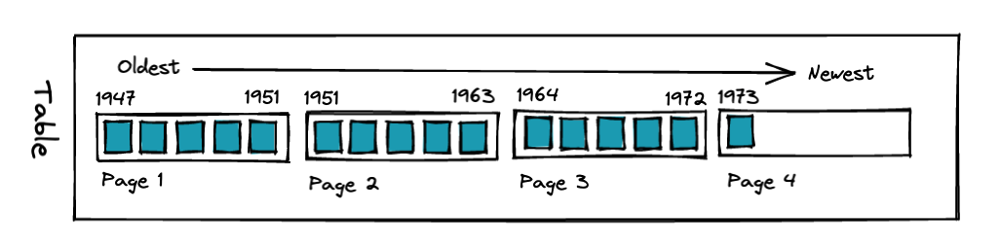
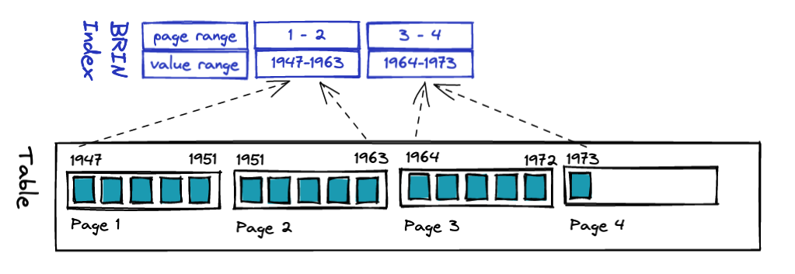

# PostgreSQL BRIN Indexes

The PostgreSQL BRIN index is a specialized index for (as the documentation says) "handling very large tables in which certain columns have some natural correlation with their physical location within the table".

For data of that sort, BRIN indexes offer extremely low insert costs (good for high velocity data) and extremely small index sizes (good for high volume data).

But what data has this "natural correlation"?

Most frequently, data with a timestamp that is continuously adding new rows. 

* A log table
* A table of GPS track points
* A table of IoT sensor measurements

In these examples the timestamp will be either the insertion time or the measurement time, and the stream of new data will be appended to the table more-or-less in the same order as the timestamp column values.

So that's a pretty narrow subset of the kinds of data you might manage. However, if you *do* have that kind of data, BRIN indexes might be helpful.

## Under the Covers

Because the BRIN index is so simple, it's possible to describe the internals with barely any simplifying.

Data in PostgreSQL tables are **arranged on disk in equal-sized "pages"** of 8kb each. So a table will physically reside on disk as a collection of pages. Within each page, rows are packed in from the front, with gaps appearing as data is deleted/updated and usually some spare space at the end for future updates. 


A table with narrow rows (few columns, small values) will fit a lot of rows into a page. A table with wide rows (more columns, long strings) will fit only a few.

Because each page holds multiple rows, we can state that a given column in that page has a minimum and maximum value in that page. When searching for a particular value, the whole page can be skipped, if the value is not within the min/max of the page. This is the core **magic of BRIN**.

So, for BRIN to be effective, you need a table where the **physical layout** and the **ordering of the column of interest** are **strongly correlated**. In situation of perfect correlation (which we test below) each page will in fact contain a completely unique set of of values.



The BRIN index is just a small table that associates a range of values with a range of pages in the table order. Building the index just requires a single scan of the table, so compared to building a structure like a BTree, it is very fast. 



Because the BRIN has one entry for each range of pages, it's also very small. The number of pages in a range is configurable, but the default is 128. As we will see, tuning this number can make a **big difference** in query performance.


## Measuring the Differences

For testing, we generate a table with three columns: one key completely uncorrelated to the storage on disk ("random"), one key perfectly correlated ("sequential"), and a "value" column to retrieve. 

```sql
CREATE TABLE test AS 
  SELECT 1000000.0*random() AS random, 
                  a::float8 AS sequential,
                  1.0 AS value
  FROM generate_series(1, 1000000) a;

ANALYZE test;
```

Both keys are in the range of zero to one million, so range queries on them will have similar numbers of return values. Now we measure some baseline timings with **larger and larger** result sets.

```sql
EXPLAIN ANALYZE 
SELECT Sum(value) FROM test
 WHERE random between 0.0 and 100.0;

EXPLAIN ANALYZE 
SELECT Sum(value) FROM test
 WHERE sequential between 0.0 and 100.0;
```

This is the summary query that all the timings below use. It sums the `value` column based on a filter of either the `random` or `sequential` keys.

(It is worth noting as a side bar that in the case of summarizing the indexed column, the btree has the advantage of being able to use an index-only scan. To do an apples-to-apples comparison, we've avoided that here by summarizing a separate "value" column.)

For the first test, since there are no indexes yet, the system has to scan the whole table every time, so the only change is it takes **slightly longer** to sum all the values as the result set gets larger.

| Rows   | Filter Rand | Filter Seq |
|--------|-------------|------------|
| 100    | 220 ms      | 218 ms     |
| 1000   | 230 ms      | 224 ms     |
| 10000  | 250 ms      | 249 ms     |
| 100000 | 262 ms      | 264 ms     |

Let's build indexes now.

```sql
CREATE INDEX btree_random_x ON test (random);
CREATE INDEX btree_sequential_x ON test (sequential);
CREATE INDEX brin_random_x ON test USING BRIN (random);
CREATE INDEX brin_sequential_x ON test USING BRIN (sequential);
```

Note the huge size differences among the indexes!

```sql
SELECT pg_size_pretty(pg_relation_size('test'))               AS table_size,
       pg_size_pretty(pg_relation_size('btree_random_x'))     AS btree_random_size,
       pg_size_pretty(pg_relation_size('brin_random_x'))      AS brin_random_size,
       pg_size_pretty(pg_relation_size('btree_sequential_x')) AS btree_sequential_size,
       pg_size_pretty(pg_relation_size('brin_sequential_x'))  AS brin_sequential_size;
```

The BTree indexes end up very close to the table size. The BRIN indexes are **1000 times smaller**. This is with the default `pages_per_range` of **128** -- smaller values of `pages_per_range` will result in slightly larger (but still very small!) indexes.

| Relation              | Size  |
|-----------------------|-------|
| table_size            | 42 MB |
| btree_random_size     | 21 MB |
| brin_random_size      | 24 kB |
| btree_sequential_size | 21 MB |
| brin_sequential_size  | 24 kB |

Now, we drop all the indexes, and then re-create them one at a time, testing each for larger and larger result sets.

| Rows   | BTree Rand | BTree Seq | BRIN Rand | BRIN Seq |
|--------|------------|-----------|-----------|----------|
| 100    | 0.6 ms     | 0.5 ms    | 211 ms    | 11 ms    |
| 1000   | 5 ms       | 2 ms      | 207 ms    | 10 ms    |
| 10000  | 22 ms      | 13 ms     | 221 ms    | 15 ms    |
| 100000 | 98 ms      | 85 ms     | 250 ms    | 67 ms    |

First, note that as expected the BRIN index is completely useless when filtering the random key. The order of the data on disk is uncorrelated with the order of the key, so the BRIN index is no better than a sequence scan.

Second, note that for small result sets, the BTree outperforms BRIN, but as the result sets get larger, the BRIN index actually pulls ahead. For even larger result sets (1M records of a 10M or 100M record table) the BRIN advantage only grows.

Even for small result sets, remember that the BRIN index is only taking up 0.1% the memory space of the BTree and the index update cost for new rows is also much lower.

## Tuning Parameters

This test was with the default `pages_per_range` of **128**. Tuning this parameter to the general query filter width can result in quite different performance results.

```sql
DROP INDEX brin_sequential_x;
CREATE INDEX brin_sequential_x ON test USING BRIN (sequential) WITH (pages_per_range=64);
```

| Rows   | PPR=128 | PPR=64 | PPR=32 | PPR=16 | PPR=8  | PPR=4  |
|--------|---------|--------|--------|--------|--------|--------|
| 100    | 11 ms   | 7 ms   | 4 ms   | 3 ms   | 2.5 ms | 3.5 ms |
| 1000   | 12 ms   | 8 ms   | 5 ms   | 4 ms   | 3.5 ms | 4.5 ms |
| 10000  | 13 ms   | 12 ms  | 11 ms  | 11 ms  | 12 ms  | 13 ms  |
| 100000 | 67 ms   | 68 ms  | 67 ms  | 68 ms  | 69 ms  | 69 ms  |

The variable performances are a interplay of how many rows fit in each page of the table and how many pages the query filter needs to read to fulfill the query.

Using the [stattuple](https://www.postgresql.org/docs/current/pgstattuple.html) extension, we can get the number of tuples that fit in each page.

```sql
SELECT 1000000 / pg_relpages('test');
-- 156
```

For the narrow, 100-row queries the larger `pages_per_range` values meant that a lot of pages didn't have relevant data, so reading and filtering it was pure overhead, like a sequence scan. For the smaller `pages_per_range` values, most of the values in any pulled page would be relevant, hence the faster queries, particularly for narrow filters.

## Conclusion

* The BRIN index can be a useful alternative to the BTree, for specific cases:
  * For tables with an "insert only" data pattern, and a correlated column (like a timestamp)
  * For use cases with very large tables (too large for btree) or very high velocity (expensive to update) or both
  * For queries that pull quite large (100K+) result sets from tables
* The low cost to build, and low memory foot print make a BRIN index an option worth looking at, particularly for larger tabes with correlated column data

