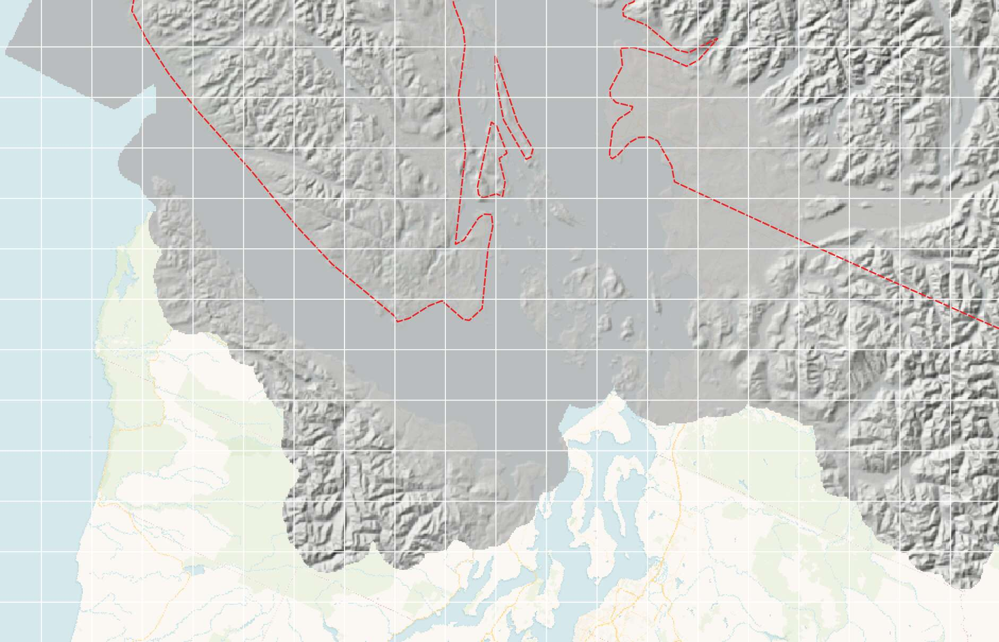

# Using Cloud Rasters with PostGIS

With the `postgis_raster` extension, it is possible to access gigabytes of raster data from the cloud, **without ever downloading the data**. 

How? The venerable `postgis_raster` extension (released [13 years ago](https://www.postgresql.org/about/news/postgis-200-released-1387/)) already has the critical core support built-in! 

Rasters can be stored inside the database, or outside the database, on a local file system **or** anywhere it can be accessed by the underlying [GDAL](https://gdal.org) raster support library. The [storage options](https://gdal.org/en/stable/user/virtual_file_systems.html#network-based-file-systems) include S3, Azure, Google, Alibaba, and any HTTP server that supports [RANGE requests](https://developer.mozilla.org/en-US/docs/Web/HTTP/Range_requests). 

As long as the rasters are in the [cloud optimized GeoTIFF](https://cogeo.org) (aka "COG") format, the network access to the data will be optimized and provide access performance limited mostly by the speed of connection between your database server and the cloud storage.

## TL;DR It Works

### Prepare the Database

Set up a database named `raster`  with the `postgis` and `postgis_raster` extensions.

```sql
CREATE EXTENSION postgis;
CREATE EXTENSION postgis_raster;
```

### Investigate The Data

COG is still a new format for public agencies, so finding a large public example can be tricky. Here is a [56GB COG of medium resolution (25m) elevation data for Canada](https://open.canada.ca/data/en/dataset/18752265-bda3-498c-a4ba-9dfe68cb98da). **Don't try and download it, it's 56GB!**


You can see some metadata about the file using the `gdalinfo` utility to read the headers. 

```
gdalinfo /vsicurl/https://datacube-prod-data-public.s3.amazonaws.com/store/elevation/mrdem/mrdem-30/mrdem-30-dsm.tif
```

Note that we prefix the URL to the image with `/viscurl/` to tell GDAL to use [virtual file system](https://gdal.org/en/stable/user/virtual_file_systems.html) access rather than direct download.

There is a lot of metadata!

<details><summary>Metadata from gdalinfo</summary>

```
Driver: GTiff/GeoTIFF
Files: /vsicurl/https://datacube-prod-data-public.s3.amazonaws.com/store/elevation/mrdem/mrdem-30/mrdem-30-dsm.tif
Size is 183687, 159655
Coordinate System is:
PROJCRS["NAD83(CSRS) / Canada Atlas Lambert",
    BASEGEOGCRS["NAD83(CSRS)",
        DATUM["NAD83 Canadian Spatial Reference System",
            ELLIPSOID["GRS 1980",6378137,298.257222101,
                LENGTHUNIT["metre",1]]],
        PRIMEM["Greenwich",0,
            ANGLEUNIT["degree",0.0174532925199433]],
        ID["EPSG",4617]],
    CONVERSION["Canada Atlas Lambert",
        METHOD["Lambert Conic Conformal (2SP)",
            ID["EPSG",9802]],
        PARAMETER["Latitude of false origin",49,
            ANGLEUNIT["degree",0.0174532925199433],
            ID["EPSG",8821]],
        PARAMETER["Longitude of false origin",-95,
            ANGLEUNIT["degree",0.0174532925199433],
            ID["EPSG",8822]],
        PARAMETER["Latitude of 1st standard parallel",49,
            ANGLEUNIT["degree",0.0174532925199433],
            ID["EPSG",8823]],
        PARAMETER["Latitude of 2nd standard parallel",77,
            ANGLEUNIT["degree",0.0174532925199433],
            ID["EPSG",8824]],
        PARAMETER["Easting at false origin",0,
            LENGTHUNIT["metre",1],
            ID["EPSG",8826]],
        PARAMETER["Northing at false origin",0,
            LENGTHUNIT["metre",1],
            ID["EPSG",8827]]],
    CS[Cartesian,2],
        AXIS["(E)",east,
            ORDER[1],
            LENGTHUNIT["metre",1]],
        AXIS["(N)",north,
            ORDER[2],
            LENGTHUNIT["metre",1]],
    USAGE[
        SCOPE["Transformation of coordinates at 5m level of accuracy."],
        AREA["Canada - onshore and offshore - Alberta; British Columbia; Manitoba; New Brunswick; Newfoundland and Labrador; Northwest Territories; Nova Scotia; Nunavut; Ontario; Prince Edward Island; Quebec; Saskatchewan; Yukon."],
        BBOX[38.21,-141.01,86.46,-40.73]],
    ID["EPSG",3979]]
Data axis to CRS axis mapping: 1,2
Origin = (-2454000.000000000000000,3887400.000000000000000)
Pixel Size = (30.000000000000000,-30.000000000000000)
Metadata:
  TIFFTAG_DATETIME=2024:05:08 12:00:00
  AREA_OR_POINT=Area
Image Structure Metadata:
  LAYOUT=COG
  COMPRESSION=LZW
  INTERLEAVE=BAND
Corner Coordinates:
Upper Left  (-2454000.000, 3887400.000) (175d38'57.51"W, 68d 7'32.00"N)
Lower Left  (-2454000.000, -902250.000) (121d27'11.17"W, 36d35'36.71"N)
Upper Right ( 3056610.000, 3887400.000) ( 10d43'16.37"W, 62d45'36.29"N)
Lower Right ( 3056610.000, -902250.000) ( 63d 0'39.68"W, 34d21' 6.31"N)
Center      (  301305.000, 1492575.000) ( 88d57'23.39"W, 62d31'56.78"N)
Band 1 Block=512x512 Type=Float32, ColorInterp=Gray
  NoData Value=-32767
  Overviews: 91843x79827, 45921x39913, 22960x19956, 11480x9978, 5740x4989, 2870x2494, 1435x1247, 717x623, 358x311
```

</details>

The key things we need to take from the metadata are that:

* the spatial reference system is "NAD83(CSRS) / Canada Atlas Lambert", "EPSG:3979"; and,
* the blocking (tiling) is 512x512 pixels.

### Load The Database Table

With this metadata in hand, we are ready to load a **reference** to the remote data into our database, using the `raster2pgsql` utility that comes with PostGIS.

```
./raster2pgsql \
  -R \
  -k \
  -s 3979 \
  -t 512x512 \
  -Y 1000 \
  /vsicurl/https://datacube-prod-data-public.s3.amazonaws.com/store/elevation/mrdem/mrdem-30/mrdem-30-dsm.tif \
  mrdem30 \
  | psql raster 
```

That is a lot of flags! What do they mean?

* **-R** means store references, so the pixel data is not copied into the database.
* **-k** means do not skip tiles that are all NODATA values. While it would be nice to skip NODATA tiles, doing so involves reading **all** the pixel data, which is exactly what we are trying to avoid.
* **-s 3979** means that the projection of our data is [EPSG:3979](https://epsg.io/3979), the value we got from the metadata.
* **-t 512x512** means to create tiles with 512x512 pixels, so that the blocking of the tiles in our database matches the blocking of the remote file. This should help lower the number of network reads any given data request requires.
* **-Y 1000** means to use `COPY` mode when writing out the tile definitions, and to write out batches of 1000 rows in each `COPY` block.
* Then the URL to the cloud GeoTIFF we are referencing, with `/vsicurl/` at the front to indicate using the "curl [virtual file system](https://gdal.org/en/stable/user/virtual_file_systems.html)". 
* Then the table name (`mrdem30`) we want to use in the database.
* Finally we pipe the result of the command (which is just SQL text) to `psql` to load it into the `raster` database.

When we are done, we have a table of raster tiles that looks like this in the database.

```
                     Table "public.mrdem30"
 Column |  Type   | Nullable |               Default                
--------+---------+-----------+----------+--------------------------------------
 rid    | integer | not null | nextval('mrdem30_rid_seq'::regclass)
 rast   | raster  |          | 
Indexes:
    "mrdem30_pkey" PRIMARY KEY, btree (rid)
```

We should add a `geometry` index on the raster column, specifically on the bounds of each tile.

```sql
CREATE INDEX mrdem30_st_convexhull_idx 
  ON mrdem30 USING GIST (ST_ConvexHull(rast));
```

This index will speed up raster tile lookup need when we are spatially querying.

### Query The Data

The single MrDEM GeoTIFF data set is now represented in the database as a table of raster tiles.

```sql
SELECT count(*) FROM mrdem30;
```

There are **112008** tiles in the collection. 

Each tile is pretty big, spatially (512 pixels on a side, 25 meters per pixel, means a 12.8km tile).



Each tile knows what file it references, where it is on the globe and what projection it is in.

```sql
SELECT (ST_BandMetadata(rast)).* 
  FROM mrdem30 OFFSET 50000 LIMIT 1;
```
```
pixeltype     | 32BF
nodatavalue   | -32767
isoutdb       | t
path          | /vsicurl/https://datacube-prod-data-public.s3.amazonaws.com/store/elevation/mrdem/mrdem-30/mrdem-30-dsm.tif
outdbbandnum  | 1
filesize      | 59659542216
filetimestamp | 1718629812
```
The [ST_ConvexHull()](https://postgis.net/docs/RT_ST_ConvexHull.html) function can be used to get a polygon geometry of the raster bounds.
```sql
SELECT ST_AsText(ST_ConvexHull(rast))
  FROM mrdem30 OFFSET 50000 LIMIT 1;
```
```
POLYGON((-2054640 -367320,-2039280 -367320,-2039280 -382680,-2054640 -382680,-2054640 -367320))
```
Just like geometries, raster tiles have a spatial reference id associated with them, in this case a projection that makes sense for a Canada-wide raster.
```sql
SELECT ST_SRID(rast)
  FROM mrdem30 OFFSET 50000 LIMIT 1;
```
```
3978
```

### Query Elevation

So how do we get an elevation value from this collection of reference tiles? Easy! For any given point, we pull the tile that point falls inside, and then read off the elevation at that point.

```sql
-- Make point for Toronto
-- Transform to raster coordinate system
WITH pt AS (
  SELECT ST_Transform(
    ST_Point(-79.3832, 43.6532, 4326), 
    3978) AS yyz 
)
-- Find the raster tile of interest, 
-- and read the value of band one (there is only one band)
-- at that point.
SELECT 
  ST_Value(rast, 1, yyz, resample => 'bilinear') AS elevation,
  yyz AS geom 
FROM 
  mrdem30, pt  
WHERE ST_Intersects(ST_ConvexHull(rast), yyz);
```

Note that we are using "[bilinear interpolation](https://en.wikipedia.org/wiki/Bilinear_interpolation)" in [ST_Value()](https://postgis.net/docs/RT_ST_Value.html), so if our point falls between pixel values, the value we get is interpolated in between the pixel values.


### Query a Larger Geometry

What about something bigger? How about the flight line of a plane going from Victoria (YYJ) to Calgary (YYC) over the Rocky Mountains?

* Generate the points
* Make a flight route to join them
* Transform that route into the coordinate system of the raster
* Pull all the rasters that touch the line and merge them into one giant raster in memory
* Copy the values off the raster into the Z coordinate of the line
* Dump the line into points to make a pretty picture

```sql
-- Create start and end points of route
-- YYJ = Victoria, YYC = Calgary
CREATE TABLE flight AS 
WITH 
end_pts AS (
    SELECT ST_Point(-123.3656, 48.4284, 4326) AS yyj,
           ST_Point(-114.0719, 51.0447, 4326) AS yyc
),
-- Construct line and add vertex every 10KM along great circle
-- Reproject to coordinate system of rasters
ln AS (
    SELECT ST_Transform(ST_Segmentize(
        ST_MakeLine(end_pts.yyj, end_pts.yyc)::geography, 
        10000)::geometry, 3978) AS geom
    FROM end_pts
),
rast AS (
    SELECT ST_Union(rast) AS r
    FROM mrdem30, ln
    WHERE ST_Intersects(ST_ConvexHull(rast), ln.geom)
),
-- Add Z values to that line
zln AS (
    SELECT ST_SetZ(rast.r, ln.geom) AS geom
    FROM rast, ln
),
-- Dump the points of the line for the graph
zpts AS (
    SELECT (ST_DumpPoints(geom)).*
    FROM zln
)
SELECT geom, ST_Z(geom) AS elevation
FROM zpts;
```

From the elevated points, we can make a map showing the flight line, and the elevations along the way.


## Why does it work?

How is it possible to read the values off of a 56GB GeoTIFF file without every downloading the file?

### Cloud Optimized GeoTIFF

The difference between a "cloud GeoTIFF" and a "local GeoTIFF" is mostly a difference in how software accesses the data. 

* A local GeoTIFF probably resides on an SSD or some other storage that has fast random access. Small random reads will be fast, and so will large sequential reads. Local access is fast!

* A cloud GeoTIFF resides on an "object store", a remote API that allows clients to real all of a file (with an HTTP "[GET](https://developer.mozilla.org/en-US/docs/Web/HTTP/Methods/GET)") or part of a file (with an HTTP "[RANGE](https://developer.mozilla.org/en-US/docs/Web/HTTP/Range_requests)"). Each random read is quite slow, because the read involves setting up an HTTP connection (slow) and then transmitting the data over an internetwork (slow). The more reads you do, the worse performance get. So the core goal of a "cloud format" is to reduce the number of reads required to access a subset of the data.

Reading multi-gigabyte raster files from object storage is a relatively new idea, formalized only a couple years ago in the [cloud optimized GeoTIFF](https://cogeo.org) (aka **COG**) specification.

The "cloud optimization" takes the form of just a [few restrictions](https://cogeo.org/in-depth.html) on the ordinary [GeoTIFF](https://en.wikipedia.org/wiki/GeoTIFF):

* Pixel data are tiled
* Overviews are also tiled

Forcing tiling means that pixels that are near each other in space are also near each other in the file. Pixels that are near each other in the file can be read in a **single read**, which is great when you are reading from cloud object storage.

(Another "cloud format" shaking up the industry is [Parquet](https://parquet.apache.org), and [Crunchy Data Warehouse](https://www.crunchydata.com/products/warehouse) can do direct access and query on Parquet for precisely the same reasons that `postgis_raster` can query COG files -- the format is structured to reduce the number of reads needed to carry out common queries.)


### GDAL Virtual File Systems

While a "cloud optimized" format like COG or GeoParquet is cool, it is not going to be a useful cloud format without a client library that knows how to efficiently read the file. The client needs to be native to the application, and it needs to be parsimonious in the number of file accesses it makes. 

For a web application, that means that COG access requires a JavaScript library that understands the GeoTIFF format.

For a database written in C, like PostgreSQL/PostGIS, that means that access requires a C/C++ library that understands GeoTIFF and abstracts file system operations, so that the GeoTIFF reader can support both local file system access and remote cloud access.

For PostGIS raster, that library is [GDAL](https://gdal.org). Every build of `postgis_raster` is linked to GDAL and allows us to take advantage of the library capabilities.

GDAL allows direct access to COG files on [remote cloud storage services](https://gdal.org/en/stable/user/virtual_file_systems.html#network-based-file-systems).

* Any HTTP server that supports Range requests
* AWS S3
* Google Cloud Storage
* Azure Blob Storage
* and others!

The specific cloud service support allows things like access keys to be used for reading private objects. There is more information about accessing secure buckets with PostGIS raster in this [blog post](https://www.crunchydata.com/blog/waiting-for-postgis-3.2-secure-cloud-raster-access#security-and-gdal-network-virtual-file-systems).

Under the covers GDAL not only reads COG format files, it also maintains a [modest in-memory data cache](https://gdal.org/en/stable/user/configoptions.html#how-to-set-configuration-options). This means there's a performance premium to making sure your raster queries are spatially coherent (each query point is near the previous one) because this maximizes the use of cached data.

