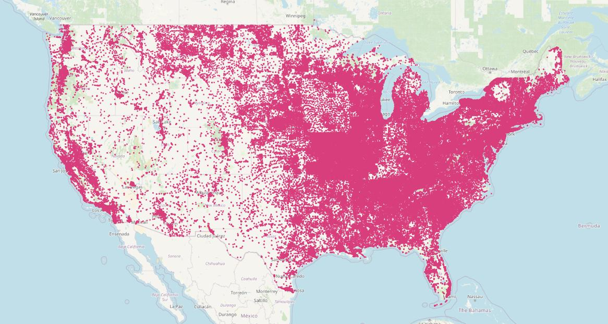
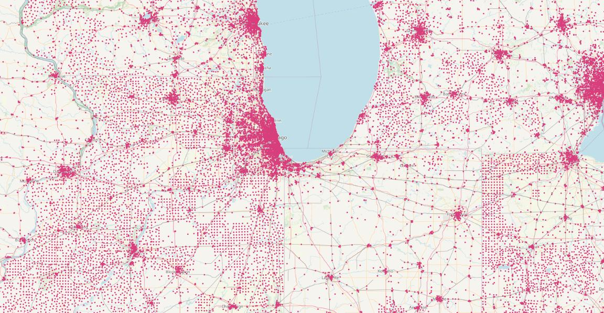
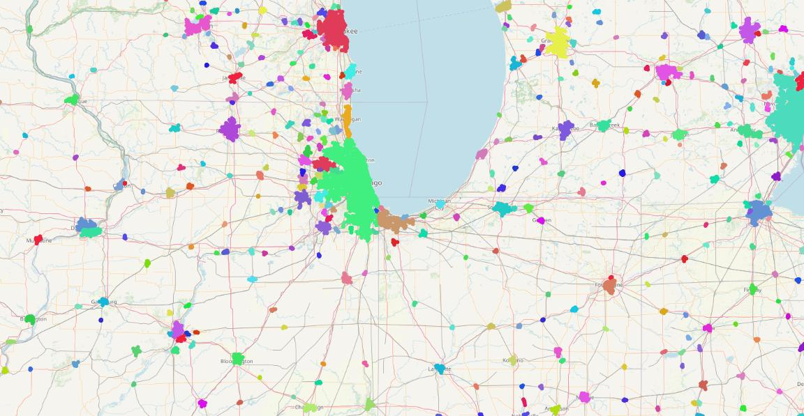
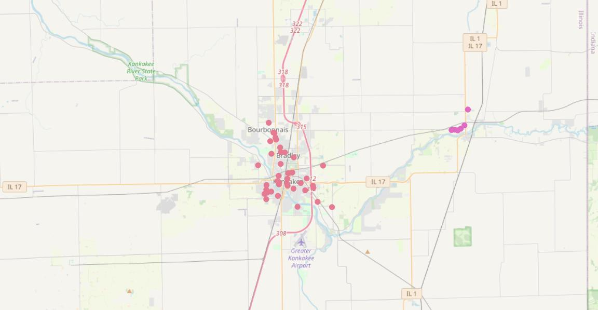
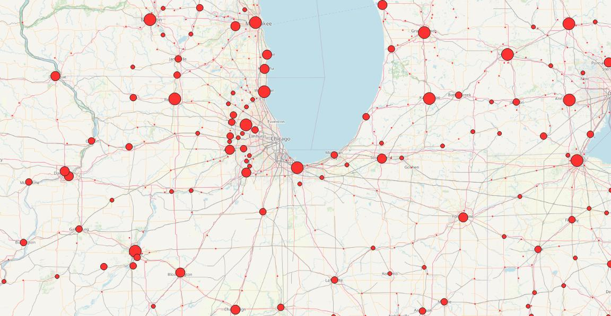

# PostGIS Clustering with DBSCAN

A common problem in geospatial analysis is extracting areas of density from point fields. The [ST_ClusterDBSCAN](https://postgis.net/docs/ST_ClusterDBSCAN.html) function in PostGIS is a quick and easy way to extract clusters from point data.

## Geographic Names Data

Lets explore clustering using geographic names data.

Create a table to hold the data. Note that the table is generating the points automatically from the longitude/latitude ([EPSG:4326](https://epsg.io/4326)) and transforming into a planar projection for the USA ([EPSG:5070](https://epsg.io/5070)).

```sql
CREATE TABLE geonames (
  geonameid integer,
  name text,
  asciiname text,
  alternatenames text,
  latitude float8,
  longitude float8,
  fclass char,
  fcode text,
  country text,
  cc2 text,
  admin1 text,
  admin2 text,
  admin3 text,
  admin4 text,
  population bigint,
  elevation integer,
  dem text,
  timezone text,
  modification date,
  geom geometry(point, 5070) 
    GENERATED ALWAYS AS 
      (ST_Transform(ST_Point(longitude, latitude, 4326),5070)) STORED
);
```

Now load the table. Note the super fun use of `PROGRAM` to pull data directly from the web and feed a `COPY`. 

```sql
COPY geonames 
  FROM PROGRAM '(curl http://download.geonames.org/export/dump/US.zip > /tmp/US.zip) && unzip -p /tmp/US.zip US.txt' 
  WITH (FORMAT CSV, DELIMITER E'\t', HEADER false);
```

(This trick only works using the `postgres` superuser, since it involves calling a program and writing to system disk. If you do not have superuser access, download and unzip the `US.TXT` file by hand and load it using `COPY` from the file.)



Finally, add a spatial index to the `geom` column.

```sql
CREATE INDEX geonames_geom_x 
  ON geonames 
  USING GIST (geom);
```

## Schools

There are 434 distinct feature codes in the `geonames` table. We will restrict our analysis to just the 205,848 schools, with an `fcode` of `SCH`.

```sql
SELECT Count(DISTINCT fcode) FROM geonames;
SELECT Count(fcode) FROM geonames WHERE fcode = 'SCH';
```

Schools are an interesting feature to analyze because there's a nice strong correlation between the number of schools and the population. There's a lot of schools! But they are not uniformly distributed.



If we zoom into the midwest, the concentration of schools in populated places pops out. **We can use PostGIS to turn this distribution difference into a data set of populated places!**

## Clustering on Schools

The [DBSCAN](https://en.wikipedia.org/wiki/DBSCAN) clustering algorithm is a "density based spatial clustering of applications with noise". The PostGIS [ST_ClusterDBSCAN](https://postgis.net/docs/ST_ClusterDBSCAN.html) implementation is a window function that takes three parameters: 

* The geometries to be analyzed for clusters.
* A 'eps' distance tolerance. Geometries must be within this distance to be added to a cluster.
* A 'minpoints' count. If a point is within the 'eps' distance of 'minpoints' cluster members, it is a "core member" of the cluster.

An input geometry is added to a cluster if it is either:

* A "core" geometry, that is within eps distance of at least minpoints input geometries (including itself); or
* A "border" geometry, that is within eps distance of a core geometry.

How does this play out in practice? 

If we zoom further into Chicago, around the suburban/exurbal transition, the schools are about 1000 meters apart, sometimes more sometimes less, transitioning out to 2000 meters and more in the exurbs. 

For our clusters, we will use:

* A `eps` distance of 200m
* A `minpoints` of 5
* A partition on the state code (`admin1`) to cut down on the number of cluster numbers.

```sql
CREATE TABLE geonames_sch AS 
  SELECT ST_ClusterDBScan(geom, 2000, 5) 
           OVER (PARTITION BY admin1) AS cluster, * 
  FROM geonames 
  WHERE fcode = 'SCH';
```

The result looks like this, with each cluster given a distinct color, and un-clustered schools rendered transparent.



The smaller clusters look a little arbitrary, but if we zoom in, we can see that even small population centers have been surfaced with this analytical technique.

Here is Kanakee, Illinois, neatly identified as a populated place by its cluster of schools.




## Clusters to Points

Now that we have clusters, getting a populated place point is as simple as using the [ST_Centroid](https://postgis.net/docs/ST_Centroid.html) function.

```sql
CREATE TABLE geonames_popplaces AS 
  SELECT ST_Centroid(ST_Collect(geom))::geometry(Point, 5070) AS geom,
         Count(*) AS school_count,
         cluster, admin1
  FROM geonames_sch 
  GROUP BY cluster, admin1
```

Now we have completed the analysis, converting the density different in school locations into a set of derived populated place points.




## PostGIS Clustering Window Functions

PostGIS has four window clustering functions that take in geometries and return cluster numbers (or NULL for unclustered inputs), which apply different algorithms to the problem of grouping the geometries in the input partitions.

* [ST_ClusterDBSCAN](https://postgis.net/docs/ST_ClusterDBSCAN.html)
* [ST_ClusterKMeans](https://postgis.net/docs/ST_ClusterKMeans.html)
* [ST_ClusterIntersectingWin](https://postgis.net/docs/ST_ClusterIntersectingWin.html)
* [ST_ClusterWithinWin](https://postgis.net/docs/ST_ClusterWithinWin.html)


