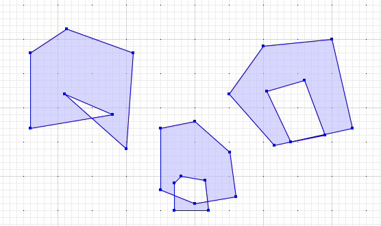

# Spatial Constraints with PostGIS - Part 1

Constraints are used to ensure that data in the database reflects the assumptions of the data model.

* Do foreign keys match up to corresponding keys? (`REFERENCES`)
* Are mandatory columns filled in? (`NOT NULL`)
* Are unique values columns in fact unique? (`UNIQUE`)
* Do other data quality rules pass? (`CHECK`)

Why enforce data quality rules in the database, and not at the application tier? Because if you qualify all your data at the application tier, you have to duplicate **all that logic** whenever you add **another application** that writes to the database. 

If you are lucky enough to write a system successful enough to be in production for more than a couple years, the odds of multiple write applications proliferating rapidly converge to 100%. Enforcing core data quality rules in the database is a nice way to ground your system with solid assumptions about data integrity.

Our interactive learning portal has a [whole section on the use of non-spatial constraints](https://learn.crunchydata.com/postgresql-devel/courses/basics/constraints), if you're interested. There's also a [video](https://www.youtube.com/watch?v=MAZ4EM8Up8w).

What about spatial, though? Thanks to the magic of PostgreSQL run-time extensions, the `geometry` type is just another type and all the machinery of constraint checking works just as well for `geometry` as any other type.

Here are a few examples of simple and complex constraints that spatial database users like to enforce on the geometry data.

### Check Constraints

PostgreSQL column level constraints allow us to apply tests to data, but only at a granular level: the check can can only operate on the incoming value, so we are restricted to relatively simple tests that check the properties of a single geometry.

Spatial functions like [ST_Area](https://postgis.net/docs/ST_Area.html), [ST_Union](https://postgis.net/docs/ST_Union.html), and [ST_Intersection](https://postgis.net/docs/ST_Intersection.html) all depend on "valid geometry" inputs in order to produce correct answers, so many users want to only allow valid geometry in a table.

Here's a table of parcels, with a [CHECK constraint](https://www.postgresql.org/docs/current/ddl-constraints.html#DDL-CONSTRAINTS-CHECK-CONSTRAINTS) on [ST_IsValid](https://postgis.net/docs/ST_Intersection.html) to enforce geometry validity.

```sql
CREATE TABLE parcels (
   pk bigint PRIMARY KEY,
   geom geometry(Polygon, 3005) 
      NOT NULL CHECK (ST_IsValid(geom)),
   pid text NOT NULL UNIQUE
)
```

An "invalid" polygon is one that has:

* A self-intersecting ring; or
* An interior ring that shares a boundary with an exterior ring; or
* An interior ring that is outside the exterior ring.

Here are some invalid polygons.



With our check constraint in place, inserts of valid polygons succeed.

```sql
INSERT INTO parcels (pk, pid, geom) 
  VALUES (1, '12345', 
    'POLYGON((0 0, 10 0, 10 10, 0 10, 0 0))'
    );
```

And inserts of invalid polygons fail.

```sql
INSERT INTO parcels (pk, pid, geom) 
  VALUES (2, '23456', 
    'POLYGON((160 170, 160 280, 213 315, 310 280, 300 140, 210 220, 280 190, 160 170))'
    );
```
```
NOTICE:  Self-intersection at or near point 249.47368421052633 184.91228070175438
ERROR:  new row for relation "parcels" violates check constraint "parcels_geom_check"
DETAIL:  Failing row contains (2, 0103000020BD0B00000100000008000000000000000000644000000000004065..., 23456).
```

Spatial constraints can also be used to enforce common-sense business rules, just as with non-spatial constraints. For example:

* `CHECK ST_Area(geom) > 10` to enforce a minimum polygon area. Surveyed parcels might have a minimum allowed size.
* `CHECK ST_Length(geom) > 1` to enforce a minimum line length. A road network with a 1 metre accuracy should not have any segments shorter than 1 metre.
* `CHECK ST_IsSimple(geom)` to ensure lines do not self-intersect. A noded network should not have self-intersecting elements.

While check constraints are simple and easy to understand, spatial data calls out for more powerful tests of quality, that involve looking at structural relationships between geometries in a table, and between tables. 

For that, we will need table-level constraints and triggers, which we will discuss in the next installment of this series.