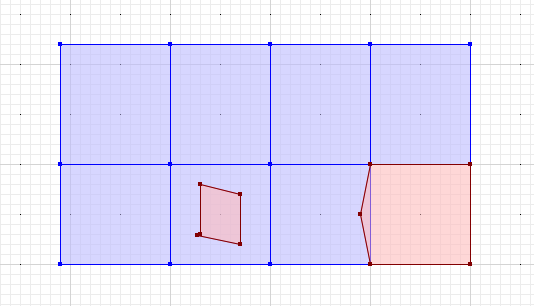
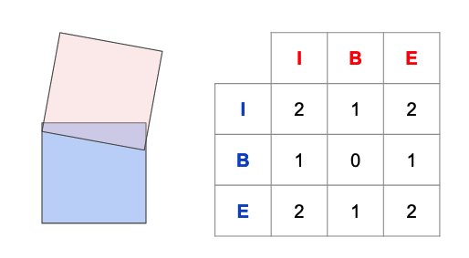
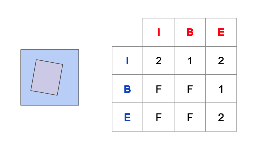
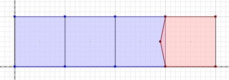

# Spatial Constraints with PostGIS - Part 2

If constraints in general have caught your interest, our interactive learning portal has a [whole section on the use of non-spatial constraints](https://learn.crunchydata.com/postgresql-devel/courses/basics/constraints), even a [video](https://www.youtube.com/watch?v=MAZ4EM8Up8w) walkthrough!

In our last installment, we covered the use of [CHECK constraints](https://www.postgresql.org/docs/current/ddl-constraints.html#DDL-CONSTRAINTS-CHECK-CONSTRAINTS) to enforce data quality at an object level. 

However, spatial data quality usually involves higher order relationships between geometries. Just as a strong non-spatial model will enforce foreign key relationships, spatial constraints can be used to enforce spatial relationships.

## Trigger Constraints

Parcels are form of "cadastre", a spatial layer that reflects the legal subdivision of land. One of the core business rules of parcels is that no piece of land may be in two parcels at once.

There are two ways for parcels to break the rule.



* A parcel can partially overlap another parcel, like the red parcel on the lower right. 
* A parcel can be fully contained with another parcel, like the red parcel on the left.

We need to check that new and updated parcels don't break those rules.

```sql
CREATE OR REPLACE FUNCTION overlapping_parcel_trigger()
  RETURNS trigger AS
  $$
    DECLARE
      c bigint;
    BEGIN

      SELECT Count(*)
      INTO c
      FROM parcels
      WHERE ST_Intersects(parcels.geom, NEW.geom)
      AND parcels.pk != NEW.pk;
      AND ST_Relate(parcels.geom, NEW.geom, '2********')

      IF c > 0 THEN
        RAISE EXCEPTION 'parcel % shares area with another parcel', NEW.pk;
      END IF;

      RETURN NEW;
    END;
  $$
  LANGUAGE 'plpgsql';
```

The query inside this trigger looks for parcels that share area. If there are more than zero parcels sharing area, we have a problem, so we raise an exception to abort the transaction.

Note the three `WHERE` clauses:

* First [ST_Intersects](https://postgis.net/docs/ST_Intersects.html) to quickly find parcels that **might** share area.
* Then a primary key check to exclude the case where a parcel overlaps with itself.
* Finally a call to the [ST_Relate](https://postgis.net/docs/ST_Relate.html) function to check if the relationship between the geometries includes sharing of area.

The [ST_Relate](https://postgis.net/docs/ST_Relate.html) computes the "dimensionally extended 9-intersection model" (DE9IM) for the two input geometries. 

## Dimensionally Extended 9-Intersection Model (DE9IM)

The DE9IM **exactly** describes the relationship between two geometries. 

Every geometry has three components:

* It has an **interior** the part of the plane contained by the geometry.
* It has an **exterior** the part of the plane not contained by the geometry.
* It has a **boundary** the part of the plane that divides the interior from the exterior.

The DE9IM code for two geometries is derived by filling in the matrix indicating how the components interact. For example, for the case of two overlapping polygons:



Each component interaction is coded according to the dimensionality of their intersection. The interiors have a 2-d (area) intersection, so the I/I cell gets a "2". The boundary and interior have a 1-d (linear) intersection, so the B/I cells get a "1", and so on. 

The final matrix is turned into a relate string by appending the rows, so the SQL to generate a DE9IM returns a single string value:

```sql
SELECT ST_Relate(
         'POLYGON ((0 100, 100 100, 100 0, 0 0, 0 100))', 
         'POLYGON ((200 0, 100 0, 91 55, 100 100, 200 100, 200 0))'
         );
```
```
 st_relate 
-----------
 212101212
```

The matrix for the case of the covered polygon looks like this. Note that in cases where the components have no intersection, the cell is filled with an "F".



The two matrixes are both quite different, but they have a key thing in common: the intersection of the interiors is an area in both cases. So any relate matrix for two polygons that has a "2" in the I/I cell indicates that the polygons have some area overlapping, and they are thus, not legal parcels.

Fortunately there's a form of [ST_Relate](https://postgis.net/docs/ST_Relate.html) that tests relate patterns, so we don't need to do string hacking.

```
ST_Relate(parcels.geom, NEW.geom, '2********')
```

The three-parameter form of [ST_Relate](https://postgis.net/docs/ST_Relate.html) tests the relate matrix for the two geometry parameters against the string parameter, and returns `true` if the pattern is consistent, where the glob "*" matches any cell value. So the pattern "2********" matches any relate where the I/I cell is "2".

## Constraint Trigger

To enable parcel overlap checking on our parcels table, we need to associate the trigger function with an actual trigger.

```sql
-- create our table
CREATE TABLE parcels (
   pk bigint PRIMARY KEY,
   geom geometry(Polygon, 3005) 
      NOT NULL CHECK (ST_IsValid(geom))
);

-- add the constraint trigger
CREATE CONSTRAINT TRIGGER overlapping_parcel 
    AFTER INSERT OR UPDATE ON parcels
    FOR EACH ROW EXECUTE FUNCTION overlapping_parcel_trigger();
```

Now we can test the constraint. First, add three non-overlapping parcels:

```sql
INSERT INTO parcels VALUES (1, 'POLYGON((0 100, 100 100, 100 0, 0 0, 0 100))');
INSERT INTO parcels VALUES (2, 'POLYGON((100 100, 200 100, 200 0, 100 0, 100 100))');
INSERT INTO parcels VALUES (3, 'POLYGON((200 100, 300 100, 300 0, 200 0, 200 100))');
```

No errors! 



Now insert an overlapping parcel:

```sql
INSERT INTO parcels VALUES (4, 'POLYGON ((300 100, 400 100, 400 0, 300 0, 290 50, 300 100))');
```
```
ERROR:  parcel 4 shares area with another parcel
CONTEXT:  PL/pgSQL function overlapping_parcel_trigger() line 14 at RAISE
```

Caught the mistake! 

Parcel overlaps are a good test case for a simple trigger constraint, but there are structures that require even more finesse to quality control for: connected networks. 

In our next installment, we'll look at using constraints and deferral to enforce connectivity and other data quality for a road network.