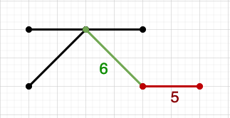
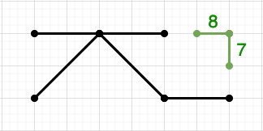

# Spatial Constraints with PostGIS - Part 3

If constraints in general have caught your interest, our interactive learning portal has a [whole section on the use of non-spatial constraints](https://learn.crunchydata.com/postgresql-devel/courses/basics/constraints), even a [video](https://www.youtube.com/watch?v=MAZ4EM8Up8w) walkthrough!

In our last installment, we covered the use of a [constraint trigger](https://www.postgresql.org/docs/current/sql-createtrigger.html) to enforce data quality by looking at geometry spatial relationships.

For this installment, we'll start with basic relationships and then look at more complex use cases: deferred constraints, and full table-level data structures.

## Linear Network Constraints

Let's start with a simple road network.

```sql
CREATE TABLE roads (
  pk bigint PRIMARY KEY,
  name text NOT NULL,
  geom geometry(LineString, 3005) NOT NULL
    CONSTRAINT geom_no_zero_length CHECK (ST_Length(geom) > 0)
    CONSTRAINT geom_no_self_intersection CHECK (ST_IsSimple(geom))
);
```

## Check Constraints

We've added a couple simple check constraints in the table definition:

* we want our road segments to have a non-zero length; and,
* we want our road segments to have no self-intersections, to be "simple".

And sure enough, PostgreSQL easily manages these constraints. 

```sql
INSERT INTO roads VALUES (0, 'Main', 'LINESTRING(0 0, 0 0)');
```
```
ERROR:  new row for relation "roads" violates check constraint "geom_no_zero_length"
DETAIL:  Failing row contains (0, Main, 0102000020BD0B00000200000000000000000000000000000000000000000000...).
```

```sql
INSERT INTO roads VALUES (1, 'Elm', 'LINESTRING(0 0, 5 5, 5 3, 0 5)');
```
```
ERROR:  new row for relation "roads" violates check constraint "geom_no_self_intersection"
DETAIL:  Failing row contains (1, Elm, 0102000020BD0B00000400000000000000000000000000000000000000000000...).
```

## Trigger Constraints

However, the real restriction that most spatial users want to enforce for linear network data is connectivity. In particular, they like it when:

* Their networks are "noded", so that every segments ends at the start- or end-point of another segment, not in the middle of a segment.
* Their networks are "connected", so that every segment can be reached from every other segment.

Both these conditions require knowledge of more than just the segment being inserted, so we have to move beyond `CHECK` constraints to a trigger.

```sql
CREATE OR REPLACE FUNCTION noded_road_trigger()
  RETURNS trigger AS
  $$
    DECLARE
      c bigint;
    BEGIN

      -- How many roads does the end point of this 
      -- road touch at the ends? Touches is not true
      -- when end points touch middles.
      SELECT Count(*)
      INTO c
      FROM roads
      WHERE ST_Touches(roads.geom, NEW.geom);

      -- Have to touch at least one other segment in
      -- the network.
      IF c < 1 THEN
        RAISE EXCEPTION 'road % is not connected to the network', NEW.pk;
      END IF;

      RETURN NEW;
    END;
  $$
  LANGUAGE 'plpgsql';

-- Run for data additions and changes,
-- and allow deferal to end of transaction.
CREATE CONSTRAINT TRIGGER noded_road 
  AFTER INSERT OR UPDATE ON roads DEFERRABLE
  FOR EACH ROW EXECUTE FUNCTION noded_road_trigger();
```

We'll start with a small seed network, that looks like this:

```sql
INSERT INTO roads VALUES (2, 'Grand', 'LINESTRING(0 0, 0 2, 2 2)');
INSERT INTO roads VALUES (3, 'Grand', 'LINESTRING(2 2, 2 4)');
INSERT INTO roads VALUES (4, 'Oak', 'LINESTRING(2 2, 4 2)');
```


Now let's add two new segments to the network:

```sql
INSERT INTO roads VALUES (5, 'Larch', 'LINESTRING(2 0, 4 0)');
```
```
ERROR:  road 5 is not connected to the network
CONTEXT:  PL/pgSQL function noded_road_trigger() line 13 at RAISE
```
```sql
INSERT INTO roads VALUES (6, 'Oak', 'LINESTRING(2 2, 2 0)');
```
```
INSERT 0 1
```

This is interesting. One failed, and the other succeeded, why? Because while they **together** are connected, the "Oak" segment need to be inserted before the "Larch" segment can connect to it.



## Deferring Constraints

The two segments have to both be in place in order to evaluate the connectivity. Maybe if we put them both in a transaction block, things will work better?

```sql
-- Get rid of old road for new experiment
DELETE FROM roads WHERE pk = 6;
-- Does using a transaction block work?
BEGIN;
INSERT INTO roads VALUES (5, 'Larch', 'LINESTRING(2 0, 4 0)');
INSERT INTO roads VALUES (6, 'Oak', 'LINESTRING(2 2, 2 0)');
COMMIT;
```

Nope.

```
ERROR:  road 5 is not connected to the network
CONTEXT:  PL/pgSQL function noded_road_trigger() line 13 at RAISE
```

However, when we created this constraint trigger, we marked it as `DEFERRABLE`, for just this purpose. If we can get the database to wait until all the records are loaded before checking the constraint, our load will work.

To defer the constraint, we use the [SET CONSTRAINTS](https://www.postgresql.org/docs/9.1/sql-set-constraints.html) command at the start of our transaction.

```sql
BEGIN;
SET CONSTRAINTS noded_road DEFERRED;
INSERT INTO roads VALUES (5, 'Larch', 'LINESTRING(2 0, 4 0)');
INSERT INTO roads VALUES (6, 'Oak', 'LINESTRING(2 2, 2 0)');
COMMIT;
```

Success! So, we can ensure noding. 

But can we also ensure connectivity? It would seem so, if every segment must connect to another segment, but it's actually quite easy to break connectivity: just insert a self-connected group of segments in one deferred transaction.

```sql
BEGIN;
SET CONSTRAINTS noded_road DEFERRED;
-- These aren't connected, do they fail on commit?
INSERT INTO roads VALUES (7, 'Sea', 'LINESTRING(5 2, 6 2)');
INSERT INTO roads VALUES (8, 'Isle', 'LINESTRING(6 2, 6 3)');
-- They do not! :(
COMMIT;
-- Clean up.
DELETE FROM roads WHERE pk IN (7, 8);
```



Oh no, it's very easy insert "islands" of separate noded segments into our table. We need a new constraint to check that all the segments are connected together globally.

## Table-wide Constraints

We've already guaranteed noding, with the `noded_road_trigger()`, so we just need to ensure that all the noded segments form a single graph, and we can do that using [spatial clustering](https://postgis.net/docs/ST_ClusterDBSCAN.html) with zero tolerance.

```sql
CREATE OR REPLACE FUNCTION single_network_trigger()
  RETURNS trigger AS
  $$
    DECLARE
      c bigint;
    BEGIN

      -- All the segments are noded (touching)
      -- so clustering with zero distance will find
      -- all connected clusters.
      WITH clusters AS (
        SELECT ST_ClusterDBScan(geom, 0.0, 1) over () AS cluster
        FROM roads
      )
      SELECT Count(DISTINCT cluster)
      INTO c
      FROM clusters;

      -- If there's more than one cluster, we have
      -- separate islands in graph, and that's a no-no.
      IF c > 1 THEN
        RAISE EXCEPTION 'network is not fully connected';
      END IF;

      RETURN NEW;
    END;
  $$
  LANGUAGE 'plpgsql';

CREATE CONSTRAINT TRIGGER single_network 
  AFTER INSERT OR UPDATE ON roads DEFERRABLE
  FOR EACH ROW EXECUTE FUNCTION single_network_trigger();
```

Now, when we attempt to batch insert our noded-but-not-connected set of lines, the system catches us!

```sql
BEGIN;
-- Defer BOTH table constraints this time
SET CONSTRAINTS ALL DEFERRED;
-- These aren't connected, do they fail on commit?
INSERT INTO roads VALUES (7, 'Sea', 'LINESTRING(5 2, 6 2)');
INSERT INTO roads VALUES (8, 'Isle', 'LINESTRING(6 2, 6 3)');
-- They do!
COMMIT;
```
```
ERROR:  network is not fully connected
CONTEXT:  PL/pgSQL function single_network_trigger() line 15 at RAISE
```

The downside of this approach should be obvious: for larger tables, the cost of checking the cluster on each data update will become hard on performance. However, for smaller tables in the 10s of thousands of records, it should work fine.

### More Constraints?

Once you get started, it's easy to imagine other constraints, and more complex ones.

Remember, you can enforce data validity in your application if you like, but only so long as the number of applications you have writing to your database is **one**. Look at database constraints, they might save you a world of hurt!

If constraints in general have caught your interest, our interactive learning portal has a [whole section on the use of non-spatial constraints](https://learn.crunchydata.com/postgresql-devel/courses/basics/constraints), even a [video](https://www.youtube.com/watch?v=MAZ4EM8Up8w) walkthrough!
