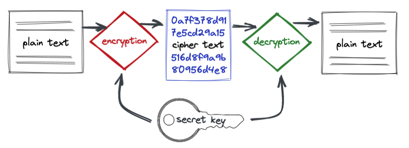
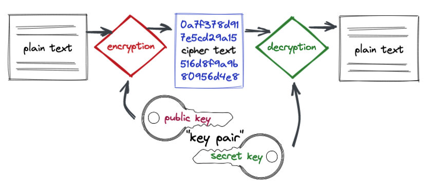
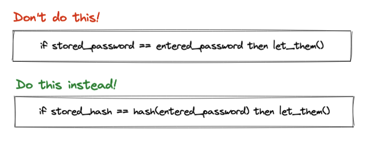
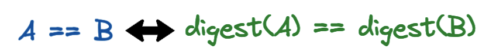

# Generate Unlimited Crypto using Postgres!

Ha ha, made you look! 

This post is not a crazy scam (you be the judge) but just a practical description of using cryptographical algorithms to encrypt and decrypt data inside PostgreSQL.


## Encryption in Crunchy Bridge

There's already a lot of encryption in Crunchy Bridge! 

First, your data are "encrypted at rest". That means that the "volumes" (what in an earlier era would be called the disk drives) your data is saved to are encrypted. Also all the backup files generated by your server are encrypted. Functionally this means that it is not possible for someone to backdoor access to your data by mounting the volumes or reading the backups.

Second, your connections to the database are encrypted. Transport Layer Security ("TLS", what used to be called "SSL") ensures that all the traffic between your database server and you client software is also encrypted. 

What does all this churning of bytes achieve? If we didn't do it, it would mean we'd have to trust that nobody could ever get access to the data volumes or backup files. Those items are all protected by the cloud provider login rules, so it would not be easy for someone to do, but it's not impossible, and there's one entity that can always get access to the volumes and the backups: the cloud provider itself. 

Encrypting your data at rest is a way of ensuring that your system administrator (or someone who has hacked your system administrator) cannot directly read your raw data.


## PgCrypto

We aren't going to be talking about volume encryption or connection encryption, but encryption of the data stored inside the database tables, with [pgcrypto](https://www.postgresql.org/docs/current/pgcrypto.html).

Using the [pgcrypto](https://www.postgresql.org/docs/current/pgcrypto.html) extension, you can:

* apply symmetric encryption (one secret key);
* apply public key encryption (one secret key, one public key);
* interoperate with [OpenPGP](https://tools.ietf.org/html/rfc4880) standard keys and payload formats;
* generate and test passwords; and,
* generate digests to summarize content.

The [pgcrypto](https://www.postgresql.org/docs/current/pgcrypto.html) extension uses [OpenPGP](https://tools.ietf.org/html/rfc4880) standard functions, making it easy to move data between system components while retaining the ability to work with the payload and not have to reinvent various wheels around envelopes, integrity, and formats.

[Crunchy Bridge](http://crunchybridge.com) includes [pgcrypto](https://www.postgresql.org/docs/current/pgcrypto.html) by default, so we can run all these examples on a standard instance.

## Why Use PgCrypto?

Mostly, it is just a lot simpler to not encrypt things. It adds complexity and moving parts. Don't do it unless you need it. 

Why might you need it?

Just as volume encryption and network encryption are useful if you want your data to remain private even if someone obtains access to your underlying storage, encryption of data in tables is useful if you want your data to remain private even if they obtain access to your database itself.

Simplistically, you might use volume encryption if you didn't entirely trust your sysadmin. You might use [pgcrypto](https://www.postgresql.org/docs/current/pgcrypto.html) if you didn't entirely trust your DBA. 

At the end of the day, someone somewhere needs to have access to the keys to the data, using an application level encryption scheme like [pgcrypto](https://www.postgresql.org/docs/current/pgcrypto.html) moves the level of trust another layer up the application stack. At the cost, it is important to always point out, of more application complexity.

So, given all that: what can we do with [pgcrypto](https://www.postgresql.org/docs/current/pgcrypto.html)?


## Symmetric Encryption

Symmetric encryption uses one key to both encrypt and decrypt payloads. This puts a high premium on password management, but it's easy to understand: there's one secret key password, don't lose (or expose) it!



The [pgp_sym_encrypt()](https://www.postgresql.org/docs/current/pgcrypto.html#id-1.11.7.35.8.11) symmetric encryption function takes in three parameters:

* The textpayload to be encrypted;
* The password to generate the symmetric key with (effectively this ends up being your external representation of the symmetric key, so make sure it is strong); and
* [Options](https://www.postgresql.org/docs/current/pgcrypto.html#id-1.11.7.35.8.18) to pass to the encryption engine.

Here we encrypt a short poem about secrecy, using "mypassword" as the password, and choosing the [AES256](https://en.wikipedia.org/wiki/Advanced_Encryption_Standard) algorithm, applied after compressing the payload with zlib.

```sql
WITH args AS (
  SELECT
    'The Blanket, Sees all secrets, Forgets many, Reveals nothing, ...' AS payload,
    'mypassword' AS password,
    'compress-algo=1, cipher-algo=aes256' AS options
  )
SELECT armor(pgp_sym_encrypt(payload, password, options))
  FROM args;
```

We wrap the encryption in the [armor()](https://www.postgresql.org/docs/current/pgcrypto.html#id-1.11.7.35.8.16) function, to convert the binary encrypted output into a standard text envelope that any OpenPGP client can read.

The result looks like this.

```
-----BEGIN PGP MESSAGE-----

ww0ECQMC46Tv/FL2lZtp0nYBPMSd2ReBlTcLcBTekE2mkWWbx3jMZAUzBcLYOZttqZe6YHlomYkx
0wWiEWHWEMWFW0WXM/wxlj/xqWKppT/YUp4Q4gjWiLjm7oq+iulY7tCeXdamcSp925YuuFTlIBqt
f30m71IhlYqn6VaWAXKqH2f7VRV5
=niDe
-----END PGP MESSAGE-----
```

Because the amored ciphertext is in a standard PGP format you can copy and paste it into a file (hint: "poem.gpg") and decrypt it using [Gnu Privacy Guard](https://gnupg.org/) (GPG).

```
gpg --output peom.txt poem.gpg
```

Note that we don't even have to tell GPG what encryption scheme we used -- it's all encoded in the armor. Just give it the password (hint: "mypassword") and it spits out the original poem.

If you are storing the encrypted data in a database column, it is best to use a `bytea` column type and avoid storing a fluffed up text version. You can always apply the [armor()](https://www.postgresql.org/docs/current/pgcrypto.html#id-1.11.7.35.8.16) function on output, if you need a transportable text format.

## Public Key Encryption

Public key encryption is a clever scheme that uses "key pairs" Each key pair consists of a "public key" which can be provided to anyone, and used to encrypt payloads, and a "private key" which is kept secret and used to decrypt payloads.



Note that unlike symmetric encryption, public key encryption doesn't require strong security for the encrypting key. This means you can can publish your public key widely, and receive encrypted payloads from anyone who has the public key... but only you will be able to decrypt them. 

Or in the opposite scenario, you could store data payloads encrypted with many users' public keys, but only they would be able to decrypt it (using their secret key).

### Generating Keys

Unlike the simple symmetric encryption scenario, dealing with key pairs means first generating the pair. Usually a user would do this themselves, but for demonstration purposes we will generate and test our own pair, using `gpg --gen-key`.

For our example, we will make a key for `Homer Simpson <homer@springfieldnuclear.com>` using "ilovemarge" as the password:

```
% gpg --gen-key   

gpg (GnuPG) 2.2.35; Copyright (C) 2022 g10 Code GmbH
This is free software: you are free to change and redistribute it.
There is NO WARRANTY, to the extent permitted by law.

Note: Use "gpg --full-generate-key" for a full featured key generation dialog.

GnuPG needs to construct a user ID to identify your key.

Real name: Homer Simpson
Email address: homer@springfieldnuclear.com
You selected this USER-ID:
    "Homer Simpson <homer@springfieldnuclear.com>"

Change (N)ame, (E)mail, or (O)kay/(Q)uit? o
```

Once the key pair is generated, you can list the keys in your keychain:

```
% gpg --list-secret-keys

---------------------------------
sec   rsa3072 2022-07-12 [SC] [expires: 2024-07-11]
      04ECDA97DDED57E6A6DBC57009D23B87223F0114
uid           [ultimate] Homer Simpson <homer@springfieldnuclear.com>
ssb   rsa3072 2022-07-12 [E] [expires: 2024-07-11]
```

And then extract them to files, in this case [public.key](public.key) and [public.key](public.key):

```
gpg -a -o public.key --export homer@springfieldnuclear.com 
gpg -a -o secret.key --export-secret-keys homer@springfieldnuclear.com 
```

To make working with these big hunks of data easier, here's a [keys table](keys.sql) that stores the keys in dearmored `bytea` form along with their id. The keys table just looks like this:

```sql
CREATE TABLE keys (
    id text,
    public_key bytea,
    secret_key bytea
);
```

Yes, working with key pairs is a real **pain in the arms**!

### Encrypting and Decrypting

Now that our keys are easily accessible, demonstrating encrypting and decryption using [pgp_pub_encrypt()](https://www.postgresql.org/docs/current/pgcrypto.html#id-1.11.7.35.8.13) is much terser.

```sql
WITH args AS (
  SELECT
    'The Blanket, Sees all secrets, Forgets many, Reveals nothing, ...' AS payload,
    'compress-algo=1, cipher-algo=aes256' AS options
  )
SELECT armor(pgp_pub_encrypt(args.payload, keys.public_key, args.options))
  FROM args, keys
  WHERE keys.id = 'homer@springfieldnuclear.com';
```

And out pops our ciphertext!

```
-----BEGIN PGP MESSAGE-----

wcDMAyrb0BxZVTADAQv/W4rwhXpgkA+WYm+V3IYxCVnHWn3Yc6Ejh1z63q5dGgeHd7XL1aJqL4+B
CJgIKUU7AndC4OCKMTALT6hR5YbLxW/pGBWqm72hAKuX/p+v/j6FNoVD/2vio0JYsW2zO/xK3Q7o
TiG2ox3+s1+m94Yb0ixLP6ganBW57U3FHtyA3TgV6igmk6m8C2aa2d0qkgUyW51Pd1uEA3wsIqON
cOpSL0TZJSShTrzq9rNLKFF49aGg3KRsdLoJl0otLRL6hCIygJ/i/xLNm6vOVkxCxuSTtcN4Ba2e
xgVX6jjIosBG+flejpFk2lg+G7l+nqWd49mOsk/wWi1ZkiMw2Bj/D4Vty45yoV0UaABlkFhHzlT4
0tSIk/7eXVUGiywZEphvixYB5wpySOZomGddPj/0C8uqtBXQkyNrn2u5/ouCFdCMNpog15mYduMU
OWyPSlqmWjo+D7HxrUqW1EADeSZ+OTyEcdNb8xyatsMGuyIrAmphpAqzy1rAMw/Jm4DAQfWkVo1N
0nYBt1ltXrkJlbskQ2IGj/t0x71pfYTB8WUAKKFWIQkvYVZHI3Bv7DF7j/aN448npWyTl3OktG4g
Wn00B2xrfq3kM2EpFG/wAD0xb9fxmlOFO12RY+qV93GokJ7VgQVH2p6OtfF9+VunKlCdtW3mOwAG
W4fQh4WN
=KB03
-----END PGP MESSAGE-----
```

We can test the encryption by reversing it with [pgp_pub_decrypt()](https://www.postgresql.org/docs/current/pgcrypto.html#id-1.11.7.35.8.14).

```sql
WITH args AS (
  SELECT
    'The Blanket, Sees all secrets, Forgets many, Reveals nothing, ...' AS payload,
    'compress-algo=1, cipher-algo=aes256' AS options
  ),
encrypted AS (
  SELECT pgp_pub_encrypt(args.payload, keys.public_key, args.options) AS bytes
    FROM args, keys
    WHERE keys.id = 'homer@springfieldnuclear.com'
)
SELECT pgp_pub_decrypt(encrypted.bytes, keys.secret_key, 'ilovemarge')
  FROM encrypted, keys
  WHERE keys.id = 'homer@springfieldnuclear.com';

```

## Passwords

Working with passwords is great fun, if you like being yelled at by security professionals. If you don't, then when someone gives you a plain text password, get rid of it as quickly as possible.



One way to get rid of a password is to "hash" it. Run it through a one-way cryptographic function that converts it to a unique number. That way you can forget the actual password and only store the hash, while still retaining the ability to check if future input matches the stored hash.

### Generating a Password Hash

To generate a password hash, you need two things: 

* the plaintext password
* a "salt" to initialize the hashing algorithm

The "salt" is the important bit, as ensures that duplicate passwords actually generate distinct hashes, thus avoiding password hash collisions. Here we generate a "[blowfish](https://en.wikipedia.org/wiki/Blowfish_\(cipher\))" password hash using "ilovemarge" as the plaintext password.

```sql
-- bf is the blowfish cipher
select crypt('ilovemarge', gen_salt('bf'));
```

The output hash is a big long string of characters which stand in for the big long number that is the hash.

```
$2a$06$BQ2LACTO/.RFjbYGDMN8we61MRrN2s4EFzmEJeHskmbmyNrAul74a
```

### Checking a Password Hash

OK, someone gave you a plaintext password and you astutely hashed it and threw it away as fast as possible. Now how do you verify a plain password the next time someone throws one at you?

Hash it again! This time though, use your stored hash value as the salt for the new hashing routine, like this:

```sql
-- bf is the blowfish cipher
select crypt('ilovemarge', '$2a$06$BQ2LACTO/.RFjbYGDMN8we61MRrN2s4EFzmEJeHskmbmyNrAul74a');
```

The output is... exactly the same as the input salt!

```
$2a$06$BQ2LACTO/.RFjbYGDMN8we61MRrN2s4EFzmEJeHskmbmyNrAul74a
```

So, a notional "is the password correct" query might look like this:

```sql
SELECT hash == crypt({{plain_password}}, hash)
FROM passwords
WHERE id = 'homer@springfieldnuclear.com'
```

Note that the password table never stores a plain text password, it only ever deals in the hashed values.

## Digests

Another useful trick you can do with [pgcrypto](https://www.postgresql.org/docs/current/pgcrypto.html) is generate "digests", relatively short codes that can uniquely substitute for larger hunks of data.



If you had a large collection of image files, and someone handed you a new image, how could you avoid accidentally storing duplicate files?

One way would be to check every file before you accept the new one: is the new file the same as any of the existing ones? That's a full scan of your whole collection -- it is going to be slow.

Another way would be to create a database table that stores, for each file in your collection, the path to the file and a digest of the file contents. You can **index that digest code** and very very quickly search the set of digests.

```sql
CREATE TABLE file_manifest (
  filename text,
  digest bytea,
  added timestamptz NOT NULL DEFAULT now()
);

CREATE INDEX file_manifest_digest_x ON file_manifest (digest);
```

Then checking for a unique file would be as simple as:

```sql
SELECT Count(*) 
  FROM file_manifest
  WHERE digest = digest({{file_content}}, 'sha1');
```


## Conclusions

* Crypto means more than crazy computer coins! There's a whole [pgcrypto](https://www.postgresql.org/docs/current/pgcrypto.html) extension that actually does useful things.
* You can do symmetric and public key encryption right inside PostgreSQL.
* You can create encrypted outputs that conform to the [OpenPGP](https://tools.ietf.org/html/rfc4880) standards for easy interoperability.
* You can hash passwords for secure storage.
* You can generate digests on any content for easy quality control and identity checking.
