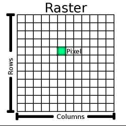

# Raster Query Basics

In geospatial terminology, a "raster" is a cover of an area divided into a uniform gridding, with one or more values assigned to each grid cell. 



A "raster" in which the values are associated with red, green and blue bands might be an visual image. The rasters that come off the [Landsat 7](https://www.usgs.gov/landsat-missions/landsat-7) earth observation satellite have eight bands: red, green, blue, near infrared, shortwave infrared, thermal, mid-infrared and panchromatic. 

## Database Rasters

Working with raster data via SQL is a little counter-intuitive: rasters don't neatly fit the relational model the way vector geometries. A table of parcels where one column is the geometry and the others are the owner name, address, and tax roll id makes sense.

How should a raster fit into a table? As a row for every pixel? For every scan row? What other values should be associated with each row? There is no clean relationship between "real world objects" and the database representation of a raster, because a raster has nothing to say about objects, it is just a collection of measurements.

We can squeeze rasters into the database, but doing so makes working with the data more complex. Before loading data, we need to enable PostGIS and the raster module.

```sql
CREATE EXTENSION postgis;
CREATE EXTENSION postgis_raster;
```

## Loading Rasters

For this example, we will load raster data for "digital elevation model" (DEM), a raster with just one band, the elevation at each pixel.

Using the [SRTM Tile Grabber](https://dwtkns.com/srtm/) I downloaded one tile of old [SRTM](https://www2.jpl.nasa.gov/srtm/) data. Then using the `gdalinfo` utility, read out the metadata about the file.

``` 
wget http://srtm.csi.cgiar.org/wp-content/uploads/files/srtm_5x5/TIFF/srtm_12_03.zip
unzip srtm_12_03.zip
gdalinfo srtm_12_03.tif
```

The metadata tells me two useful things for loading the data:

* The coordinate system of the data is [WGS 84](https://epsg.io/4326). 
* The pixel size is 3 arc-seconds.
* The pixel type is `Int16`, so two bytes per pixel.

Knowing that, I can build a `raster2pgsql` call to load the data into a raster table.

```
raster2pgsql \
    -I \                 # create a spatial index on the column
    -s 4326 \            # use 4326 (WGS 84) as the spatial reference for the raster
    -t 32x32 \           # tile the raster into 32 by 32 pixel tiles
    srtm_12_03.tif | \   # name of the raster
    psql dem             # target database connection
```

Once loaded the raster table looks like this on a map.


And it looks like this in the database.

```
Table "public.srtm_12_03"

 Column |  Type   
--------+---------
 rid    | integer 
 rast   | raster  
Indexes:
    "srtm_12_03_pkey" PRIMARY KEY, btree (rid)
    "srtm_12_03_st_convexhull_idx" gist (st_convexhull(rast))
```

It's a pretty boring table! Just a bunch of binary raster tiles and a unique key for each.

```sql
-- 29768 rows
SELECT Count(*) FROM srtm_12_03;
```

Those binary raster tiles aren't just opaque blobs though, we can look inside them with the right functions. Here we get a summary of all the raster tiles in the table.

```sql
SELECT (ST_SummaryStatsAgg(rast, 1, true)).* FROM srtm_12_03;
```

```
count  | 28966088
sum    | 20431360140
mean   | 705.3544869434907
stddev | 561.252765463607
min    | -291
max    | 4371
```

## Tiles, Tiles, Tiles

Remember when we loaded the data with `raster2pgsql` we specified a "tile size" of 32 by 32 pixels? This has a number of implications.

* First, at 32x32, a tile of 2-byte `Int16` data like our DEM will take up 2048 bytes. This is small enough to fit in the database [page size](https://www.postgresql.org/docs/current/storage-page-layout.html), which means the data will not end up stored in a side table by the [TOAST](https://www.postgresql.org/docs/current/storage-toast.html) subsystem that handles large row values.
* Second our input file had 6000x6000 pixels, which is enough pixels to generate 35156 32x32 tiles. Our table only has 29768 rows, because `raster2pgsql` does not generate tiles when the contents are all "no data" pixels (as the DEM data is over the ocean).

The loaded data looks like this. 


Notice how small each tile is. As a general rule, when working with raster data queries,

* the first step will be to efficiently find the relevant tile(s);
* the second step will be to use the tiles to find the answer you want.

Finding tile efficiently means using spatial index, and the spatial index defintion as we saw above is this:

```
"srtm_12_03_st_convexhull_idx" gist (st_convexhull(rast))
```

This is a [functional index](https://www.postgresql.org/docs/current/indexes-expressional.html), which means in order to access it, we need to copy the functional part: `st_convechull(rast)` when forming our query. 

The [ST_ConvexHull(raster)](https://postgis.net/docs/RT_ST_ConvexHull.html) converts a raster tile into a polygon defining the boundary of the tile. When querying raster tables, you will use this function a great deal to convert rasters into polygons suitable for querying a spatial index.

## Point Query

The simplest raster query is to take a point, and find the value of the raster under that point. 

Here is a point table with one point in it:

```sql
CREATE TABLE mappoint AS 
SELECT ST_Point(-123.7273, 47.8467, 4326)::geometry(Point, 4326) AS geom, 
       1 AS fid;
```

The nice thing about points is that they only hit one tile at a time. So we don't have to think too hard about what to do with our tile sets.

```sql
SELECT ST_Value(srtm.rast, pt.geom) 
FROM srtm_12_03 srtm
JOIN mappoint pt
  ON ST_Intersects(pt.geom, ST_ConvexHull(srtm.rast))
```

```
 st_value 
----------
     1627
```

Here we use the [ST_ConvexHull(raster)](https://postgis.net/docs/RT_ST_ConvexHull.html) function to get access to our spatial index on the raster table, and the [ST_Intersects(geom, geom)](https://postgis.net/docs/ST_Intersects.html) function to test the condition.

The [ST_Value(raster, geom)](https://postgis.net/docs/RT_ST_Value.html) function reads the pixel value from the raster at the location of the point.

## Polygon Query

Summarizing rasters under polygons is more involved than reading point values, because polygons will frequently overlap multiple tiles, so you have to think in terms of "sets of raster tiles" instead of "the raster" when building your query.

* We will use [ST_ConvexHull(raster)](https://postgis.net/docs/RT_ST_ConvexHull.html) and [ST_Intersects(geom, geom)](https://postgis.net/docs/ST_Intersects.html) again to get the set of tiles that intersect the polygon.


* Then we will apply [ST_Clip(raster, geometry)](https://postgis.net/docs/RT_ST_Clip.html) to mask out pixels on our tiles that are not inside the polygon.


* Then we will summarize the clipped tiles, to get the average elevation in our polygon.

The final complete query looks like this.

```sql
WITH clipped_tiles AS (
  SELECT ST_Clip(srtm.rast, ply.geom) AS rast, srtm.rid
  FROM srtm_12_03 srtm
  JOIN mappoly ply
    ON ST_Intersects(ply.geom, ST_ConvexHull(srtm.rast))
)
SELECT (ST_SummaryStatsAgg(rast, 1, true)).* 
  FROM clipped_tiles;
```

```
count  | 362369
sum    | 388175193
mean   | 1071.2152336430545
stddev | 441.7982032761408
min    | 108
max    | 2374
```

## Conclusion

Working with database rasters analytically can be challenging, particularly if you are used to thinking about them as single, unitary coverages. 