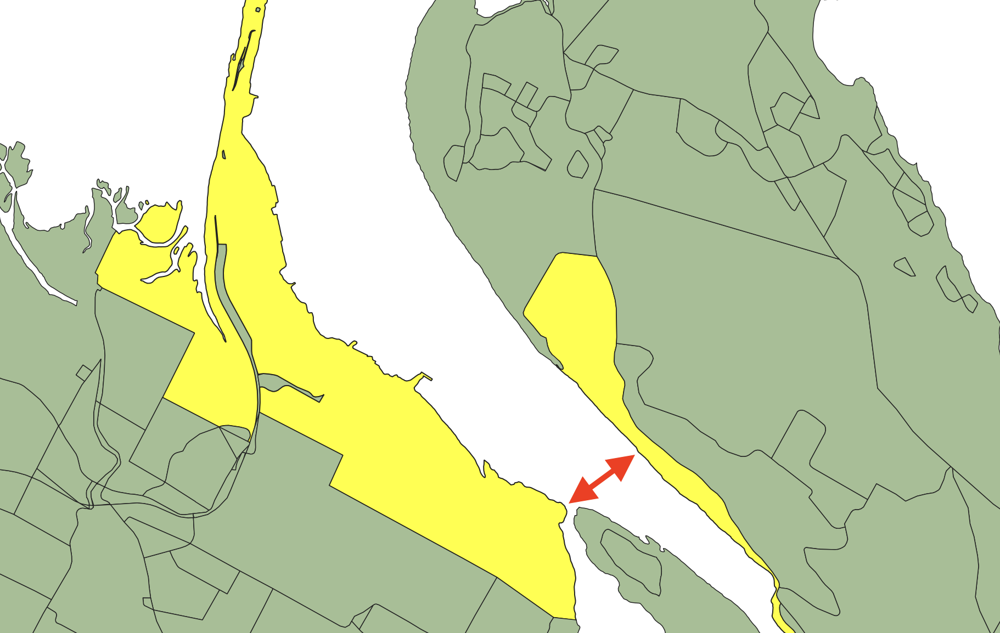

# Calculating Distance

Calculating distance is a core feature of a spatial database, and the central function in many analytical queries. 

* "How many houses are within the evacuation radius?"
* "Which responder is closest to the call?"
* "How many more miles until the school bus needs routine maintenance?"

Fortunately we all learn how to calculate distance in middle school! The [Pythagorean Theorem](https://en.wikipedia.org/wiki/Pythagorean_theorem) tells us that the square of the hypotenuse of a right triangle is the sum of the squares of the two other sides.

So, problem solved, right?

Not so fast. Pythagorus gives us the distance between two points, but objects in spatial databases like PostGIS can be much more complex. 

How would I calculate the distance between two complex polygons?

## Brute Force

The straight-forward solution is to just find the distance between every possible combination of edges in the two polygons, and return the minimum of that set.

This is a "quadratic" algorithm, what computer scientists call `O(n^2)`, because the amount of work it generates is proportional to the square of the number of inputs. As the inputs get big, the amount of work gets **very very very big**.

Fortunately, there are better ways.

## Projection and Pruning

The [distance implementation in PostGIS](https://github.com/postgis/postgis/blob/bd63102e05c5df317cb631efe782cc79e3e053db/liblwgeom/measures.c#L207) has two major code paths:

* For disjoint (non-overlapping) inputs, an optimized calculation; and,
* For overlapping inputs, the brute force calculation.

Disjoint inputs are handled with a clever simplification of the problem space. Because the inputs are disjoint, it is possible to construct a line between the centers of the two inputs. 

If every edge in each object is projected down onto the line, it becomes possible to perform a sort of those edges, such that edges that are near on the line are also near in the sorted lists, and near in space.

Starting from the mid-point of each object it is relatively inexpensive to quickly prune away large numbers of edges that a definitely **not** the nearest edges, leaving a much smaller number of potential targets that need to have their distance calculated.

The cost of creating the projected segments is just `O(n)`, but the cost of the sort step is `O(n*log(n))` so the overall cost of the algorithm is `O(n*log(n))`.

This is all well and good, but what if the inputs **do** overlap? Then the algorithm falls back to brute-force and `O(n^2)`. Is there any way to avoid that?

## Linear Time Spatial Trees

The project-and-prune approach is very clever, but it is possible to generate a spatially searchable representation of the edges even faster, by using the fact that edges in a LineString or LinearRing are highly spatial autocorrelated:

* The end point of one edge is **always** the start point of the next.
* The edges **mostly** don't cross each other. 

Basically, the edges are already spatially pre-sorted. That means it is possible to build a decent tree structure from them incurring any non-linear computational cost. 

Start with the edges in sorted order. The bounds of the edges form the leaf nodes of a spatial tree. Merge neighboring leaf nodes, now you have the first level of interior nodes. Continue until you have only one node left, that is your root node. The cost is `O(n) + O(0.5n) + O(0.25n) ...` which is to say in aggregate, `O(n)`. 

Ordinarily, building a spatial tree would be expected to cost about `O(n*log(n))`, so this is a nice win.

The `CIRC_NODE` tree used to [accelerate distance calculation](https://github.com/postgis/postgis/blob/master/liblwgeom/lwgeodetic_tree.h) for the `geography` type is built using this process.

## Overlapping Inputs and Distance Calculation

There is no guarantee that a tree-indexed approach will crack the overlapping polygon problem.

Disjoint polygons are very amenable to distance searching trees, because it is easy to discard whole branches of the tree that are definitionally too far away to contain candidate edges.

As inputs begin to overlap, it becomes harder to discard large portions of the trees, and as a result a lot of computation is spent traversing the tree, even if a moderate proportion of candidates can be discarded from the lower branches of the tree.

## Next Steps

The distance calculation in PostGIS has not been touched in many years, for good reason: it's really important, so any re-write has to be definitely an improvement on the existing code, over all known (and unknown) use cases.

However, there is some already built and tested code, in the code base, which has never been turned on, the [RECT_TREE](https://github.com/postgis/postgis/blob/bd63102e05c5df317cb631efe782cc79e3e053db/liblwgeom/lwtree.h). 

Like the `CIRC_NODE` tree in geography, this implementation is based on building a tree from spatially coherent inputs. Unlike the `CIRC_NODE` tree, it has not been proven to be faster than the existing implementation in all cases. 

A next development step will be to revive this implementation, evaluate it for implementation efficiency, and test effectiveness: 

* Can it exceed the current sort-and-prune strategy for disjoint polygons.
* Can it exceed brute-force for overlapping polygons.

