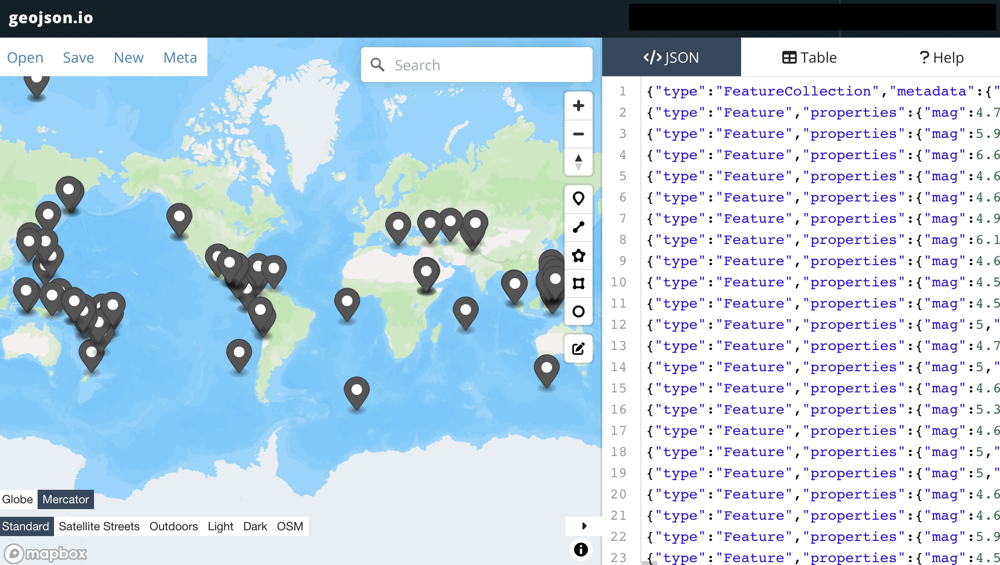

# Shaking the Earth with JSON_TABLE

A few days ago, I was awakened in the middle of the night when my house started to shake. Living in the [Cascadia subduction zone](https://www.pnsn.org/outreach/earthquakesources/csz), when things start to shake I wake up really fast, because you never know if this one is going to be the [Big One](https://www.newyorker.com/magazine/2015/07/20/the-really-big-one).

Fortunately this one was only a little one, 4.0 magnitude quake several miles to the north of the city, captured and memorialized in its own [USGS earthquake page](https://earthquake.usgs.gov/earthquakes/eventpage/uw62050041/executive), almost as soon as it had finished shaking.

The [USGS](https://earthquake.usgs.gov) keeps a [near-real-time collection](https://earthquake.usgs.gov/earthquakes/feed/) of information about the latest quakes online, served up in a variety of formats including [GeoJSON](https://earthquake.usgs.gov/earthquakes/feed/v1.0/geojson.php).



The [weekly feed](https://earthquake.usgs.gov/earthquakes/feed/v1.0/summary/4.5_week.geojson) of magnitude 4.5 quakes has a nice amount of data in it.

If we could import this feed into the database, we could use it for other queries, like finding potential customers to sell tents and emergency supplies to! (When the big one hits me, sell me some tents and emergency supplies.)

## Retrieving the Feed

The first step is to retrieve the feed. The simplest way is to use the [http](https://github.com/pramsey/pgsql-http) extension, which provides a simple functional API to making HTTP requests. 

```sql
CREATE EXTENSION http;
```

The `http_get(url)` function returns an `http_response`, with a status code, content_type, headers and content. We could write a wrapper to check the status code, but for this example we will just assume the feed works and look at the content.

```sql
SELECT jsonb_pretty(content::jsonb) 
  FROM http_get('https://earthquake.usgs.gov/earthquakes/feed/v1.0/summary/4.5_week.geojson');
```

## Reading the Feed

The feed is in [GeoJSON](https://datatracker.ietf.org/doc/html/rfc7946), and between PostgreSQL and PostGIS we have the tools to read into it -- native JSON support in PostgreSQL and GeoJSON support in PostGIS.

The feed is actually a GeoJSON [FeatureCollection](https://datatracker.ietf.org/doc/html/rfc7946#section-3.3), which is just a container for a list of [Feature](https://datatracker.ietf.org/doc/html/rfc7946#section-3.2). In order to convert it to a table, we need to iterate through the list.

## Reading the Features with PL/PgSQL

One way to iterate through the list would be to write a function in PL/PgSQL, and build a loop.

```sql
    -- Read the feed
    SELECT content::jsonb
    INTO response
    FROM http_get(feed_url);

    -- Read the features
    FOR feature IN
        SELECT jsonb_array_elements(response->'features')
    LOOP
        -- Extract properties from the current feature
        -- here ...
        -- ...
        -- and then...
        RETURN NEXT;

    END LOOP;
```

<details><summary>Complete PL/PgSQL Function</summary>

```sql
CREATE OR REPLACE FUNCTION earthquakes(feed_url TEXT)
RETURNS TABLE(
    title TEXT,
    mag REAL,
    place TEXT,
    ts TIMESTAMPTZ,
    url TEXT,
    detail TEXT,
    felt INTEGER,
    id TEXT,
    geom geometry(Point, 4326)
) AS
$$
DECLARE
    response JSONB;
    feature JSONB;
    props JSONB;
BEGIN
    -- Fetch the GeoJSON file from the provided URL using the HTTP extension
    SELECT content::jsonb
    INTO response
    FROM http_get(feed_url);

    -- Extract features array from GeoJSON
    FOR feature IN
        SELECT jsonb_array_elements(response->'features')
    LOOP
        -- Extract properties from the current feature
        props := feature->'properties';

        -- Return each feature's geometry and properties
        place  := props->>'place';
        mag    := props->>'mag';
        title  := props->>'title';
        ts     := to_timestamp((props->>'time')::bigint / 1000);
        url    := props->>'url';
        detail := props->>'detail';
        felt   := props->>'felt';
        id     := feature->>'id';
        geom   := ST_SetSRID(ST_GeomFromGeoJSON(feature->>'geometry'),4326);

        RETURN NEXT;

    END LOOP;
END;
$$ LANGUAGE 'plpgsql';
```
</details>

However, there is a new (as of PostgreSQL 17) and faster way to process JSON data files like the USGS earthquakes feed: [JSON_TABLE](https://www.postgresql.org/docs/current/functions-json.html#FUNCTIONS-SQLJSON-TABLE)

## Reading the Features with JSON_TABLE

[JSON_TABLE](https://www.postgresql.org/docs/current/functions-json.html#FUNCTIONS-SQLJSON-TABLE) is part of the [SQL/JSON](https://www.iso.org/standard/78937.html) standard, and allows users to filter parts of JSON documents using the [JSONPath](https://www.ietf.org/archive/id/draft-goessner-dispatch-jsonpath-00.html) filter language.

The PL/PgSQL function above can be reduced to just one equivalent `JSON_TABLE` call.

```sql
-- Download the GeoJSON feed from USGS 
WITH http AS (
    SELECT * FROM 
    http_get('https://earthquake.usgs.gov/earthquakes/feed/v1.0/summary/4.5_week.geojson') 
),
-- Filter the JSON feed into a record set, providing
-- the type informant and JSONPath to each column
jt AS (
    SELECT * FROM
    http, 
    JSON_TABLE(content, '$.features[*]' COLUMNS (
        title text PATH '$.properties.title',
        mag real PATH '$.properties.mag',
        place text PATH '$.properties.place',
        ts text PATH '$.properties.time',
        url text PATH '$.properties.url',
        detail text PATH '$.properties.detail',
        felt integer PATH '$.properties.felt',
        id text PATH '$.id',
        geometry jsonb PATH '$.geometry'
    ))
)
-- Apply any remaining transforms to the columns
-- in this case converting the epoch time into a timestamp
-- and the GeoJSON into a geometry
SELECT 
    jt.title, 
    jt.mag, 
    jt.place, 
    to_timestamp(jt.ts::bigint / 1000),
    jt.url, 
    jt.detail, 
    jt.felt, 
    jt.id,
    ST_SetSRID(ST_GeomFromGeoJSON(jt.geometry),4326) AS geom
FROM jt;
```

In particular, look at the `JSON_TABLE` call.

```sql
JSON_TABLE(content, '$.features[*]' COLUMNS (
    title text PATH '$.properties.title',
    mag real PATH '$.properties.mag',
    place text PATH '$.properties.place',
    ts text PATH '$.properties.time',
    url text PATH '$.properties.url',
    detail text PATH '$.properties.detail',
    felt integer PATH '$.properties.felt',
    id text PATH '$.id',
    geometry jsonb PATH '$.geometry'
))
```

* The first argument is the JSON document
* The second argument is the filter that generates the rows, in this case one row for each member of the `features` list in the GeoJSON `FeatureCollection`
* The `COLUMNS` provides with path, within each `Feature` to pull the column data from, and the database type to apply to that data. Most of the columns come from the GeoJSON `properties` but others, like the `id` and `geometry` come from other attributes.

## Conclusion

The [JSON_TABLE](https://www.postgresql.org/docs/current/functions-json.html#FUNCTIONS-SQLJSON-TABLE) documentation includes some much more complicated examples, but this basic example of JSON document handling is probably good for 80% of use cases, pulling data from web APIs, live into the database.


