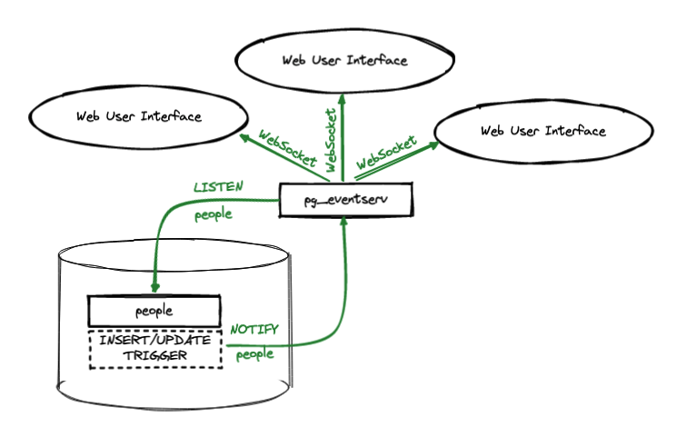
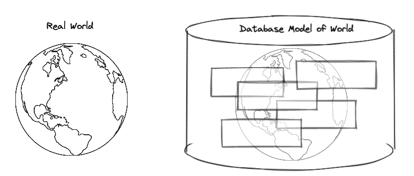
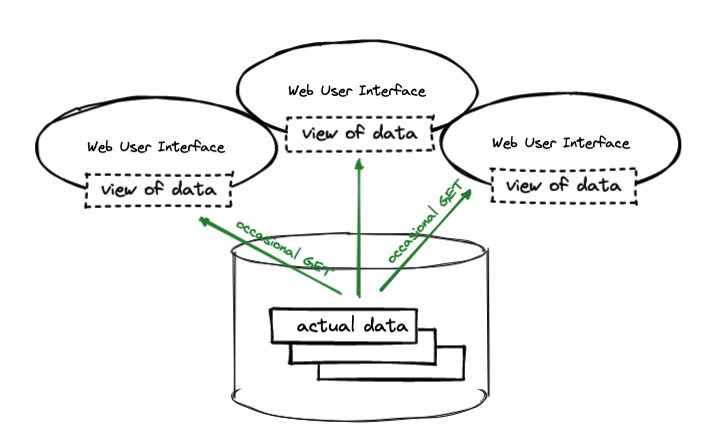
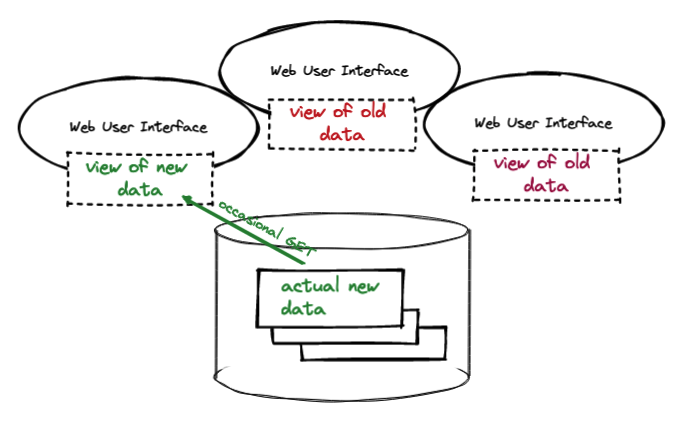
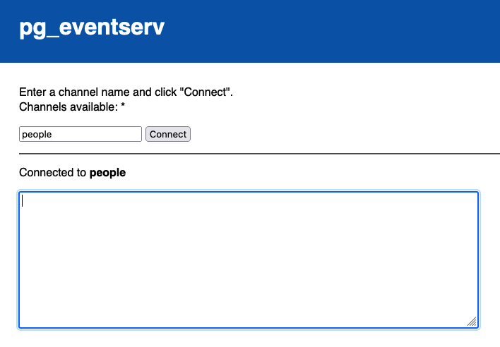

# Real-time Database Events with pg_eventserv

By combining triggers, the PostgreSQL `LISTEN/NOTIFY` system, and the [pg_eventserv](https://github.com/crunchydata/pg_eventserv) service, you can build a real-time application that keeps your web application state perfectly in sync with your database state.

[pg_eventserv](https://github.com/crunchydata/pg_eventserv) converts events from the PostgreSQL event bus to standard WebSockets messages that any web client can handle.



For multi-user real-time applications (like a fleet tracker, or auction system, for example), this setup can be a boon! The database is the central source-of-truth, and all applications can keep on working directly on the database, no need for a fancy new event bus or system rebuild.

## Your Database holds a Model

A database can be thought of as a model of a real world system. Sometimes the system is something boring and abstract, like accounting ledgers, and sometimes the system is very physical, like the locations of a delivery fleet, but in most cases the database models the state of some kind of system.



When the state of the system changes (delivery trucks move, or transaction records arrive), the state of the database should also change. Sometimes the system state changes in tandem with the real-world system, as when point-of-sale machines update a transaction database. Sometimes the system state changes on a delay, as when transactions are hand entered. But in all cases, the system tracks the real-world.

In order to make sense of our database system, we construct user interfaces on top of them. They can be as simple as a web form, or as sophisticated as a stylized cartographic map.



Now, when the state of the system changes, and the state of the database changes, what happens to user interface views of the database? Ideally, the state of the interfaces tracks the state of the database: what the user sees is what is in the database.



However, for interfaces that have long periods of being open without refreshing their sources, it is quite easy for the interface view of the system to drift out of synch with the actual data in the database. (This is particularly common for mapping interfaces of live location data.)


## A Simple Model

For this blog post, let us model a set of people with a single table tracking their names, ages, and heights.

```sql
CREATE TABLE people (
    pk serial primary key,
    ts timestamptz DEFAULT now(),
    name text,
    age integer,
    height real
);
```


## Noticing Data Changes

Noticing data changes in a database is really easy, because there is a feature devoted exclusively to carrying out actions when data changes: the [TRIGGER](https://www.postgresql.org/docs/current/triggers.html).

Here's a trigger function that catches new and updated data in our model of people.

```sql
CREATE OR REPLACE FUNCTION data_change() RETURNS trigger AS
$$
    DECLARE
        js jsonb;
    BEGIN
        SELECT to_jsonb(NEW.*) INTO js;
        js := jsonb_set(js, '{dml_action}', to_jsonb(TG_OP));
        js := jsonb_set(js, '{dml_table}', to_jsonb(TG_TABLE_NAME));
        PERFORM (
            SELECT pg_notify('people', js::text)
        );
        RETURN NEW;
    END;
$$ LANGUAGE 'plpgsql';

CREATE OR REPLACE TRIGGER data_change_trigger
    BEFORE INSERT OR UPDATE ON people
    FOR EACH ROW
        EXECUTE FUNCTION data_change();

```


## LISTEN/NOTIFY

Look what is happening in the trigger function above! ⬆️⬆️⬆️ 

For every data change, the function is preparing a JSON object with the row information, and then using the `pg_notify()` function on that JSON object. Why?

The `pg_notify()` function is equivalent to running the PostgreSQL [NOTIFY](https://www.postgresql.org/docs/current/sql-notify.html) command. `NOTIFY` is one half of the [LISTEN](https://www.postgresql.org/docs/current/sql-listen.html)/[NOTIFY](https://www.postgresql.org/docs/current/sql-notify.html) pairing of commands.

Any PostgreSQL database client may `LISTEN` to a named channel. The `NOTIFY` command places a text payload into a named channel, and all listening clients are **immediately** informed of the new payload. This makes the `LISTEN/NOTIFY` system a great tool for ensuring that clients are told when the data they are displaying has **changed** in some way.


## Notifying Web Clients with pg_eventserv

By default, the only clients that can recieve `LISTEN/NOTIFY` messages are clients connected directly to the database using the PostgreSQL network protocol. That is actually a pretty limited selection of clients. Most modern user interfaces are built using web technologies: is there any way to pass a PostgreSQL `LISTEN/NOTIFY` message on to a web client?

There is now, with [pg_eventserv](https://github.com/crunchydata/pg_eventserv)! 


[pg_eventserv](https://github.com/crunchydata/pg_eventserv) bridges the gap between the PostgreSQL `LISTEN/NOTIFY` and web clients by providing a [WebSockets](https://developer.mozilla.org/en-US/docs/Web/API/WebSockets_API) service that HTML/Javascript clients can connect to.

A WebSockets client can connect to [pg_eventserv](https://github.com/crunchydata/pg_eventserv) at:

```
ws://hostname:7700/listen/people
```

The client will then recieve all the messages sent on the "people" channel in PostgreSQL. Including, in our example, all the changes captured off the `people` table.


## Starting pg_eventserv

The [pg_eventserv](https://github.com/crunchydata/pg_eventserv) program is just a small multi-threaded service written in [Go](https://go.dev/). 

* From the [pg_eventserv](https://github.com/crunchydata/pg_eventserv) home page download a binary suitable for your operating system and unzip it.
* Set the `DATABASE_URL` environment variable to be a connection string for your database.
* Run the [pg_eventserv](https://github.com/crunchydata/pg_eventserv) program.

You should see the service start up and connect. If you want to see more, run with the `--debug` commandline flag.

```
INFO[0000] pg_eventserv latest                          
INFO[0000] Run with --help parameter for commandline options 
INFO[0000] Serving HTTP  at http://0.0.0.0:7700/        
INFO[0000] Channels available: *                        
INFO[0000] Connected as 'pramsey' to '' @ '/private/tmp' 
```


## Create database events!

Now you can create database events and see them propogated to your web browser!

Connect to the [pg_eventserv](https://github.com/crunchydata/pg_eventserv) demonstration user interface at:

```
http://localhost:7700
```

Enter "people" into the channel field and click "Connect".



Now go to your database client, and send the database some SQL to modify the people table.

Add some new records:

```sql
INSERT INTO people (name, age, height) VALUES ('Paul', 51, 1.9);
INSERT INTO people (name, age, height) VALUES ('Colin', 65, 1.5);
```

Check the web page, you should see the results there! 

For extra fun, open several web tabs on the demonstration page, and point them all at the same channel. Note how they all receive updates **simultaneously**.


## Database as Central Model

Because the database is already serving as a central point of truth for an application data model, it makes a lot of sense to keep the point of truth in place and notify clients when the state of the model changes. 

<video width="600" controls><source src="eventserv.mp4" type="video/mp4">Your browser does not support the video tag.</video> 

Building real-time systems this way allows **any database client** to alter the state of the system and have that alteration propagated to all other clients in real time. 


## Conclusions

* Databases are the place we store our "information of record" for systems of all kinds.
* User interfaces can easily come out of sync with the state of data in the database.
* PostgreSQL provides the LISTEN/NOTIFY system to update clients about real-time changes.
* The pg_eventserv service allows you to push LISTEN/NOTIFY events further out to any WebSockets client.


