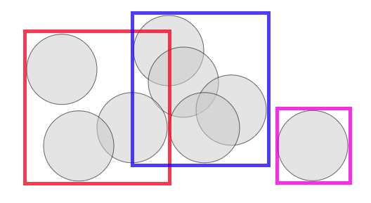
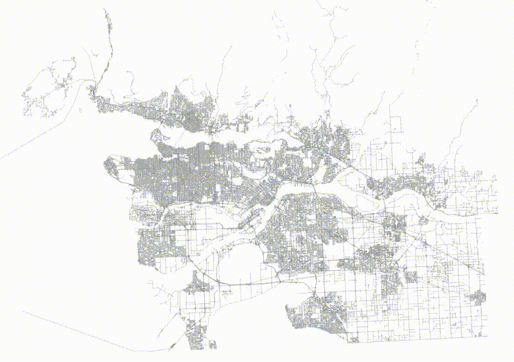
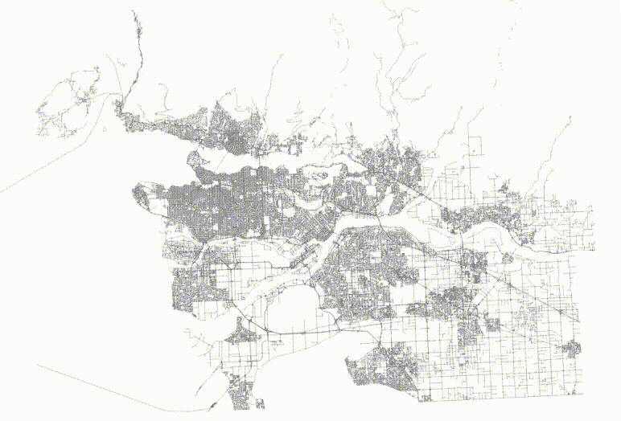
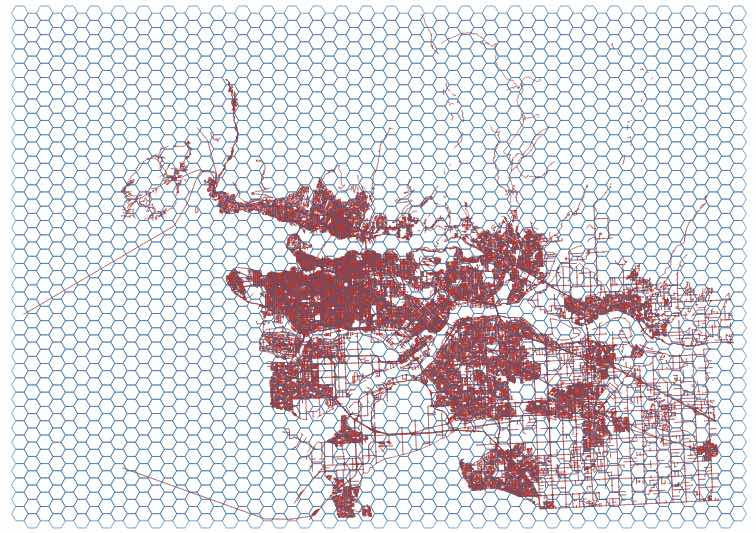
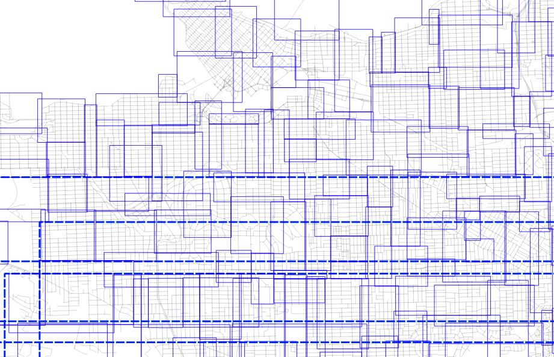
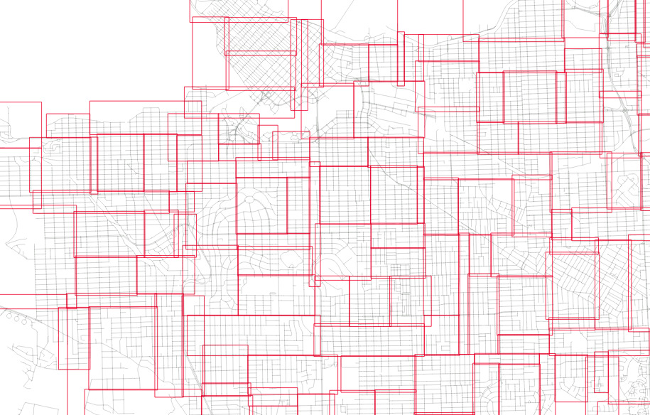

# Clustering Spatial Indexes for Performance

One of the curious aspects of spatial indexes is that the nodes of the tree can overlap, because the objects being indexed themselves also overlap. 



That means that if you're searching an area in which two nodes overlap, you'll have to scan the contents of both nodes. For a trivial example above, that's not a big deal, but if an index has a lot of overlap, the extra work can add up to a measurable query time difference.

The PostGIS spatial index is based on a [R-tree](https://en.wikipedia.org/wiki/R-tree) structure, which naturally tries to split nodes into children that have minimized overlap. As the index is built, it automatically tries to conform to the distribution of the data, with more nodes in dense data areas and fewer in sparse areas. 

## Order Matters

For data retrieval, the order in which data are laid down on disk has a surprising affect on the performance of accesses, as long as the data pattern matches the access pattern.

Imagine a table full of time-stamped measurements. If a common query was "all measurements within a time range", then having the records in the table ordered by time would intuitively make those queries faster.

Similarly, spatial data is a case where there is a very common access pattern behind most queries: retrieve all the data within a bounding box. If the data are laid into the table in "spatially correlated" order, then intuitively you would expect faster performance for bounding box queries.

## Ordered vs Unordered

To test the difference that ordering makes, we can lay data down into a table in different orders.

For example, here's a [table of roads](http://s3.cleverelephant.ca/roads.sql.bz2). 

```sql
CREATE EXTENSION postgis;

\i roads.sql

CREATE TABLE roads_sorted AS 
  SELECT * FROM roads ORDER BY geom;

CREATE INDEX roads_sorted_idx ON roads_sorted USING GIST (geom);
```

To generate a sorted table, we order by the geometry column, which results in a [Hilbert curve](https://en.wikipedia.org/wiki/Hilbert_curve) ordering.

The result is a table that is highly spatially auto-correlated.



To generate a random table, we can just order using the PostgreSQL `random()` function.

```sql
CREATE TABLE roads_random AS 
  SELECT * FROM roads ORDER BY random();

CREATE INDEX roads_random_idx ON roads_random USING GIST (geom);
```

The data are in that table are very randomized!



## A Very Ordinary Join

The most common join in the spatial SQL world is a polygon driven join, so we will create some regular polygons to drive the join.

```sql
  CREATE TABLE hexes AS
    WITH bounds AS (
      SELECT ST_Extent(geom) AS extent FROM roads
    )
    SELECT * 
    FROM bounds, ST_HexagonGrid(1000, bounds.extent);
```

This generates 2124 hexagons, some of which overlap the roads data.



Now, we can time the join of the hexagons to the different roads tables, using a pure index join condition with the [&&](https://postgis.net/docs/geometry_overlaps.html) operator.

```sql
SELECT count(*)   
FROM hexes h, roads_random r  
WHERE h.geom && r.geom
```

The query explain shows we are getting a nice nested loop join, so each hexagon drives a dive into the roads with a bounding box query, exactly the kind of search condition we think a good table order will help.

## Timings

The timings were gathered by averaging the query time over 64 runs.

```
roads_random: 358ms
roads_sorted: 259ms
```

So querying the sorted table is quite a bit faster. 

## Pretty Random Index

One of the properties of a spatial index built from random inputs (as opposed to highly correlated inputs) is that it tends to be slightly more efficient, as each parent node gets created from a representative sample of all future inputs.

This is what the nodes of an index build from sorted input look like.



And here's the nodes from randomized input.



This raises an intriguing possibility: if, after building the pretty index from randomized inputs, we then sort the underlying table using the index order, is the result the perfect marriage of "nice index" and "nice data"?

Fortunately, we can test is, because the PostgreSQL [CLUSTER](https://www.postgresql.org/docs/current/sql-cluster.html) command does exactly what we want: it reorders a table based on the index.

```sql
CLUSTER roads_random USING roads_random_idx;
```

Unfortunately the answer is "no". Any benefits provided by the optimal index are too small to measure.

```
roads_random: 358ms
roads_sorted: 259ms
roads_random after cluster: 260ms
```

However, sorting the table into a spatially correlated order (driven by the index) has brought performance to parity with the pre-sorted table.

## Conclusion

Based on our tests, the simplest way to get a table with good spatial auto-correlation for the fastest spatial joins is to just:

* Load the table as usual
* Build a spatial index as usual
* Cluster the table using that spatial index

For very large input tables, this might take a while, and the table will be locked while the clustering process runs, to be aware. Also, new data inserted into the table later will **not** be ordered spatially, so you may need to re-cluster your table from time-to-time if squeezing every ounce of performance out of your joins is the over-riding concern.

