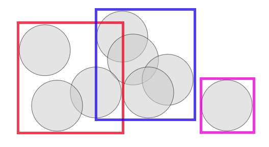
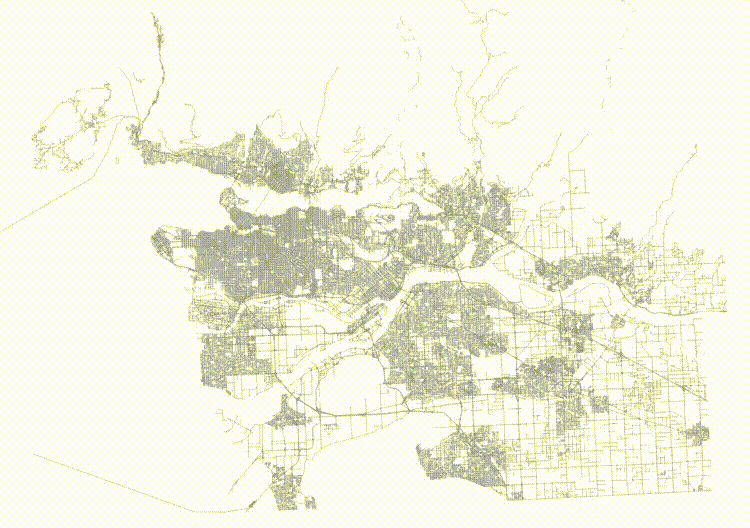
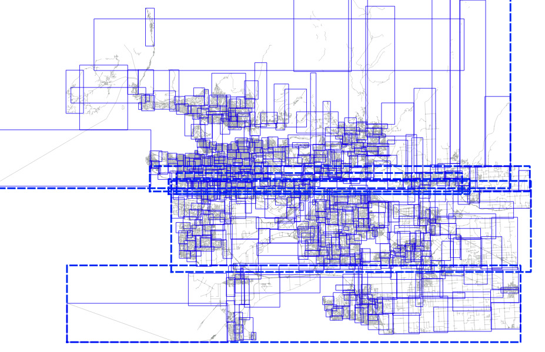
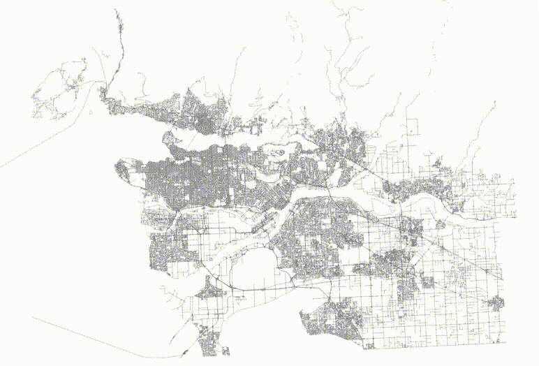
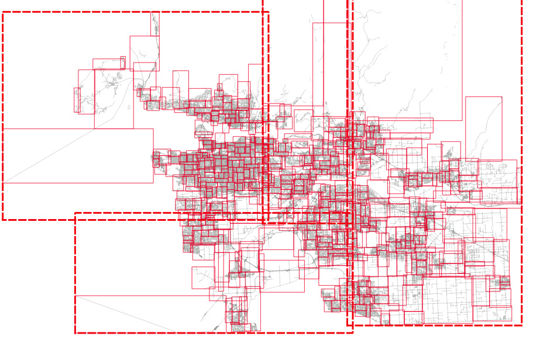
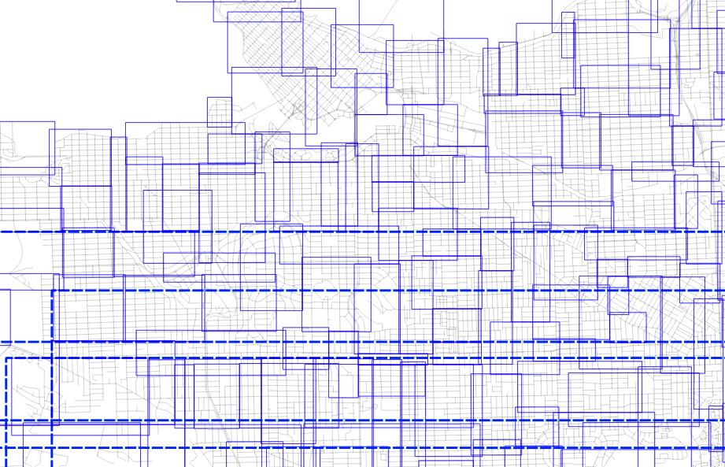

# Faster Spatial Indexes with this One Wierd Trick

One of the curious aspects of spatial indexes is that the nodes of the tree can overlap, because the objects being indexed themselves also overlap. 



That means that if you're searching an area in which two nodes overlap, you'll have to scan the contents of both nodes. For a trivial example above, that's not a big deal, but if an index has a lot of overlap, the extra work can add up to a measurable query time difference.

The PostGIS spatial index is based on a [R-tree](https://en.wikipedia.org/wiki/R-tree) structure, which naturally tries to split nodes into children that have minimized overlap. As the index is built, it automatically tries to conform to the distribution of the data, with more nodes in dense data areas and fewer in sparse areas. 

So problem solved, right?

Well no! Because the index is structuring itself based on the inputs it receives, the **order of inputs**, particularly the early inputs, can have a strong effect on the quality of the final index.

## Sorted vs Random Inputs

For example, here's a [table of roads](http://s3.cleverelephant.ca/roads.sql.bz2).

```sql
CREATE EXTENSION postgis;

\i roads.sql

CREATE TABLE roads_sorted AS 
  SELECT * FROM roads ORDER BY geom;

CREATE INDEX roads_sorted_idx ON roads_sorted USING GIST (geom);
```

If we order the roads in a [Hilbert curve](https://en.wikipedia.org/wiki/Hilbert_curve) (which is the default sort order for `geometry`) we get a table that is highly spatially autocorrelated.



And then if we visualize the top two levels of the index (using [gevel](https://github.com/pramsey/gevel), we can see how the pages look.




This is not actually a terrible tree! Mostly the nodes don't have a lot of overlap, but the shape of the level one pages (the dotted lines) isn't great, and there's some stretching, both vertically and horizontally.

Now, take the same data and **randomize** it.

```sql
CREATE TABLE roads_random AS 
  SELECT * FROM roads ORDER BY random();

CREATE INDEX roads_random_idx ON roads_random USING GIST (geom);
```

The table now has no spatial correlation at all.



And then if we visualize the top two levels of the index, we can see how the pages look.



The level one nodes are definitely better, but it's hard to see how much better the level two nodes are until you zoom in.

Here's the level one nodes from sorted input.



And here's the level one nodes from randomized input.


The nodes for the index built from randomized inputs are just much more nicely arranged to cover the area with minimized overlap.

So it's pretty. So what?

## Different Trees, Different Performance

In fact, a pretty index performs faster than an ugly one. 

To test, we will run a self-join of the table on itself. The query plan is a nested loop join, and the table is 92K records long, so that's 92K index lookups.

```
# SELECT count(*) 
  FROM roads_sorted a, roads_sorted b 
  WHERE a.geom && b.geom;

 count  
--------
 505806
(1 row)

Time: 5229.205 ms (00:05.229)

# SELECT count(*) 
  FROM roads_random a, roads_random b 
  WHERE a.geom && b.geom;

 count  
--------
 505806
(1 row)

Time: 4629.745 ms (00:04.630)
```

So **querying on the slightly prettier index is 11% faster**.

In general, spatial indexes will end up with a better shape if seeded with randomized inputs. We found [the same effect](http://lin-ear-th-inking.blogspot.com/2020/12/randomization-to-rescue.html) in our in-memory [K-D trees](https://en.wikipedia.org/wiki/K-d_tree), and addressed it both with bulk randomization, and a more clever [pre-seeding](http://lin-ear-th-inking.blogspot.com/2021/10/query-kd-trees-100x-faster-with-this.html) approach.


## Conclusions

* Spatial indexes are sensitive to the order of inputs, in particular highly correlated inputs will result in poorly balanced trees and/or poorly arranged trees.
* Pre-ordering your rows randomly will result in a more balanced tree and measurable improvements in query performance.
