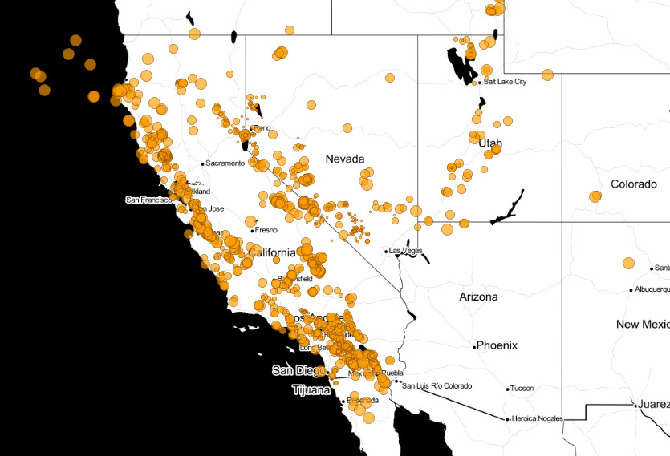

# Easy PostgreSQL Time Bins

It's the easiest thing in the world to put a timestamp on a column and track when events like new records or recent changes happen, but what about reporting?

Here's some PostgreSQL secrets that you can use to build up complete reports of time-based data.

## Earthquake Data

Earthquakes are a natural source of time-stamped data, and Crunchy Bridge gives us access to [PL/Python](https://www.postgresql.org/docs/current/plpython.html).

```sql
CREATE EXTENSION plpython3u;
```

Our target table is just a few interesting columns for each quake.

```sql
CREATE TABLE quakes (
    mag   float8,
    place text,
    ts    timestamptz,
    url   text,
    id    text,
    geom  geometry(pointz, 4326)
);
```

To populate the table, we pull the live [earthquake feed published by the USGS](https://earthquake.usgs.gov/earthquakes/feed/v1.0/summary/all_hour.geojson).




```sql
CREATE OR REPLACE FUNCTION fetch_quakes()
RETURNS setof quakes
AS $$
    import requests
    import json
    url = 'https://earthquake.usgs.gov/earthquakes/feed/v1.0/summary/all_month.geojson'
    r = requests.get(url)
    quakes = r.json()

    for q in quakes['features']:
        q_id     = q['id']
        props   = q['properties']
        geojson = json.dumps(q['geometry'])
        epoch   = props['time']
        q_ts     = plpy.execute(f"SELECT to_timestamp({epoch}/1000.0) AS t")[0]['t']
        q_geom   = plpy.execute(f"SELECT st_geomfromgeojson('{geojson}') AS g")[0]['g']
        q_mag    = props['mag']
        q_url    = props['url']
        q_place  = props['place']

        plpy.debug(f'quake at {q_place}, magnitude {q_mag}, time {q_ts}')
        yield (q_mag, q_place, q_ts, q_url, q_id, q_geom)

$$
LANGUAGE 'plpython3u';
```

And populating the table is then just a simple refresh and load.

```sql 
TRUNCATE quakes;
INSERT INTO quakes SELECT * FROM fetch_quakes();
```

## Simple Summaries

One month of quakes of all sizes is a table of a few thousand records. (The answer will vary depending on when you run the query, since the input is live.)

```sql
-- 11791
SELECT Count(*) 
FROM quakes;
```

Where the data support it, running grouped aggregates off of rounded results is a good way to generate a summary. Here's the summary of magnitudes, using the `floor()` function to turn the distinct floating point magnitudes into groupable integers.

```sql
SELECT floor(mag) AS mags, 
       Count(*) 
FROM quakes 
GROUP BY mags 
ORDER BY mags;
```

There's only a handful of quakes above magnitude 6 in the last month.

```
 mags | count 
------+-------
   -2 |     4
   -1 |   719
    0 |  2779
    1 |  5252
    2 |  1676
    3 |   342
    4 |   849
    5 |   142
    6 |    13
```

## Histogram Summaries

Let's look at magnitude 6 quakes.

```sql
SELECT ts::date AS date, count(*)
FROM quakes q 
WHERE q.mag > 6
GROUP BY date
```

To build a good histogram, you need a value for every category in your binning of the raw data. Unfortunately, the quake data are sparse: there isn't a result for every day of the last month.

There's a couple ways to solve this problem.

Since we are binning by date, we can take a list of all dates in our range, and left join the counts to that list. Dates without counts will get `NULL` counts, but we can use `Coalesce()` to convert those to zeroes.

```sql
WITH counts AS (
    SELECT ts::date AS date, count(*)
    FROM quakes q 
    WHERE q.mag > 6
    GROUP BY date
)
SELECT series::date, coalesce(counts.count, 0)
FROM generate_series('2023-02-13'::date, '2023-03-14'::date, '1 day'::interval) series
LEFT JOIN counts 
ON counts.date = series;
```

The magic ingredient here is the `generate_series()` function. It is usually used to generate sets of integers, but it will also generate sets of timestamps, or dates, or floats, as long as you provide a third parameter, the distance between each element.

In this example, we generated using a one day interval.

## Arbitrary Bins

What if we want to summarize using a bin layout that doesn't neatly align with the rounding of a particularly type? What about magnitude 6 earthquakes by week?

We can generate the bins easily enough with `generate_series()`.

```sql
SELECT array_agg(a) AS bins
FROM generate_series(
    '2023-02-13'::date, 
    '2023-03-14'::date, 
    '1 week'::interval) a
```

Fortunately there is another PostgreSQL function to make use of the bins, `width_bucket()`. We can feed our bins into `width_bucket()` as an array to get back counts in each bucket.

```sql
WITH a AS (
    SELECT array_agg(a) AS bins
    FROM generate_series(
        '2023-02-13'::date, 
        '2023-03-14'::date, 
        '1 week'::interval) a
),
counts AS (
    SELECT 
        width_bucket(ts, a.bins) AS bin, 
        Count(*) AS count
    FROM quakes
    CROSS JOIN a
    WHERE mag > 6
    GROUP BY bin
)
SELECT * FROM counts;
```

This is extremely flexible, as the bin width can be any interval at all: a week, 2 days, 47 hours, whatever.

However, the result isn't very informative.

```
 bin | count 
-----+-------
   1 |     3
   2 |     4
   3 |     3
   5 |     1
```

We have the bin number and the count, but we have lost the information about the bin boundaries, and also we have a missing zero count for bin 4.

To get back the bin boundaries, we reach back to the array we initially generated, and `unnest()` it. To get the bin numbers at the same time, we use the `WITH ORDINALITY` keywords. 

```sql
WITH a AS (
    SELECT array_agg(a) AS bins
    FROM generate_series(
        '2023-02-13'::date, 
        '2023-03-14'::date, 
        '1 week'::interval) a
),
counts AS (
    SELECT 
        width_bucket(ts, a.bins) AS bin, 
        Count(*) AS count
    FROM quakes
    CROSS JOIN a
    WHERE mag > 6
    GROUP BY bin
)
SELECT 
    b.elem AS bin_min, 
    b.bin, 
    Coalesce(counts.count, 0) AS count
FROM a 
CROSS JOIN unnest(bins) WITH ORDINALITY AS b(elem, bin)
LEFT JOIN counts ON b.bin = counts.bin;
```

The final result is ready for charting!

```
        bin_min         | bin | count 
------------------------+-----+-------
 2023-02-13 00:00:00+00 |   1 |     3
 2023-02-20 00:00:00+00 |   2 |     4
 2023-02-27 00:00:00+00 |   3 |     3
 2023-03-06 00:00:00+00 |   4 |     0
 2023-03-13 00:00:00+00 |   5 |     1
```

We have a count for every bin, and a bottom value for every bin. Tinker with this query and adjust the bin width at the top, to see how flexible PostgreSQL's dynamic binning tools are.

## Conclusions

* [PL/Python](https://www.postgresql.org/docs/current/plpython.html) is a fun tool for dynamic HTTP data access.
* The `generate_series()` function can create sets of floats and timestamps as well as integers.
* The `width_bucket()` function is a powerful tool for creating counts of values in dynamically generated bins.
* Pairing `unnest()` with `ORDINALITY` is a cute trick to generate row numbers to go along with row sets.


