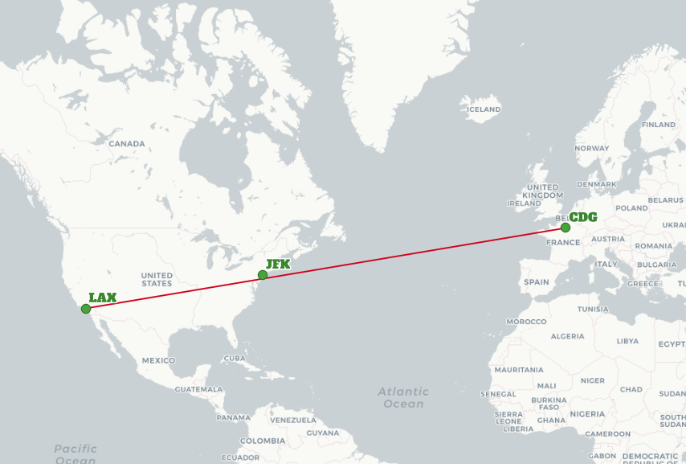
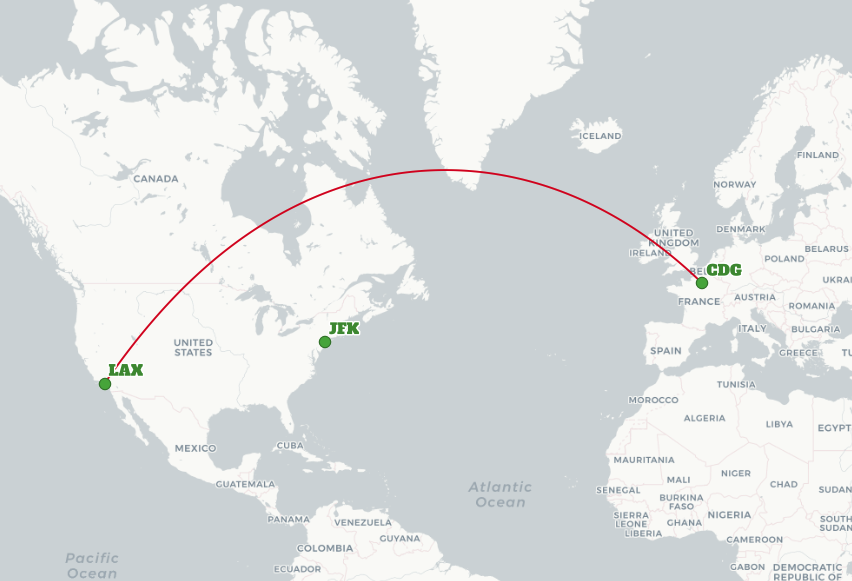

# PostGIS and the Geography Type

PostGIS is a "geospatial database" and the "geo" in "geospatial" is an important qualifier: it means that all the coordinates in PostGIS point, lines, and polygons can be located somewhere on the earth.

As we all know (except for a [few of us](https://en.wikipedia.org/wiki/Flat_Earth)) the earth is not flat, it's [round](https://en.wikipedia.org/wiki/Geodesy#Geoid_and_reference_ellipsoid). It's almost a sphere, an "oblate spheroid", slightly wider than it is tall. 

Because it is (mostly) spherical, we don't use cartesian coordinates (x, y) to describe locations on the earth, we use spherical coordinates. If you were ever introduced to spherical coordinates in math class, you would know the two coordinates as "theta" and "phi". If you were introduced to them in an astronomy class, you might know them as "bearing" and "elevation". If you are talking to a geographer, they will use the terms "longtitude" and "latitude".

The PostGIS "[geography](https://postgis.net/workshops/postgis-intro/geography.html)" type is a geospatial type that understands coordinates as spherical coordinates, in latitude and longitude. 

Here is a small table of world airports, loaded into a geography column.

```sql
-- Airports table
CREATE TABLE airports (
  code text primary key,
  geog geography(point)
);

-- Los Angeles
INSERT INTO airports (code, geog)
  VALUES ('LAX', 'POINT(-118.4079 33.9434)');
-- Paris
INSERT INTO airports (code, geog)
  VALUES ('CDG', 'POINT(2.5559 49.0083)');
-- Tokyo
INSERT INTO airports (code, geog)
  VALUES ('NRT', 'POINT(139.733 35.567)');
-- New York
INSERT INTO airports (code, geog)
  VALUES ('JFK', 'POINT(-73.77813 40.641311)');

-- Spatial index on geography
CREATE INDEX airports_geog_x 
  ON airports USING GIST (geog);
```

We can calculate distances between airports with a simple self-join:

```sql
SELECT a.code AS orig, b.code AS dest, ST_Distance(a.geog, b.geog)
FROM airports a
CROSS JOIN airports b
WHERE a.code = 'LAX';
```

The result might look a little funny, because the results are in meters:

```
 orig | dest |   st_distance    
------+------+------------------
 LAX  | LAX  |                0
 LAX  | CDG  | 9124665.27317673
 LAX  | NRT  | 8833954.77277118
 LAX  | KEF  | 6941795.61535381
```

The important part is: you didn't have to think about the units or the fact that all the distances are calculated as [great circles](https://en.wikipedia.org/wiki/Great_circle) over an oblate [spheroid](https://en.wikipedia.org/wiki/Spheroid), the system just did it for you.

Suppose I run a flight from LAX (Los Angeles) to CDG (Paris), does it make economic sense to stop over? 



Well, what's the shortest distance between the flight and JFK (New York) airport?

```sql
-- LAX-CGD route line
WITH lax_cdg AS (
    SELECT ST_MakeLine(a.geog::geometry, b.geog::geometry)::geography AS geog
    FROM airports a, airports b
    WHERE a.code = 'LAX' and b.code = 'CDG'
    )
-- Distance from route line to JFK
SELECT ST_Distance(a.geog, lax_cdg.geog) AS distance
FROM airports a, lax_cdg
WHERE a.code = 'JFK';
```

1962 kilometers! Quite a long way. But wait a minute, the route looked **really** close on the map. Is the system wrong?

No, I was just fooling with the map. The system is correct, the map is wrong. On the sphere, the shortest distance between any two points is a great circle. The straight line on the map wasn't reflective of the actual route.



Incidentally, this kind of problem is one that people working with geography grapple with frequently: our intuition about places and routes and shapes in the world is strongly conditioned to a use a cartesian, flat view of the world. 

So, should you use the "[geography](https://postgis.net/workshops/postgis-intro/geography.html)" type all the time?

The benefits of geography we have already shown:

* It is a global coordinate space.
* It supports longitude/latitude coordinates without any special code.
* It indexes and calculates over the dateline and poles automatically.

The drawbacks of geography are visible in our final query:

* Most PostGIS functions are built to use the planar "geometry" type, and you will have to cast your data to use them.
* Geography calculations on the sphere are quite expensive, for big queries you'll find a noticeable performance penalty.

In general, if your working area is geographically small enough (a state, a region, a country) to fit in a projected system, using a projected system and the "geometry" type for all your calculations will result in simpler SQL and faster queries. 

But if you have global data, you'll find your system is simpler to code and reason about if you use the "geography" type.

