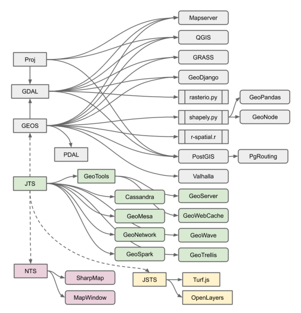
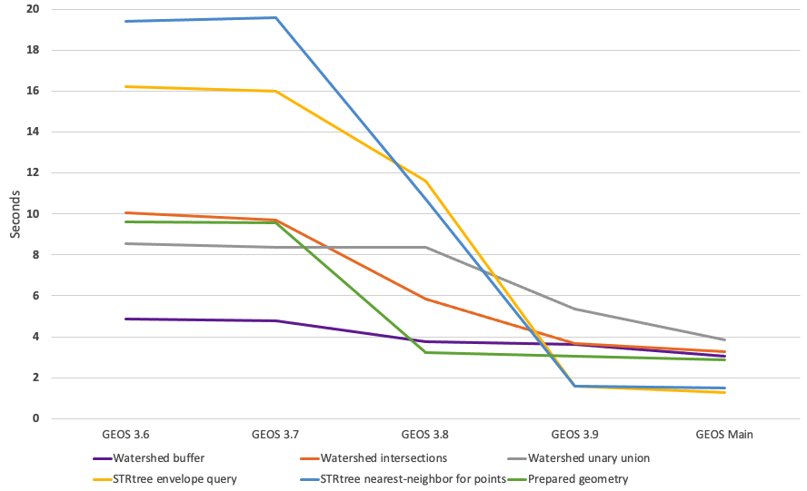
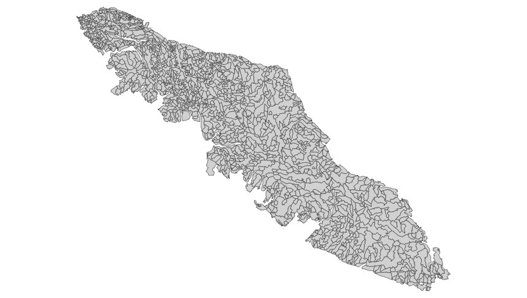
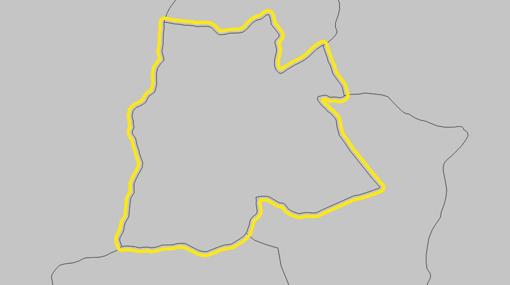
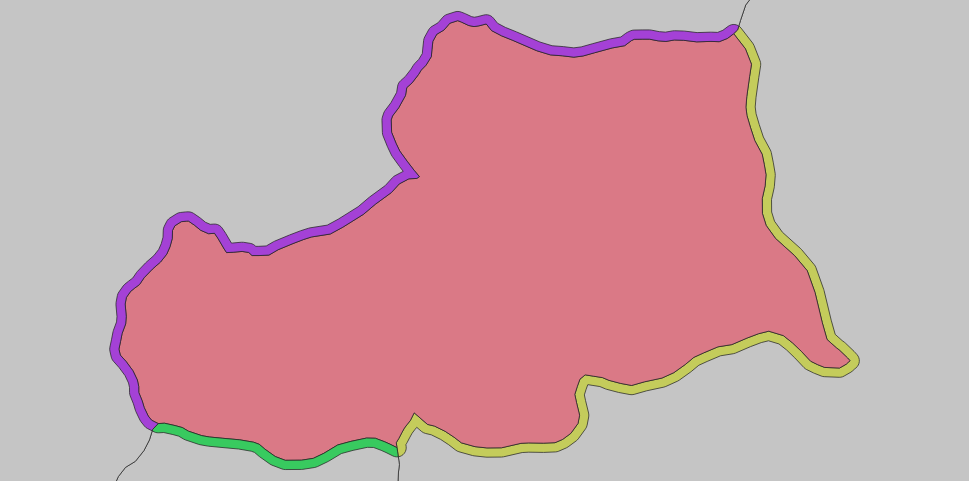
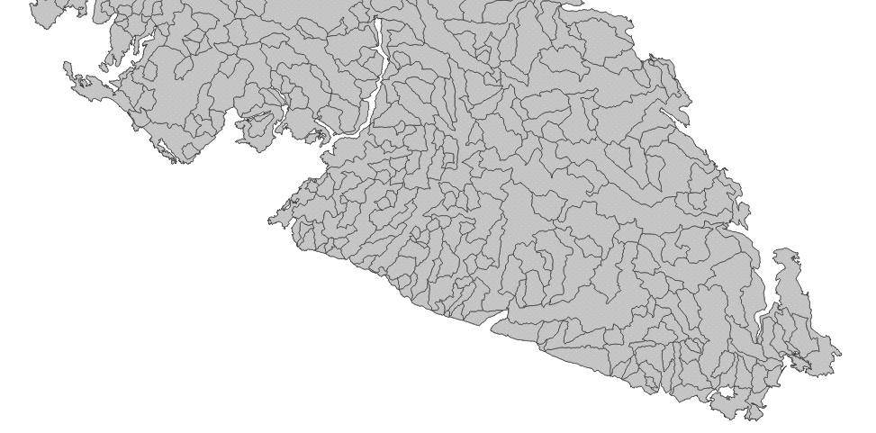
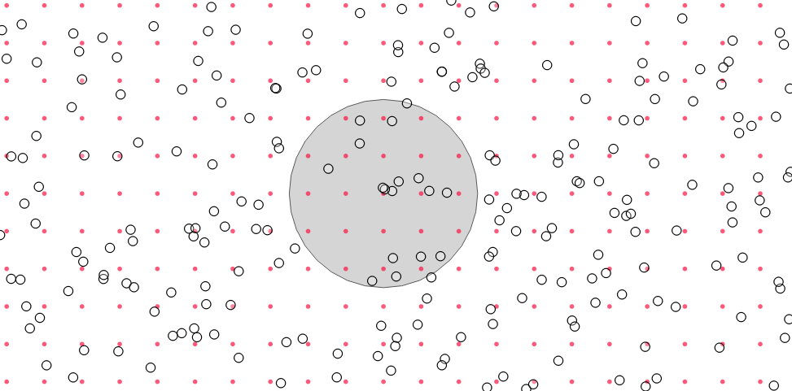
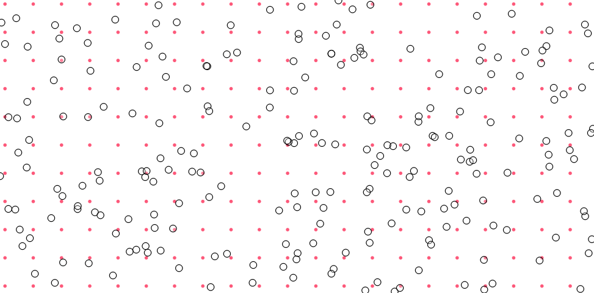
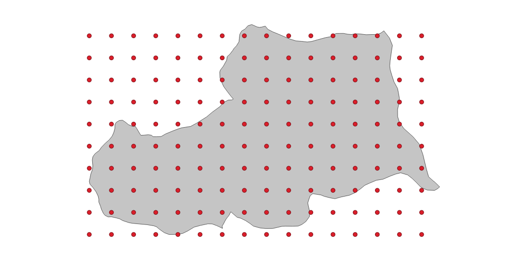

# Performance Improvements in GEOS

We at Crunchy Data put as much development effort into improving GEOS as we do improving PostGIS proper, because the GEOS library is so central to much geospatial processing. 

The GEOS library is a core piece of PostGIS. It is the library that provides all the "hard" computational geometry functionality:

* Intersections of geometry
* Unions of geometry
* Differences of geometry
* Buffers of geometry
* Geometry relationship evaluation

GEOS (and its Java cousin JTS) also provide the algorithmic core of other open source GIS tools, like QGIS, Shapely, R-SF, and more.



Having computational geometry expert [Martin Davis](http://blog.cleverelephant.ca/2019/02/dr-jts-crunchy.html) on staff has been a huge help, and resulted the marque feature of the last PostGIS release, [fully robust support for intersection, union and difference](https://blog.crunchydata.com/blog/waiting-for-postgis-3.1-geos-3.9).

I've been working on GEOS since before the 3.8 release, and I wanted to chart out the improvement of GEOS performance over time, so I wrote a [small test harness](https://github.com/pramsey/geos-performance/) that makes it easy to swap out the GEOS engine under a battery of "real world" geospatial use cases.

**TL;DR: Things have gotten a lot faster over time.**



Depending on the use case, the improvements are as much as 15-times faster.

Each release is approximately one year after the prior release. The tale is pretty straight forward:

* The 3.7 release was largely a bug fix release, with a handful of new features.
* The 3.8 release was the first after I joined Crunchy. With full-time available for core work, I did some profiling and removed some obvious C++ implementation bottlenecks. Things got faster.
* The 3.9 release included major **algorithmic** changes, in the intersection/union/difference code. This resulted in speedups for some cases, but also slowdowns in others. More C++ improvements in the core overlay code and the STRtree improved all-around performance.
* Since 3.9, GEOS community member [Dan Baston](https://github.com/dbaston) has continued to chip away at core implementation. The changes aren't big on this chart (because it starts off so slow) but later I'll show a chart of the improvements relative to 3.9, which are still substantial.

The tests are repeated enough to generate "long" runs of a few seconds, so the absolute lengths of the timings have no meaning, but the relative lengths do. The benchmark currently consists of six tests:

* Watershed buffer
* Watershed intersections
* Watershed unary union
* STRtree envelope query
* STRtree nearest-neighbor for points
* Prepared geometry

Each test is broken into three phases:

* Setup, where data are loaded and prepared;
* Run, where the actual interesting work is timed; and,
* Cleanup, where memory is freed and objects recycled.

## Watershed Buffer

Half the tests build off a real-world data set of 1384 watershed boundaries from beautiful [Vancouver Island](https://www.sfchronicle.com/travel/article/An-outside-guide-to-Vancouver-Island-13726647.php). 



This test just takes each watershed and buffers it by 25 metres.



The actual buffer code remains unchanged since before GEOS 3.6, so all the measured improvements come from new implemenation efficiences in things like overlay primitives and spatial indexes.

```
               Improvement over previous release
                  GEOS 3.7  GEOS 3.8  GEOS 3.9  GEOS Main
Watershed buffer      1.4%     21.8%      3.9%      14.8%
```

## Watershed Intersections

The intersection code was completely re-written between GEOS 3.8 and 3.9, so improvements there are a mixture of implementation and algorithm changes.

The intersection test creates two sets of watersheds, a raw set and a buffered set. For each member of the buffered set, all the raw watersheds are found, and then each pair of watersheds are intersected with one another. 



```
                  Improvement over previous release
                     GEOS 3.7  GEOS 3.8  GEOS 3.9  GEOS Main
Watershed intersections   3.3%    39.9%     36.9%      11.4%
```

## Watershed Union

The union code was also completely re-written for GEOS 3.9. This test formed to core of our performance benchmark for a couple months, as it exercised the new overlay code and for a while was slower than the previous implementation (now it's faster).



```
                  Improvement over previous release
                     GEOS 3.7  GEOS 3.8  GEOS 3.9  GEOS Main
Watershed unary union    2.0%     -0.1%     36.0%      28.2%
```

## STRtree Envelope Query

The STRtree is a core data structure for GEOS algorithms. When loaded with geometries, it provides a high speed way to search the collection for intersecting or nearby geometries. As such, improvements to the tree tend to speed up **all other** computations as well.

The envelope test uses a block of 10,000 random points loaded into an STRtree as a search set, and another block of 10,000 regular circles as a query set. 



For each circle, all the intersecting points are pulled from the tree in a query.

The STRtree logic is unchanged, but in 3.9 the implementation was re-written to use more concrete C++ classes and removed a lot of un-used abstraction overhead. The result was a sharp speed-up, that has continued with further refinements for upcoming releases.

```
                   Improvement over previous release
                      GEOS 3.7  GEOS 3.8  GEOS 3.9  GEOS Main
STRtree envelope query    1.4%     27.5%     86.4%      19.6%
```

## STRtree Nearest Neighbor Query

For the nearest neighbor (NN) test, the same random points are loaded into a tree, and for each regular point, the nearest random point is found. The query is a little more complex than an envelope query, but now runs almost as fast.



```
                     Improvement over previous release
                        GEOS 3.7  GEOS 3.8  GEOS 3.9  GEOS Main
STRtree nearest-neighbor   -1.0%     45.3%     85.1%       5.6%
```

## Prepared Geometry

The "prepared geometry" code is used extensively in PostGIS to speed up spatial join queries. Spatial joins are usually planned as "nested loop" joins, with one side of the join held constant while the other iterates. This provides an opening for optimization, by "preparing" the constant term with an in-memory index of the edges, to speed up the evaluation of spatial join predicates.

Prepared geometry has not been changed in recent versions, but again the underlying structures have been updated, in particular the STRtree. 



For each watershed in the watershed set, the geometry is "prepared" and then a regular grid of points that fits in the geometry extent is calculated and each point tested for containment. This exercises the prepared geometry query, as well as the cost to prepare each watershed.

```
                 Improvement over previous release
                    GEOS 3.7  GEOS 3.8  GEOS 3.9  GEOS Main
Prepared geometry       0.4%     66.5%      5.2%       5.4%
```

# Upcoming Performance Improvements

Because the performance graph includes some very slow older versions it's hard to appreciate that the current development state of GEOS already includes some substantial speed-ups over the last release.

```
                                 GEOS 3.9  GEOS Main  % Faster
Watershed buffer                     3.60       3.07     14.8%
Watershed intersections              3.68       3.26     11.4%
Watershed unary union                5.36       3.85     28.2%
STRtree envelope query               1.58       1.27     19.6%
STRtree nearest-neighbor for points  1.60       1.51      5.6%
Prepared geometry                    3.04       2.88      5.4%
```

As before, incremental improvements to the lowest level structures--shrinking object sizes, improving memory locality, moving to stack allocations--are still yielding noticeable benefits in performance that will be seen in the 3.10 release of GEOS this fall.

# Conclusion

* The GEOS 3.9 release currently available contains major performance improvements over prior releases, and is worth upgrading to immediately. 
* The next release of GEOS will continue the trend of faster performance and greater reliability.


