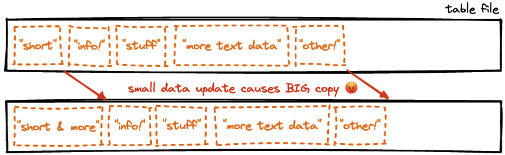
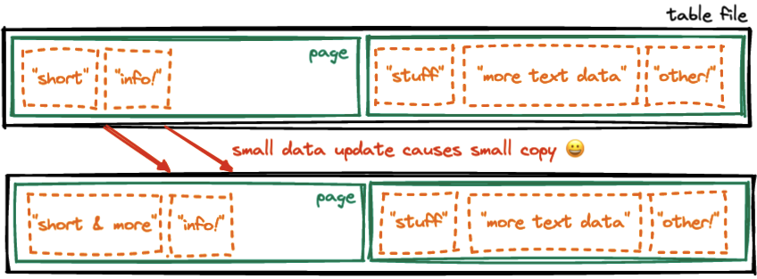

# PostgreSQL Terminology

Last week [Craig Keirstens](https://www.crunchydata.com/blog/author/craig-kerstiens) published a [great introduction to Postgres terminology](https://www.crunchydata.com/blog/postgres-databases-and-schemas), covering some of the basics you might run into when just getting started.

The funny thing about jargon is how quickly we get used to it, and forget we are even using it. It becomes part of the secret handshake, the way we signal to other members of our tribe that we're part of the group.

When I first started going to Postgres conferences and listening to talks by Postgres core developers I suddenly found myself at sea. What were these strange words and phrases they were using?

It turns out that a lot of them are taken from the Postgres code base, which in turn naturally uses them because they are part of [Codd's relational model](https://twobithistory.org/2017/12/29/codd-relational-model.html), the  theoretical information architecture that underpins all relational databases.

Here's an unofficial, incomplete glossary of weird terms that come out of developers mouths when talking about Postgres.

## Tuple

Can developers ever stop saying "tuple"? I cannot! It's a foundational building block, so it comes up a lot. 

A "tuple" is what most people understand as a "row" in a "table". It has a number of attributes, each of which has a name, a value, and a data type.

Frequently you will also hear someone say "tuple set". A set of tuples is a set of rows, which is to say, a table! Or, at least, a "table-like thing". As we'll see later, there are also other special words for table-like things.

## Record and Row

"Record" and "row" are another way of saying "tuple", but unlike "tuple", "record" and "row" are actually used in SQL when working with Postgres.

The "record" keyword is most frequently used as a return type in server side functions that return [composite types](https://www.postgresql.org/docs/current/rowtypes.html). 

```sql
CREATE FUNCTION onerow(pk integer) 
  RETURNS record AS 
  $$ 
    SELECT * FROM mytable WHERE mytable.pk = pk
  $$ 
  LANGUAGE 'sql';
```

The "row" keyword is used to construct composite (tuple valued) types within SQL.

```sql
INSERT INTO on_hand VALUES (ROW('fuzzy dice', 42, 1.99), 1000);
```

## Array

Arrays are a list of values, all of the same type. Here is an array of integers.

```sql
SELECT ARRAY[1,2,3,4];
```

Arrays can also be multi-dimensional.

```sql
SELECT ARRAY[[1,2,3],[4,5,6]];
```

Most amazingly, arrays are not restricted to just the built-in Postgres types. You can make an array of any type at all!

```sql
CREATE TYPE person AS (name text, age integer);
SELECT ('Peter',45)::person;
SELECT ARRAY[('Peter',45),('Paul',35)]::person[];
```

## Relation

From Codd's original paper, a "relation" is a collection of tuples. A single tuple is a "unary relation", two tuples are a "binary relation", N tuples are an "nary" relation. 

But we usually call relations "tables". 

Every table is a relation. But not every relation is a table!

Views are also relations.

So, really, are the results of queries. A query result is a set of tuples, it is a relation! Even the intermediate steps in a query can be thought of as a relation. 

The result of joining two tables using a join condition? Also a relation!

You can get a feel for how pervasive the idea of a "relation" is in Postgres by querying the `pg_class` system table like this:

```sql
SELECT relname, relkind FROM pg_class
```

This lists all the things Postgres considers to be "relations". You will see tables (`relkind` of "r") in the list. You will also see indexes, views, sequences, materialized views, and foreign tables.

## Target List and Restrictions

As you get deeper into the Postgres core, you will see things named that you didn't know had a name. What is the name of the part of a SQL query after the `SELECT` but before the `FROM`? What is the name of the stuff after the `WHERE`?

```
SELECT <this is the target list>
FROM mytable
WHERE <these are the restrictions>
```

The first part is the "target list". The second part are the "restrictions".

## Schema

I have to include "schema" here because on the one hand it is very easy, Craig already covered it in his [blog post](https://www.crunchydata.com/blog/postgres-databases-and-schemas): a schema is what you get when you `CREATE SCHEMA`! It's like a folder in your database.

But actually! Internally you will find that Postgres refers to "schemas" as "namespaces". You can see a list of all the schemas in your database by running a query on ... `pg_namespace`!

```sql
SELECT * FROM pg_namespace
```

And that's not all. When I was first introduced to "schema" I was very confused, because to my mind a "schema" was a "collection of table definitions in a database". So an "application schema" might be all the tables in a database used to support a particular software application.

So, a "schema" is (to SQL) a folder where you can put database objects (like tables, functions, etc) and might (in Postgres) also be called a "namespace", and is sometimes (to an app developer) the definition of one or more tables.

## Page

Hang around Postgres developers long enough, they'll inevitably start talking about "pages". 

Fortunately database **end users** can pretty safely ignore "pages", they are an implementation detail, and are never visible to users of SQL.

Database **administrators** should probably know what a "page" is, because some of the tuning parameters make references to pages.

Down at the level of the disk, database tables reside in files, one file per table (actually if the tables get large enough, they get multiple files, but lets ignore that for now).

If every tuple in the table were packed into a single file as tight as possible, how would the database update the data as it changed? 

If it had to change someone's name from "Paul" to "Paul the Great", for example? It would have to expand the table, and move everything after the particular name entry down enough to make space for the new, larger entry. Not efficient!



Enter "pages". Rather than one tightly stuffed file of data, the database internally divides the table file into regularly spaced "pages", and only partially fills each page with tuples (there's another piece of jargon for this, the "fill factor"). Now, when the database needs to update a tuple, to perhaps add more data, only the page of interest needs to be re-written, and the rest of the file can remain untouched.



The "page" is in many ways the fundamental unit of the underlying database engine. You don't see it when writing SQL, but things like the "page cache" (a piece of RAM where frequently read pages are placed for high-speed access) and the "random page cost" (a tuning parameter that expresses how expensive random access within files is) testify to the centrality of the "page" in the system design of the database.


## Conclusion

This is just a few of the words that get thrown around when talking about Postgres and how it works, but I bet there are enough others that we will have an expanded glossary to publish soon! 

