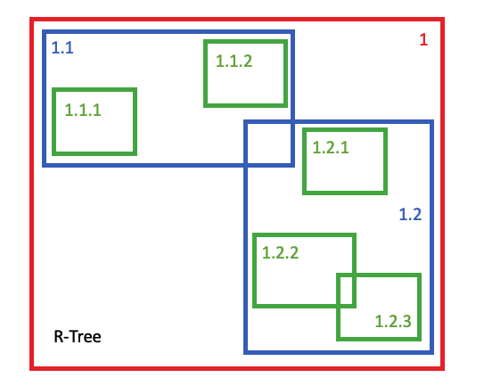
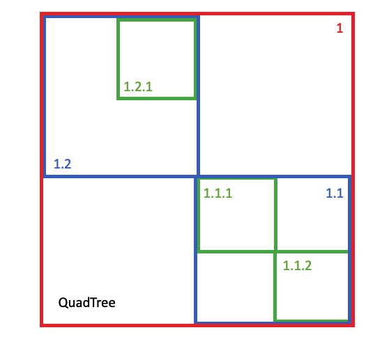
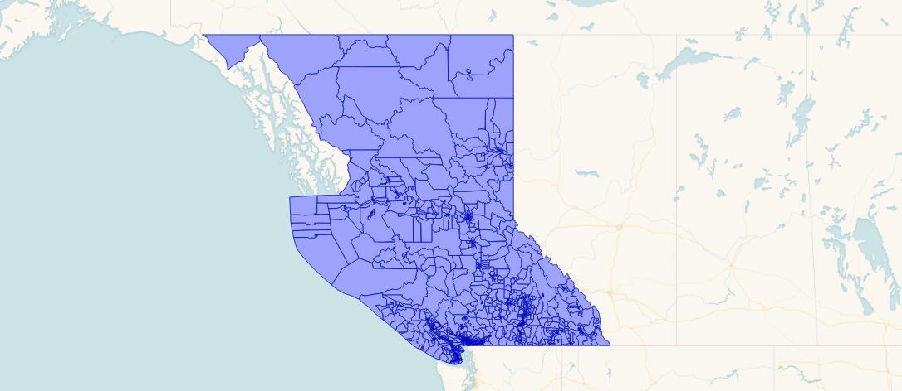

# (The Many) Spatial Indexes of PostGIS

Spatial indexes are used in PostGIS to quickly find spatial features within a dimension space, using spatial properties (location or distance) as the search key.  Practically, this means very quickly answering questions of the form 

* "all the things inside this this" or
* "all the things near this other thing".

Because spatial objects are often quite large and complex (coastlines commonly are defined with thousands of points, for example) spatial indexes use "bounding boxes" as index and search keys:

* Bounding boxes are of a small, fixed size, only 4 floats for a 2D box; and,
* Bounding boxes are very inexpensive to compare to test things like containment.

So the simple story of spatial indexes is: if you are planning to do spatial queries (which, if you are storing spatial objects, you probably are) you should create a spatial index for your table. 

Creating a spatial index is very simple:

```sql
CREATE INDEX mytable_geom_x ON mytable USING GIST (geom);
```

This will create a GIST index on the geometry column, using the default "operator class" for geometry. End of story? Not even close.

## So Many Indexes

For the PostGIS geometry type alone, there are actually 10 different operator classes!

```sql
SELECT opcname, amname
FROM pg_opclass oc
JOIN pg_am am ON (am.oid = oc.opcmethod)
JOIN pg_type typ ON (oc.opcintype = typ.oid)
WHERE typ.typname = 'geometry';
```

```
            opcname             | amname 
--------------------------------+--------
 btree_geometry_ops             | btree
 hash_geometry_ops              | hash
 gist_geometry_ops_2d           | gist
 gist_geometry_ops_nd           | gist
 brin_geometry_inclusion_ops_2d | brin
 brin_geometry_inclusion_ops_3d | brin
 brin_geometry_inclusion_ops_4d | brin
 spgist_geometry_ops_2d         | spgist
 spgist_geometry_ops_3d         | spgist
 spgist_geometry_ops_nd         | spgist
```

The first two operator classes, the "btree" and "hash" indexes, can be safely ignored, because end users have no call to create those indexes, they exist solely to enable some core database functionality. 

* PostgreSQL requires a **btree** operator class for any type that supports "ORDER BY" in queries, and the geometry type [is sortable](https://blog.crunchydata.com/blog/waiting-for-postgis-3-hilbert-geometry-sorting). 
* PostgreSQL requires a **hash** operator class for and type that supports "DISTINCT" in queries.

The remaining indexes all provide support for the core feature of a spatial index: finding all the spatial objects that are contained by the bounding box of a query spatial object. 

As we can see in the list, the implementations vary in the underlying database access method used to provide the capability (GIST, SPGIST and BRIN) and the dimensional space (2D, 3D, 4D) within which the search takes place.

## GIST vs SPGIST vs BRIN

The GIST access method is a general general scheme for for building indexes -- "generalized search tree" is what the acronym stands for -- and the index scheme used for the geometry type implements an [R-Tree](https://en.wikipedia.org/wiki/R-tree) algorithm for splitting nodes. This supports a wide range of different spatial use cases and data patterns. Data with a high degree of overlap, and data with regular layout. Data with heterogeneous spatial extent and data with uniform sizing.



The SP-GIST access method is also a general scheme, but one specifically tuned for "spatial partitioning". That is, schemes that can split index nodes into two **completely non-overlapping** domains. The scheme used for the geometry type is a variation on a [quad-tree](https://en.wikipedia.org/wiki/Quadtree), partitioning each node into four non-overlapping children on each split. 



The BRIN access method ("block range index") operates on completely different assumptions. The BRIN index for a column stores the range the column covers for each database page. The "index" is a list of ranges, mapping values of the search space to data pages in the database table. 

The result is an insanely small index, even for very large tables. However, the effectiveness of the index is tied to the underlying ordering of the data. A table full of streaming timestamped data, where new values are written but nothing is ever deleted would be an excellent candidate for a BRIN index on the timestamp column. 

In the spatial domain, pre-sorting the data by geometry can yield a very "searchable" data set for BRIN, and that's what we'll do in this post.

## Comparing Index Builds

To provide some very basic performance comparisons, we'll look at a test data set of 1M random points. 

```sql
CREATE TABLE table points AS
  SELECT ST_MakePoint(
    1000*random(), 
    1000*random(), 
    1000*random())::geometry(PointZ) AS geom, 
    pk
  FROM generate_series(1,1000000) pk;
ALTER TABLE points ADD PRIMARY KEY (pk);
```


To generate data for BRIN tests, we'll do the same thing but add an "ORDER BY geom" clause to pre-sort the data by location.

Now we can build an index using each type, and check build time and sizes.

```
          Build    Size
GIST      15.0s    53 MB
SPGIST     5.6s    44 MB
BRIN       0.4s    24 KB
```

Some substantial differences in build time and index size! As expected, BRIN indexes are fast to build and very small, but as we'll see later, that has a cost. The more generic GIST index is penalized in both build time and size compared to SPGIST.

## Comparing Query Times

In order to compare query times, we use a query that builds 1000 random boxes over the data area and then joins those boxes to the data table using a spatial index operator, "&&".

```sql
WITH xy AS (
  SELECT 1000*random() AS x, 1000*random() AS y 
  FROM generate_series(1, 1000)
),
boxes AS (
  SELECT ST_MakeEnvelope(x-5, y-5, x+5, y+5) AS geom 
  FROM xy
)
SELECT Count(*)
FROM points, boxes
WHERE points.geom && boxes.geom;
```

By timing this query we can get a feel for index performance while minimizing the effect of query start-up overhead in the result.

```
             Time
GIST        230ms
SPGIST      150ms 
BRIN      21810ms 
```

Here we see the downside of the BRIN index. Each query run involves 1000 box-vs-data index calls, so the GIST and SPGIST indexes are averaging well under **1ms per call**. 

BRIN on the other hand is averaging about **20ms per call**. Which, if you only have one call to make, could be good enough for your use case. However, it points to the special-purpose nature of BRIN indexes: for large tables, where the data is laid down sequentially in an order that matches the query structure.

## SPGIST Wins?

So far it looks like the newer SPGIST index is outpacing the old GIST infrastructure, but it's important to remember where SPGIST is strongest: where data are non-overlapping, and where data can be perfectly divided into spaces. Our uniform random table of points is perfect data for SPGIST to outperform on.

A more fair test might make use of more real-world data. Here's a table of 9349 polygons in British Columbia. They are non-overlapping (so good for SPGIST) but quite non-uniform in size.



Testing just GIST and SPGIST, using another random box query with 10,000 boxes, we get the following results:

```
             Time
GIST        270ms
SPGIST      375ms 
```

As a general rule, when the data have a lot of overlaps, GIST with out perform SPGIST. When there is less overlap, then SPGIST will outperform GIST.

Visually, using a synthetic data set of randomly sized circles with a high degree of overlay, GIST was about 5-15% faster.


While using a synethetic data set of randomly size circles with less overlay, SPGIST was about 5-15% faster.


## Conclusions

* Yes, you need a spatial index for your spatial data!
* Don't neglect the possibility of using the newer SPGIST implementation over the tried-and-true GIST, if your data does not have a lot of overlap.
* Consider BRIN only if your data table is large, and stored in highly spatially correlated order.
