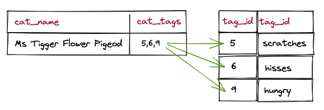
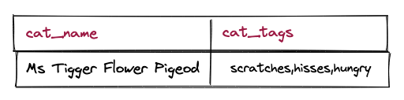

# Tags and Postgres Arrays, a match made in heaven?

In a previous life, I worked on a CRM system that really loved the idea of tags. Everything could be tagged, users could create new tags, tags were a key organizing priciple of searching and filtering.

The trouble was, modeled traditionally, tags can really make for some ugly tables and equally ugly queries. Fortunately, and as usual, Postgres has an answer.

## Practical Cats

For these tests, we will use a very simple table of `cats`, our entity of interest, and `tags` a short table of ten tags for the cats. In between the two tables, the relationship between tags and tags is stored in the `cat_tags` table. 


<details><summary>Table Creation SQL</summary>

```sql
CREATE TABLE cats (
    cat_id serial primary key,
    cat_name text not null
);

CREATE TABLE cat_tags (
    cat_id integer not null,
    tag_id integer not null,
    unique(cat_id, tag_id)
);

CREATE TABLE tags (
    tag_id serial primary key,
    tag_name text not null,
    unique(tag_name)
);
```

</details>

I filled the tables with over 1.7M entries for the `cats` and ten entries for the `tags`.

<details><summary>Data Generation SQL</summary>

```sql
-- Generate cats random names
INSERT INTO cats (cat_name) 
WITH 
hon AS (
    SELECT * 
    FROM unnest(ARRAY['mr', 'ms', 'miss', 'doctor', 'frau', 'fraulein', 'missus', 'governer']) WITH ORDINALITY AS hon(n, i)
),
fn AS (
    SELECT * 
    FROM unnest(ARRAY['flopsy', 'mopsey', 'whisper', 'fluffer', 'tigger', 'softly']) WITH ORDINALITY AS fn(n, i)
),
mn AS (
    SELECT * 
    FROM unnest(ARRAY['biggles', 'wiggly', 'mossturn', 'leaflittle', 'flower', 'nonsuch']) WITH ORDINALITY AS mn(n, i)
),
ln AS (
    SELECT * 
    FROM unnest(ARRAY['smithe-higgens', 'maclarter', 'ipswich', 'essex-howe', 'glumfort', 'pigeod']) WITH ORDINALITY AS ln(n, i)
)
SELECT initcap(concat_ws(' ', hon.n, fn.n, mn.n, ln.n)) AS name 
FROM hon, fn, mn, ln, generate_series(1,1000)
ORDER BY random();

-- Fill in the tag names
INSERT INTO tags (tag_name) VALUES 
    ('soft'), ('cuddly'), ('brown'), ('red'), ('scratches'), ('hisses'), ('friendly'), ('aloof'), ('hungry'), ('birder'), ('mouser');

-- Generate random tagging. Every cat has 25% chance of getting each tag.
INSERT INTO cat_tags 
WITH tag_ids AS (
    SELECT DISTINCT tag_id FROM tags
),
tag_count AS (
    SELECT Count(*) AS c FROM tags 
)
SELECT cat_id, tag_id
FROM cats, tag_ids, tag_count
WHERE random() < 0.25;

CREATE INDEX cat_tags_x ON cat_tags (tag_id);
```

</details>

In total, the relational model needs **446MB** for the `cats`, `tags` and the tag relationships. 

```sql
SELECT pg_size_pretty(
    pg_total_relation_size('cats') + 
    pg_total_relation_size('cat_tags') +
    pg_total_relation_size('tags'));
```

## Performance of Relational Cats 

There are two standard directions of tag queries: 

* "what are the tags for this particular cat?"
* "what cats have this particular tag or set of tags?"

### Tags of a Cat


The query is simple, and the performance is very good (**under 1 ms**).

```sql
SELECT tag_name 
FROM tags 
JOIN cat_tags USING (tag_id) 
WHERE cat_id = 444;
```

### Cats of a Tag


The query is still simple, and the performance is not unexpected (**about 500ms**) for the number of records (431K) that meet the filter criterion.

```sql
SELECT Count(*)
FROM cats 
JOIN cat_tags a ON (cats.cat_id = a.cat_id)
JOIN tags ta ON (a.tag_id = ta.tag_id)
WHERE ta.tag_name = 'brown';
```

### Cats of Two Tags

This is where things start to come off the rails for the relational model, because finding the just the records that have two particular tags involves quite complicated SQL.

```sql
SELECT Count(*)
FROM cats 
JOIN cat_tags a ON (cats.cat_id = a.cat_id)
JOIN cat_tags b ON (a.cat_id = b.cat_id)
JOIN tags ta    ON (a.tag_id = ta.tag_id)
JOIN tags tb    ON (b.tag_id = tb.tag_id)
WHERE ta.tag_name = 'brown'
  AND tb.tag_name = 'aloof';
```

This query takes around **900ms** to find the 108K cats that are both "brown" and "aloof".

### Cats of Three Tags

Just so you can see the pattern, here's the three tag version.

```sql
SELECT Count(*)
FROM cats 
JOIN cat_tags a ON (cats.cat_id = a.cat_id)
JOIN cat_tags b ON (a.cat_id = b.cat_id)
JOIN cat_tags c ON (b.cat_id = c.cat_id)
JOIN tags ta    ON (a.tag_id = ta.tag_id)
JOIN tags tb    ON (b.tag_id = tb.tag_id)
JOIN tags tc    ON (c.tag_id = tc.tag_id)
WHERE ta.tag_name = 'brown'
  AND tb.tag_name = 'aloof'
  AND tc.tag_name = 'red';
```

At this point the decreasing number of records in the result set (27K) is balancing out the growing complexity of the multi-join and query time has only grown to **950ms**. 

But imagine doing this for five, six or seven tags?

### Performance of Arrayed Cats 

What if we changed our model, and instead of modelling the cat/tag relationship with a correlation table, we model it with an integer array?

```sql
CREATE TABLE cats_array (
    cat_id serial primary key,
    cat_name text not null,
    cat_tags integer[]
);
```

Now our model has just two tables, `cats_array` and `tags`. We can populate the array-based table from the relational data, so we can compare answers between models.

<details><summary>Data Generation SQL</summary>

```sql
INSERT INTO cats_array 
SELECT cat_id, cat_name, array_agg(tag_id) AS cat_tags
FROM cats 
JOIN cat_tags USING (cat_id)
GROUP BY cat_id, cat_name;
```

</details>

With this new data model, the size of the required tables has gone down, and we are using only **199MB**.

```sql
SELECT pg_size_pretty(
    pg_total_relation_size('cats_array') + 
    pg_total_relation_size('tags'));
```

Once the data are loaded, we need the **most important part** an index on the `cat_tags` integer array.

```sql
CREATE INDEX cats_array_x ON cats_array USING GIN (cat_tags);
```

This [GIN index](https://www.postgresql.org/docs/current/gin-intro.html) is a perfect fit for indexing collections (like our array) where there is a fixed and finite number of values in the collection (our ten tags). While Postgres ships with an [intarray](https://www.postgresql.org/docs/current/intarray.html) extension, the core support for arrays and array indexes have caught up with and rendered much of the extension redundant.

As before, we will test common tag-based use cases.

### Tags of a Cat



The query is much less pretty! First we have to lookup the `tag_id` values in `cat_tags` and use `unnest()` to expand them out into a relation. Then we're ready to join that relation to the `tags` table to find the `tag_name` that correspond to the `tag_id`.

```sql
WITH the_cat AS (
    SELECT cat_name, cat_id, unnest(cat_tags) AS tag_id
    FROM cats_array
    WHERE cat_id = 779
)
SELECT the_cat.*, tag_name
FROM the_cat JOIN tags USING (tag_id);
```

The query hits the `cats` primary key index and returns in the **1ms** range. Great performance!


### Cats of a Tag

This is the query that flumoxed our relational model. Let's jump straight to the hardest case and try to find all the cats that are "red", "brown" and "aloof".

First we have to go into the `tags` table to make an array of `tag_id` entries that correspond to our tags. Then we can use the `@>` Postgresql [array operator](https://www.postgresql.org/docs/current/functions-array.html) to test to see which cats have `cat_tags` arrays that contain the query array.

```sql
WITH tags AS MATERIALIZED (
    SELECT array_agg(tag_id) AS tag_ids
    FROM tags
    WHERE tag_name IN ('red', 'brown', 'aloof')
    )
SELECT Count(*) -- cat_id, cat_tags, cat_name
FROM cats_array
CROSS JOIN tags
WHERE cat_tags @> tags.tag_ids;
```

The query hits the GIN index on `cat_tags` and returns the count of **26,905** cats in around **120ms**. About **seven times** faster than the same query on the relational model!


## Performance of Arrayed Textual Cats 

So if partially denormalizing our data from a "cats-cat_tags-tags" model to a "cats-tags" model makes things faster... what if we went all the way to the simplest model of all: just `cats`?

```sql
CREATE TABLE cats_array_text (
    cat_id serial primary key,
    cat_name text not null,
    cat_tags text[] not null
);
```

Again we can populate this new model directly from the relational model.

<details><summary>Data Generation SQL</summary>

```sql
INSERT INTO cats_array_text 
SELECT cat_id, cat_name, array_agg(tag_name) AS cat_tags
FROM cats 
JOIN cat_tags USING (cat_id)
JOIN tags USING (tag_id)
GROUP BY cat_id, cat_name;
```

</details>

The result is about **34MB** (17%) larger than the integer array version.

```sql
SELECT pg_size_pretty(
    pg_total_relation_size('cats_array_text') + 
    pg_total_relation_size('tags'));
```

Now every cat has the tag names right in the record.

### Tags of a Cat



Since there's only one table with all the data, finding the tags of a cat is ridiculously easy.

```sql
SELECT cat_name, cat_tags
FROM cats 
WHERE cat_id = 888;
```

### Cats of a Tag

Once again, in order to get good performance we need a GIN index on the array we will be searching.

```sql
CREATE INDEX cats_array_text_x ON cats_array_text USING GIN (cat_tags);
```

The query to find the cats are "red", "brown" and "aloof" is also wonderfully simple.

```sql
SELECT Count(*) 
FROM cats_array_text
WHERE cat_tags @> ARRAY['red', 'brown', 'aloof'];
```

This query takes about the same amount of time as the integer array based query, **120ms**.


## Drawbacks

So are array-based models the final answer for tag-oriented query patterns in Postgres? Maybe, but with some caveats.

* For the text-array model, there's no general place to lookup all tags. For a list of all tags, you will have to scan the entire `cats` table.
* For the integer-array model, there's no way to create a simple constraint that guarantees that integers used in the `cat_tags` integer array exist in the `tags` table. You can work around this with a `TRIGGER`, but it's not as clean as a relational foreign key constraint.
* For both array models, the SQL can get a little crufty when the tags have to be un-nested to work with relational querying. 

