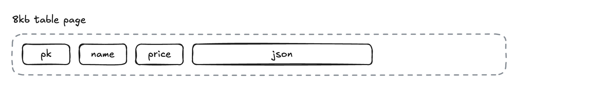
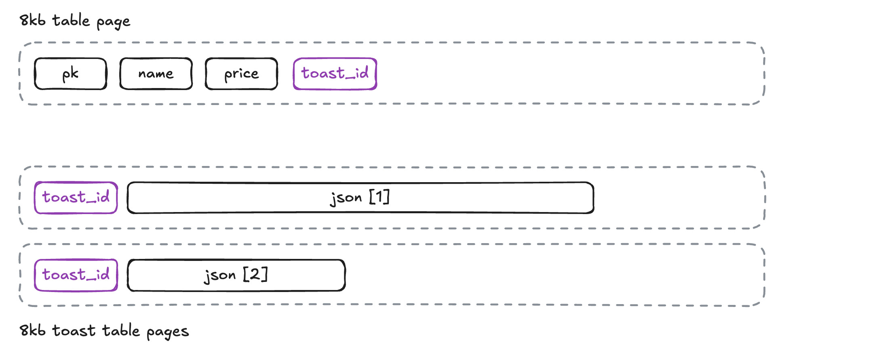

# JSONB Columns and the Tuple Toaster

## Database Implementations are Irrelevant until they are Not

The goal of a PostgreSQL database is to provide a rich user-facing abstraction over the gritty details of storing and retrieving data durably in storage. And mostly it does that, but sometimes the gritty reality leaks through.

For instance, when using the `jsonb` type to store large documents.

Like the `text`, `bytea` and `geometry` types, the `jsonb` type is "variable length", there is no limit to how big it can be. 

But under the covers, the PostgreSQL database stores all data in fixed-size 8kb pages. How can a data type with no size limit exist in a data with very small fixed storage size limit? 

By using The Oversize Attribute Storage Technique, aka "[TOAST](https://www.crunchydata.com/blog/postgres-toast-the-greatest-thing-since-sliced-bread)".

Ordinarily, all the attributes in a row can fit inside a page.



But sometimes, one or more of the attributes are too big to fix!


Under the covers, PostgreSQL quietly cuts up the big attributes, puts them in a side table, and replaces them in the original page with unique toast identifier.



So even for large attributes, the user does not have to do anything special to store them. The database abstraction remains intact. Or does it?


## JSONB Column Types Are Convenient, But Are They Fast?

For testing, [here is a function](https://gist.github.com/pramsey/219d54fe55bec59ce84350f6aa7d705f), `generate_item_json` that will generate a `jsonb` object of arbitrary size.

The `item_description` can be expanded to make the object too big to fit on a page. This example generates a 40 bytes description.

```
SELECT generate_item_json(40);
```
```
{
  "item_pk": 482910,
  "item_name": "adipiscing",
  "item_price": 42.55,
  "item_description": "lorem ipsum dolor sit amet consectetur "
}
```

Here is a 10000 row table with four columns, a key, name and price, and then the original JSON document.

```
CREATE TABLE json_40 (
    pk SERIAL,
    name TEXT GENERATED ALWAYS AS (json->>'item_name') STORED,
    price FLOAT8 GENERATED ALWAYS AS (float8(json->>'item_price')) STORED,
    json JSONB
    );

INSERT INTO json_40 (json)
  SELECT generate_item_json(40)
    FROM generate_series(1,10000);
```

If we inspect the size of the table (which includes TOAST entries) and the relation (which is just the base table) we see that with these small JSON objects, TOAST is not being used.

```sql
SELECT pg_relation_size('json_40') AS table_size, 
       pg_table_size('json_40') - pg_relation_size('json_40') AS toast_size;
```
```
table_size | 2056192
toast_size | 32768
```

A query to find all the JSON documents that have a `item_name` starting with 'a' runs in less than **10 ms** on this 10000 record table.

```sql
SELECT count(*) 
  FROM json_40
 WHERE json->>'item_name' ~ '^a';
```

So far, so good. 


## Large JSONB Documents End Up TOASTed

Now we replicate the first table, but with large, 40kb JSON documents.

```sql
CREATE TABLE json_40000 (
    pk SERIAL,
    price FLOAT8 GENERATED ALWAYS AS (float8(json->>'item_price')) STORED,
    name TEXT GENERATED ALWAYS AS (json->>'item_name') STORED,
    json JSONB
    );

INSERT INTO json_40000 (json)
  SELECT generate_item_json(40000)
    FROM generate_series(1,10000);
```

This time, the TOAST table is very large, because all the JSON documents have been split up and stored there.

```sql
SELECT pg_relation_size('json_40000') AS table_size, 
       pg_table_size('json_40000') - pg_relation_size('json_40000') AS toast_size;
```
```
table_size | 671744
toast_size | 124329984
```

But the number of rows in the table is the same, just 10000! What kind of performance do we get, searching the JSON documents for `item_name` starting with `a`.

```sql
SELECT count(*) 
  FROM json_40000
 WHERE json->>'item_name' ~ '^a';
```

Ack! A **brutal 500 ms** to scan these 10000 rows! That's **40 times slower**, what is happening?

What's happening is you are paying the TOAST tax. 

In order to check the value of `item_name` in the JSON object, the database first needs to retrieve the JSON object, and since the object is in TOAST, retrieval is a multi-step process, repeated for **every** JSON object (since in this example they are *all* TOASTed).

* Get the TOAST id from the base table;
* find all records with that id in the TOAST table and pull the data from each record;
* concatenate all that data; and finally,
* decompress that concatenated data.

Once the object is rebuilt and decompressed, only **then** can the database read the `item_name` and check the first character.


## Best Practices

So how do you **avoid** the TOAST tax? Avoid accessing the **whole object** unless you really need to. 

In this example, when we ingested the JSON object we used a generated column to read the `item_name` value and put it in the `name` column of the table. 

Queries that filter on that tiny `name` column do not pay the TOAST tax and take only **5 ms**.

```sql
SELECT count(*) 
  FROM json_40000
 WHERE name ~ '^a';
```

In general, this is the best way to avoid the TOAST tax: ensure the keys you care about are pulled out into real columns during JSON ingest. 

Note that for our examples, we used `GENERATED ALWAYS` and `STORED` on our generated columns, to ensure that the columns are always in sync to the JSONB document and they can be efficiently read and indexed.

For columns you do not want to split out explicitly, you can still quickly search them by creating a functional index on their values.

```
CREATE INDEX json_40000_name_x 
    ON json_40000 ((json->>'item_name') text_pattern_ops);

SELECT count(json->>'item_name') 
  FROM json_40000
 WHERE json->>'item_name' ~ '^a';
```

Querying on the functional index takes **80 ms** which is *faster* than **500 ms** but still *slower* than the direct filter on the `name` column, because the query plan is re-applying the filter after the index scan, which means the 983 rows that passed the filter still pay the TOAST tax.

