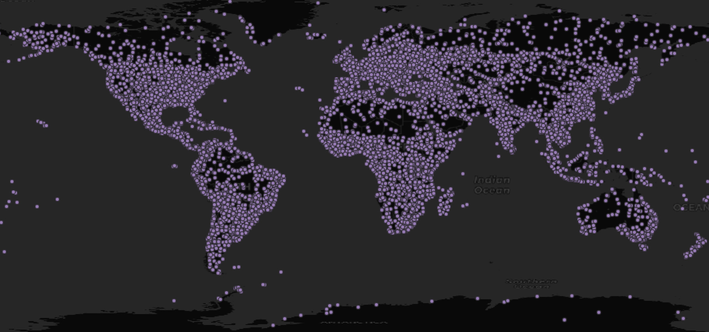
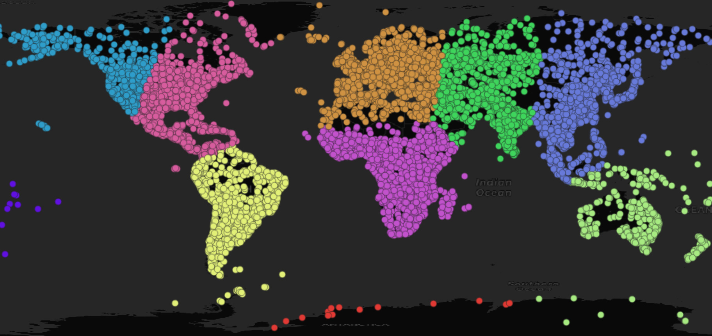
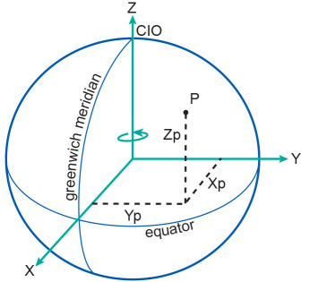
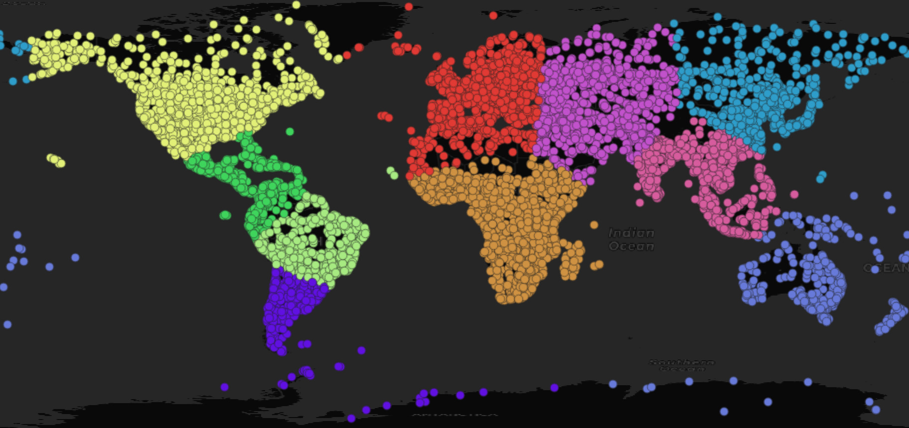
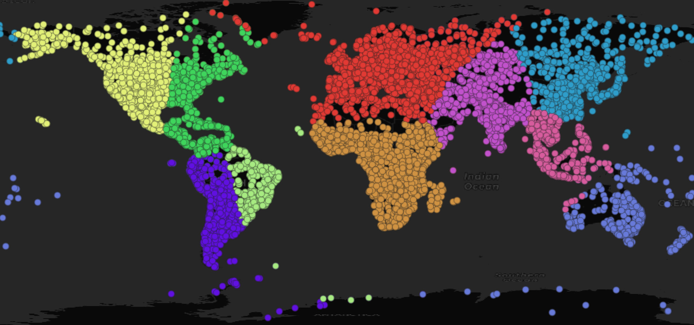

# PostGIS Clustering with K-Means

Clustering points is a common task for geospatial data analysis, and PostGIS provides several functions for clustering.

* [ST_ClusterDBSCAN](https://postgis.net/docs/ST_ClusterDBSCAN.html)
* [ST_ClusterKMeans](https://postgis.net/docs/ST_ClusterKMeans.html)
* [ST_ClusterIntersectingWin](https://postgis.net/docs/ST_ClusterIntersectingWin.html)
* [ST_ClusterWithinWin](https://postgis.net/docs/ST_ClusterWithinWin.html)

We previously looked a the popular [DBSCAN](https://www.crunchydata.com/blog/postgis-clustering-with-dbscan) spatial clustering algorithm, builds clusters off of spatial density. 

This post explores the features of the PostGIS [ST_ClusterKMeans](https://postgis.net/docs/ST_ClusterKMeans.html) function. [K-means](https://en.wikipedia.org/wiki/K-means_clustering#Algorithms) clustering is having a moment, as a popular way of grouping very high-dimensional LLM embeddings, but it is also useful in lower dimensions for spatial clustering.

[ST_ClusterKMeans](https://postgis.net/docs/ST_ClusterKMeans.html) will cluster 2-dimensional and 3-dimensional data, and will also perform weighted clustering on points when weights are provided in the "measure" dimension of the points.

## Some Points to Cluster

To try out K-Means clustering we need some points to cluster, in this case the [1:10M populated places](https://www.naturalearthdata.com/downloads/10m-cultural-vectors/10m-populated-places/) from [Natural Earth](https://www.naturalearthdata.com/).

Download the GIS files and load up to your database, in this example using [ogr2ogr](https://gdal.org/download.html).

```
ogr2ogr \
  -f PostgreSQL \
  -nln popplaces \
  -lco GEOMETRY_NAME=geom \
  PG:'dbname=postgres' \
  ne_10m_populated_places_simple.shp
```



## Planar Cluster

A simple clustering in 2D space looks like this, using 10 as the number of clusters:

```sql
CREATE TABLE popplaces_geographic AS
SELECT geom, pop_max, name,
  ST_ClusterKMeans(geom, 10) OVER () AS cluster 
FROM popplaces;
````



Note that pieces of Russia are clustered with Alaska, and Oceania is split up. This is because we are treating the longitude/latitude coordinates of the points as if they were on a plane, so Alaska is very far away from Siberia.

For data confined to a small area, effects like the split at the dateline do not matter, but for our global example, it does. Fortunately there is a way to work around it.

## Geocentric Cluster

We can convert the longitude/latitude coordinates of the original data to a geocentric coordinate system using [ST_Transform](https://postgis.net/docs/ST_Transform.html). A "geocentric" system is one in which the origin is the center of the Earth, and position are defined by their X, Y and Z distances from that center.



In a geocentric system, positions on either side of the dateline are still very close together in space, so it's great for clustering global data without worrying about the effects of the poles or date line. For this example we will use [EPSG:4978](https://epsg.io/4978) as our geocentric system.

Here are the coordinates of New York, converted to geocentric.

```sql
SELECT ST_AsText(ST_Transform(ST_PointZ(74.0060, 40.7128, 0, 4326), 4978), 1);
```

```
POINT Z (1333998.5 4654044.8 4138300.2)
```

And here is the cluster operation performed in geocentric space.

```sql
CREATE TABLE popplaces_geocentric AS
SELECT geom, pop_max, name,
  ST_ClusterKMeans(
    ST_Transform(
      ST_Force3D(geom), 
      4978), 
    10) OVER () AS cluster 
FROM popplaces;
```

The results look very similar to the planar clustering, but you can see the "whole world" effect in a few places, like how the islands of Oceania are now in one cluster, and how the dividing point between the Siberia and Alaska clusters has moved west.



It's worth noting that this clustering has been performed in three dimensions (since geocentric coordinates require an X, Y and Z), even though we are displaying the results in two dimensions.

## Weighted Cluster

In addition to naive k-means, [ST_ClusterKMeans](https://postgis.net/docs/ST_ClusterKMeans.html) can carry out [weighted k-means clustering](https://link.springer.com/chapter/10.1007/11546849_48), to push the cluster locations around using extra information in the "M" dimension (the fourth coordinate) of the input points.

Since we have a "populated places" data set, it makes sense to use population as a weight for this example. The weighted algorithm requires strictly positive weights, so we filter out the handful of records that are non-positive.

```sql
CREATE TABLE popplaces_geocentric_weighted AS
SELECT geom, pop_max, name,
  ST_ClusterKMeans(
    ST_Force4D(
      ST_Transform(ST_Force3D(geom), 4978),
      mvalue => pop_max 
    ), 
    10) OVER () AS cluster 
FROM popplaces 
WHERE pop_max > 0;
```



Again, the differences are subtle, but note how India is now a single cluster, how the Brazil cluster is now biased towards the populous eastern coast, and how North America is now split into east and west. 


