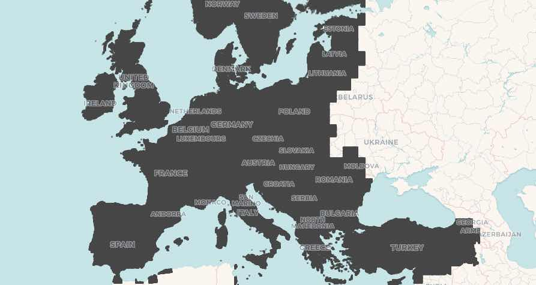
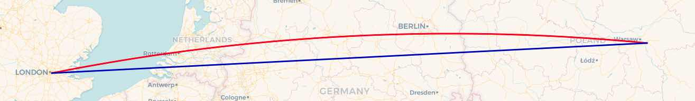
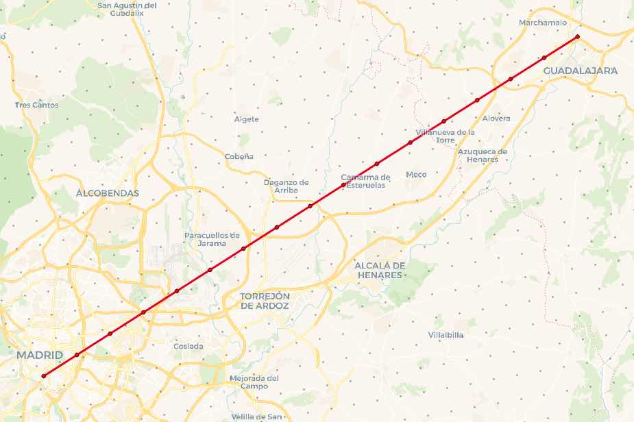
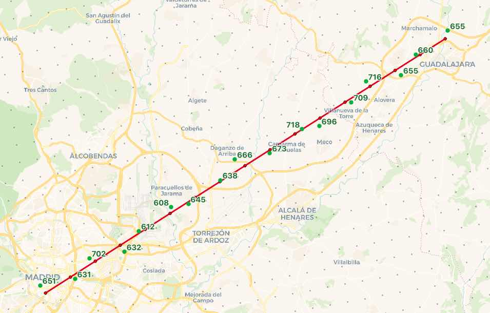

# Nearest Neighbor Flightline

A community member on the [postgis-users](https://lists.osgeo.org/listinfo/postgis-users) mailing list had a question recently: 

  I have a table of elevation points, and I would like to figure out
  an elevation profile for a flightline running through those points. How?

He was nice enough to share his elevation data, so I can show you some pictures and an approach.

## Elevation Points every 2KM

The data set is 1.5M elevation points in Europe, one point every 2km, which plotted on a map... is quite dense.



However, the table structure is simple.

```
  Column   |       Type       | Collation | Nullable | Default 
-----------+------------------+-----------+----------+---------
 latlng    | geography        |           |          | 
 lat       | double precision |           |          | 
 lng       | double precision |           |          | 
 elevation | real             |           |          | 
```

All we need is a spatial index on the `latlng` column to make our nearest neighbor searches fast.

## Flightline

Flightlines are different from overland lines because they are not only "as the crow flies", but "as the crow flies over a sphere". Over longer distances, and at higher latitudes, the effect is more visible, but great circle routes are not quite the same as point-point routes.

For example, a straight line between London and Warsaw can be constructed like this:

```sql
SELECT ST_MakeLine(ST_MakePoint(-0.061,51.482),  -- London
                   ST_MakePoint(21.252,52.150))  -- Warsaw
```

But a straight line (shortest path over a plane) is not what we want, we want a great circle (shortest path over a sphere). So, we flip the line into the `geography` type, which uses great circles to interpolate between vertices, and then [ST_Segmentize](http://postgis.net/docs/ST_Segmentize.html) the line, to add new vertices between the end points.

```sql
SELECT  ST_Segmentize(geography(
          ST_MakeLine(
            ST_MakePoint(-0.061,51.482), 
            ST_MakePoint(21.252,52.150))
        ), 4000)
```

The red line is the great circle, the blue line is the original cartesian line.



## Nearest to a Point

For the final query, we will construct a flight path between Madrid and Guadalajara, two cities close enough together that we can see the actual elevation points. We'll put a vertex every 4KM along that path, and find the closest elevation point to each vertex.

To find the closest point, we use the `<->` "[index ordered distance](https://www.postgis.net/workshops/postgis-intro/knn.html)" operator. When placed in the `ORDER BY` clause of a query `<->` not only calculates the distance between the left and right operands, it also returns the distances starting from the minimum possible distance.

So, the query for the nearest elevation point to Madrid (-3.6996,40.4009) is:

```
SELECT 
  e.elevation, 
  ST_AsText(e.latlng, 3) AS coords,
  geography(ST_MakePoint(-3.6996,40.4009)) <-> e.latlng AS dist
FROM elevation e
ORDER BY dist
LIMIT 1
```

Which returns (in 2ms, because of the index assist):

```
 elevation |        coords        |        dist        
-----------+----------------------+--------------------
  650.8142 | POINT(-3.707 40.409) | 1045.4185642910293
```

## Nearest to Flight Path

The index-assisted nearest neighbor operator `<->` is an odd one, as it **requires** a literal value on one side of the operator. It cannot take in two variable arguments, so how do we join up our flight path, which will have more than one point, to the elevation grid?

The answer is to use a [LATERAL JOIN](https://blog.crunchydata.com/blog/iterators-in-postgresql-with-lateral-joins) to control the iteration and supply the flight path points, one at a time, to the nearest neighbor calculation.



Taken in chunks, the query first builds the flight path.

```
WITH path AS (
    SELECT ST_Segmentize(geography(
        ST_MakeLine(
            ST_MakePoint(-3.6996,40.4009),  -- Madrid
            ST_MakePoint(-3.1675,40.6582))  -- Guadalajara
        ), 4000) AS geog
)
```

Then it takes apart the path into one record for each vertex using [ST_DumpPoints](http://postgis.net/docs/ST_DumpPoints.html)

```
points AS (
    SELECT (ST_DumpPoints(geog::geometry)).geom FROM path
)
```

Finally, it does a lateral join to the elevation points, finding the nearest elevation for each path point.

```
SELECT 
  d.elevation, 
  round(d.dist) AS distance,
  ST_AsText(d.latlng, 3) AS elevation_pt, 
  ST_AsText(points.geom, 3) AS path_pt
FROM points
CROSS JOIN LATERAL (
  SELECT 
    e.elevation, e.latlng, 
    points.geom::geography <-> e.latlng AS dist
  FROM elevation e
  ORDER BY dist
  LIMIT 1
) d
```

The final result take about 14ms to run, and finds an elevation for every point on the flightline.



```
 elevation | distance |     elevation_pt     |       path_pt        
-----------+----------+----------------------+----------------------
  650.8142 |     1045 | POINT(-3.707 40.409) | POINT(-3.7 40.401)
  630.8268 |      563 | POINT(-3.66 40.415)  | POINT(-3.666 40.417)
  701.6845 |      728 | POINT(-3.641 40.436) | POINT(-3.633 40.433)
 632.26556 |      882 | POINT(-3.595 40.443) | POINT(-3.6 40.449)
   611.845 |      733 | POINT(-3.575 40.464) | POINT(-3.567 40.465)
  607.7102 |      701 | POINT(-3.533 40.488) | POINT(-3.534 40.482)
  644.5825 |     1057 | POINT(-3.509 40.491) | POINT(-3.501 40.498)
 637.69604 |      166 | POINT(-3.467 40.515) | POINT(-3.467 40.514)
  666.1685 |     1335 | POINT(-3.447 40.536) | POINT(-3.434 40.53)
   673.436 |      373 | POINT(-3.401 40.543) | POINT(-3.401 40.546)
  717.8294 |      938 | POINT(-3.358 40.567) | POINT(-3.368 40.562)
 696.11383 |      910 | POINT(-3.335 40.57)  | POINT(-3.334 40.578)
 709.38855 |      723 | POINT(-3.292 40.594) | POINT(-3.301 40.594)
  716.1025 |      697 | POINT(-3.273 40.615) | POINT(-3.268 40.61)
 655.39514 |      862 | POINT(-3.226 40.621) | POINT(-3.234 40.626)
 659.81757 |      501 | POINT(-3.207 40.642) | POINT(-3.201 40.642)
   654.524 |      943 | POINT(-3.164 40.666) | POINT(-3.168 40.658)
```

