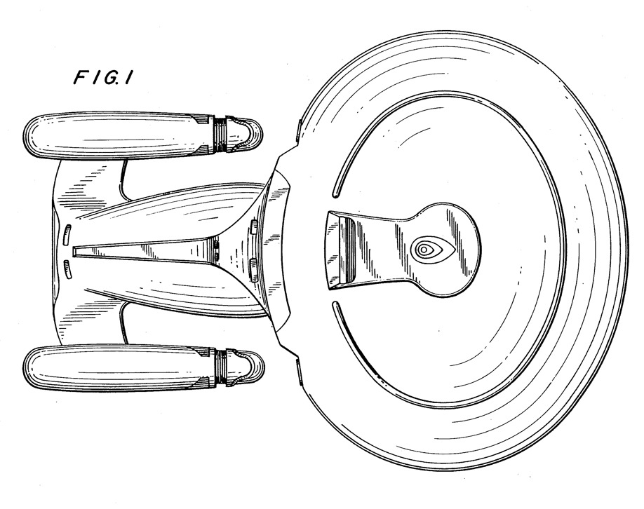
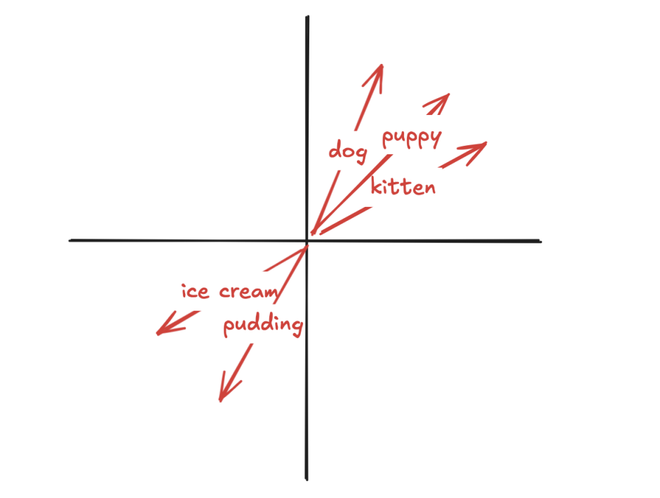
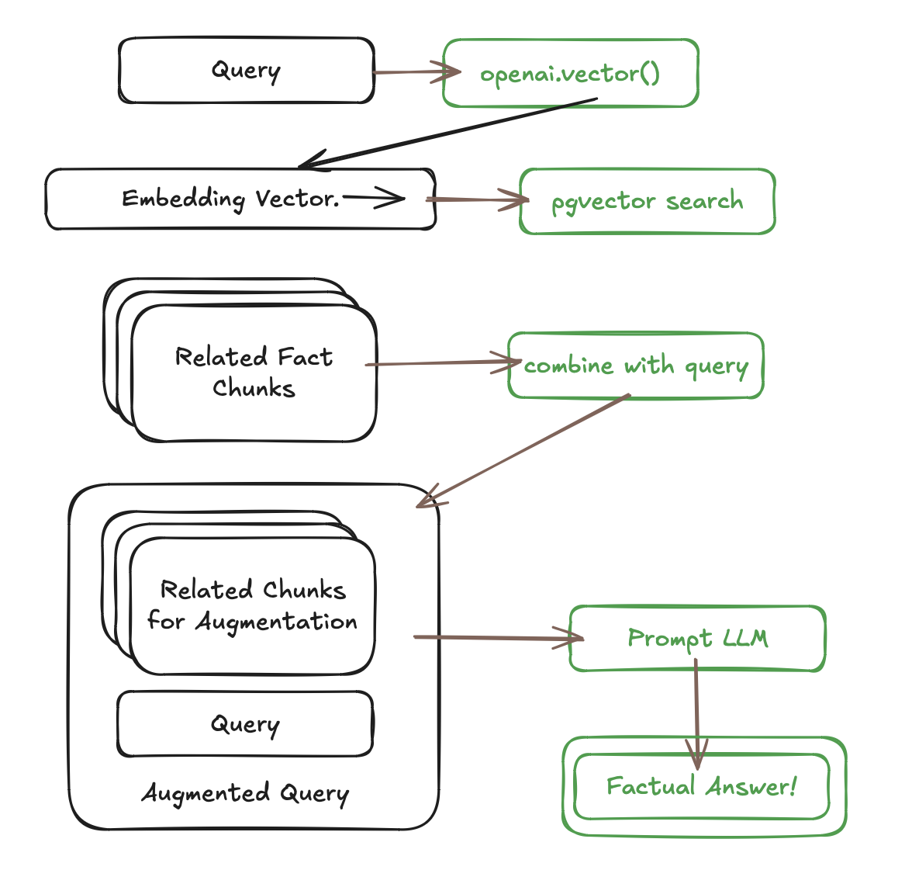

# Smarter PostgreSQL LLM with Retrieval Augmented Generation

"Retrieval Augmented Generation" (RAG) is a poor description of a useful technique in working with large language models (LLM) to **improve accuracy** when dealing with **facts** in a restricted domain of interest.

Asking an LLM about Shakespeare: works pretty good. The model was probably fed a lot of Shakespeare in training.

Asking it about holiday time off rules from the company employee manual: works pretty bad. The model may have ingested a few manuals in training, **but not yours**!

Is there a way around this LLM limitation? Yes!


## Example

For this example, we will build a query function that can accurately answer questions about Star Trek: The Next Generation (STTNG) episodes.

* We run the LLM locally using [Ollama hosted](https://ollama.com)
* We access the LLM using the [OpenAI API access extension](https://github.com/pramsey/pgsql-openai) functions described in our [last blog post]() on sentiment analysis.

The [Llama3-8B](https://ai.meta.com/blog/meta-llama-3/) model does not know a lot about Star Trek when queried directly.



```sql
SELECT openai.prompt(
  'You are a science fiction expert!',
  'What is the Star Trek episode where Deanna and her
   mother are kidnapped?'
);
```
```
I believe you might be thinking of the Star Trek: 
The Next Generation episode "Dark Page", which is 
Season 5, Episode 9. In this episode, 
Lwaxana Troi (Deanna's mother) visits the 
Enterprise and plans to attend a ceremony on Betazed 
with her husband. However, she is kidnapped by a 
group of space pirates who want to use her as bait 
to lure her son Jori-Troi back onto their ship.
```

This is... a pure halucination. It is "trekish" but it references an episode that doesn't exist, and characters that don't exist either. We need a way to inject more **facts** into the LLM query.


## Data

To improve our STTNG trivia bot, we will build a chunk database using plot summaries of STTNG episodes. This database table will be a source of facts we can feed the LLM.

```sql
CREATE TABLE tng (
    title text,
    plot text
    );

COPY tng (title, plot) 
    FROM PROGRAM 'curl https://raw.githubusercontent.com/pramsey/pgsql-openai/refs/heads/main/examples/rag/tng.txt'
    WITH (
        FORMAT csv,
        DELIMITER E'\t'
        );
```

Each row of the `tng` table contains a title and episide number slug, and a plot summary for the episode. Unfortunately this data set does not include all 178 episodes.


## Embedding

One of the most magical aspects of LLM technology is how the data are modeled under the covers. Just a collection of tokens in an extremely high (1500 or more) dimensional space. 

You can take a phrase or a paragraph and hand it to a model and ask for an "embedding" and it will spit back a single high dimensional vector that **uniquely characterizes** it. 

Amazingly, paragraphs that discuss the same concepts have embedding vectors that are "close" to each other in the embedding space. [Really](https://www.technologyreview.com/2015/09/17/166211/king-man-woman-queen-the-marvelous-mathematics-of-computational-linguistics/)!



As a very simple example, the vector for "puppies" will be close to the vector for "dogs" and also (in a different direction) close to the vector for "kittens").


## Searching Embeddings with PgVector

[pgvector](https://github.com/pgvector/pgvector) is a PostgreSQL extension that adds a "vector" data type that can handle the really high dimensionality used by LLM models, as well as some index schemes for quickly searching large collections of those vectors.

```sql
-- Enable pgvector
CREATE EXTENSION pgvector;

-- Add an emedding column to the table
ALTER TABLE tng
    ADD COLUMN vec vector;

-- Populate the column with embeddings from an LLM model
UPDATE tng 
    SET vec = openai.vector(title || ' -- ' || plot)::vector;
```

Now we have an embedding for every episode summary. Is the embedding of the episode we are looking for "close" to the embedding of the trivia question?

```sql
SELECT title
FROM tng
ORDER BY vec <-> (SELECT openai.vector('What is the Star Trek episode where Deanna and her mother are kidnapped?')::vector)
LIMIT 5
```
```
                         title                          
--------------------------------------------------------
 Star Trek: The Next Generation, Ménage à Troi (#3.24)
 Star Trek: The Next Generation, Cost of Living (#5.20)
 Star Trek: The Next Generation, The Loss (#4.10)
 Star Trek: The Next Generation, Manhunt (#2.19)
 Star Trek: The Next Generation, Unification I (#5.7)
```

There it is, and it's even the first entry! [Ménage à Troi](https://en.wikipedia.org/wiki/Ménage_à_Troi) is in fact the edisode where Deanna and her mother are kidnapped (by the duplicitous Ferengi!) 


## Augmenting the Query

For this example, our query has been a question about STTNG: "What is the Star Trek episode where Deanna and her mother are kidnapped?"

We can augment our query by bundling together all the title and plot summary information in the "related" records we found in the last section, and feeding them to the LLM along with the query text.



Let's automate the whole chain in one PL/PgSQL function:

* Lookup the embedding vector for the query string.
* Find the 5 closest entries to that embedding vector.
* Pull the 5 plot summaries and titles together into one lump of context.
* Run the query string against the LLM along with the context lump.


```sql
CREATE OR REPLACE FUNCTION trektrivia(query_text TEXT) 
    RETURNS TEXT 
    LANGUAGE 'plpgsql' AS $$
DECLARE
    query_embedding VECTOR;
    context_chunks TEXT;
BEGIN
    -- Step 1: Get the embedding vector for the query text
    query_embedding := openai.vector(query_text)::VECTOR;

    -- Step 2: Find the 5 closest plot summaries to the query embedding
    -- Step 3: Lump together results into a context lump
    SELECT string_agg('Episode: { Title: ' || title || ' } Summary: {' || plot, E'}}\n\n\n') INTO context_chunks
    FROM (
        SELECT plot, title
        FROM tng
        ORDER BY vec <-> query_embedding
        LIMIT 5
    ) AS similar_plots;

    -- Step 4: Run the query against the LLM with the augmented context
    RETURN openai.prompt(context_chunks, query_text);
END;
$$;
```

## Running the RAG

Now we can the RAG query and see if we get a better answer!

```sql
SELECT trektrivia('What is the Star Trek episode where Deanna and her mother are kidnapped?');
```
```
 The answer is: Star Trek: The Next Generation - "Menage à Troi" 
 (Season 3, Episode 24)
 In this episode, Counselor Deanna Troi's mother, Lwaxana, 
 is kidnapped by the Ferengi along with Commander William Riker, 
 and they demand that Captain Picard declare his love for 
 Lwaxana in exchange for her safe release.
```
Exactly correct! With the right facts in the context, the LLM was able to compose a coherent and factual answer to the question.


## Conclusion

There is no doubt that using RAG can increase the quality of LLM answers, though as always the answers should be taken with a grain of salt. This example was built with a 9B parameter model running locally, so the extra context made a big difference. Against a frontier model, it probably would not. 

Also, it is still possible to get wrong answers from this RAG system, they just tend to be somewhat less wrong. RAG is not a panacea for eliminating halucination, unfortunately.


## Useful Links

* [pgvector](https://github.com/pgvector/pgvector)
* [Ollama](https://ollama.com)
* [pgsql-openai](https://github.com/pramsey/pgsql-openai)
* [Chunking in RAG applications](https://stackoverflow.blog/2024/06/06/breaking-up-is-hard-to-do-chunking-in-rag-applications/)
* Enterprise Line Art from [US Patent 307923S](https://patents.google.com/patent/USD307923S/en)

