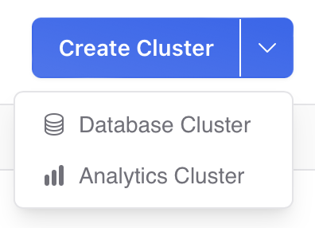

# Vehicle Routing with Overture Data

The [Overture Maps](https://overturemaps.org) collection of data is enormous, encompassing over [300 million transportation segments](https://docs.overturemaps.org/guides/transportation/), [2.3 billion building footprints](https://overturemaps.org/overture-buildings-theme-hits-2-3b-buildings-with-addition-of-google-open-buildings-data/), [53 million points of interest](https://docs.overturemaps.org/guides/places/), and a rich collection of cartographic features as well. It is a consistent global data set, but it is intimidatingly large -- what can a person do with such a thing?

Building cartographic products is the obvious thing, but what about the non-obvious. With an analytical engine like PostgreSQL and [Crunchy Bridge for Analytics](https://docs.crunchybridge.com/analytics), what is possible?

How about vehicle routing?


Not global routing, but something more tractable, and perhaps more useful (how many people have global routing problems?) such as local routing. In this walk-through we will:

* extract enough Overture transportation data to perform useful local routing;
* condition that data to be usable by the [pgRouting](https://pgrouting.org) engine; and,
* actually run some routing queries.

## Database Setup

For this example, we will be using the new [Geospatial](https://docs.crunchybridge.com/analytics/spatial) features of [Crunchy Bridge for Analytics](https://docs.crunchybridge.com/analytics).

When creating a new cluster, click the drop-down option and select an "Analytics Cluster".



Log in to you cluster as `postgres` and enable the spatial analytics extension:

```sql
SET pgaudit.log TO 'none';

-- create the spatial analytics extension and postgis:
CREATE EXTENSION crunchy_spatial_analytics CASCADE;

-- to re-enable audit logging in the current session
RESET pgaudit.log;
```

Then enable the pgrouting extension.

```sql
CREATE EXTENSION pgrouting;
```

The database is ready to go!

## Data Import

One of the things that makes the Overture data sets so enticing is the way they are hosted: in [GeoParquet](https://geoparquet.org) format on S3 and Azure object storage. 

This alone would not be a big deal, but since spring 2024 the Overture data is [spatially sorted](https://github.com/OvertureMaps/data/discussions/91#discussioncomment-8763402). That means it is possible for a client with GeoParquet support to pull out a spatial subset of the data without having to scan the whole collection. We can get the 20 thousand features we want, without having to read through the whole 300 million feature collection.

The trickiest part of the data access is figuring out the URL to pull the Overture data from. The data are released approximately monthly, and each theme consists of multiple parquet files. For our purposes though, we can use the `*` character in the URL and the analytics code treats the collection of files as a single data set.
 
```sql
CREATE FOREIGN TABLE ov_segments ()
    SERVER crunchy_lake_analytics
    OPTIONS (path 's3://overturemaps-us-west-2/release/2024-08-20.0/theme=transportation/type=segment/*.parquet');
```

This SQL does not initiate a download, it creates a "foreign table", which is like a view but where the data is not stored locally to the database server. In this case, of course, the data reside on S3, and nothing has been downloaded yet.

So, we do not want to run `SELECT * FROM ov_segments`, for example, because that would download the **entire contents of the collection**. Instead, we should **subset** the download, and because the data are spatially sorted, we can do it efficiently with a spatial filter.

```sql
-- Use the same table definition as the FDW table
CREATE TABLE ov_segments_local () 
    INHERITS (ov_segments);

-- Query only those features that are within our area of interest
INSERT INTO ov_segments_local
    SELECT ov_segments.* 
    FROM 
        ov_segments,
        (VALUES ('LINESTRING(-123.455 48.391,-123.283 48.522)'::geometry)) AS t(q)
    WHERE (bbox).xmin >= ST_XMin(q)
      AND (bbox).xmax <= ST_XMax(q)
      AND (bbox).ymin >= ST_YMin(q)
      AND (bbox).ymax <= ST_YMax(q);
```

Despite addressing a data collection with 300 million records, the query returns 20 thousand records in a few seconds.

## Data Structure

We have transportation segments! Are we ready to start routing? No we are not.

We have several data structuring tasks to get the data ready for vehicle routing:

* We need to ensure further filter the segments down to those classes that participate in the vehicle network. No paths, no tracks, nothing under construction. 
* We need to convert the speed and road class attribution in Overture to a "cost" for pgRouting to apply to each edge.
* We need to change the physical structure of the Overture segments to the pure edge/node structure that is used by pgRouting, and identify one-way segments.
* We need to change the unique Overture UUID identifiers into integers for pgRouting.

The starting point for data structuring is the Overture `segment` feature, and it is a complex one!

```sql
-- Get a pretty JSON view of the data structure
SELECT row_to_json(ov_segments_local, true) 
  FROM ov_segments_local 
  WHERE id = '08828d1aac3fffff043df239fe1d3069';
```

<details><summary>Full JSON structure of a segment</summary>

```json
{
  "id":"08828d1aac3fffff043df239fe1d3069",
  "geometry":{
    "type":"LineString",
    "coordinates":[[-123.3617848,48.4325098], ...[-123.3626606,48.4352395]]},
  "bbox":{
    "xmin":-123.3627,"xmax":-123.3618,
    "ymin":48.4325,"ymax":48.43525},
  "version":0,
  "sources":[
    {"property":"routes","dataset":"OpenStreetMap","record_id":"r8747097","update_time":null,"confidence":null},{"property":"","dataset":"OpenStreetMap","record_id":"w476265027","update_time":null,"confidence":null},
    {"property":"","dataset":"OpenStreetMap","record_id":"w494031748","update_time":null,"confidence":null}],
  "subtype":"road",
  "class":"primary",
  "names":{
    "primary":"BlanshardStreet",
    "common":null,
    "rules":[
      {"variant":"common","language":null,"value":"BlanshardStreet","between":null,"side":null}]},
  "connector_ids":[
    "08f28d1aac38818d0429ea4e482966af",
    "08f28d1aac38818d0429ea4e482246ae",
    "08f28d1aac28d6680473cb2c125fcd98"],
  "connectors":[
    {"connector_id":"08f28d1aac38818d0429ea4e482966af","at":0},
    {"connector_id":"08f28d1aac38818d0429ea4e482246ae","at":0.3},
    {"connector_id":"08f28d1aac28d6680473cb2c125fcd98","at":1}],
  "routes":[
    {"name":"Highway17(BC)(North)","network":"CA:BC","ref":"17","symbol":"https://upload.wikimedia.org/wikipedia/commons/7/76/BC-17.svg","wikidata":"Q918890","between":[0.856363,1]}],
  "subclass":null,
  "subclass_rules":null,
  "access_restrictions":[{ 
    "access_type":
      "denied",
      "when":{
        "during":null,
        "heading":"backward",
        "using":null,
        "recognized":null,
        "mode":null,
        "vehicle":null},
      "between":null}],
  "level_rules":null,
  "destinations":null,
  "prohibited_transitions":null,
  "road_surface":[{"value":"paved","between":null}],
  "road_flags":null,
  "speed_limits":[{ 
    "min_speed":null,
    "max_speed":{
      "value":50,
      "unit":"km/h"},
    "is_max_speed_variable":null,
    "when":null,
    "between":null}],
  "width_rules":null,
  "theme":"transportation",
  "type":"segment"
}
```

</details>

### Filtering Class for Vehicle Routing

Fortunately we can do all our filtering for vehicle segments by using the `class` attribute of segments.

There are a lot of combinations of `class` and `subclass`:

```sql
SELECT DISTINCT class, subclass 
  FROM ov_segments_local 
  ORDER BY 1,2;
```  

<details><summary>All the combinations of class and subclass</summary>

```
     class     |    subclass    
---------------+----------------
 bridleway     | 
 cycleway      | cycle_crossing
 cycleway      | 
 footway       | crosswalk
 footway       | sidewalk
 footway       | 
 living_street | 
 motorway      | link
 motorway      | 
 path          | 
 pedestrian    | 
 primary       | link
 primary       | 
 residential   | 
 secondary     | link
 secondary     | 
 service       | alley
 service       | driveway
 service       | parking_aisle
 service       | 
 steps         | 
 tertiary      | link
 tertiary      | 
 track         | 
 trunk         | link
 trunk         | 
 unclassified  | 
               | 
```

</details>

And of those many combinations, there are a lot of segments we **do not want**--paths, pedestrian, bridleways, and more!


Restricting to a few classes--motorway, primary, residential, secondary, tertiary, trunk, unclassified--results in a network that has only vehicle segments.


### Converting Speed to Cost

Many of the segments in our collection of vehicle segments have a speed limit on them, but the model is a little complicated. Because segments can be quite long it is possible (though rare) for a single segment to have multiple speeds. So the Overture model for speed limits looks like this:

```json
  "speed_limits": [{ 
     "min_speed": null,
     "max_speed": {
        "value": 50,
        "unit": "km/h"},
     "is_max_speed_variable": null,
     "when": null,
     "between": null}],
```

For simplicity, in this example we will use the first speed limit we find and apply it to the whole segment. If we were being precise, we would split the segment into one edge for each speed limit.

For many segments, there is no speed limit provided, so for those we can use defaults and provide different defaults for different classes: a default speed limit for a trunk road might be 90km/hr, and a default for a residential street might be 40km/hr. 

So, converting the speed limits to cost, then looks like this:

* Find the speed limit if there is one.
  * Apply a class based default if there is not.
* Convert any "miles per hour" limits to "kilometers per hour"
* Convert to "meters per second".
* Calculate the length of the segment in meters.
* Calculate the time required to traverse the segment, in **seconds**.

The last step is the fun one: each segment is costed based on how long it takes to traverse it. This way a 1 kilometer segment with a speed limit of 100 km/h has half the cost of the same segment with a 50 km/h limit.

<details><summary>PL/PgSQL functions to convert speed limits into cost</summary>

```sql
--
-- Deal with kmph/mph units, and fill in any null 
-- speed information with sensible defaults based 
-- on the segment class.
--
CREATE OR REPLACE FUNCTION pgr_segment_kmph(speed float8, unit text, class text)
RETURNS FLOAT8 AS
$$
DECLARE
    default_kmph FLOAT8 := 40;
BEGIN

    -- Convert mph to kmph where necessary
    IF unit = 'mph' THEN
        speed := speed * 1.60934;
    END IF;

    IF speed IS NOT NULL THEN
    	RETURN speed;
    END IF;

    -- Apply some defaults
    -- Should not be driving fast on service roads
    IF class = 'service' THEN
        speed := 20;
    -- Or on residential roads
    ELSIF class = 'residential' THEN
        speed := 30;
    -- Everywhere else, use the default
    ELSE 
        speed := coalesce(speed, default_kmph);
    END IF;

    RETURN speed;

END;
$$ LANGUAGE 'plpgsql';

--
-- The cost to traverse a segment is the number of 
-- seconds needed to traverse it, so distance over speed.
-- 
CREATE OR REPLACE FUNCTION pgr_segment_cost(geom geometry, speed_kmph float8)
RETURNS FLOAT8 AS
$$
DECLARE
    length_meters FLOAT8;
    default_kmph FLOAT8 := 40;
    kmph FLOAT8;
    cost FLOAT8;
    meters_per_second FLOAT;
BEGIN
    -- Geography length is in meters
    length_meters := ST_Length(geom::geography);

    -- Convert km/hour into meters/second
    meters_per_second := speed_kmph * 1000.0 / 3600.0;

    -- Segment cost is the number of seconds 
    -- needed to traverse the segment
    RETURN length_meters / meters_per_second;
END;
$$ LANGUAGE 'plpgsql';
````

</details>


### Identifying One-way Segments

One of the strangest aspects of the Overture model is the handling of one-way streets. Most models have a boolean "one way" flag, or maybe a "direction" attribute with "forward", "backward" and "both". 

Overture chooses to model directionality is one in a number of possible "restrictions" on the segment, here's the relevant JSON from our example segment.

```json
  "access_restrictions":[{ 
    "access_type":
      "denied",
      "when":{
        "during":null,
        "heading":"backward",
        "using":null,
        "recognized":null,
        "mode":null,
        "vehicle":null},
      "between":null}],

```

So every segment has a list of restrictions, and "heading" is one of them, but also mode of transport, vehicle type, time period, and others. Because one-way is a pretty important restriction in a route planner, we cannot simply check the first restriction, we will have to actually check every restriction on a segment and only set the "one way" flag if the "heading" restricting is non-null.


### Converting from Overture Segments to pgRouting Edges

The trickiest part of preparing the Overture segments for pgRouting is the model transformation between "segments" and "edges".

The pgRouting graph is a simple structure of vertices and edges. Vertices are points and edges are defined as joining two vertics, so any edge can be characterized by stating its "source" and "target" vertex.


In the Overture graph, on the other hand, every segment connects **at least** two connectors. 


So "source" and "target" connector alone are not enough to characterize a segment. So Overture uses a **list** of connectors on the edge.

```json
  "connectors":[
    {"connector_id":"08f28d1aac38818d0429ea4e482966af","at":0},
    {"connector_id":"08f28d1aac38818d0429ea4e482246ae","at":0.3},
    {"connector_id":"08f28d1aac28d6680473cb2c125fcd98","at":1}],
```

The unique identifier for each connector is given, and the `at` attritbute provides the proportion along the edge where the connector appears. The `0` connector is at the start, the `1` connector is at the end, and the `0.3` connector is 30% of the distance between the start and the end.

So to convert from Overture "segments" to pgRouting "edges", we **just** need to iterate over the `connectors` list and apply the [ST_LineSubstring](https://postgis.net/docs/ST_LineSubstring.html) function to chop the original segment into the right edges.

<details><summary>A PL/PgSQL function to chop Overture segments into edges</summary>

```sql
--
-- Create a simple table that reflects some of the 
-- input we have generated (speed, directionality)
-- and mirrors some other useful info (surface,
-- primary name) for mapping purposes. 
-- Most importantly, carry out the chopping of segments
-- into edges with only two graph connectors, one at
-- the start and one at the end.
-- 
CREATE OR REPLACE FUNCTION ov_to_pgr(segment ov_segments)
RETURNS TABLE(
    id text,
    geometry geometry(LineString, 4326),
    connector_source text,
    connector_target text,
    class text,
    subclass text,
    surface text,
    speed_kmph real,
    primary_name text,
    one_way boolean
) AS
$$
DECLARE
    n integer;
    connector_to float8;
    connector_from float8 := 0.0;
BEGIN

    -- Carry over some attributes directly
    id := segment.id;
    class := segment.class;
    subclass := segment.subclass;
    primary_name := (segment.names).primary;
    -- Take the first surface we see rather than 
    -- chopping up the segment here
    surface := segment.road_surface[1].value;

	speed_kmph := pgr_segment_kmph(segment.speed_limits[1].max_speed.value, segment.speed_limits[1].max_speed.unit, segment.class);
    
    -- Most edges are two-way, but a few are one-way, flag 
    -- those so we can adjust the cost later
    one_way := false;
    IF segment.access_restrictions IS NOT NULL THEN

    	-- Overture uses "backward" access restrictions 
    	-- for one-way segments, and the restriction can
    	-- show up anywhere in the list, so...
        n := array_length(segment.access_restrictions, 1);
        FOR i IN 1..n LOOP
            IF segment.access_restrictions[i].access_type = 'denied' AND segment.access_restrictions[i].when.heading = 'backward' THEN
                one_way := true;
                EXIT;
            END IF;
        END LOOP;
    END IF;

    -- Chop segments into edges with vertexes at 
    -- the connectors. Each edge has two connectors
    -- (one at each end) so a list of 3 connectors
    -- implies outputting 2 edges.
    connector_target := segment.connectors[1].connector_id;
    connector_to := 0.0;
    n := array_length(segment.connectors, 1);
    FOR i IN 2..n LOOP

        -- Avoid emitting zero-length segments
        IF connector_to = segment.connectors[i].at THEN
            CONTINUE;
        END IF;
        connector_from := connector_to;
        connector_source := connector_target;
        connector_to := segment.connectors[i].at;
        connector_target := segment.connectors[i].connector_id;

        -- This is where we chop!
        geometry := ST_SetSRID(ST_LineSubstring(segment.geometry, connector_from, connector_to),4326);

        -- Table-valued output means the return fills
        -- in the output parameters for us magically,
        -- as long as we have used the correct variable
        -- names. 
        RETURN NEXT;
    END LOOP;

END;
$$ LANGUAGE 'plpgsql';
```

</details>


### Creating a table of Connectors

In order to actually run routing on our final data, we are going to need a table of network vertices, so that we can figure what "source" vertex and "target" vertex correspond to a particular pair of routing points.

You would think that the Overture [connector](https://docs.overturemaps.org/schema/reference/transportation/connector/) file would provide an easy way to get those points, but unfortunately I discovered while testing this process that the file is incomplete. Not all of the connectors referenced in the `segments` type appear in the `connectors` type.

Fortunately, there is another place a complete list of connectors appears: in the `connectors` attribute of the `segments`:

```json
  "connectors":[
    {"connector_id":"08f28d1aac38818d0429ea4e482966af","at":0},
    {"connector_id":"08f28d1aac38818d0429ea4e482246ae","at":0.3},
    {"connector_id":"08f28d1aac28d6680473cb2c125fcd98","at":1}],
```

Using the `segment` geometry, and the connectors list, it is possible to materialize (with [ST_LineLocatePoint](https://postgis.net/docs/ST_LineLocatePoint.html))a complete list of all connectors associated with the segments in our tables.

<details><summary>A SQL query to generate connectors from connector list</summary>

```sql
DROP TABLE IF EXISTS pgr_connectors;
CREATE TABLE pgr_connectors AS 
    WITH connectors AS (
        SELECT (unnest(connectors)).*, geometry 
        FROM ov_segments_local 
        WHERE class IN ('motorway', 'primary', 'residential', 'secondary', 'tertiary', 'trunk', 'unclassified')
    )
    -- Unfortunately a connector will show up on every segment
    -- it connects, so we need to dedupe the set, which can be costly
    -- for larger areas.
    SELECT DISTINCT ON (connector_id) 
        nextval('pgr_connector_seq') AS vertex_id, 
        connector_id, 
        ST_SetSRID(ST_LineInterpolatePoint(geometry, at),4326)::geometry(point, 4326) AS geometry 
    FROM connectors;

CREATE INDEX pgr_connectors_x ON pgr_connectors (connector_id);
CREATE INDEX pgr_connectors_geom_x ON pgr_connectors USING GIST (geometry);
```


## Data Processing

I have described a bunch of parts, but not put them together in sequence so far, to process data from cloud based Overture GeoParquet files all the way to tables ready to support pgRouting, so here is the process, roughly:

* Create an FDW table `ov_segments` referencing the raw Overture files online.
* Pull a local copy of that table, `ov_segments_local`, only for our area of interest.
* Process the `ov_segments_local` table, chopping segments into edges, and copying some attributes of interest into a `pgr_segments` table.
* Process the `ov_segments_local` table, pulling out a unique list of connectors and connector geometry into a `pgr_connectors` table.
* Process the `pgr_segments` table, adding integer unique keys for edge and vertex identification, creating the final `pgr_edges` table ready for routing.


All the functions and the overall process are available in the [overture.sql](overture.sql) files.


## Routing

After all the work, we are ready to route, which should be easy, right? We have pgRouting data ready, with low costs on the fast streets and higher costs on the slow streets.


Unfortunately there are still a few pieces of code left to write, because pgRouting provides a very low level generic graph solver and most people solving routing problems have more specific needs.

For example, 

* pgRouting expects the start- and end-points of a route to be specified **using a vertex id**, (like these red dots) but
* most people working with spatial routing are dealing with start- and end-points that are **coordinates** (like the green triangle)


So we need to start our routing function by translating from locations to vertex identifiers. 

And also,

* pgRouting returns route results as a **list of edge** ids, but
* most people working with spatial routing want, at a minimum, a **linestring representation** of the route to put on a map.

So we need to end our routing function by joining the edge identifiers back to the edges table to create the route geometry.


To drive the [pgr_dijkstra()](https://docs.pgrouting.org/latest/en/pgr_dijkstra.html) function, we need to provide a SQL statement that generates a list of edges and source/target vertices, and for this example, we pull **all 13902 edges** from the `pgr_edges` table.

The final function looks like this:

```sql
CREATE OR REPLACE FUNCTION pgr_routeline(pt0 geometry, pt1 geometry)
RETURNS TEXT AS
$$
DECLARE
    vertex0 bigint;
    vertex1 bigint;
    edges_sql text;
    result text;
BEGIN

    -- Lookup the nearest vertex to our start and end geometry
    SELECT vertex_id INTO vertex0 FROM pgr_connectors ORDER BY geometry <-> pt0 LIMIT 1;
    SELECT vertex_id INTO vertex1 FROM pgr_connectors ORDER BY geometry <-> pt1 LIMIT 1;
    RAISE DEBUG 'vertex0=% vertex1=%', vertex0, vertex1;

    --
    -- SQL to create a pgRouting graph
    -- This is as simple as they come. 
    -- More complex approaches might
    --  * scale cost based on class
    --  * restrict edges based on box formed
    --    by start/end points
    --  * restrict edges based on class
    --
    edges_sql := 'SELECT 
            edge_id AS id, 
            source_vertex_id AS source, 
            target_vertex_id AS target, 
            cost, reverse_cost
        FROM pgr_edges';

    -- Run the Dijkstra shortest path and join back to edges
    -- to create the path geometry
    SELECT ST_AsGeoJSON(ST_Union(e.geometry))
        INTO result 
        FROM pgr_dijkstra(edges_sql, vertex0, vertex1) pgr
        JOIN pgr_edges e
        ON e.edge_id = pgr.edge;

    RETURN result;

END;
$$ LANGUAGE 'plpgsql';
``` 

To run the function and get back the route, feed it two points located within the area of your downloaded data.

```sql
SELECT pgr_routeline(
    ST_Point(-123.37826,48.41976, 4326),
    ST_Point(-123.35214,48.43891, 4326));
```

## Resources

* To see all the functions, tables and SQL for this example, check out the [overture.sql](overture.sql) file. 
* The pictures in this example were created using [QGIS](https://qgis.org).
* The documentation of [Crunchy Analytics Geospatial](https://docs.crunchybridge.com/analytics/spatial) has more on accessing Overture data.

