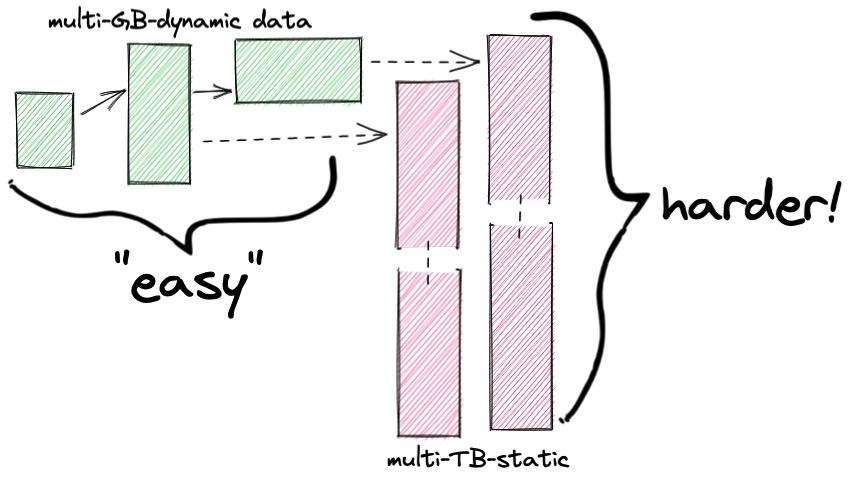
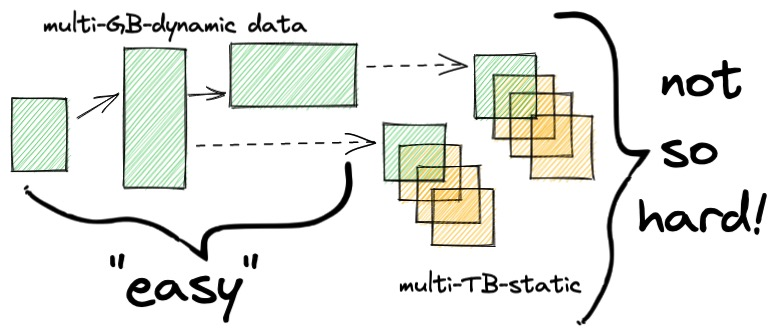
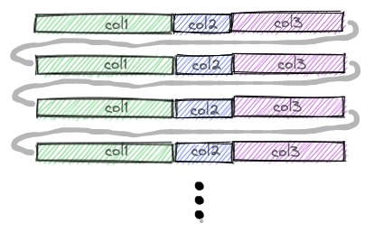
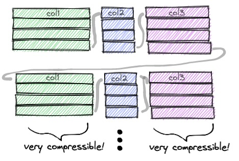

# Parquet and Postgres in the Data Lake

## Static Data is Different

A couple weeks ago, I came across a [blog from Retool](https://retool.com/blog/how-we-upgraded-postgresql-database/) on their experience migrating a 4TB database. They put in place some good procedures and managed a succesful migration, but the whole experience was complicated by the size of the database, and the size of the database was driven primarily by having a couple of very large "logging" tables: an edit log and an audit log.



The thing about log tables is, they don't change much. They are append-only by design. They are also queried fairly irregularly, and the queries are often time ranged: "tell me what happened then" or "show me the activities between these dates".

So, one way the Retool migration would have been made easier is if their log tables were constructed as time-ranged partitions. That way there'd would only be one "live" table in the partition set (the one with the recent entries) and a larger collection of historical tables. The migration could move the live partition as part of the critical path, and do all the historical partitions later.



Even after breaking up the log tables into manageable chunks they still remain, in aggregate, pretty big! The PostgreSQL [documentation on partitioning](https://www.postgresql.org/docs/current/ddl-partitioning.html) has some harsh opinions about stale data living at the end of a partition collection:

> The simplest option for removing old data is to drop the partition that is no longer necessary.

There's something to that! All those old historical records just fluff up your base backups, and maybe you almost never have occasion to query it. 

Is there an alternative to dropping the tables?

## Dump Your Data in the Lake

What if there was a storage option that was still durable, allowed access via multiple query tools, and could integrate transparently into your operational transactional database?

How about: storing the static data in [Parquet format](https://www.upsolver.com/blog/apache-parquet-why-use) but retaining database access to the data via the [parquet_fdw](https://github.com/adjust/parquet_fdw/)?

Sounds a bit crazy, but:

* A foreign parquet table can participate in a partition along with a native PostgreSQL table.
* A parquet file can also be consumed by [R](https://arrow.apache.org/docs/r/reference/read_parquet.html), [Python](https://pandas.pydata.org/pandas-docs/stable/reference/api/pandas.read_parquet.html), [Go](https://github.com/xitongsys/parquet-go) and a host of cloud applications.
* Modern PostgreSQL (14+) can parallelize access to foreign tables, so even collections of Parquet files can be scanned effectively.
* Parquet stores data compressed, so you can get way more raw data into less storage. 

## Wait, Parquet?

Parquet is a language-independent storage format, designed for online analytics, so:

* Column oriented
* Typed
* Binary
* Compressed

A standard table in PostgreSQL will be row-oriented on disk.



This layout is good for things PostgreSQL is expected to do, like query, insert, update and delete data a "few" records at a time. (The value of "a few" can run into the hundreds of thousands or millions, depending on the operation.)

A Parquet file stores data column-oriented on the disk, in batches called "row groups".



You can see where the Parquet format gets its name: the data are grouped into little squares, like a parquet floor. One of the advantages of grouping data together, is that compression routines tend to work better on data of the same time, and even more so when the data elements have the same values.

## Does This Even Work?

In a word "yes", but with some caveats: Parquet has been around for several years, but the ecosystem supporting it is still, relatively, in flux. New releases of the underlying C++ libraries are still coming out regularly, the [parquet_fdw](https://github.com/adjust/parquet_fdw) is only a couple years old, and so on.

However, I was able to demonstrate to my own satisfaction that things were baked enough to be interesting.

### Loading Data

I started with a handy data table of Philadelphia parking infractions, that I used in a previous [blog post on spatial joins](https://www.crunchydata.com/blog/performance-and-spatial-joins), and sorted the file by date of infraction, `issue_datetime`.

<details><summary>Data Download and Sort</summary>

```
#
# Download Philadelphia parking infraction data
#
curl "https://phl.carto.com/api/v2/sql?filename=parking_violations&format=csv&skipfields=cartodb_id,the_geom,the_geom_webmercator&q=SELECT%20*%20FROM%20parking_violations%20WHERE%20issue_datetime%20%3E=%20%272012-01-01%27%20AND%20issue_datetime%20%3C%20%272017-12-31%27" > phl_parking_raw.csv

#
# Sort it
#
sort -k2 -t, phl_parking_raw.csv > phl_parking.csv
```

Sorting the data by `issue_datetime` will make queries that filter against that column go faster in the column-oriented Parquet setup.

</details>

```sql
-- Create parking infractions table
CREATE TABLE phl_parking (
    anon_ticket_number integer,
    issue_datetime timestamptz,
    state text,
    anon_plate_id integer,
    division text,
    location text,
    violation_desc text,
    fine float8,
    issuing_agency text,
    lat float8,
    lon float8,
    gps boolean,
    zip_code text
    );

-- Read in the parking data
\copy phl_parking FROM 'phl_parking.csv' WITH (FORMAT csv, HEADER true);
```

OK, so now I have an 8M record data table, good for some bulk data experiments. How big is the table?

```sql
SELECT pg_size_pretty(pg_relation_size('phl_parking')) AS pg_table_size;
```
```
 pg_table_size 
----------------
 1099 MB
```

Just over 1GB!

### Generating Parquet

How do I get a Parquet file?

This turns out to be way harder then I expected. Most internet advice was around using Python or Spark to convert CSV files into Parquet. In the end, I used the very new (currently unreleased, coming in GDAL 3.5) [support for Parquet in GDAL library](https://gdal.org/drivers/vector/parquet.html), and the `ogr2ogr` command to do the conversion.

```bash
ogr2ogr -f Parquet \
  /tmp/phl_parking.parquet \
  PG:"dbname=phl host=localhost" \
  phl_parking
```

For these tests the Parquet file will reside on my local disk in `/tmp`, though for cloud purposes it might reside on a cloud volume, or even (with the right software) in an object store.

```
% ls -lh /tmp/phl_parking.parquet
-rw-r--r--  1 pramsey  wheel   216M 29 Apr 10:44 /tmp/phl_parking.parquet
```

Thanks to data compression, the Parquet file is 20% the size of the database table!

### Querying Parquet

Querying Parquet in PostgreSQL involves a number of parts, which can be challenging to build right now.

* [Apache libarrow](https://arrow.apache.org/install/), built with Parquet support enabled.
* [parquet_fdw](https://github.com/adjust/parquet_fdw/) itself.

Note that `parquet_fdw` request `libarrow` version 6, not the recently released version 7.

Once the FDW and supporting libraries are built, though, everything works just like other FDW extensions.

```sql
CREATE EXTENSION parquet_fdw;

CREATE SERVER parquet_srv FOREIGN DATA WRAPPER parquet_fdw;

CREATE FOREIGN TABLE phl_parking_pq (
    anon_ticket_number integer,
    issue_datetime     timestamptz,
    state              text,
    anon_plate_id      integer,
    division           text,
    location           text,
    violation_desc     text,
    fine               float8,
    issuing_agency     text,
    lat                float8,
    lon                float8,
    gps                boolean,
    zip_code           text
    )
  SERVER parquet_srv
  OPTIONS (filename '/tmp/phl_parking.parquet', 
           sorted 'issue_datetime', 
           use_threads 'true');
```

Compared to the raw table, the Parquet file is similar in performance, usually a little slower. Just blasting through a row count (when the tables are pre-cached in memory).

```sql
-- Give native table same indexing advantage 
-- as the parquet file
CREATE INDEX ON phl_parking USING BRIN (issue_datetime);

SELECT Count(*) FROM phl_parking_pq;
-- Time: 1230 ms 

SELECT Count(*) FROM phl_parking;
-- Time:  928 ms 
```

Similarly, a filter also is slightly faster on PostgreSQL.

```sql
SELECT Sum(fine), Count(1)
FROM phl_parking_pq
WHERE issue_datetime BETWEEN '2014-01-01' AND '2015-01-01';
-- Time: 692 ms

SELECT Sum(fine), Count(1)
FROM phl_parking
WHERE issue_datetime BETWEEN '2014-01-01' AND '2015-01-01';
-- Time: 571 ms
```

The `parquet_fdw` is very nicely implemented, and will even tell you the execution plan that will be used on the file for a given filter. For example, the previous filter involves opening about 20% of the 132 row groups in the Parquet file.

```sql
EXPLAIN SELECT Sum(fine), Count(1)
FROM phl_parking_pq
WHERE issue_datetime BETWEEN '2014-01-01' AND '2015-01-01';
                                                             
 Finalize Aggregate  (cost=6314.77..6314.78 rows=1 width=16)
   ->  Gather  (cost=6314.55..6314.76 rows=2 width=16)
         Workers Planned: 2
         ->  Partial Aggregate  (cost=5314.55..5314.56 rows=1 width=16)
               ->  Parallel Foreign Scan on phl_parking_pq  (cost=0.00..5242.88 rows=14333 width=8)
                     Filter: ((issue_datetime >= '2014-01-01 00:00:00-08') 
                          AND (issue_datetime <= '2015-01-01 00:00:00-08'))
                     Reader: Single File
                     Row groups: 40, 41, 42, 43, 44, 45, 46, 47, 48, 49, 50, 51, 
                                 52, 53, 54, 55, 56, 57, 58, 59, 60, 61, 62, 63
```

For plowing through the whole table and doing a summary, the Parquet query is about the same speed as the PostgreSQL query.

```sql
SELECT issuing_agency, count(1) 
FROM phl_parking_pq 
GROUP BY issuing_agency;
Time: 3043 ms

SELECT issuing_agency, count(1) 
FROM phl_parking
GROUP BY issuing_agency;
Time: 3103 ms
```

My internal model for the performance differences is that, while the Parquet format has some advantages in avoiding unnecessary reads, via row block filtering and accessing only the columns of interest, those advantages are offset by some inefficiencies in converting the raw data from parquet into the internal PostgreSQL formats.

## Conclusion

Is that it? Well, we've seen:

* Parquet is a software-neutral format that is increasingly common in data science and the data centre.
* Parquet access can be made transparent to PostgreSQL via the `parquet_fdw` extension.
* Parquet storage can provide substantial space savings.
* Parquet storage is a bit slower than native storage, but can offload management of static data from the back-up and reliability operations needed by the rest of the data.
* Parquet storage of static data is much better than just throwing it out.

More importantly, I think there's more to discuss:

* Can parquet files participate in partitions?
* Can parquet files be accessed in parallel in collections?
* Can parquet files reside in cloud object storage instead of filesystem storage?
* Can PostgreSQL with parquet storage act like a "mid-range big data engine" to crunch numbers on large collections of static data backed by parquet?

So far the ecosystem of Parquet tools has been dominated by the needs of data science (R and Python) and a handful of cloud OLAP system (Apache Spark), but there's no reason PostgreSQL can't start to partake of this common cloud format goodness, and start to swim in the data lake.

