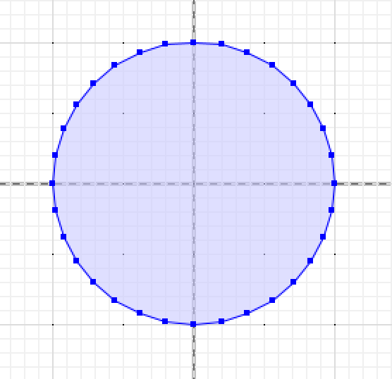
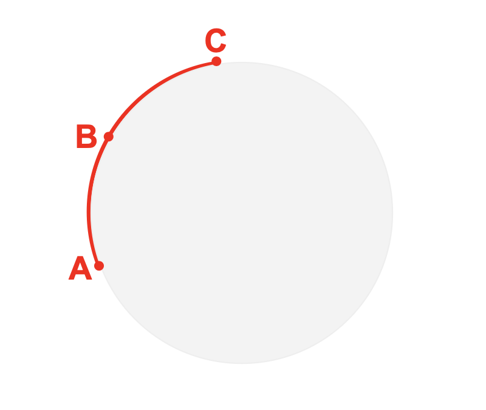

# Getting Circular on Pi Day

What's your favourite infinite sequence of non-repeating digits? There are some people who make a case for _e_, but to my mind nothing beats the transcendental and curvy utility of _pi_, the ratio of a circle's circumference to its diameter.

Drawing circles is a simple thing to do in PostGIS -- take a point, and buffer it. The result is circular, and we can calculate an estimate of _pi_ just by measuring the perimeter of the unit circle.

```sql
SELECT ST_Buffer('POINT(0 0)', 1.0);
```



Except, look a little more closely -- this "circle" seems to be made up of short straight lines. What is the ratio of its circumference to its diameter?

```sql
SELECT ST_Perimeter(ST_Buffer('POINT(0 0)', 1.0)) / 2;
```
```
3.1365484905459406
```
That's **close** to _pi_, but it's **not** pi. Can we generate a better approximation? What if we make the edges even shorter? The third parameter to `ST_Buffer()` is the "quadsegs", the number of segments to build each quadrant of the circle.

```sql
SELECT ST_Perimeter(ST_Buffer('POINT(0 0)', 1.0, quadsegs => 128)) / 2;
```
```
3.1415729403671087
```
Much closer!

We can crank this process up a lot more, keep adding edges, but at some point the process becomes silly. We should just be able to say "this edge is portion of a circle, not a straight line", and get an actual circular arc.

Good news, we can do exactly that! The `CIRCULARSTRING` is curvey analogue to a `LINESTRING` wherein every connection is between three points that define a portion of a circle.



The circular arc above is the arc that starts at A and ends at C, passing through B. Any three points define a unique circular arc. A `CIRCULARSTRING` is a connected sequence of these arcs, just as a `LINESTRING` is a connected sequence of linear edges.

How does this help us get to _pi_ though? Well, PostGIS has a moderate amount of support for circular arc geometry, so if we construct a circle using "natively curved" objects, we should get an exact representation of a circle rather than an approximation.

So, what is an arc that starts and ends at the same point? A circle!

```sql
SELECT ST_Length('CIRCULARSTRING(1 0, -1 0, 1 0)') / 2;
```
```
3.141592653589793
```

That looks a lot like _pi_!

Let's bust out the built-in `pi()` function from PostgreSQL and check to be sure.

```sql
SELECT pi() - ST_Length('CIRCULARSTRING(1 0, -1 0, 1 0)') / 2;
```
```
0
```

Yep, a perfect *pi* to celebrate "Pi Day" with!

