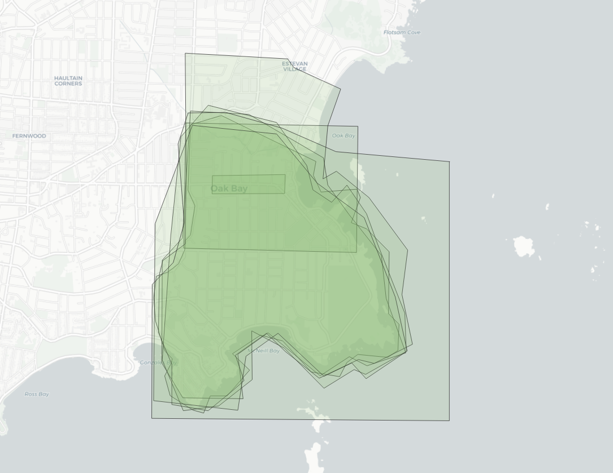
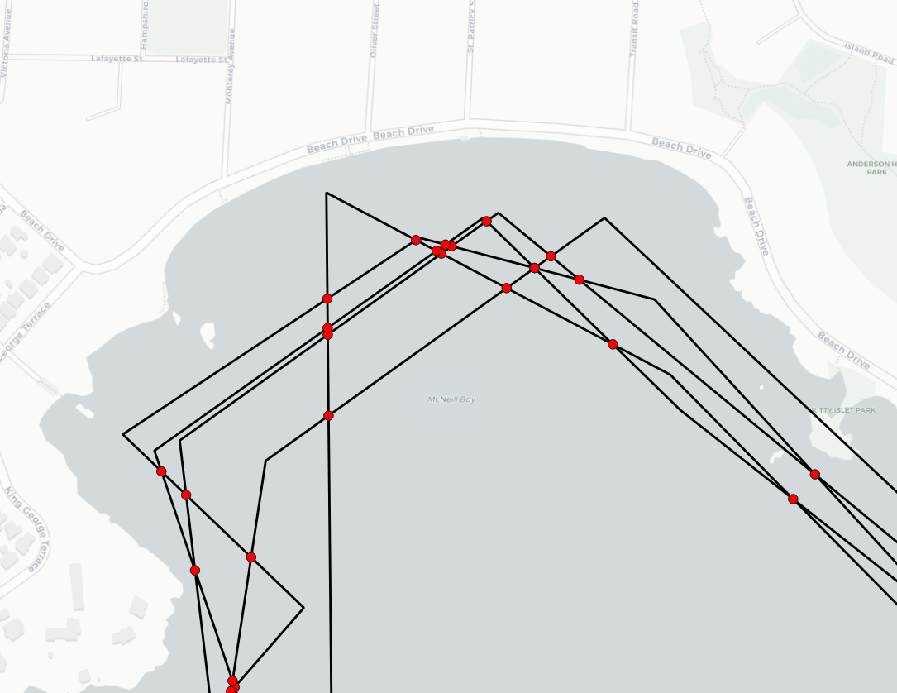
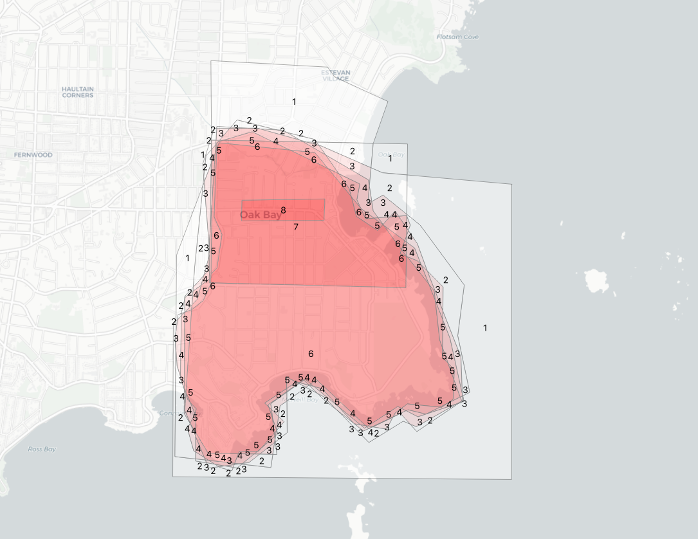
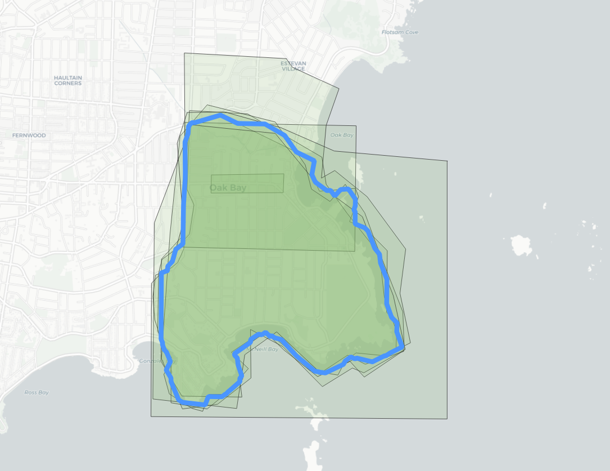
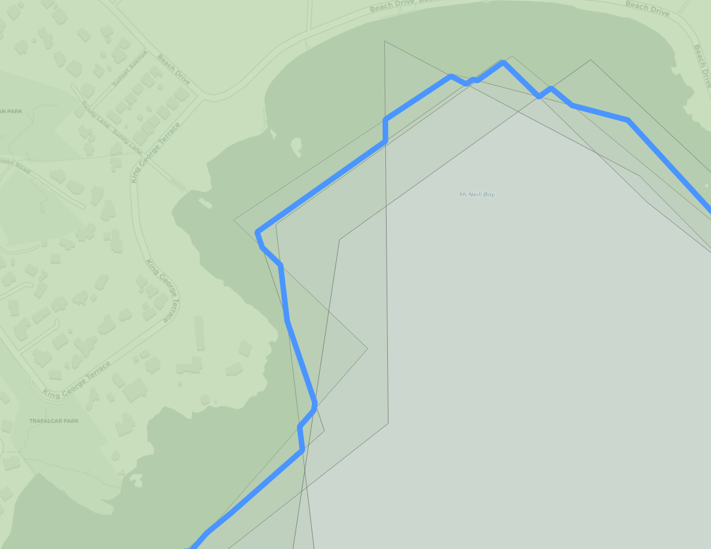

# Polygon Overlay in PostGIS

The [GIS Stack Exchange](https://gis.stackexchange.com/) is a great repository of interesting questions and answers about how to work with spatial data, and with PostGIS.

For example, [this question](https://gis.stackexchange.com/questions/357398/using-postgis-to-generate-a-polygon-representing-the-area-shared-by-some-but-no/357628#357628):

> Let's say we received polygons from 10 users. If we used ST_Intersection on those polygons, the remaining polygon would only represent the points included in all 10 polygons. If we used ST_Union, the output would repesent the points included in at least 1 polygon.

> Can anyone recommend a way to output a polygon that represents the points that are in n polygons, where n is greater than 1 and less than the total number of polygons (10 in this case)?

This sounds like a common problem, and has a solution that runs inside the database. 

Start with a collection of polygons, like these eight interpretations of where "Oak Bay" is.



As you can see, the polygons share some parts of the interpretation. We'd like the "consensus" area that at least 4 polygons share.

First, extract all the lines that make up the polygon rings, and smash them together, so that they all share end points. 

```sql
WITH 
edges AS 
  SELECT
    (ST_Dump(
     ST_UnaryUnion(
     ST_Collect(
     ST_ExteriorRing(p.geom))))).geom
  FROM polygons p
```

This requires a few functions:

* [ST_ExteriorRing](https://postgis.net/docs/ST_ExteriorRing.html) to get the polygon boundary,
* [ST_UnaryUnion](https://postgis.net/docs/ST_UnaryUnion.html) to mash all the rings together and break them at crossing points, and
* [ST_Dump](https://postgis.net/docs/ST_Dump.html) to convert the output of the union (a multi-linestring) back into one row per geometry.



Next we take those edges and polygonize them, so we get one polygon for each unique piece of area. 

```sql
parts AS (
  SELECT (ST_Dump(ST_Polygonize(geom))).geom FROM edges
)
```

Those small polygons can then be joined back against the original polygons, and every overlap with an original polygon counted up. This allows us to figure what the "overlap count" is for each piece of area covered by the input polygons.

```sql
parts_count AS (
  SELECT parts.geom, count(*)
  FROM parts
  JOIN polygons p
  ON ST_Intersects(p.geom, ST_PointOnSurface(parts.geom))
  GROUP BY parts.geom
)
```

If we color up the parts based on the count of overlaps, we can see the original overlap pattern showing up, except now we have an actual overlap number to use.



Finally, we can take all the parts with a count greater than four and merge them.

```sql
SELECT ST_Union(geom) AS geom, 4 as count
FROM parts_count
WHERE count > 4
```

The final result is a nice average of all the input polygons.



The whole analysis can be run in one go by chaining together the CTE sections.

```sql
CREATE TABLE average AS
WITH
edges AS (
    SELECT (ST_Dump(ST_UnaryUnion(ST_Collect(ST_ExteriorRing(p.geom))))).geom
    FROM polygons2 p
),
parts AS (
    SELECT (ST_Dump(ST_Polygonize(geom))).geom FROM edges
),
parts_count AS (
    SELECT parts.geom, count(*)
    FROM parts
    JOIN polygons2 p
    ON ST_Intersects(p.geom, ST_PointOnSurface(parts.geom))
    GROUP BY parts.geom
)
SELECT ST_Union(geom) AS geom, 4 as count
FROM parts_count
WHERE count > 4
```

Because the final average uses the original linework, it makes a more visually appealing result than a shape generated using a grid or some other aggregation unit.


