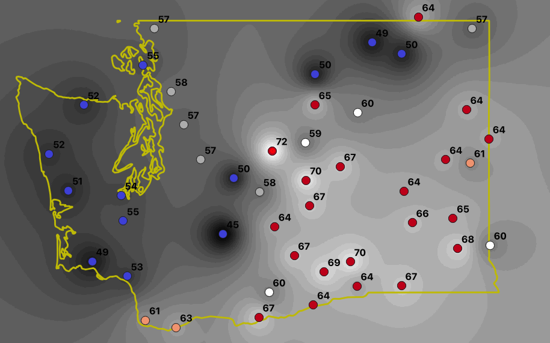
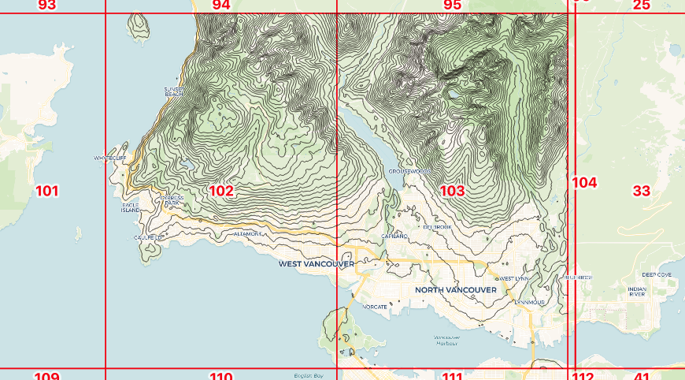
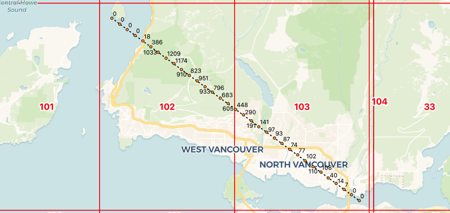
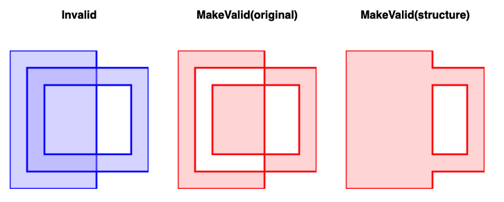

# PostGIS 3.2 New and Improved

Last month, just under the wire for a 2021 release, the 3.2 version of PostGIS hit the streets! This new PostGIS also supports the latest [3.10 release](https://libgeos.org/posts/2021-10-01-geos-3-10-released/) of GEOS, which underpins a few of the new features.

## Raster Algorithms

The `postgis_raster` extension uses the GDAL raster library for things like vectorizing rasters, and rasterizing vectors (yes!), and this release exposed a few more cool GDAL algorithms.

* The new [ST_InterpolateRaster](https://postgis.net/docs/manual-3.2/RT_ST_InterpolateRaster.html) function allows collections of measurement points to be interpolated into a continuous raster surface. 



* Those continuous raster surfaces can be fed to the new [ST_Contour](https://postgis.net/docs/manual-3.2/RT_ST_Contour.html) function, to calculate the iso-lines of the surface.



* The same raster surfaces can be used as input to add dimensional attributes to 3D and 4D vector objects, with [ST_SetZ](http://postgis.net/docs/manual-dev/RT_ST_SetZ.html) and [ST_SetM](http://postgis.net/docs/manual-dev/RT_ST_SetM.html).



* Finally, the [ST_Value](http://postgis.net/docs/manual-dev/RT_ST_Value.html) function (and [ST_SetZ](http://postgis.net/docs/manual-dev/RT_ST_SetZ.html) and [ST_SetM](http://postgis.net/docs/manual-dev/RT_ST_SetM.html)) has been upgraded to support [bilinear interpolation](https://en.wikipedia.org/wiki/Bilinear_interpolation) of values from rasters. 

## Raster Cloud Access

One of the more exciting trends in geospatial over the last five years is the growing industry consensus that big geospatial data should [live in the cloud](https://www.cogeo.org/), in HTTP object stores (like AWS S3, Google Cloud Storage or Azure Blob Storage). This changes the default location of major raw data archives from "on the USB drive under Joe's desk" to something publicly accessible and, thus, available for integration into analysis chains.

With raster data in the cloud, it's possible to do raster-based analysis using the `postgis_raster` extension without ever importing the source raster data. You can even do it in a (appropriately configured) cloud database service like [Crunchy Bridge](https://blog.crunchydata.com/blog/postgis-raster-and-crunchy-bridge).

Our initial [blog posts](https://blog.crunchydata.com/blog/postgis-raster-and-crunchy-bridge) about cloud raster analysis were fun, but they showed up a limitation in cloud-raster-from-the-database, namely there was no good way to access private objects. 

With PostGIS 3.2, it's now possible to [supply credentials to cloud object stores](https://blog.crunchydata.com/blog/waiting-for-postgis-3.2-secure-cloud-raster-access), so you can do remote analysis against your private raster collections too. 

## Faster/Better Validity

One of our development focusses over the past couple years has been making the computational geometry engine that PostGIS uses, the GEOS library, [faster and more modern](https://blog.crunchydata.com/blog/performance-improvements-in-geos).

For this release cycle, two common user facing functions were modernized, [ST_IsValid](https://postgis.net/docs/ST_IsValid.html) and [ST_MakeValid](https://postgis.net/docs/ST_MakeValid.html).

* [ST_IsValid](https://postgis.net/docs/ST_IsValid.html) was re-written to be more efficient, and is about 30% faster depending upon inputs.
* A new implementation of [ST_MakeValid](https://postgis.net/docs/ST_MakeValid.html) was added, that is twice as fast, and respects the structural make-up of inputs a little better. The result is (depending on your interpretation) more "reasonable" corrections to validity mistakes.




## (Optional) Faster GIST Index Build

This year a Google Summer of Code [student](https://github.com/HanwGeek) took on an ambitious PostGIS project: using the new GIST "[sort support](https://www.postgresql.org/docs/current/gist-extensibility.html)" hooks for PostgreSQL 14 to cut index build times.

The work has been committed and does in fact **substantially speed up** GIST index build times, between two- and five-times.

However, there is a catch: the indexes built in the manner are less well structured than the default incremental index builds. This can result in query performance degredation ranging from none to 30% or more.

Because we expect that index **query** work will outweight index **build** for most use cases, we have left the new sort support hooks out of the default geometry operator class. 

If you want to enable the faster index build (at the expense of query performance) you can just add the sort support function to the default operator class **before** building your index.

```sql
ALTER OPERATOR FAMILY gist_geometry_ops_2d USING gist
  ADD FUNCTION 11 (geometry)
  geometry_gist_sortsupport_2d (internal);
```

You can turn the operator back off by sort support from the operator class. 

```sql
ALTER OPERATOR FAMILY gist_geometry_ops_2d using gist
  DROP FUNCTION 11 (geometry);
```

Remember that any indexes you built with sort support on will still have the sub-optimal structure, even after you turn sort support off.


## FlatGeoBuf Format

In the category of "maybe this will take off" is the new support for the [FlatGeoBuf format](https://flatgeobuf.org/). As with other MVT and GeoBuf formats supported by PostGIS, the [ST_AsFlatGeoBuf](https://postgis.net/docs/ST_AsFlatGeobuf.html) function takes in a row or set of rows and outputs a single binary `bytea` that encodes all the data in those rows.

The FlatGeoBuf format is a vector take on the same principle as the [Cloud Optimized GeoTiff](https://www.cogeo.org/): a format in which features that are near one another in space are also near each other in the format byte stream. This allows spatial windows of data to be extracted with relatively few HTTP range reads. "Cloud optimization" is all about reducing the number of accesses needed to service common use cases.

So far there is not a lot of use of FlatGeoBuf in the wild, but it fills an un-met need in the vector cloud storage space, so that may change quickly.


## Many Other Things

Any summary of changes for a release will necessarily miss a huge number of niche enhancement and fixes, so true afficionadoes should review the [closed ticket backlog](https://trac.osgeo.org/postgis/query?status=closed&resolution=fixed&milestone=PostGIS+3.2.0&col=id&col=summary&col=milestone&col=status&col=type&col=priority&col=component&order=priority) and the release [NEWS file](https://git.osgeo.org/gitea/postgis/postgis/src/tag/3.2.0/NEWS).
