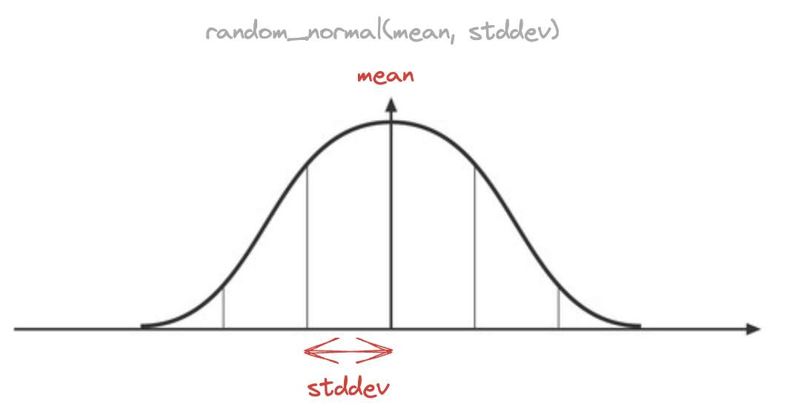

# Rolling the Dice with PostgreSQL

Generating random numbers is a surprisingly common task in programs, whether it's to create test data or to provide a user with a random entry from a list of items. 

PostgreSQL comes with [just a few](https://www.postgresql.org/docs/current/functions-math.html#FUNCTIONS-MATH-RANDOM-TABLE) simple foundational functions that can be used to fulfill most needs for randomness.

Almost all your random-ness needs will be met with the `random()` function. 

## Uniformity

The `random()` returns a double precision float in a [continuous uniform distribution](https://en.wikipedia.org/wiki/Continuous_uniform_distribution) between 0.0 and 1.0.

What does that mean? It means that you could get any value between 0.0 and 1.0, with equal probability, for each call of `random()`.


Here's five uniform random numbers between 0.0 and 1.0.

```sql
SELECT random() FROM generate_series(1, 5)
```

```
0.3978842227698167
0.7438732417540841
0.3875091442400458
0.4108009373061563
0.5524543763568912
```

Yep, those look pretty random! But, maybe not so useful?

## Random Numbers

Most times when people are trying to generate random numbers, they are looking for random **integers** in a range, not random floats between 0.0 and 1.0.

Say you wanted random integers between 1 and 10, inclusive. How do you get that, starting from `random()`?

Start by scaling an ordinary `random()` number up be a factor of 10! Now you have a continuous distribution between 0 and 10.


```sql
SELECT 10 * random() FROM generate_series(1, 5)
```

```
3.978842227698167
7.438732417540841
3.875091442400458
4.108009373061563
5.5245437635689125
```

Then, if you push every one of those numbers down to the nearest integer using `floor()` you'll end up with a random integer between 0 and 9. 


```sql
SELECT floor(10 * random()) FROM generate_series(1, 5)
```

```
4
8
4
5
6
```

If you wanted a random integer between 1 and 10, you just need to add 1 to the zero-base number.


```sql
SELECT floor(10 * random()) + 1 FROM generate_series(1, 5)
```

```
3
7
3
4
5
```

## Seeds and Peudo-randomness

If you looked **very** closely at the examples in the previous section you'll have noticed that they all started from the same, allegedly random values.

If `random()` truly is random, how did I get the same starting values four times in a row?

The answer, shockingly is that `random()` is actually "[pseudo-random](https://en.wikipedia.org/wiki/Pseudorandomness)".

A pseudorandom sequence of numbers is one that appears to be statistically random, despite having been produced by a completely deterministic and repeatable process.

With a pseudo-random number generator and a known starting point, I will always get the same sequence of numbers, at least on the same computer.

The reason most computer programs use pseudo-random number generators is that generating truly random numbers is actually quite an expensive operation (relatively speak). 

So programs instead generate one truly random number, and use that as a "seed" for a generator.

PostgreSQL uses the Blackman/Vigna "xoroshiro128 1.0" pseudo-random number generator.

By default, on start-up PostgreSQL sets up a seed value by calling an external random number generator, using an appropriate method for the platform:

* Using OpenSSL `RAND_bytes()` if available, or
* using Windows `CryptGenRandom()` on that platform, or
* using the operating system `/dev/urandom` if necessary.

So if you are interested in a random number, just calling `random()` will get you one every time.

But if you want to put your finger on the scales, you can use the `setseed()` function to cause your `random()` functions to generate a deterministic series of random numbers, starting from a seed value you specify.


## Random Rows and Values

Some times the things you are trying to do randomly aren't numbers. How do you get a random entry out of a string? Or a random row from a table?

We already saw how to get one-based integers from `random()` and we can apply that technique to the problem of pulling an entry from an array (since PostgreSQL array access is one-based).

```sql
WITH f AS (
    SELECT ARRAY[
        'apple', 
        'banana', 
        'cherry', 
        'pear', 
        'peach'] AS fruits
)
SELECT fruits[floor(array_length(fruits,1) * random())+1] AS snack
FROM f;
```

```
 snack 
-------
 peach
```

Getting a random row involves some tradeoffs and thinking. For a random value from a small table, the naive way to get a single random value is this.

```sql
SELECT * 
FROM fruits 
ORDER BY random()
LIMIT 1
```


As you can imagine, this gets quite expensive if the `fruits` table gets too large, since it sorts the whole table every time.

If you only need a single random row, one way to achieve that is to add a random column to your table and index it.

```sql
CREATE TABLE fruits (
  id SERIAL PRIMARY KEY,
  fruit TEXT NOT NULL,
  random FLOAT8 DEFAULT random()
  );

INSERT INTO fruits (fruit) 
  VALUES ('apple'),('banana'),('cherry'),('pear'),('peach');

CREATE INDEX fruits_random_x ON fruits (random);
```


Then when it's time to search, use the random function to generate a starting search location and find the next highest value.

```sql
SELECT * 
FROM fruits
WHERE random > random()
ORDER BY random ASC
LIMIT 1;
```

```
 id | fruit  |       random       
----+--------+--------------------
  8 | banana | 0.1997961574379754
```

Be careful using this trick for more than one row though: since the values in the random column are fixed, the sequences of rows returned will be deterministic, even if the start row is random.

If you want to pull large portions of a table into a query (for random sampling, for example) look at the `TABLESAMPLE` clause of the [SELECT](https://www.postgresql.org/docs/current/sql-select.html) command.


## Random Groups

Suppose I wanted the entire contents of the fruits collection, but returned in two random groups? This is actually much like getting a single random value: order the whole set randomly, and then use that ordering to determine grouping.

```sql
WITH random_fruits AS (
    SELECT id, fruit
    FROM fruits 
    ORDER BY random()
)
SELECT row_number() over () % 2 AS group, 
       id, fruit
FROM random_fruits
ORDER BY 1;
```

```
 group | id | fruit  
-------+----+--------
     0 | 11 | peach
     0 |  8 | banana
     1 | 10 | pear
     1 |  7 | apple
     1 |  9 | cherry
```

The '2' in the example above is the number of groups desired. 

## Other Distributions

So far we have just been looking at ways to permute the uniform distribution offered by the `random()` function. But there in fact an infinite number of other probability distributions that random numbers could be a part of.

Of that infinite collection, by far the most frequently used in practice is the "[normal distribution](https://en.wikipedia.org/wiki/Normal_distribution)" also known as the "Gaussian distribution" or "bell curve".

Rather than having a hard cut-off point, the normal distribution has a frequent center and then ever lower probability of values out to infinity in both directions.

The position of the center of the distribution is the "mean" and the rate of probability decay is controlled by the "standard deviation".



To generate normally distributed data in PostgreSQL, use the `random_normal(mean, stddev)` function that was introduced in [version 16](https://www.postgresql.org/docs/current/functions-math.html#FUNCTIONS-MATH-RANDOM-TABLE).

```sql
SELECT random_normal(0, 1)
FROM generate_series(1,10)
ORDER BY 1
```

```
 -0.8147201382612904
 -0.5751449000210354
 -0.4643454485382744
 -0.0630592935151314
 0.26438942114339203
 0.39298889191244274
  0.4946046063256206
  0.8560911955145666
  1.3534309793797454
   1.664493506727331
```

It's kind of hard to appreciate that the data have a central tendency without generating a lot more of them and counting how many fall within each bin.

```sql
SELECT random_normal()::integer, 
       Count(*)
FROM generate_series(1,1000)
GROUP BY 1
ORDER BY 1
```

The cast to `integer` rounds the values towards the nearest integer, so you can see how the data are mostly between the first two standard deviations of the mean.

```
 random_normal | count 
---------------+-------
            -3 |     5
            -2 |    65
            -1 |   233
             0 |   378
             1 |   246
             2 |    67
             3 |     5
             4 |     1
```

Just like the `normal()` function, `random_normal()` is based on a psuedo-random number generator, so you can use the `setseed()` function to force the random sequence to start at a repeatable place and get identical runs.

