# Random Geometry Generator

A user on the [postgis-users](https://lists.osgeo.org/mailman/listinfo/postgis-users) had an interesting question today: how to generate a geometry column in PostGIS with random points, linestrings, or polygons.

## Random Points

Random points is pretty easy -- define an area of interest and then use the PostgreSQL [random()](https://pgpedia.info/r/random.html) function to create the X and Y values in that area.

```sql
CREATE TABLE random_points AS 
  WITH bounds AS (
    SELECT 0 AS origin_x,
           0 AS origin_y,
           80 AS width,
           80 AS height
  )
  SELECT ST_Point(width  * (random() - 0.5) + origin_x, 
                  height * (random() - 0.5) + origin_y,
                  4326)::Geometry(Point, 4326) AS geom, 
         id
    FROM bounds, 
         generate_series(0, 100) AS id
```

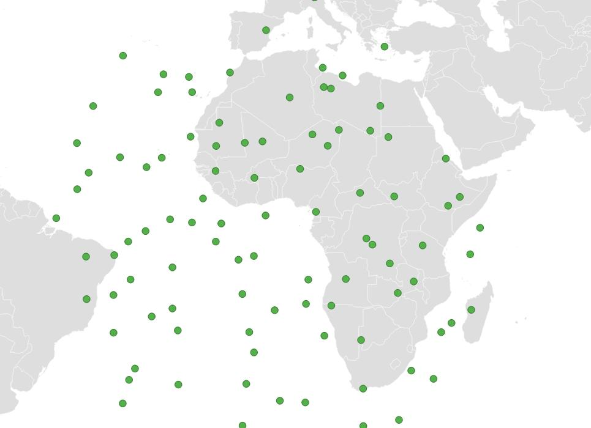

Filling a target shape with random points is a common use case, and there's a special function just for that, [ST_GeneratePoints()](https://postgis.net/docs/ST_GeneratePoints.html). Here we generate points inside a circle created with [ST_Buffer()](https://postgis.net/docs/ST_Buffer.html).

```sql
CREATE TABLE random_points AS 
  SELECT ST_GeneratePoints(
  	ST_Buffer(
  		ST_Point(0, 0, 4326), 
  		50),
  	100) AS geom
```

If you have PostgreSQL 16, you can use the [random_normal()](https://pgpedia.info/r/random_normal.html) function to generate coordinates with a central tendency.

```sql
CREATE TABLE random_normal_points AS 
  WITH bounds AS (
    SELECT 0 AS origin_x,
           0 AS origin_y,
           80 AS width,
           80 AS height
  )
  SELECT ST_Point(random_normal(origin_x, width/4), 
                  random_normal(origin_y, height/4),
                  4326)::Geometry(Point, 4326) AS geom, 
         id
    FROM bounds, 
         generate_series(0, 100) AS id
```

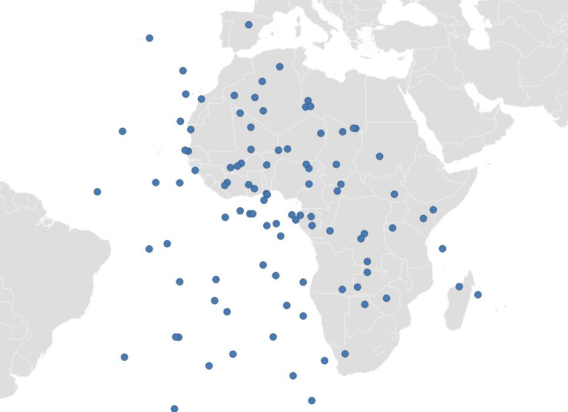

<details><summary>For PostgreSQL versions before 16, here is a user-defined version of `random_normal()`.</summary>

```sql
CREATE OR REPLACE FUNCTION random_normal(
  mean double precision DEFAULT 0.0, 
  stddev double precision DEFAULT 1.0)
RETURNS double precision AS
$$
DECLARE
    u1 double precision;
    u2 double precision;
    z0 double precision;
    z1 double precision;
BEGIN
    u1 := random();
    u2 := random();

    z0 := sqrt(-2.0 * ln(u1)) * cos(2.0 * pi() * u2);
    z1 := sqrt(-2.0 * ln(u1)) * sin(2.0 * pi() * u2);

    RETURN mean + (stddev * z0);
END;
$$ LANGUAGE plpgsql;
```

</details>

## Random Linestrings

Linestrings are a little harder, because they involve more points, and aesthetically we like to avoid self-crossings of lines.

Two-point linestrings are pretty easy to generate with [ST_MakeLine()](https://postgis.net/docs/en/ST_MakeLine.html) -- just generate twice as many random points, and use them as the start and end points of the linestrings.

```sql
CREATE TABLE random_2point_lines AS 
  WITH bounds AS (
    SELECT 0 AS origin_x, 80 AS width,
           0 AS origin_y, 80 AS height
  )
  SELECT ST_MakeLine(
  	       ST_Point(random_normal(origin_x, width/4), 
                    random_normal(origin_y, height/4),
                    4326), 
  	       ST_Point(random_normal(origin_x, width/4), 
                    random_normal(origin_y, height/4),
                    4326))::Geometry(LineString, 4326) AS geom,
         id
    FROM bounds, 
         generate_series(0, 100) AS id
```

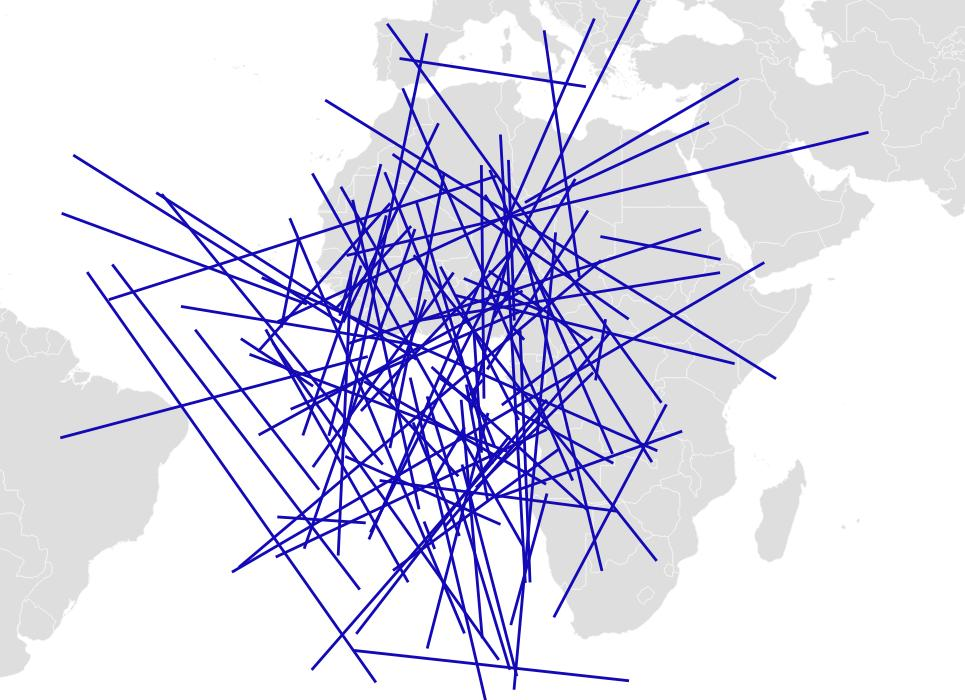

Multi-point random linestrings are harder, at least while avoiding self-intersections, and there are a lot of potential approaches. While a [recursive CTE](https://www.postgresql.org/docs/current/queries-with.html#QUERIES-WITH-RECURSIVE) could probably do it, an imperative approach using PL/PgSQL is more readable.

The `generate_random_linestring()` function starts with an empty linestring, and then adds on new segments one at a time, changing the direction of the line with each new segment.

<details><summary>Here is the full generate_random_linestring() definition.</summary>

```sql
CREATE OR REPLACE FUNCTION generate_random_linestring(
    start_point geometry(Point))
  RETURNS geometry(LineString, 4326) AS
$$
DECLARE
  num_segments integer := 10; -- Number of segments in the linestring
  deviation_max float := radians(45); -- Maximum deviation
  random_point geometry(Point);
  deviation float;
  direction float := 2 * pi() * random();
  segment_length float := 5; -- Length of each segment (adjust as needed)
  i integer;
  result geometry(LineString) := 'SRID=4326;LINESTRING EMPTY';
BEGIN
  result := ST_AddPoint(result, start_point);
  FOR i IN 1..num_segments LOOP
    -- Generate a random angle within the specified deviation
    deviation := 2 * deviation_max * random() - deviation_max;
    direction := direction + deviation;

    -- Calculate the coordinates of the next point
    random_point := ST_Point(
        ST_X(start_point) + cos(direction) * segment_length,
        ST_Y(start_point) + sin(direction) * segment_length,
        ST_SRID(start_point)
      );

    -- Add the point to the linestring
    result := ST_AddPoint(result, random_point);

    -- Update the start point for the next segment
    start_point := random_point;

    END LOOP;

    RETURN result;
END;
$$
LANGUAGE plpgsql;
```

</details>

```sql
CREATE TABLE random_lines AS 
  WITH bounds AS (
    SELECT 0 AS origin_x, 80 AS width, 
           0 AS origin_y, 80 AS height
  )
  SELECT id, 
    generate_random_linestring(
  	  ST_Point(random_normal(origin_x, width/4), 
               random_normal(origin_y, height/4),
               4326))::Geometry(LineString, 4326) AS geom
    FROM bounds, 
         generate_series(1, 100) AS id;
```

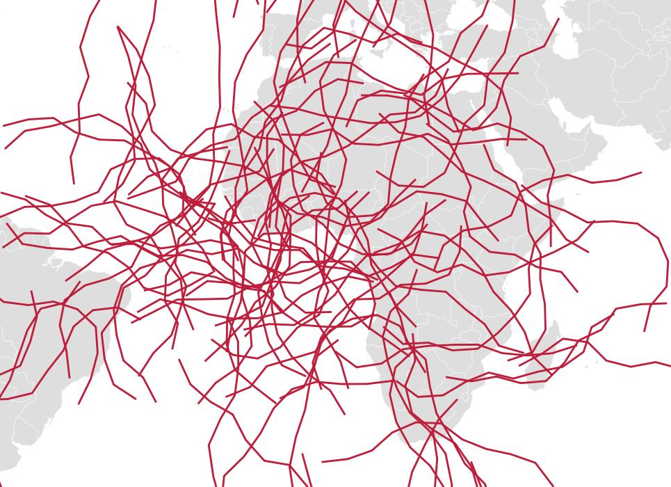


## Random Polygons

At the simplest level, a set of random boxes is a set of random polygons, but that's pretty boring, and easy to generate using [ST_MakeEnvelope()](https://postgis.net/docs/en/ST_MakeEnvelope.html).

```sql
CREATE TABLE random_boxes AS 
  WITH bounds AS (
    SELECT 0 AS origin_x, 80 AS width,
           0 AS origin_y, 80 AS height
  )
  SELECT ST_MakeEnvelope(
  	       random_normal(origin_x, width/4), 
  	       random_normal(origin_y, height/4), 
  	       random_normal(origin_x, width/4), 
  	       random_normal(origin_y, height/4)
  	     )::Geometry(Polygon, 4326) AS geom,
         id
    FROM bounds, 
         generate_series(0, 20) AS id

```

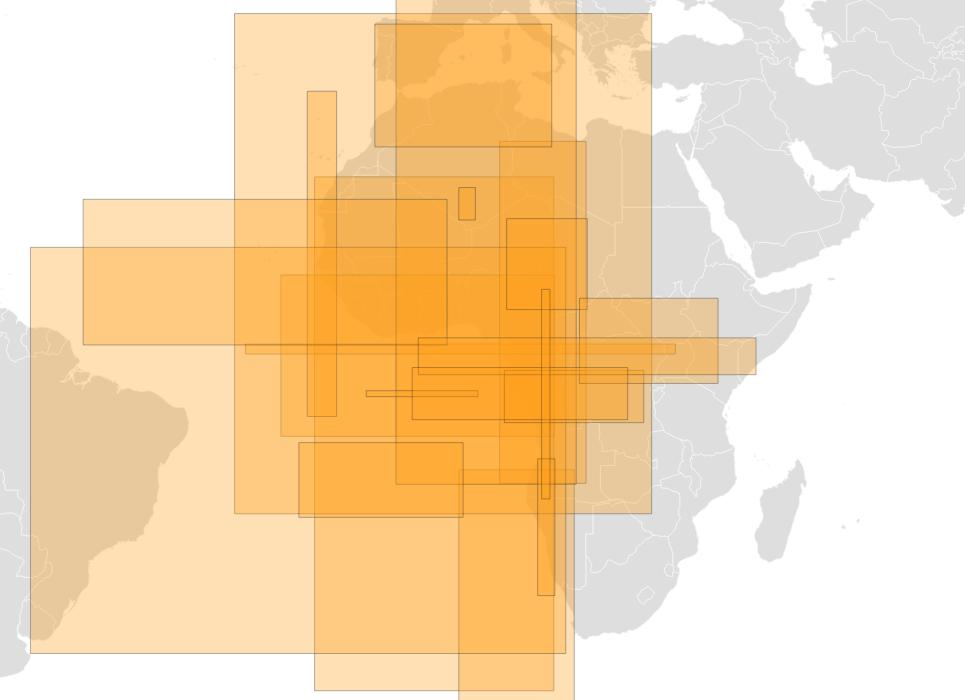

But more interesting polygons have curvy and convex shapes, how can we generate those?

### Random Polygons with Concave Hull

One way is to extract a polygon from a set of random points, using [ST_ConcaveHull()](https://postgis.net/docs/en/ST_ConcaveHull.html), and then applying an "erode and dilate" effect to make the curves more pleasantly round.

We start with a random center point for each polygon, and create a circle with [ST_Buffer()](https://postgis.net/docs/en/ST_Buffer.html).

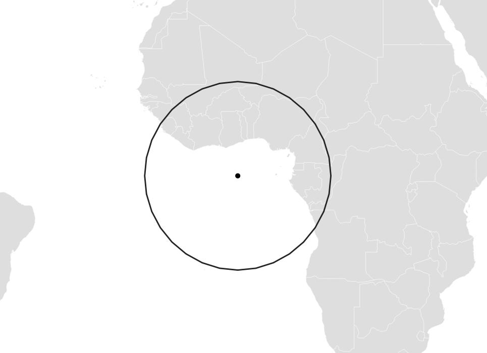

Then use [ST_GeneratePoints()](https://postgis.net/docs/ST_GeneratePoints.html) to fill the circle with some random points -- not too many, so we get a nice jagged result.

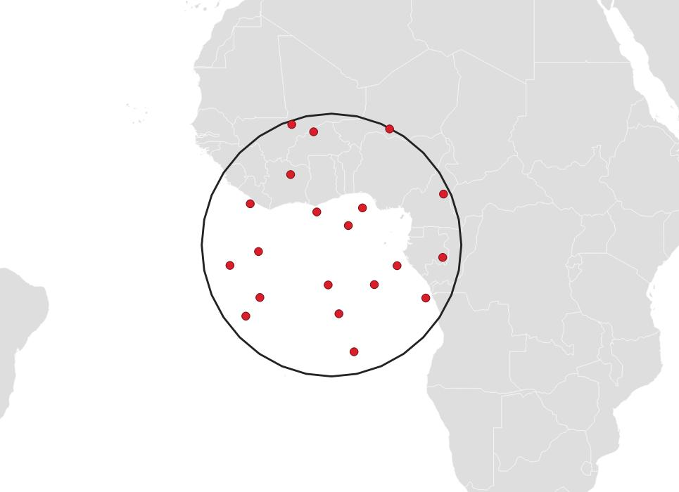

Then use [ST_ConcaveHull()](https://postgis.net/docs/en/ST_ConcaveHull.html) to trace a "boundary" around those points.

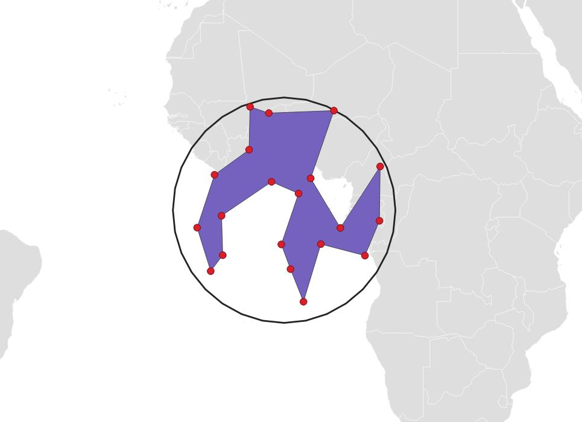

Then apply a negative buffer, to erode the shape.

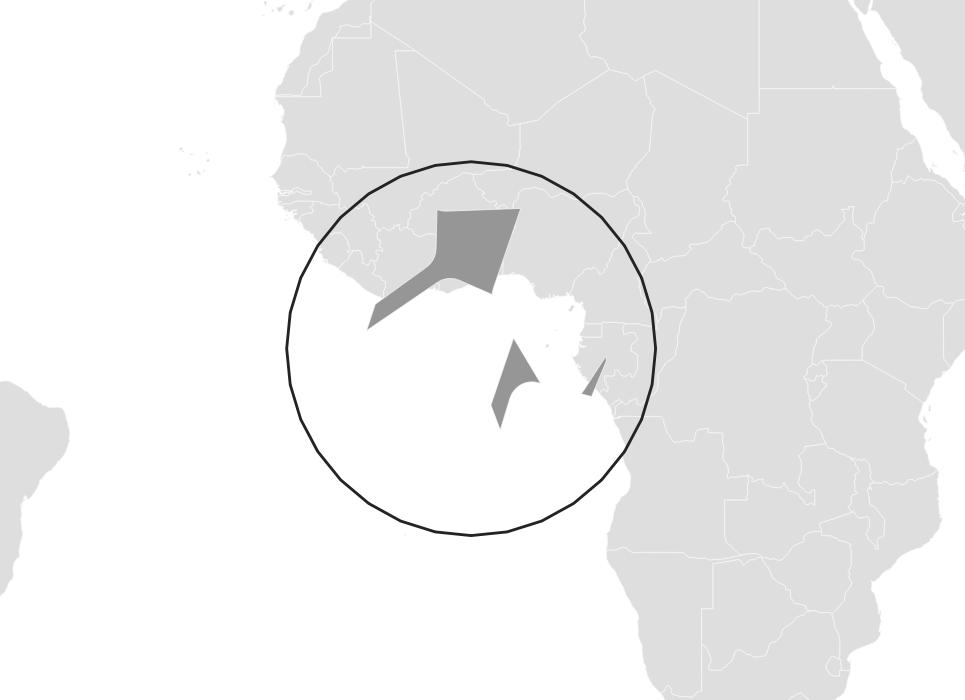

And finally a positive buffer to dilate it back out again.

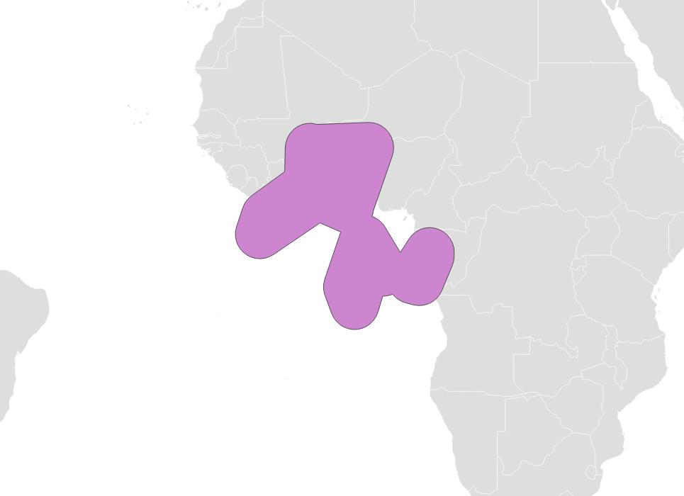

Generating multiple hulls involves stringing together all the above operations with CTEs or subqueries.

<details><summary>Here is the full query to generate multiple polygons with the concave hull method.</summary>

```sql
CREATE TABLE random_hulls AS 
  WITH bounds AS (
    SELECT 0 AS origin_x,
           0 AS origin_y,
           80 AS width,
           80 AS height
  ),
  polypts AS (
    SELECT ST_Point(random_normal(origin_x, width/2), 
  	                random_normal(origin_y, width/2), 
                    4326)::Geometry(Point, 4326) AS geom, 
           polyid
    FROM bounds, 
         generate_series(1,10) AS polyid
  ),
  pts AS (
    SELECT ST_GeneratePoints(ST_Buffer(geom, width/5), 20) AS geom, 
           polyid 
    FROM bounds,
         polypts
  )
  SELECT ST_Multi(ST_Buffer(
  	       ST_Buffer(
  	       	 ST_ConcaveHull(geom, 0.3),
  	       	 -2.0),
  	       3.0))::Geometry(MultiPolygon, 4326) AS geom,
         polyid
    FROM pts;
```

</details>

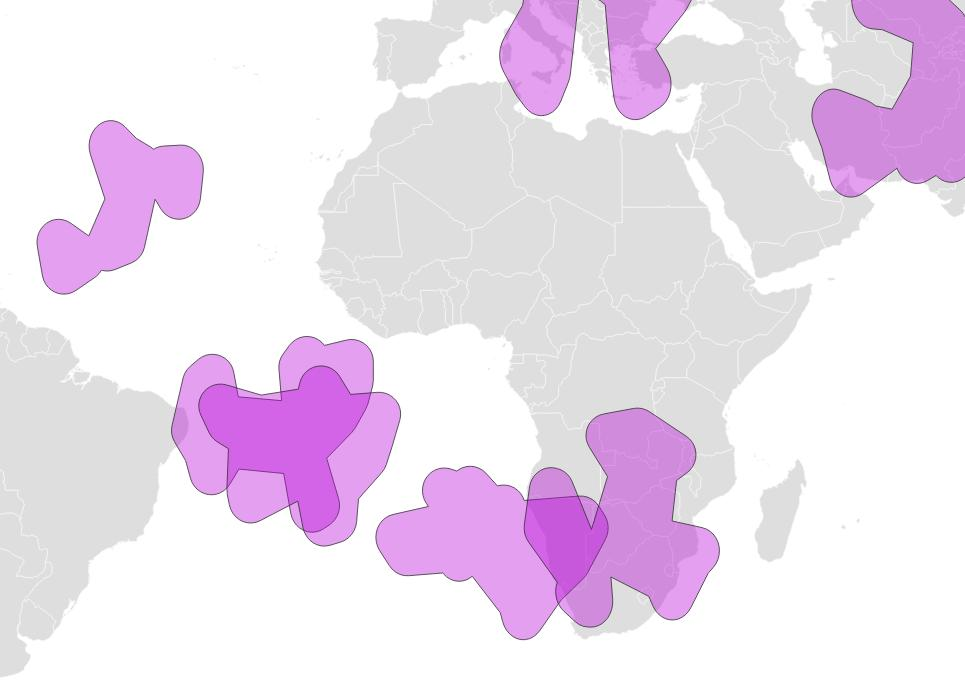


### Random Polygons with Voronoi Polygons

Another approach is to again start with random points, but use the [Voronoi diagram](https://en.wikipedia.org/wiki/Voronoi_diagram) as the basis of the polygon.

Start with a center point and buffer circle.

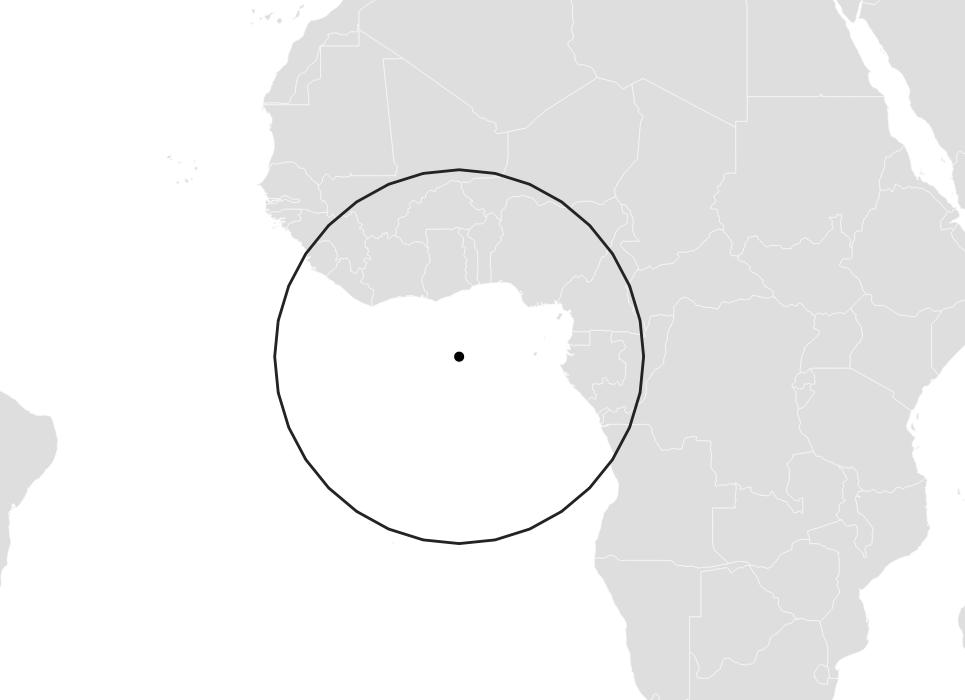

Generate random points in the circle.

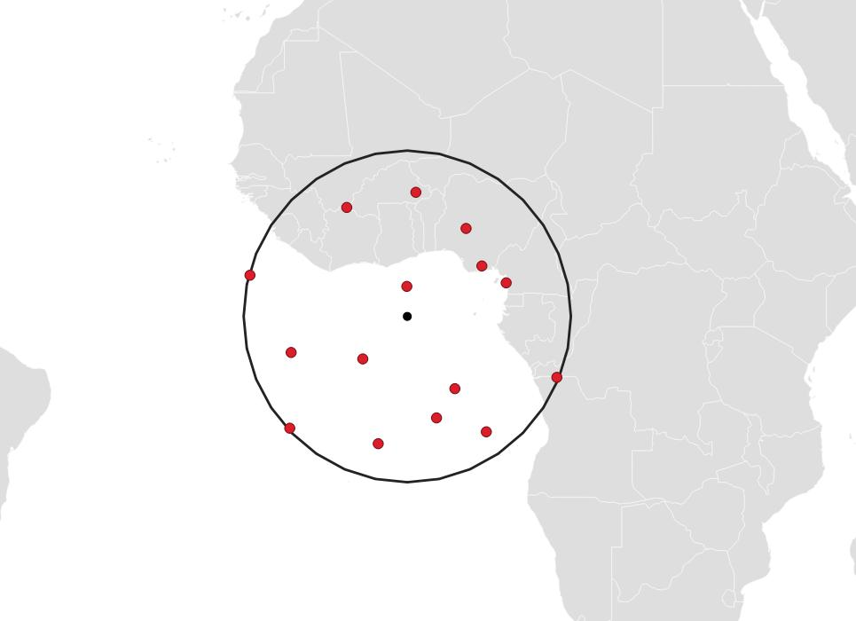

Use the [ST_VoronoiPolygons()](https://postgis.net/docs/en/ST_VoronoiPolygons.html) function to generate polygons that subdivide the space using the random polygons as seeds.

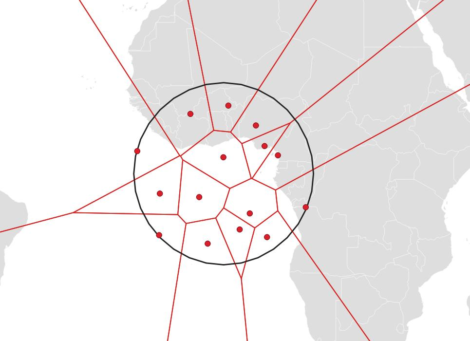

Filter just the polygons that are fully contained in the originating circle.

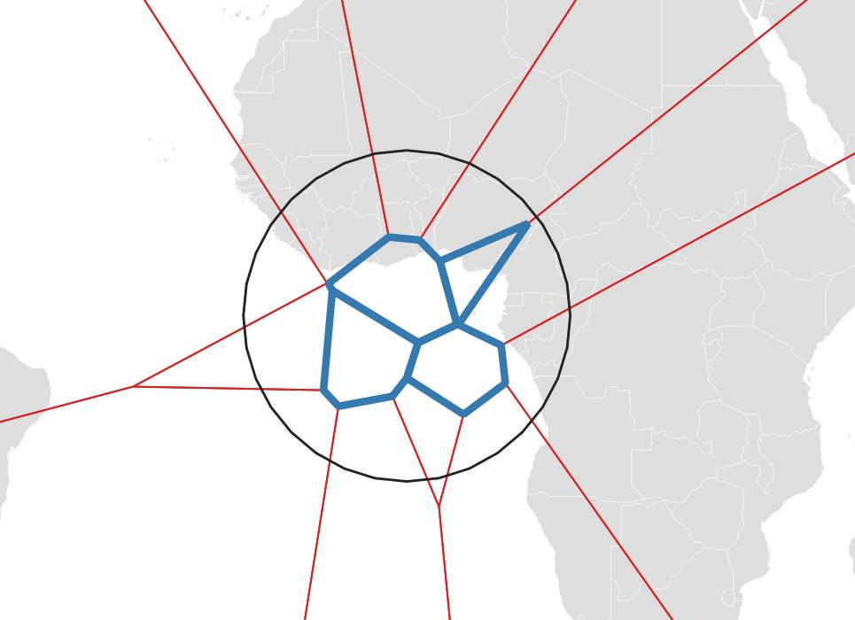

And then use [ST_Union()]() to merge those polygons into a single output shape.

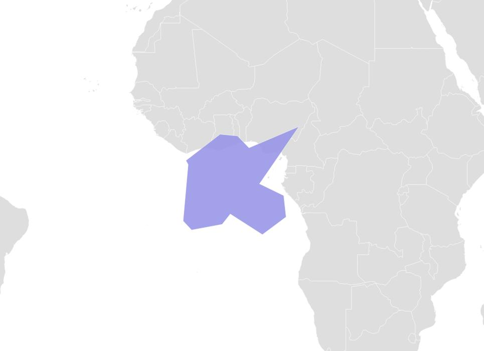

Generating multiple hulls again involves stringing together the abovee operations with CTEs or subqueries.

<details><summary>Here is the full query to generate multiple polygons with the Voronoi method.</summary>

```sql
CREATE TABLE random_delaunay_hulls AS 
  WITH bounds AS (
    SELECT 0 AS origin_x,
           0 AS origin_y,
           80 AS width,
           80 AS height
  ),
  polypts AS (
    SELECT ST_Point(random_normal(origin_x, width/2), 
  	                random_normal(origin_y, width/2), 
                    4326)::Geometry(Point, 4326) AS geom, 
           polyid
    FROM bounds, 
         generate_series(1,20) AS polyid
  ),
  vonorois AS (
    SELECT ST_VoronoiPolygons(
    	     ST_GeneratePoints(ST_Buffer(geom, width/5), 10)
    	   ) AS geom, 
           ST_Buffer(geom, width/5) AS geom_clip,
           polyid 
    FROM bounds,
         polypts
  ),
  cells AS (
  	SELECT (ST_Dump(geom)).geom, polyid, geom_clip
  	FROM vonorois
  )
  SELECT ST_Union(geom)::Geometry(Polygon, 4326) AS geom, polyid
  FROM cells 
  WHERE ST_Contains(geom_clip, geom)
  GROUP BY polyid;
```


