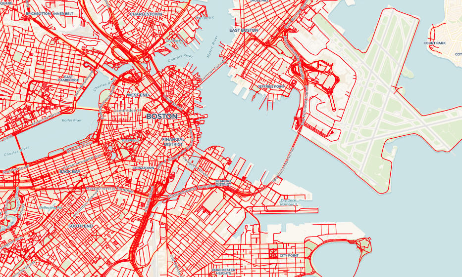
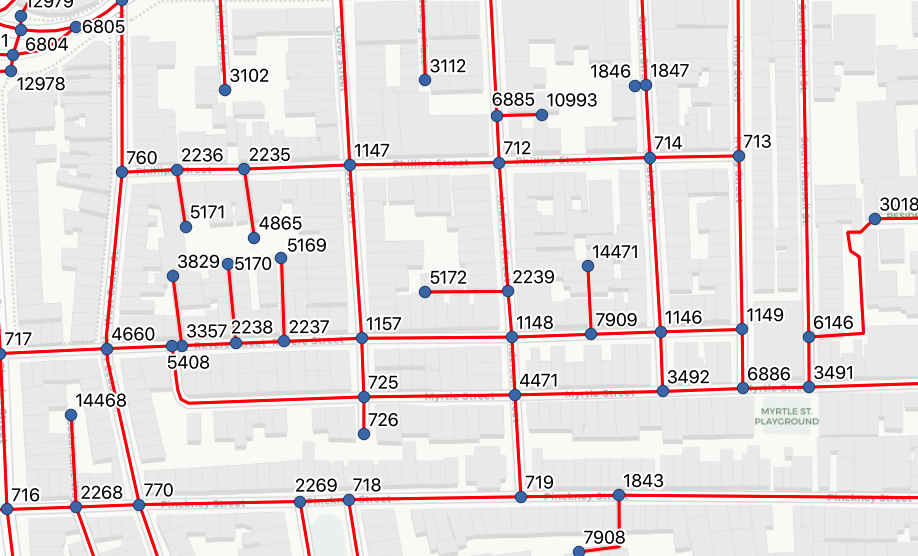
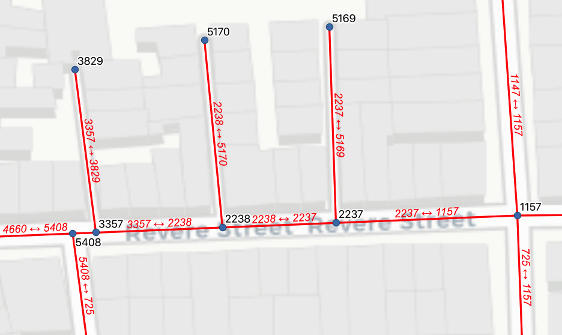
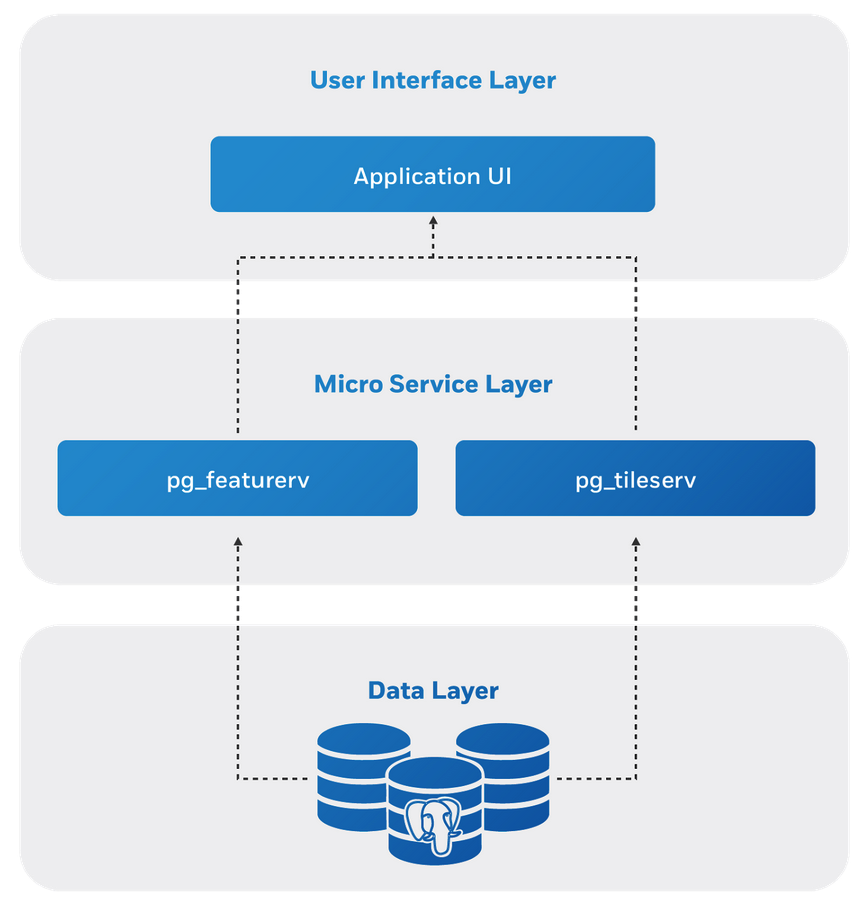

# Routing with PostgreSQL and Crunchy Spatial

One of the least-appreciated PostgreSQL extensions is the powerful [PgRouting](https://pgrouting.org/) extension, which allows routing on dynamically generated graphs. Because it's often used for geographic routing, PgRouting depends on the [PostGIS](https://postgis.net) extension, but there's no reason it could not be used for graph analysis for any number of other graph problems.

Here's a simple practical example of backing a web map with [PgRouting](https://pgrouting.org/).

## Installing PgRouting

Thanks to the magic of packaging, PgRouting is available in most PostgreSQL package repositories, including the PostgreSQL [community repository](https://yum.postgresql.org/repopackages.php) and the [Crunchy Certified](https://www.crunchydata.com/products/crunchy-certified-postgresql/) repository. 

```sql
CREATE EXTENSION postgis;
CREATE EXTENSION pgrouting;
```

## Getting Data

PgRouting can calculate routes on any graph data, that is, any data that can be expressed as a collection of edges with from- and to- node values, like this:

```
 id | source | target 
----+--------+--------
  1 |   2937 |   7496
  2 |   6464 |      2
  3 |   7019 |      3
  4 |   6189 |      4
```

The `id` is the edge identifier, and the `source` and `target` are the identifiers of the nodes the edge connects.

For this example, we'll use data from Boston collected by the [OpenStreetMap](http://openstreetmap.org) project.

```bash
wget http://download.osgeo.org/livedvd/data/osm/Boston_MA/Boston_MA.osm.bz2
bunzip2 Boston_MA.osm.bz2
```

Data for other regions of the world are available at the [GeoFabrik download site](https://download.geofabrik.de/). Start with a small extract while you are learning.

The PgRouting package ships with a utility program for loading [OpenStreetMap](http://openstreetmap.org) OSM files, so loading the Boston data is a one-line command:

```bash
osm2pgrouting \
  --username postgres \
  --password postgres \
  --host 127.0.0.1 \
  --dbname routing \
  --file Boston_MA.osm
```



The loader tool creates three tables of data.

* The **pointsofinterest** table, which in this case is empty.

* The **ways_vertices_pgr** which is a table of nodes where the edges join. Note that every node has an `id` number.



* The **ways** table, which is a table of road/path and other "movement" oriented edges.



Note that the ways table includes a `source` and `target` node identifier for each edge, so it's possible to traverse from node to node over the graph of edges. In the simplest form, PgRouting can walk any collection of records with a edge `id` column and `source` and `target` columns. 

In addition, PgRouting can make use of `cost` and `reverse_cost` columns to hone the routes. As we'll see, the routing engine can read the graph structure and costs from a static table, but can also generate them on the fly, so routes that take real-time conditions into account are easy to build.

## Architecture

We have all the pieces of a **routing engine** in place now in PostgreSQL:

* **Software** for routing and spatial analysis in **PgRouting** and **PostGIS**.
* **Data** for our area of interest (central Boston in this case)

But in order to serve up a routing web application we need to bridge from the web site into the database server side. 



[pg_tileserv](https://github.com/crunchydata/pg_tileserv) and [pg_featureserv](https://github.com/crunchydata/pg_featureserv) will be our bridge from the web client to the database. The tile service will allow us to visualize the ways table on the map, and the feature service will let us bind an HTTP end point to a user-defined function in PostgreSQL to run the routing query.

For our web map, we will use [OpenLayers](https://openlayers.org), an open source web mapping toolkit. With OpenLayers we can bind map click events to calls to our backend to generate point-to-point routes on the fly.

## Functions

The PgRouting is generates routes from graph-node-to-graph-node, and we will be feeding the system with mouse clicks, that won't necessarily be on a node. So one function we need converts clicks to node numbers.

```sql
CREATE OR REPLACE
FUNCTION public.boston_nearest_id(geom geometry)
RETURNS bigint
AS $$
    SELECT node.id
    FROM ways_vertices_pgr node
    JOIN ways edg
      ON (node.id = edg.source OR    -- Only return node that is
          node.id = edg.target)      --   an edge source or target.
    WHERE edg.source != edg.target   -- Drop circular edges.
    ORDER BY node.the_geom <-> $1    -- Find nearest node.
    LIMIT 1;
$$ LANGUAGE 'sql'
STABLE
STRICT
PARALLEL SAFE;
```

The PostGIS nearest-neighbor operator (`<->`) is used here to quickly find the nearest node point, and we restrict ourselves to only nodes that appear as sources or targets on edges.

PgRouting offers [multiple core functions](https://docs.pgrouting.org/latest/en/routingFunctions.html), but for this example, we'll use the classic `pgr_dijkstra()` for [Dijkstra's algorithm](https://en.wikipedia.org/wiki/Dijkstra%27s_algorithm). Here's what our core routing query looks like:

```sql
 pgr_dijkstra(
        'SELECT gid as id, 
                source, target, length_m as cost, 
                length_m as reverse_cost 
         FROM ways',
        -- source
        boston_nearest_id(clicks.start),
        -- target
        boston_nearest_id(clicks.stop)
        ) 
```

The routing call assembles the edges of interest on the fly. This means that any routing query will always reflect the current state of your database. Dynamic costs, real-time optimization, different edge graphs for different users; the flexibility of the system is very high.

Because we are pulling edges with the **length** as the cost, and the reverse cost the **same** as the forward cost, our routes will ignore one-way restrictions, and will not prefer artials over secondary streets.

Our full routing function not only runs the routing query, it also joins the results back to the edges table to return the calculated route as geometry for the map to consume.

```sql
CREATE OR REPLACE
FUNCTION postgisftw.boston_find_route(
    from_lon FLOAT8 DEFAULT -71.07246980438231,
    from_lat FLOAT8 DEFAULT 42.3439930733156,
    to_lon FLOAT8 DEFAULT -71.06028184661864,
    to_lat FLOAT8 DEFAULT 42.354491297186655)
RETURNS
  TABLE(path_seq integer,
        edge bigint,
        cost double precision,
        agg_cost double precision,
        geom geometry)
AS $$
    BEGIN
    RETURN QUERY
    -- Convert the clicks into points
    WITH clicks AS (
    SELECT
        ST_SetSRID(ST_Point(from_lon, from_lat), 4326) AS start,
        ST_SetSRID(ST_Point(to_lon, to_lat), 4326) AS stop
    )
    SELECT dijk.path_seq, dijk.edge, 
           dijk.cost, dijk.agg_cost, ways.the_geom AS geom
    FROM ways
    CROSS JOIN clicks
    JOIN pgr_dijkstra(
        'SELECT gid as id, source, target, length_m as cost, length_m as reverse_cost FROM ways',
        -- source
        boston_nearest_id(clicks.start),
        -- target
        boston_nearest_id(clicks.stop)
        ) AS dijk
        ON ways.gid = dijk.edge;
    END;
$$ LANGUAGE 'plpgsql'
STABLE
STRICT
PARALLEL SAFE;
```

While pulling the graph dynamically using SQL might seem like a performance drag, for this data set note that routes are generated in about **50ms**. PgRouting also includes facilities for optimizing routes on larger graphs, like [contraction heirarchies](https://docs.pgrouting.org/latest/en/contraction-family.html).

## Putting it All Together

The full user interface for the routing example is [available in GitHub](https://github.com/CrunchyData/pg_featureserv/blob/master/examples/openlayers-pgrouting.html).

The key function of the interface just takes in the map clicks and mashes them into a URL that calls our `pg_featureserv` function endpoint, defined above:

```js
function routeUrl(coord1, coord2) {
    var url = "http://localhost:9000/functions/boston_find_route/items.json";
    url += "?from_lon=" + coord1[0];
    url += "&from_lat=" + coord1[1];
    url += "&to_lon=" + coord2[0];
    url += "&to_lat=" + coord2[1];
    return url;
}
```

Since `pg_featureserv` publishes any table-returning function it finds in the `postgisftw` schema, we don't have to do anything other than turn on `pg_featureserv` and point it at our routing database to have the web serving online and ready for routing.

```<video autoplay loop><source src="img/routing.mp4" type="video/mp4"></video>```

The full directions for this example, and the example web page are all available in GitHub.

* https://github.com/CrunchyData/pg_featureserv/blob/master/examples/openlayers-pgrouting.md

