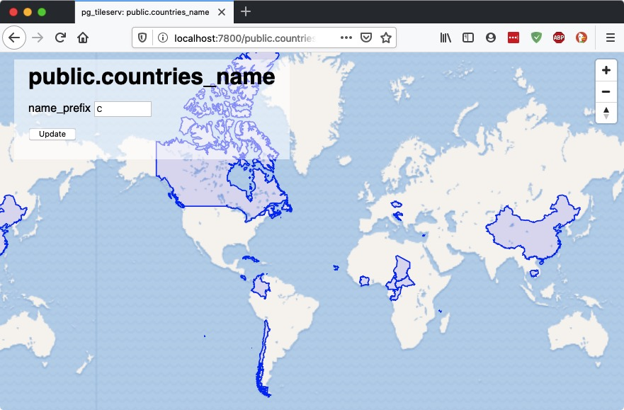
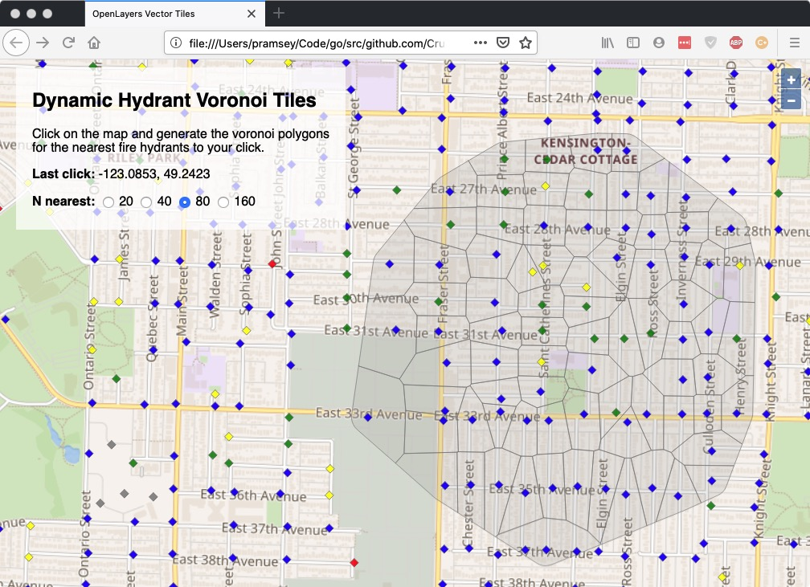

# Crunchy Spatial: Tile Serving with Functions

In our [previous posting]() on tile serving, we showed off how [pg_tileserv](https://access.crunchydata.com/documentation/pg_tileserv/) can publish spatial tables as dynamic vector tiles. 

Dynamic tiles are generated in the database, on-the-fly, in response to a tile request. This allows for two kinds of dynamism to show up in the end user applications:

* Changes in the underlying **data** show up in the generated tiles.
* Changes in the **tile request** can show up in the generated tiles.

The first kind of dynamism is easy to exercise: connect to your database and edit your data, and the tiles will reflect the changes.

The second kind of dynamism requires a way to receive custom request parameters and use them in the tile generating query. 

So each dynamic tile set requires a name, and a set of input parameters, and SQL that uses those parameters. Fortunately, PostgreSQL already has a mechanism for defining such thing: custom user functions!

### Simple Filter Function

For example, here is a function that allows the end user to filter the "ne_50m_admin_0_countries" table we used in [last weeks example]().

```sql
-- The function requires z/y/x tile address parameters
-- and then whatever other user parameters you need.
-- Be sure to name them, and provide a default 
-- value!
-- This function filters out the countries table to
-- only return those countries that start with the
-- user-provided prefix characters.
CREATE OR REPLACE
FUNCTION public.countries_name(
            z integer, x integer, y integer,
            name_prefix text default 'B')
RETURNS bytea
AS $$
    -- Convert tile coordinates to a bounding box 
    WITH
    bounds AS (
      SELECT ST_TileEnvelope(z, x, y) AS geom
    ),
    -- Convert raw geometry into MVT geometry
    -- Pull just the name in addition to the geometry
    -- Apply the name_prefix parameter to the WHERE clause
    mvtgeom AS (
      SELECT ST_AsMVTGeom(ST_Transform(t.geom, 3857), bounds.geom) AS geom,
        t.name
      FROM ne_50m_admin_0_countries t, bounds
      WHERE ST_Intersects(t.geom, ST_Transform(bounds.geom, 4326))
      AND upper(t.name) LIKE (upper(name_prefix) || '%')
    )
    -- Serialize the result set into an MVT object
    SELECT ST_AsMVT(mvtgeom, 'public.countries_name') FROM mvtgeom;
$$
LANGUAGE 'sql'
STABLE
PARALLEL SAFE;
```

Add this function to your database and you can see it in the service browser, change the input parameter, and see the output tiles change in response.



### Geometry Generating Function

This example takes in user input, in the form of a map click, and generates outputs using that click to drive the query.

Start by downloading the "[fire hydrant data](https://opendata.vancouver.ca/explore/dataset/water-hydrants/download/?format=shp&timezone=America/Los_Angeles&lang=en&epsg=26910)" as a shape file from the City of Vancouver open data site.

Load the data into your PostgreSQL/PostGIS database with `shp2pgsql`:

```bash
shp2pgsql -s 26910 -D -I water-hydrants.shp hydrants | psql postgisftw
```

Now you have a hydrants table, and you can build geometries against that table.

Now we need a function that takes in a click, and a count (N) of hydrants to process, it will

* Find the nearest N hydrants to the click point,
* Build a [voronoi diagram](https://en.wikipedia.org/wiki/Voronoi_diagram) around those hydrants,
* Clip the diagram to the convex full of the N hydrants, and
* Return the result as a [vector tile](https://en.wikipedia.org/wiki/Vector_tiles).

The function signature looks like this:
```sql
CREATE OR REPLACE
FUNCTION public.hydrants_voronoi(
            z integer, x integer, y integer,
            lon float8 default -123.129,
            lat float8 default 49.253,
            count bigint default 0)
RETURNS bytea
...
```

The full function definition is available here:

* [openlayers-function-click.sql](https://github.com/CrunchyData/pg_tileserv/blob/master/examples/openlayers/openlayers-function-click.sql)

Load the function into your database. Refresh the server catalog by hitting the root metadata or HTML URL (http://localhost:7800/index.html). TThe function signature provides a definition that is exposed using JSON metadata.

* http://localhost:7800/public.hydrants_voronoi.json

```json
{
   "minzoom" : 0,
   "maxzoom" : 22,
   "id" : "public.hydrants_voronoi",
   "name" : "hydrants_voronoi",
   "schema" : "public",
   "arguments" : [
      {
         "type" : "double precision",
         "name" : "lon",
         "default" : "-123.129"
      },
      {
         "default" : "49.253",
         "type" : "double precision",
         "name" : "lat"
      },
      {
         "name" : "count",
         "type" : "bigint",
         "default" : "0"
      }
   ],
   "tileurl" : "http://localhost:7800/public.hydrants_voronoi/{z}/{x}/{y}.pbf"
}
```


### Web User Interface

The web user interface for this example uses the [OpenLayers](https://openlayers.org) Javascript web map library. The full HTML page is available here:

* [openlayers-function-click.html](https://github.com/CrunchyData/pg_tileserv/blob/master/examples/openlayers/openlayers-function-click.html)



Some items of note in the example.

```javascript
var voronoiFunction = "public.hydrants_voronoi";
function voronoiUrl(x, y, count) {
  var url = vectorServer + voronoiFunction + "/{z}/{x}/{y}.pbf"
  if (count < 1) { return url; }
  var data = "?lon=" + x
           + "&lat=" + y
           + "&count=" + count;
  return url + encodeURI(data);
}
```

The URL for the voronoi vector layer includes client-side controlled values for the click coordinate (lon/lat) and for the number of voronoi polygons to be returned (count).

```javascript
// Dynamic style for hydrant points.
// Depending on the value of the 'color' property returned
// by the server, the points are assigned a different color.
// Depending on the current zoom value of the map, the
// point makers are given a different size.
// To avoid performance issues of repeatedly generating
// the same style, combinations of zoom/color are cached
// in a dictionary.
var hydrantStyleCache = {};
var hydrantStyle = function(f) {
  var alpha = 0.8;
  var zoom = map.getView().getZoom();
  var clr = f.get("color");
  clr = (clr && clr.length ? clr.toLowerCase() : "grey");
  var k = zoom + clr;
  var s = hydrantStyleCache[k];
  if (!s) {
    s = new ol.style.Style({
        image: new ol.style.RegularShape({
          fill: new ol.style.Fill({color: setAlpha(clr, alpha)}),
          stroke: new ol.style.Stroke({color: setAlpha("grey", alpha), width: 1}),
          points: 4,
          radius: 2 + (zoom < 12 ? 0 : (zoom - 12)),
          angle: 0
        })
      });
    hydrantStyleCache[k] = s;
  }
  return s;
}
```

The style for the hydrants layer dynamically reads the color values from the feature properties, and resizes the markers based on the zoom level.

```javascript
// ----------------------------------------------------------------------
// Mouse hover action for all vector features on the map
// ----------------------------------------------------------------------
var info = document.getElementById('info');
map.on('pointermove', function showInfo(event) {
  var features = map.getFeaturesAtPixel(event.pixel);
  if (features.length == 0) {
    infotext.innerHTML = '';
    info.style.opacity = 0;
    return;
  }
  var properties = features[0].getProperties();
  infotext.innerHTML = props2html(properties);
  info.style.opacity = 1;
});

// Convert properties to HTML table
function props2html(props) {
  var html = "<table>";
  for (var item in props) {
    html += "<tr>";
    html += "<th>" + item + "</th>";
    html += "<td>" + props[item] + "</td>";
    html += "</tr>";
  }
  html += "</table>";
  return html;
}
```

A pointer move action tracks when the cursor is over a vector layer feature, and returns the properties for the first feature found, to be put into a live display. This makes exploring the features of the map more dynamic than clicking on features, and is an example of the kind of client-side features that vector tiles make possible.

