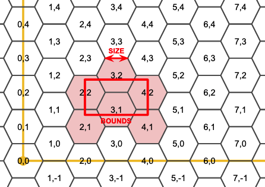

# Crunchy Spatial: Tile Serving with Dynamic Geometry

In our [previous posting]() on tile serving, we showed off how [pg_tileserv](https://access.crunchydata.com/documentation/pg_tileserv/) can use database functions to generate tiles by querying existing tables with user parameters.

We can also use functions to build geometry on the fly without input from tables. For example, hexagons!


Hexagons are a favourite input for visualizations, because they have a nice symmetric shape and provide equal areas for summarization. 

### Hexagonal Grid

A filling of the plane with hexagons is a hexagonal grid. Curiously, it's possible to address any hexagon in the grid with a two-dimensional coordinate, just like with a square grid, the only difference being that every second column of the hexgrid is offset one-half a hexagon vertically.



### Generating a Hexagon

To build a hexagonal tiling we need a function that produces an arbitrary hexagon in a hexagon grid, like this.

```sql
CREATE OR REPLACE
FUNCTION hexagon(i integer, j integer, edge float8)
RETURNS geometry
AS $$
DECLARE
h float8 := edge*cos(pi()/6.0);
cx float8 := 1.5*i*edge;
cy float8 := h*(2*j+abs(i%2));
BEGIN
RETURN ST_MakePolygon(ST_MakeLine(ARRAY[
            ST_MakePoint(cx - 1.0*edge, cy + 0),
            ST_MakePoint(cx - 0.5*edge, cy + -1*h),
            ST_MakePoint(cx + 0.5*edge, cy + -1*h),
            ST_MakePoint(cx + 1.0*edge, cy + 0),
            ST_MakePoint(cx + 0.5*edge, cy + h),
            ST_MakePoint(cx - 0.5*edge, cy + h),
            ST_MakePoint(cx - 1.0*edge, cy + 0)
        ]));
END;
$$
LANGUAGE 'plpgsql'
IMMUTABLE
STRICT
PARALLEL SAFE;
```

Any unique edge length produces a unique gridding of the plane, so to build a hexagon, we need both the hexagon coordinates, and the edge length that defines the plane.

### Filling a Tile with Hexagons

Each tile will need to know what hexagons to generate, from the overall hexagon grid, so we also need a function that can take a tile extent and figure out which hexagons fall inside the grid.

```sql
CREATE OR REPLACE
FUNCTION hexagoncoordinates(bounds geometry, edge float8,
                            OUT i integer, OUT j integer)
RETURNS SETOF record
AS $$
    DECLARE
        h float8 := edge*cos(pi()/6);
        mini integer := floor(st_xmin(bounds) / (1.5*edge));
        minj integer := floor(st_ymin(bounds) / (2*h));
        maxi integer := ceil(st_xmax(bounds) / (1.5*edge));
        maxj integer := ceil(st_ymax(bounds) / (2*h));
    BEGIN
    FOR i, j IN
    SELECT a, b
    FROM generate_series(mini, maxi) a,
         generate_series(minj, maxj) b
    LOOP
        RETURN NEXT;
    END LOOP;
    END;
$$
LANGUAGE 'plpgsql'
IMMUTABLE
STRICT
PARALLEL SAFE;
```

This set-returning function produces all the hexagon coordinates that interact with a bounds in the hex plane.

So, for example, given the bounds of a tile, it generates a set of records with hex coordinates:

```sql
SELECT * FROM hexagoncoordinates(ST_TileEnvelope(15, 1, 1), 1000.0);
```
```
   i    |   j
--------+-------
 -13358 | 11567
 -13358 | 11568
 -13357 | 11567
 -13357 | 11568
 -13356 | 11567
 -13356 | 11568
```

### Generating Hexagons for Any Tile

Remember, for `pg_tileserv` to publish a function as a tile set, the function needs to take in the tile coordinates (x, y and zoom) as well as any other user parameters (in our case, a "step") parameter. 

The "step" parameter just controls the hexagon edge size, as a function of the tile width. A "step" of 1 implies an edge size 1/2 of the tile size; a "step" of 2 implies an edge size 1/4 of the tile size, and so on.

```sql
CREATE OR REPLACE
FUNCTION tilehexagons(z integer, x integer, y integer, step integer,
                      OUT geom geometry(Polygon, 3857), OUT i integer, OUT j integer)
RETURNS SETOF record
AS $$
    DECLARE
        bounds geometry;
        maxbounds geometry := ST_TileEnvelope(0, 0, 0);
        edge float8;
    BEGIN
    bounds := ST_TileEnvelope(z, x, y);
    edge := (ST_XMax(bounds) - ST_XMin(bounds)) / pow(2, step);
    FOR geom, i, j IN
    SELECT ST_SetSRID(hexagon(h.i, h.j, edge), 3857), h.i, h.j
    FROM hexagoncoordinates(bounds, edge) h
    LOOP
        IF maxbounds ~ geom AND bounds && geom THEN
            RETURN NEXT;
        END IF;
    END LOOP;
    END;
$$
LANGUAGE 'plpgsql'
IMMUTABLE
STRICT
PARALLEL SAFE;
```

### Generating the Tile

Now that we can generate a set of hexagons for any tile coordinate, we just need a function that wraps up those hexagons in an MVT format for output.

```sql
CREATE OR REPLACE
FUNCTION public.hexagons(z integer, x integer, y integer, step integer default 4)
RETURNS bytea
AS $$
WITH
bounds AS (
    -- Convert tile coordinates to web mercator tile bounds
    SELECT ST_TileEnvelope(z, x, y) AS geom
),
rows AS (
    -- All the hexes that interact with this tile
    SELECT h.i, h.j, h.geom
    FROM TileHexagons(z, x, y, step) h
),
mvt AS (
    -- Usual tile processing, ST_AsMVTGeom simplifies, quantizes,
    -- and clips to tile boundary
    SELECT ST_AsMVTGeom(rows.geom, bounds.geom) AS geom,
           rows.i, rows.j
    FROM rows, bounds
)
-- Generate MVT encoding of final input record
SELECT ST_AsMVT(mvt, 'public.hexagons') FROM mvt
$$
LANGUAGE 'sql'
STABLE
STRICT
PARALLEL SAFE;

COMMENT ON FUNCTION public.hexagons IS 'Hex coverage dynamically generated. Step parameter determines how approximately many hexes (2^step) to generate per tile.';
```

The result is an infinitely zoomable hexagon grid that is generated on-the-fly. 


