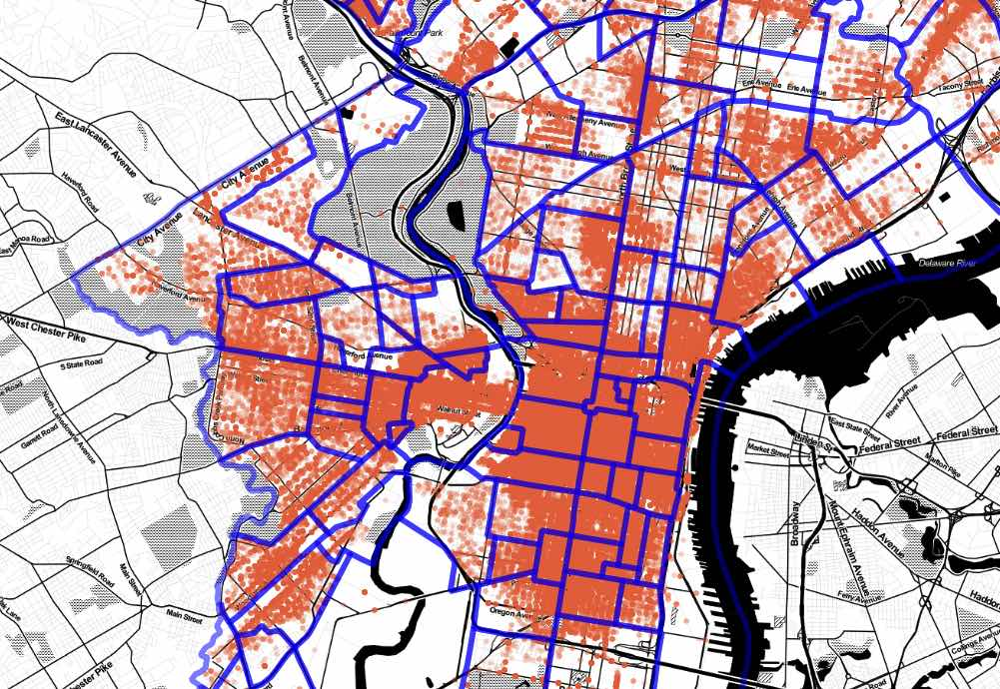
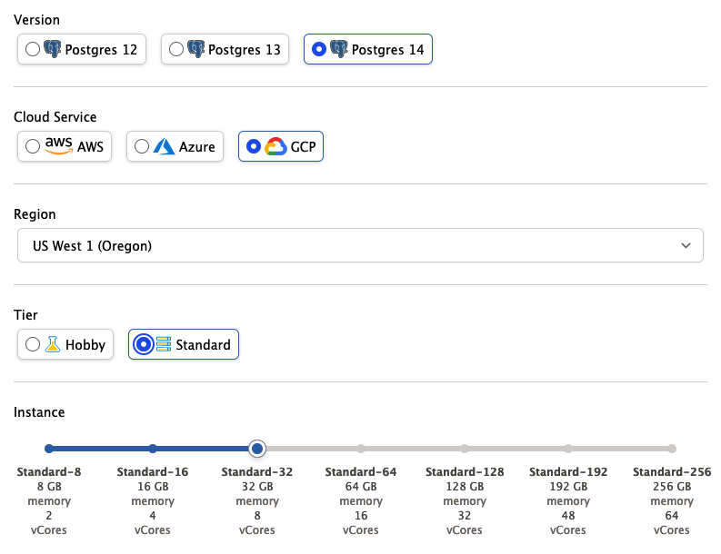
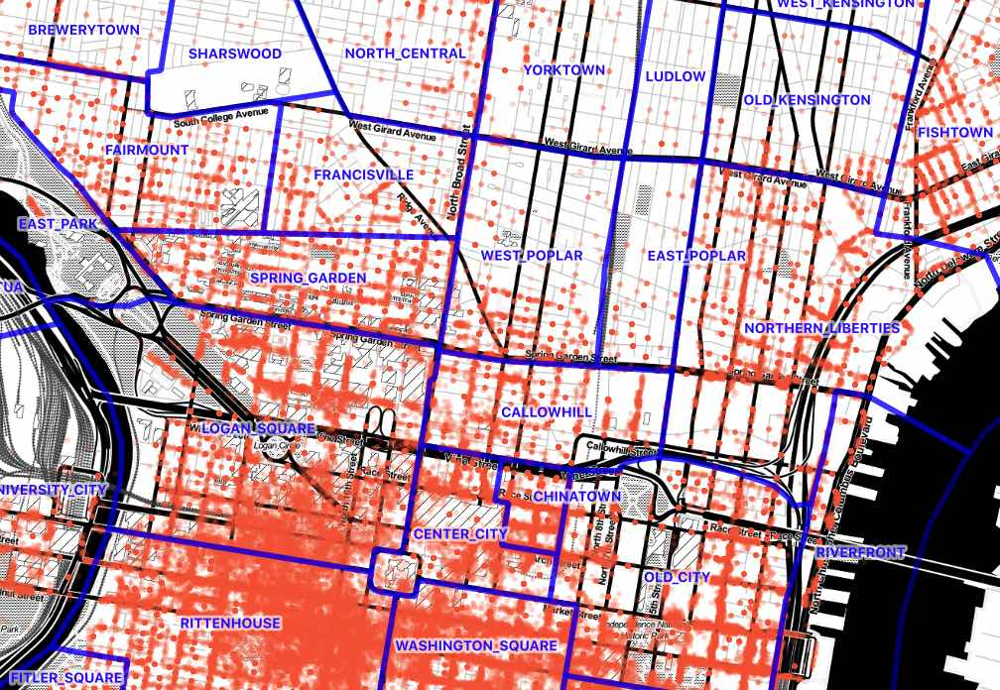

# PostGIS vs GPU: Performance and Spatial Joins

Every once and a while, a post shows up online about someone using GPUs for common spatial analysis tasks, and I get a burst of techno-enthusiasm. Maybe this is truly the new way! 

This week it was [a post on GPU-assisted spatial joins](https://medium.com/swlh/how-to-perform-fast-and-powerful-geospatial-data-analysis-with-gpu-48f16a168b10) that caught my eye. In summary, the author took a 9M record set of [parking infractions data](https://www.opendataphilly.org/dataset/parking-violations) from Philadelphia and joined it to a 150 record set of [Philadelphia neighborhoods](https://www.opendataphilly.org/dataset/philadelphia-neighborhoods). The process involved building up a little execution engine in Python, and was pretty manual, but certainly fast.



I wondered: just how bad would execution on a boring environment like PostGIS be, in comparison?

Follow along, if you like!

## Server Setup

I grabbed an 8-core cloud server with PostgreSQL 14 and PostGIS 3 from [Crunchy Bridge DBaaS](https://crunchybridge.com), like so:



## Data Download

Then I pulled down the data.

```bash
#
# Download Philadelphia parking infraction data 
#
curl "https://phl.carto.com/api/v2/sql?filename=parking_violations&format=csv&skipfields=cartodb_id,the_geom,the_geom_webmercator&q=SELECT%20*%20FROM%20parking_violations%20WHERE%20issue_datetime%20%3E=%20%272012-01-01%27%20AND%20issue_datetime%20%3C%20%272017-12-31%27" > phl_parking.csv

#
# Download Philadelphia neighborhoods
#
wget https://github.com/azavea/geo-data/raw/master/Neighborhoods_Philadelphia/Neighborhoods_Philadelphia.zip

#
# Convert neighborhoods file to SQL
#
unzip Neighborhoods_Philadelphia.zip
shp2pgsql -s 102729 -D Neighborhoods_Philadelphia phl_hoods > phl_hoods.sql

# Connect to database
# (get the DATABASE_URL from the Crunchy Bridge UI)
psql $DATABASE_URL
```

## Data Loading and Preparation

Then I loaded the CSV and SQL data files into the database.

```sql
-- Set up PostGIS
CREATE EXTENSION postgis;

-- Read in the neighborhoods SQL file
\i phl_hoods.sql

-- Reproject the neighborhoods to EPSG:4326 to match the
-- parking data
ALTER TABLE phl_hoods 
  ALTER COLUMN geom 
  TYPE Geometry(multipolygon, 4326) 
  USING st_transform(geom, 4326);

-- Create parking infractions table
CREATE TABLE phl_parking (
    anon_ticket_number integer,
    issue_datetime timestamptz,
    state text,
    anon_plate_id integer,
    division text,
    location text,
    violation_desc text,
    fine float8,
    issuing_agency text,
    lat float8,
    lon float8,
    gps boolean,
    zip_code text
    );

-- Read in the parking data
\copy phl_parking FROM 'phl_parking.csv' WITH (FORMAT csv, HEADER true);
```

This is the first step that takes any time. Reading in the 9M records from CSV takes about **29 seconds**.

Because the parking data lacks a geometry column, I create a second table that **does** have a geometry column, and then index that.

```sql
CREATE TABLE phl_parking_geom AS
  SELECT anon_ticket_number, 
    ST_SetSRID(ST_MakePoint(lon, lat), 4326) AS geom 
  FROM phl_parking ;

ANALYZE phl_parking_geom;
```

Making a second copy while creating a geometry column takes about **24 seconds**.

Finally, to carry out a spatial join, I will need a spatial index on the parking points. In this case I follow my advice about [when to use different spatial indexes](https://blog.crunchydata.com/blog/the-many-spatial-indexes-of-postgis) and build an "spgist" index on the geometry.

```sql
CREATE INDEX phl_parking_geom_spgist_x 
  ON phl_parking_geom USING spgist (geom);
```

This is the longest process, and takes about **60 seconds**.

## Running the Query

The spatial join query is a simple inner join using [ST_Intersects](https://postgis.net/docs/ST_Intersects.html) as the join condition.

```sql
SELECT h.name, count(*) 
  FROM phl_hoods h
  JOIN phl_parking_geom p
    ON ST_Intersects(h.geom, p.geom)
  GROUP BY h.name;
```

Before running it, though, I took a look at the `EXPLAIN` output for the query, which is this.

```
 HashAggregate  (cost=4031774.83..4031776.41 rows=158 width=20)
   Group Key: h.name
   ->  Nested Loop  (cost=0.42..4024339.19 rows=1487128 width=12)
         ->  Seq Scan on phl_hoods h  (cost=0.00..30.58 rows=158 width=44)
         ->  Index Scan using phl_parking_geom_spgist_x on phl_parking_geom p  
             (cost=0.42..25460.90 rows=941 width=32)
               Index Cond: (geom && h.geom)
               Filter: st_intersects(h.geom, geom)
```

This is all very good, a nested loop on the smaller neighborhood table against the large indexed parking table, **except for one thing**: I spun up an **8 core server** and my plan has no parallelism! 

What is up?

```sql
SHOW max_worker_processes;            -- 8
SHOW max_parallel_workers;            -- 8
SHOW max_parallel_workers_per_gather; -- 2
SHOW min_parallel_table_scan_size;    -- 8MB
```

Aha! That minimum table size for parallel scans seems large compared to our neighborhoods table.

```sql
SELECT pg_relation_size('phl_hoods'); 

-- 237568
```

Yep! So, first we will set the `min_parallel_table_scan_size` to 1kb, and then increase the `max_parallel_workers_per_gather` to 8 and see what happens.

```sql
SET max_parallel_workers_per_gather = 8;
SET min_parallel_table_scan_size = '1kB';
```

The `EXPLAIN` output for the spatial join now parallelized, but unfortunately only to **4 workers**.

```
 Finalize GroupAggregate  (cost=1319424.81..1319505.22 rows=158 width=20)
   Group Key: h.name
   ->  Gather Merge  (cost=1319424.81..1319500.48 rows=632 width=20)
         Workers Planned: 4
         ->  Sort  (cost=1318424.75..1318425.14 rows=158 width=20)
               Sort Key: h.name
               ->  Partial HashAggregate  
                   (cost=1318417.40..1318418.98 rows=158 width=20)
                     Group Key: h.name
                     ->  Nested Loop  
                         (cost=0.42..1018842.71 rows=59914937 width=12)
                           ->  Parallel Seq Scan on phl_hoods h  
                               (cost=0.00..29.39 rows=40 width=1548)
                           ->  Index Scan using phl_parking_geom_spgist_x 
                               on phl_parking_geom p  
                               (cost=0.42..25460.92 rows=941 width=32)
                                 Index Cond: (geom && h.geom)
                                 Filter: st_intersects(h.geom, geom)
```

Now we still get a nested loop join on neighborhoods, but this time the planner recognizes that it can scan the table in parallel. Since the spatial join is fundamentally **CPU bound** and not **I/O bound** this is a much better plan choice.

```sql
SELECT h.name, count(*) 
  FROM phl_hoods h
  JOIN phl_parking_geom p
    ON ST_Intersects(h.geom, p.geom)
  GROUP BY h.name;
```

The final query running with 4 workers takes **24 seconds** to execute the join of the 9 million parking infractions with the 150 neighborhoods.



This is pretty good!

Is it faster than the GPU though? No, the GPU post says his custom python/GPU solution took just 8 seconds to execute. Still, the differences in environment are important:

* The data in PostgreSQL is fully editable in place, by multiple users and applications.
* The execution plan in PostgreSQL is automatically optimized. If the next query involves neighborhood names and plate numbers, it will be just as fast and involve no extra custom code.
* The PostGIS engine is cabaple of answering 100s of other spatial questions about the database.
* With a web service like [pg_tileserv](https://github.com/crunchydata/pg_tileserv) or [pg_featureserv](https://github.com/crunchydata/pg_featureserv), the data are immediately publishable and remote queryable.

## Conclusion

Basically, it is very hard to beat a bespoke performance solution with a general purpose tool, but PostgreSQL/PostGIS comes within "good enough" range of a high end GPU solution, so that counts as a "win" to me.


