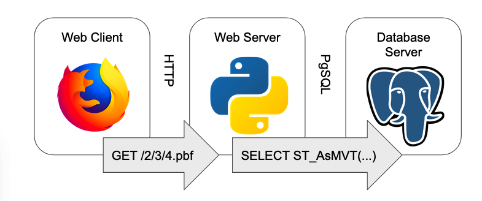
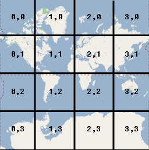
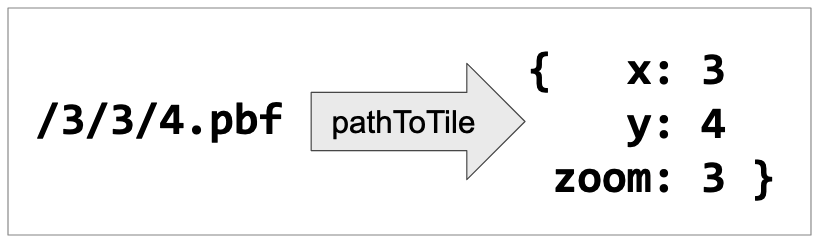
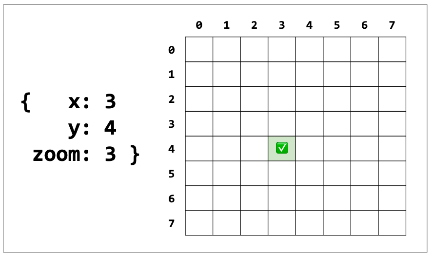
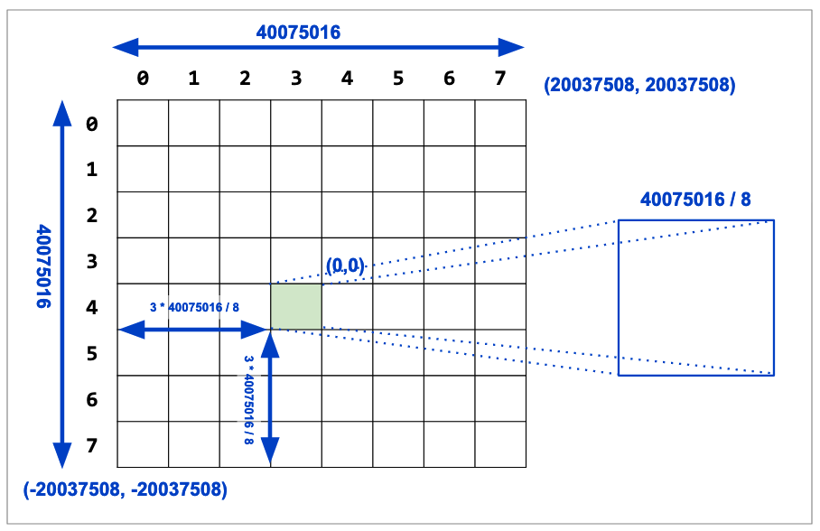
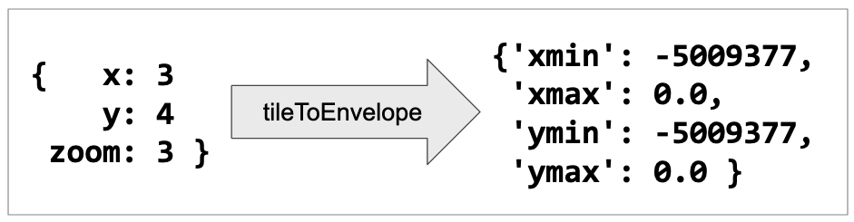
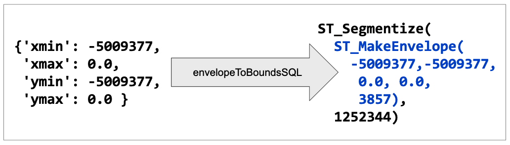
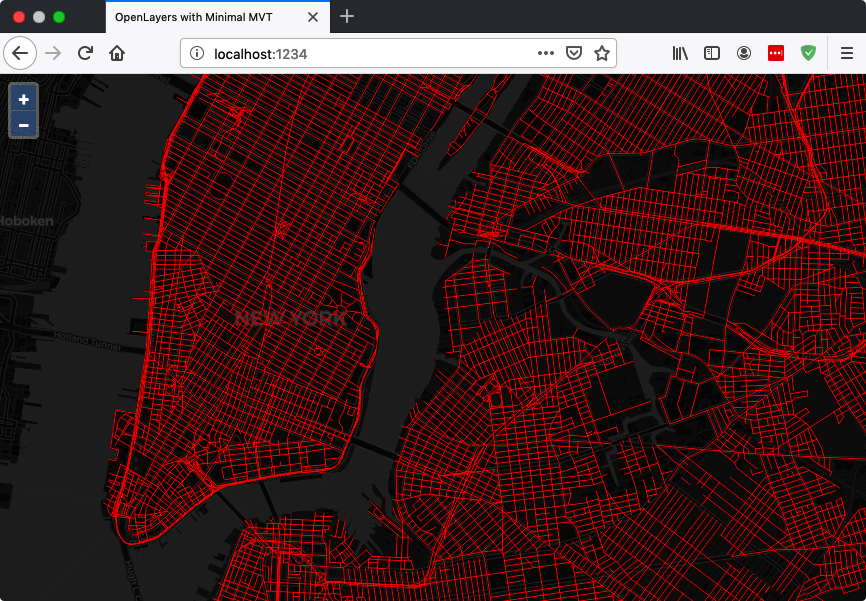

# Dynamic Vector Tiles from PostGIS

One of the most popular features of PostGIS 2.5 was the introduction of the "vector tile" output format, via the [ST_AsMVT()](https://postgis.net/docs/ST_AsMVT.html) function.

Vector tiles are a transport format for efficiently sending map data from a server to a client for rendering. The [vector tile specification](https://docs.mapbox.com/vector-tiles/specification/) describes how raw data are quantized to a grid and then compressed using delta-encoding to make a very small package.

Prior to [ST_AsMVT()](https://postgis.net/docs/ST_AsMVT.html), if you wanted to produce vector tiles from PostGIS you would use a rendering program ([MapServer](https://mapserver.org), [GeoServer](htts://geoserver.org), or [Mapnik](htts://mapnik.org)) to read the raw data from the database, and process it into tiles.

## Minimal Tile Architecture

With [ST_AsMVT()](https://postgis.net/docs/ST_AsMVT.html) it is now possible to move all that processing into the database, which opens up the possibility for very lightweight tile services that do little more than convert map tile requests into SQL for the database engine to execute.



There are already several examples of such light-weight services.

* [Dirt-Simple PostGIS HTTP API](https://github.com/tobinbradley/dirt-simple-postgis-http-api)
* [Postile](https://github.com/Oslandia/postile)
* [Martin](https://github.com/urbica/martin)

However, for learning purposes, here's a short example that builds up a tile server and map client from scratch. 

* [Minimal MVT Server](https://github.com/pramsey/minimal-mvt)

This minimal tile server is in Python, but there's no reason you couldn't execute one in any language you like: it just has to be able to connect to PostgreSQL, and run as an HTTP service.

## What are Tiles

A digital map is theoretically capable of viewing data at any scale, and for any region of interest. Map tiling is a way of constraining the digital mapping problem, just a little, to vastly increase the speed and efficiency of map display. 

* Instead of supporting any scale, a tiled map only provides a limited collection of scales, where each scale is a factor of two more detailed than the previous one.
* Instead of rendering data for any region of interest, a tiled map only renders it over a fixed grid within the scale, and composes arbitrary regions by displaying appropriate collections of tiles.


Most tile maps divide the world by starting with a single tile that encompasses the entire world, and calls that "zoom level 0". From there, each succeeding "zoom level" increases the number of tiles by a factor of 4 (twice as many vertically and twice and many horizontally).

## Tile Coordinates

Any tiles in a tiled map can be addressed by referencing the zoom level it is on, and its position horizontally and vertically in the tile grid.  The commonly used "XYZ" addressing scheme counts from zero, with the origin at the top left.

This example is for zoom level 2 (`2^zoom = 4` tiles per size).



The web addresses of tiles in the "XYZ" scheme embed the "zoom", "x" and "y" coordinates into a web address: `http://server/{z}/{x}/{y}.format`

For example, you can see the tile that encompasses Australia  (zoom=2, x=3, y=2) in the tilesets of a number of map providers:

* https://tile.openstreetmap.org/2/3/2.png
* http://a.basemaps.cartocdn.com/light_all/2/3/2.png
* http://a.tile.stamen.com/toner/2/3/2.png

## ST_AsMVTGeom() and ST_AsMVT()

Building a map tile involves feeding data through not one, but two PostGIS functions: 

* [ST_AsMVTGeom()](https://postgis.net/docs/ST_AsMVTGeom.html)
* [ST_AsMVT()](https://postgis.net/docs/ST_AsMVT.html)

Vector features in a MVT map tile are highly processed, and the [ST_AsMVTGeom()](https://postgis.net/docs/ST_AsMVTGeom.html) performs that processing:

* clip the features to the tile boundary;
* translate from cartesian coordinates (relative to geography) to image coordinates (relative to top left of image); 
* remove extra vertices that will not be visible at tile resolution; and,
* quantize coordinates from double precision to the tile resolution in integers.

So any query to generate MVT tiles will involve a call to [ST_AsMVTGeom()](https://postgis.net/docs/ST_AsMVTGeom.html) to condition the data first, something like:

```sql
SELECT ST_AsMVTGeom(geom) AS geom, column1, column2
FROM myTable
```

The MVT format can encode both geometry and attribute information, in fact that is one of the things that makes it so useful: client-side interactions can be much richer when both attributes and shapes are available on the client. 

In order to create tiles with geometry and attributes, [ST_AsMVT()](https://postgis.net/docs/ST_AsMVT.html) function takes in a record type. So SQL calls that create tiles end up looking like this:

```sql
SELECT ST_AsMVT(mvtgeom.*)
FROM (
  SELECT ST_AsMVTGeom(geom) AS geom, column1, column2
  FROM myTable
) mvtgeom
```

We'll see this pattern again as we build out the SQL queries generated by the tile server.

## Tile Server

The job of our [minimal web tile server](https://github.com/pramsey/minimal-mvt/blob/master/minimal-mvt.py) is to convert from tile coordinates, to a SQL query that creates an equivalent vector tile.

First the [pathToTile](https://github.com/pramsey/minimal-mvt/blob/8b736e342ada89c5c2c9b1c77bfcbcfde7aa8d82/minimal-mvt.py#L36-L45) function strips out the x, y and z components from the request.



Then [tileIsValid](https://github.com/pramsey/minimal-mvt/blob/8b736e342ada89c5c2c9b1c77bfcbcfde7aa8d82/minimal-mvt.py#L48-L60) confirms that the values make sense. Each zoom level can only have tile coordinates between `0` and `2^zoom - 1` so we check that values are in range.



"XYZ" tile maps are usually in a projection called "[spherical mercator](https://epsg.io/3857)" that has the nice property of forming a neat square, about 40M meters on a side, over (most of) the earth at zoom level zero. 



From that square starting point, [tileToEnvelope](https://github.com/pramsey/minimal-mvt/blob/8b736e342ada89c5c2c9b1c77bfcbcfde7aa8d82/minimal-mvt.py#L48-L60) subdivides it to to find the size of a tile at the requested zoom level, and then the coordinates of the tile in the mercator projection.



Now we can start constructing the SQL to generate the MVT format tile. First with [envelopeToBoundsSQL](https://github.com/pramsey/minimal-mvt/blob/8b736e342ada89c5c2c9b1c77bfcbcfde7aa8d82/minimal-mvt.py#L84-L91) converts our envelope in python into SQL that will generate an equivalent envelope in the database we can use to query and clip the raw data.



With the bounds SQL we are now ready to calculate the full MVT-generating SQL statement in [envelopeToSQL](https://github.com/pramsey/minimal-mvt/blob/8b736e342ada89c5c2c9b1c77bfcbcfde7aa8d82/minimal-mvt.py#L94-L116):

```sql
WITH 
bounds AS (
    SELECT {env} AS geom, 
           {env}::box2d AS b2d
),
mvtgeom AS (
    SELECT ST_AsMVTGeom(ST_Transform(t.{geomColumn}, 3857), bounds.b2d) AS geom, 
           {attrColumns}
    FROM {table} t, bounds
    WHERE ST_Intersects(t.{geomColumn}, ST_Transform(bounds.geom, {srid}))
) 
SELECT ST_AsMVT(mvtgeom.*) FROM mvtgeom
```

And finally run the SQL against the database in [sqlToPbf](https://github.com/pramsey/minimal-mvt/blob/8b736e342ada89c5c2c9b1c77bfcbcfde7aa8d82/minimal-mvt.py#L119-L137) and return the MVT as a byte array.

That's it! The main HTTP [do_GET](https://github.com/pramsey/minimal-mvt/blob/8b736e342ada89c5c2c9b1c77bfcbcfde7aa8d82/minimal-mvt.py#L140-L159) callback for the script just runs those functions in order and sends the result back.

```python
    # Handle HTTP GET requests
    def do_GET(self):

        tile = self.pathToTile(self.path)
        if not (tile and self.tileIsValid(tile)):
            self.send_error(400, "invalid tile path: %s" % (self.path))
            return

        env = self.tileToEnvelope(tile)
        sql = self.envelopeToSQL(env)
        pbf = self.sqlToPbf(sql)

        self.log_message("path: %s\ntile: %s\n env: %s" % (self.path, tile, env))
        self.log_message("sql: %s" % (sql))
        
        self.send_response(200)
        self.send_header("Access-Control-Allow-Origin", "*")
        self.send_header("Content-type", "application/vnd.mapbox-vector-tile")
        self.end_headers()
        self.wfile.write(pbf)
```

Now we have a python client we can run that will convert HTTP tile requests into MVT-tile responses directly from the database.

```
http://localhost:8080/4/3/4.mvt
```

## Map Client

Now that tiles are published, we can add our live tile layer to any web map that supports MVT format. Two of the most popular are

* [OpenLayers](https://openlayers.org), and
* [Mapbox GL JS](https://docs.mapbox.com/mapbox-gl-js/overview/).

Map clients convert the state of a map windows into HTTP requests for tiles to fill up a map window. If you've used a modern web map, like Google Maps, you've used a standard web map -- they all work the same way.



### OpenLayers

The [OpenLayers](https://openlayers.org) map client has been built out using the [NPM](https://www.npmjs.com/) module system, and can be installed into an NPM development environment as easily as:

```
npm install ol
```

The [example OpenLayers map for this post](https://github.com/pramsey/minimal-mvt/tree/master/map-openlayers) combines a standard raster base layer with an [active layer](https://github.com/pramsey/minimal-mvt/blob/8b736e342ada89c5c2c9b1c77bfcbcfde7aa8d82/map-openlayers/index.js#L13-L25) from a PostgreSQL database accessed via our tile server.

```js
var vtLayer = new VectorTileLayer({
  declutter: false,
  source: new VectorTileSource({
    format: new MVT(),
    url: 'http://localhost:8080/{z}/{x}/{y}.pbf'
  }),
  style: new Style({
      stroke: new Stroke({
        color: 'red',
        width: 1
      })
  })
});
```

### Mapbox GL JS

The [Mapbox GL JS](https://docs.mapbox.com/mapbox-gl-js/overview/) is more tightly bound to the Mapbox ecosystem, but can be run without using Mapbox services or a Mapbox API key.

The [example Mapbox map for this post](https://github.com/pramsey/minimal-mvt/blob/8b736e342ada89c5c2c9b1c77bfcbcfde7aa8d82/map-mapboxgl/index.html#L35-L40) can be run directly without any special development steps. The main challenge in composing a map with Mapbox GL JS is understanding the [style language](https://docs.mapbox.com/mapbox-gl-js/style-spec) that is used to specify both map composition and the styling of vector data in the map.


