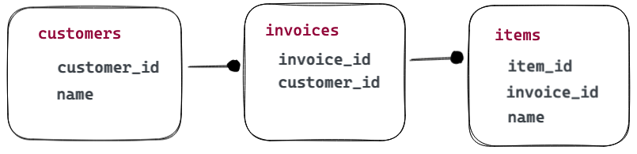

# SQL Tricks for More Effective CRUD

Over and over when I look at applications for performance, the lesson I learn and re-learn is, **do more things right inside the database**.

## What's CRUD?

Create, read, update, delete! All the things you do to a table or collection of tables to work with your ever-changing data.

Most CRUD examples, and most CRUD thinking, tends to focus on one table at a time. That's easy to understand. It's also unrealistic. Even the simplest application will be working with several interlinked normalized tables.

Here's our working example tables.



<details><summary>SQL to Create Tables</summary>

```sql
DROP TABLE customers, invoices, items;

CREATE TABLE customers (
    customer_id SERIAL PRIMARY KEY,
    name TEXT NOT NULL UNIQUE
    );

CREATE TABLE invoices (
    invoice_id SERIAL PRIMARY KEY,
    customer_id BIGINT REFERENCES customers (customer_id)
    );

CREATE TABLE items (
    item_id SERIAL PRIMARY KEY,
    invoice_id BIGINT REFERENCES invoices (invoice_id),
    name TEXT NOT NULL
    );
```

</details>

## Very Simple CRUD

Use of SQL for data management often begins and ends with SQL commands that work on only one table at a time. For example, populating our `customers` table.

```sql
INSERT INTO customers (name) VALUES ('Ben');
```

Did you know you can populate multiple records from a single insert statement? This has a bunch of performance benefits: 

* the server only has to figure out the columns and column types once, and that overhead is shared over all the data rows inserted
* there is only one transaction block for the whole insert, to again the overhead is shared over multiple rows
* you look super cool when you do this!

```sql
INSERT INTO customers (name) 
    VALUES ('Peter'), ('Paul'), ('Mary');
```

For updates and deletes, again the common practice is to work a row at a time, a table at a time.

```sql
UPDATE customers 
  SET name = 'Jen'
  WHERE name = 'Ben';

DELETE FROM customers 
  WHERE name = 'Jen';
```

## Super Complex CRUD

One of the complexities/annoyances of filling out a normalized relational model is getting the keys to neatly match up across multiple tables. 

Usually the model uses a `serial` key to auto-populate the primary keys, but that means the fresh keys for new rows have to be read back somehow when creating other rows that reference the key.

Here's a query that both creates an invoice, and also adds in some items that refer to that invoice, in a single SQL call.

Note the use of the [RETURNING](https://www.postgresql.org/docs/current/sql-insert.html) clause, to get back a result set of, in this case, all the newly created `invoice_id` keys.

```sql

WITH new_invoice AS (
    -- Add a fresh invoice and return the newly created id
    INSERT INTO invoices (customer_id) 
        SELECT customer_id FROM customers WHERE name = 'Mary'
        RETURNING invoice_id
)
-- Add the items, using the new invoice id
INSERT INTO items (name, invoice_id) 
    SELECT n.name, new_invoice.invoice_id
    FROM new_invoice 
    CROSS JOIN 
    (VALUES ('Purple Automobile'), 
            ('Yellow Automobile')) AS n(name);
```

I'm going to leverage `RETURNING` and arrays to quickly fill in data for all the customers.

<details><summary>Crazy SQL to Populate Tables</summary>

```sql
WITH i AS (
    -- Insert three new invoices for each customer
    -- returning the invoice_id for each one
    INSERT INTO invoices (customer_id)
        SELECT customer_id 
        FROM customers
        CROSS JOIN generate_series(1,3)
        RETURNING invoice_id
)
-- Insert three new items for each invoice
-- Each items is a "colored vehicle", with a
-- distinct color for each item on an invoice, 
-- and a single kind of vehicle for each invoice
INSERT INTO items (invoice_id, name)
    SELECT i.invoice_id, 
        Format('%s %s', 
            c, 
            (ARRAY['Train', 'Plane', 'Automobile'])[i.invoice_id % 3 + 1]) AS name
    FROM unnest(ARRAY['Red', 'Blue', 'Green']) AS c
    CROSS JOIN i;
```

</details>

## Read!

Joining together the tables to read out results can be done really tersely with the PostgreSQL `USING` clause for the joins. The `USING` clause is available when the source and target join tables use the same column name for the join key.

```sql
SELECT * 
FROM customers
JOIN invoices USING (customer_id)
JOIN items USING (invoice_id)
WHERE customers.name = 'Paul'
ORDER BY customers.name, invoice_id;
```

We can see from this query that Paul is really into automobiles, and that he buys one of each color, on each invoice.

```
 invoice_id | customer_id | name | item_id |       name       
------------+-------------+------+---------+------------------
          2 |           2 | Paul |      11 | Blue Automobile
          2 |           2 | Paul |       2 | Red Automobile
          2 |           2 | Paul |      20 | Green Automobile
          5 |           2 | Paul |      14 | Blue Automobile
          5 |           2 | Paul |       5 | Red Automobile
          5 |           2 | Paul |      23 | Green Automobile
          8 |           2 | Paul |       8 | Red Automobile
          8 |           2 | Paul |      26 | Green Automobile
          8 |           2 | Paul |      17 | Blue Automobile
```

In fact, Peter, Paul and Mary are all collecting different kinds of vehicles.

```sql
SELECT DISTINCT 
    customers.name, 
    split_part(items.name, ' ', 2) AS vehicle
FROM customers
JOIN invoices USING (customer_id)
JOIN items USING (invoice_id);
```

```
 name  |  vehicle   
-------+------------
 Paul  | Automobile
 Peter | Plane
 Mary  | Train
```

Do you need to do joins to get these answers? No, you could pull all the records out into your client program and summarize them there with client logic, but it would be a **lot slower**. 

Keeping the logic inside the database allows the system to plan the fastest execution of the query, and avoids a lot of network transport overhead and chatter, which is very expensive.


## Update!

OK, now want to change the color of all Mary's blue items to purple! 

The "one table at a time" method might be:

* Begin a SQL transaction
* Query the `customers` table to get Mary's `customer_id`
* Query the `invoices` table to get all the `invoice_id` associated with Mary
* Update the `items` table to flip all the blue items to purple for Mary's invoices.
* Commit the transaction

But that's three queries! Just intuitively, it will be slower than one query, so what do a single query look like?

```sql
-- Target table to change
UPDATE items
-- Change to apply to target rows
SET name = replace(items.name, 'Blue', 'Purple')
-- Other relations to use in finding target rows
FROM customers, invoices
-- Restriction on relations to find just target rows
WHERE customers.customer_id = invoices.customer_id
AND invoices.invoice_id = items.invoice_id
AND customers.name = 'Mary'
AND items.name ~ '^Blue';
```

The main challenge is relating the `items` to the customer "Mary" which is way over in the `customers` table. But by adding the `customers` and `invoices` table, we can build a path from "Mary" to her items, and then restrict the target rows to just the blue items.

## Delete!

Peter has gone off the color red, so we are going to remove the red items from just his invoices.

Just as with the update problem, we could multi-step the problem: find Peter's `customer_id`, find associated invoices, find associated items, delete the red ones. But that would be silly, it can all be done in one step.

```sql
DELETE FROM items
USING invoices, customers
WHERE items.invoice_id = invoices.invoice_id
AND invoices.invoice_id = customers.customer_id
AND customers.name = 'Peter'
AND items.name ~ 'Red';
```

The SQL keywords are a little different (`DELETE` specifies non-target relations with the `USING` keywork, while `UPDATE` uses `FROM`) but the principle is identical. 

Identify the relations needed to connect the filters you want to apply (in this case, a customer of "Peter" and an item name that starts with "Red") and then join those relations together via their foreign keys in the `WHERE` clause.

## Conclusion

* Doing things in the database is faster!
  * The database knows more about the data, thanks to planner statistics and other metadata.
  * The database is closer to the data than any client program.
  * Getting data to client programs is costly.
  * The database is happy to work on full relations and affect multiple records at a time. That's faster than one-at-a-time logic in a client.


  


