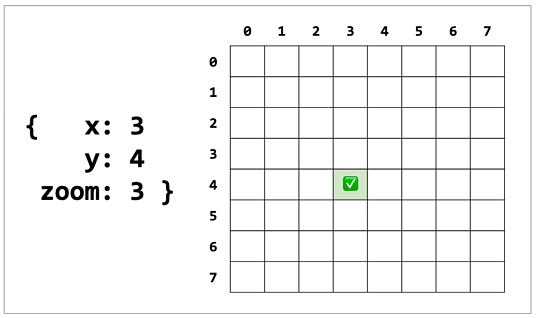
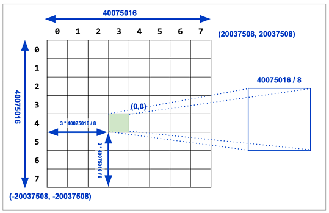

# Waiting for PostGIS 3: ST_TileEnvelope(z,x,y)

With the availability of [MVT tile format](https://docs.mapbox.com/vector-tiles/specification/) in PostGIS via [ST_AsMVT()](https://postgis.net/docs/ST_AsMVT.html), more and more people are generating tiles directly from the database. Doing so usually involves a couple common steps:

* exposing a tiled [web map API](https://en.wikipedia.org/wiki/Tiled_web_map) over HTTP
* converting tile coordinates to ground coordinates to drive tile generation

Tile coordinates consist of three values:

* **zoom**, the level of the tile pyramid the tile is from
* **x**, the coordinate of the tile at that zoom, counting from the left, starting at zero
* **y**, the coordinate of the tile at that zoom, counting from the top, starting at zero



Most tile coordinates reference tiles built in the "[spherical mercator](http://epsg.io/3857)" projection, which is a planar project that covers most of the world, albeit with [substantial distance distortions](https://en.wikipedia.org/wiki/Mercator_projection#Distortion_of_sizes) the further north you go.

Knowing the zoom level and tile coordinates, the math to find the tile bounds in web mercator is fairly straightforward.



Most of the people generating tiles from the database write their own [small](https://github.com/CartoDB/cartodb-postgresql/wiki/CDB_XYZ_Extent) [wrapper](https://github.com/mapbox/postgis-vt-util/blob/master/src/TileBBox.sql) to convert from tile coordinate to mercator, as we demonstrated in a [blog post last month](https://info.crunchydata.com/blog/dynamic-vector-tiles-from-postgis). 

It seems duplicative for everyone to do that, so we have added a utility function: [ST_TileEnvelope()](https://postgis.net/docs/manual-dev/ST_TileEnvelope.html)

By default, [ST_TileEnvelope()](https://postgis.net/docs/manual-dev/ST_TileEnvelope.html) takes in **zoom**, **x** and **y** coordinates and generates bounds in Spherical Mercator.

```sql
SELECT ST_AsText(ST_TileEnvelope(3, 4, 2));
```
```
                                      st_astext                                       
--------------------------------------------------------------------------------------
 POLYGON((0 5009377.5,0 10018755,5009377.5 10018755,5009377.5 5009377.5,0 5009377.5))
```

If you need to generate tiles in another coordinate system -- a rare but not impossible use case -- you can swap in a different spatial reference system and tile set bounds via the `bounds` parameter, which can encode both the tile plane bounds and the spatial reference system in a geometry:

```sql
SELECT ST_AsText(ST_TileEnvelope(3, 4, 2, bounds => ST_MakeEnvelope(0, 0, 1000000, 1000000, 3005)));
```

Note that the same tile coordinates generate different bounds -- because the base level tile bounds are different.

```
                                    st_astext                                     
----------------------------------------------------------------------------------
 POLYGON((500000 625000,500000 750000,625000 750000,625000 625000,500000 625000))
```

[ST_TileEnvelope()](https://postgis.net/docs/manual-dev/ST_TileEnvelope.html) will also happily generate non-square tiles, if you provide a non-square bounds. 


