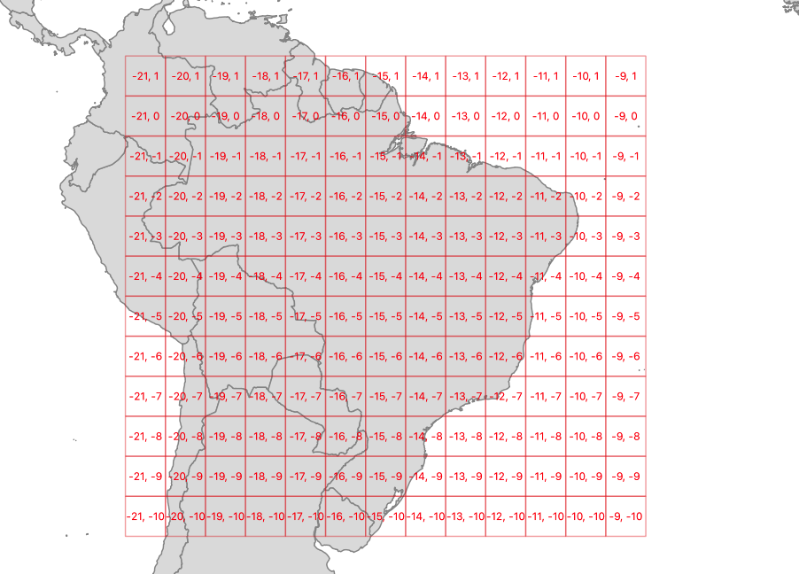
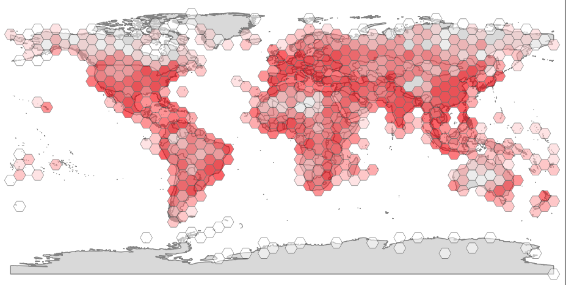

# Waiting for PostGIS 3.1: Grid Generators

Summarizing data against a fixed grid is a common way of preparing data for analysis. Fixed grids have some advantages over natural and administrative boundaries:

* No appeal to higher authorities
* Equal unit areas
* Equal distances between cells
* Good for passing data from the "spatial" computational realm to a "non-spatial" realm

Ideally, we want to be able to generate grids that have some key features:

* Fixed origin point, so that grid can be re-generated and not move
* Fixed cell coordinates for a given cell size, so that the same cell can be referred to just using a cell address, without having to materialize the cell bounds

## ST_SquareGrid()

The [ST_SquareGrid(size, bounds)](https://postgis.net/docs/manual-dev/ST_SquareGrid.html) function generates a grid with an origin at (0, 0) in the coordinate plane, and fills in the square bounds of the provided geometry.

```sql
SELECT (st_squaregrid(400000, st_transform(a.geom, 3857))).* 
FROM admin a  
WHERE name = 'Brazil';
```

So a grid generated using Brazil as the driving geometry looks like this.




## ST_HexagonGrid()

The [ST_HexagonGrid(size, bounds)](https://postgis.net/docs/manual-dev/ST_HexagonGrid.html) function works much the same as the square grid function.

Hexagons are popular for some cartographic display purposes and modeling purposes. Surprisingly the can also be indexed using the same two-dimensional indexing scheme as squares.

The hexagon grid starts with a (0, 0) hexagon centered at the origin, and a gridding for a bounds includes all hexagons that touch the bounds.


As with the square gridding, the coordinates of hexes are fixed for a particular gridding size.

```sql
SELECT (st_squaregrid(100000, st_transform(a.geom, 3857))).* 
FROM admin a  
WHERE name = 'Germany';
```

Here's a 100km gridding of Germany.


## Summarizing with Grids

It's possible to materialize grid-based summaries, without actually materializing the grids, using the generator functions to create the desired grids on-the-fly.

Here's a summary of population points, using a hex grid.

```sql
SELECT sum(pop_max) as pop_max, hexes.geom
FROM
    ST_HexagonGrid(
        4.0,
        ST_SetSRID(ST_EstimatedExtent('places', 'geom'), 4326)
    ) AS hexes
    INNER JOIN
    places AS p
    ON ST_Intersects(p.geom, hexes.geom)
GROUP BY hexes.geom;
```



It's also possible to join up on-the-fly gridding to visualization tools, for very dynamic user experiences, [feeding these dynamically generated grids out to the end user](https://info.crunchydata.com/blog/tile-serving-with-dynamic-geometry) via [pg_tileserv](https://github.com/crunchydata/pg_tileserv).


