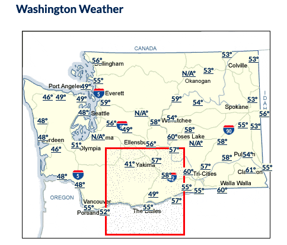
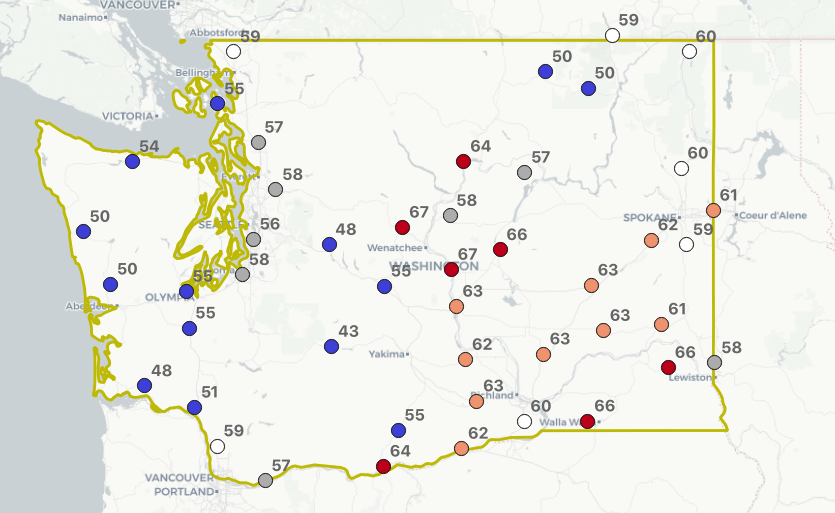
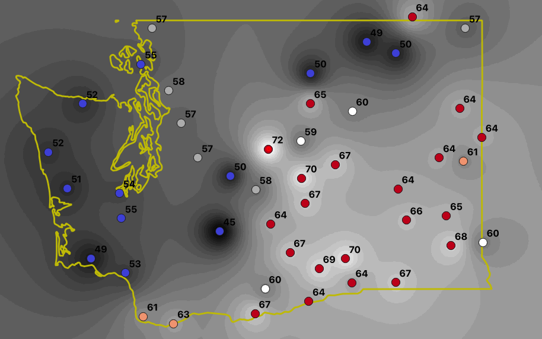

# Waiting for PostGIS 3.2: ST_InterpolateRaster

A common situation in the spatial data world is having discrete measurements of a continuous variable. Every place in the world has a temperature, but there are only a finite number of thermometers: how should we reason about places without thermometers and how should we model temperature?

For many use cases, the right way to model a continuous spatial variable is a raster: a regularly spaced grid where each square in the grid contains a value of the variable. This works for temperature and precipitation; it works for elevation and slope; it even works for travel times and way finding.

For this blog post, we will build up a temperature surface for Washington State, using the discrete temperature measurements of a set of Department of Transportation (WSDoT) weather stations.

## Getting the Data

In conceiving of this post, I envisioned finding a single page with a download of weather stations and associated weather data. Little did I know, few governments assemble that data in a convenient, easy-to-access form.

However, I did find [this old page from the WSDoT](https://wsdot.com/traffic/weather/default.aspx) that has the virtue of being really **fast** to access and actually containing **real-time temperature data**.



Behind the map it turns out the temperature data live as HTML overlays. 


To turn the web data into a temperature table, I created a [Rube Goldberg](https://en.wikipedia.org/wiki/Rube_Goldberg_machine) SQL query, that combines some of my favourite bits and pieces:

* The [pgsql-http extension](https://github.com/pramsey/pgsql-http/) for direct access to HTTP pages inside the database.
* The [regexp_matches()](https://www.postgresql.org/docs/12/functions-string.html#FUNCTIONS-STRING-OTHER) function to parse out the pixel coordinates and temperature values from the page HTML.
* Some dirty math to convert the pixel coordinates into spatial coordinates.
* Lots of [WITH](https://www.postgresql.org/docs/13/queries-with.html) queries to chain it all together.

The final result looks like this:

```sql
CREATE MATERIALIZED VIEW mv_wadot_temp as
-- Read the HTML page from the web server
WITH html AS (
  SELECT content FROM http_get('https://wsdot.com/traffic/weather/default.aspx')
),
-- Parse the HTML to extract the data
data AS (
  SELECT regexp_matches(
    content, 
    'left: (\d+)px;top: (\d+)px;.*station=(\d+).* title=''(.*?)''.*>(\d+)&ordm;', 'gn') as data 
  FROM html
),
-- Cast the data into appropriate types
rows AS (
select 
  SELECT[1]::integer AS i, 
  data[2]::integer AS j,
  data[3]::text AS station,
  data[4]::text AS title,
  data[5]::integer AS degf
FROM data
)
-- Re-scale/translate the pixel coordinates to map coordinates
SELECT ST_SetSRID(ST_MakePoint(
  station, 
  i * 1437 + 184630, 
  (349 - j) * 1437 - 40500,
  degf),3691)::geometry(pointz, 3691) AS geom,
  title, 
  degf FROM rows;
```

Because it's a [materialized view](https://www.postgresql.org/docs/13/rules-materializedviews.html), you can refresh the temperature data at any time by running `REFRESH MATERIALIZED VIEW mv_wadot_temp`.

## Interpolate a Grid

We can confirm the data are properly located in space by overlaying the points on a standard base map. Not bad!



To turn our points into an full raster surface, we will use the [ST_InterpolateRaster()](http://postgis.net/docs/manual-dev/RT_ST_InterpolateRaster.html) function.

[ST_InterpolateRaster()](http://postgis.net/docs/manual-dev/RT_ST_InterpolateRaster.html) is a binding to the GDAL library, and the functions behind the [gdal_grid](https://gdal.org/programs/gdal_grid.html#interpolation-algorithms) utility command. To keep things simple, [ST_InterpolateRaster()](http://postgis.net/docs/manual-dev/RT_ST_InterpolateRaster.html) uses the same format for controlling the interpolation algorithm and parameters: "algorithm:param1:value1:param2:value2"

The [ST_InterpolateRaster()](http://postgis.net/docs/manual-dev/RT_ST_InterpolateRaster.html) function needs the following inputs:

* A collection of points, with the value of interest ('degf' in our case) on the Z ordinate.
* A string with the interpolation algorithm and parameters. 
* An empty raster (defining the raster location, cell size, width and height) into which to place the interpolation result.

The SQL to generate the raster looks like this:

```sql
-- Constants
DROP TABLE IF EXISTS wa_rast;
CREATE TABLE wa_rast AS
WITH inputs AS (
  SELECT 
    500::float8 AS pixelsize,
    'invdist:power:5.5:smoothing:2.0' AS algorithm,
    ST_Collect(geom) AS geom,
    ST_Expand(ST_Collect(geom), 100000) AS ext
  FROM mv_wadot_temp 
),
-- Calculate output raster geometry
-- Use the expanded extent to take in areas beyond the limit of the
-- temperature stations
sizes AS (
  SELECT 
    ceil((ST_XMax(ext) - ST_XMin(ext))/pixelsize)::integer AS width,
    ceil((ST_YMax(ext) - ST_YMin(ext))/pixelsize)::integer AS height,
    ST_XMin(ext) AS upperleftx,
    ST_YMax(ext) AS upperlefty
  FROM inputs
)
-- Feed it all into interpolation
SELECT 1 AS rid,
  ST_InterpolateRaster(
    geom,
    algorithm,
    ST_SetSRID(ST_AddBand(ST_MakeEmptyRaster(width, height, upperleftx, upperlefty, pixelsize), '16BSI'), ST_SRID(geom))
  ) AS rast
FROM sizes, inputs;
```

The final surface fit provides an interpolated temperature for every point in the raster space!



Temperature models are obviously not as simple as inverse-weighted distance, but this example should show how we can take point measurements and turn them into a continuous surface in SQL.

## Conclusions

* You can use HTTP and regular expressions and glue to bodge together a refreshable data table from a web page.
* Surface interpolation provides a new way to leverage sparse spatial observations into domain-wide estimates.
* With more raster tools (to be discussed in upcoming posts) doing raster/vector calculations will allow for even more interesting data processing.


