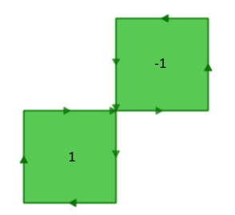
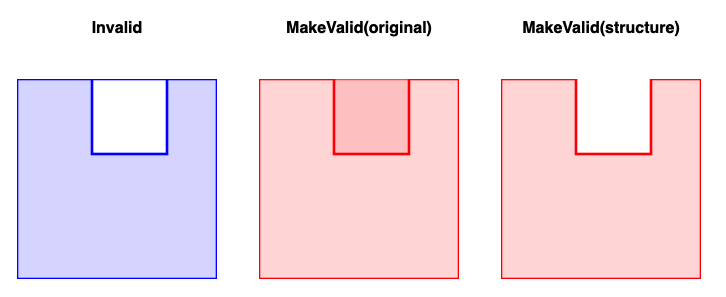
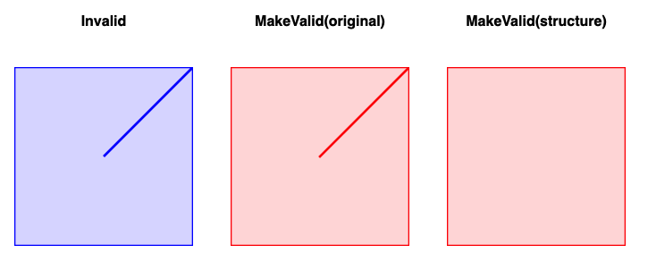

# Waiting for PostGIS 3.2: ST_MakeValid

One of the less visible improvements coming in PostGIS 3.2 (via the GEOS 3.10 release) is a new algorithm for repairing invalid polygons and multi-polygons. 

Algorithms like polygon intersection, union and difference rely on guarantees that the structure of inputs follows certain rules. We call geometries that follows those rules "valid" and those that do not "invalid".

The rules are things like:

* Polygon rings should not cross themselves
* Polygon rings should not cross other rings
* Multipolygons components should neither touch nor overlap

When geometries disobey these rules, algorithms return "funny" results.



This invalid "figure 8" polygon will return an [ST_Area()](https://postgis.net/docs/ST_Area.html) of 0.0, because the area of one lobe cancels out the area of the other.

## Repairing Invalid Polygons

PostGIS has had an [ST_MakeValid()](https://postgis.net/docs/manual-dev/ST_MakeValid.html) function since version 2.0, but with 3.2 it will be adding a new repair algorithm. The new algorithm tries to use the structure of the lines to generate a "best guess" repair. It also works at a lower structural level, so it has higher performance than the old algorithm.

An additional parameter has been added to [ST_MakeValid()](https://postgis.net/docs/manual-dev/ST_MakeValid.html), so you can choose the algorithm you want.

```sql
-- Old 'linework' algorithm
SELECT ST_AsText(ST_MakeValid(
  'POLYGON((0 0, 0 1, 1 1, 2 1, 2 2, 1 2, 1 1, 1 0, 0 0))', 
  'method=linework'));

-- New 'structure' algorithm
SELECT ST_AsText(ST_MakeValid(
  'POLYGON((0 0, 0 1, 1 1, 2 1, 2 2, 1 2, 1 1, 1 0, 0 0))', 
  'method=structure'));
```

For simple cases, both algorithms return the same result. In this case the figure-eight polygon is repaired by converting it into a multipolygon with a square component for each lobe.

## Algorithm Differences

The original algorithm is called "linework" because it endeavors to preserve every edge and vertex in the original input. The new algorithm is called "structure" because it tries to reason from the structure of the input (exterior rings bound area, interior holes exclude area) to find the "correct" repair.

In truth there is no "correct" answer for many repairs, only differences of opinion.



Here the different approaches show a difference. The old algorithm preserves the zero-width edge where the hole and shell overlap, the new one subtracts the hole from the shell.


Here, the old algorithm preserves every edge in an overlapping multi-polygon case, resulting in a checkerboard, while the new algorithm reasons that the correct representation of the two overlapping polygons is the union of their areas.



In general the new algorithm is less tolerance of zero-width edge pairs than the old one, as in this case of a zero-width gore in a shell, which the new algorithm simply drops as irrelevant to the structure of the polygon.

The new algorithm was tested against 75 different kinds of invalid inputs, and we have published [a page where you can see the cases and how the two algorithms repaired them](http://s3.cleverelephant.ca/invalid.html).

## Performance Differences

Using the 75 invalid inputs, and comparing the two algorithms repairing those inputs, we found that the new algorithm is **2.7 times** faster than the old algorithm. Most people do not have a lot of invalid geometry to repair, but for those that do, the new implementation is a huge improvement.

## Putting Repair in Action

If you are accepting new geometry from third parties and want to ensure your calculations remain robust, it might make sense to pre-validate them on insert and update, and then pre-emptively repair them before storing them.

```sql
CREATE FUNCTION ensure_geometry_valid() 
  RETURNS trigger AS 
$$
    BEGIN
        -- Check that empname and salary are given
        IF NOT ST_IsValid(NEW.geom) THEN
            NEW.geom = ST_MakeValid(NEW.geom, 'method=structure');
        END IF;

        RETURN NEW;
    END;
$$ LANGUAGE plpgsql;

CREATE TRIGGER geometry_valid 
  BEFORE INSERT OR UPDATE 
  ON mytable
  FOR EACH ROW EXECUTE FUNCTION ensure_geometry_valid();
```

## Conclusions

* Geometry validity is worth keeping track of, using [ST_IsValid()](https://postgis.net/docs/ST_IsValid.html), to avoid algorithm failures
* Geometry can be repaired using [ST_MakeValid()](https://postgis.net/docs/manual-dev/ST_MakeValid.html)
* The new "method=structure" algorithm offers a higher performance and maybe "more correct" (depending on who you ask) take on geometry repair


