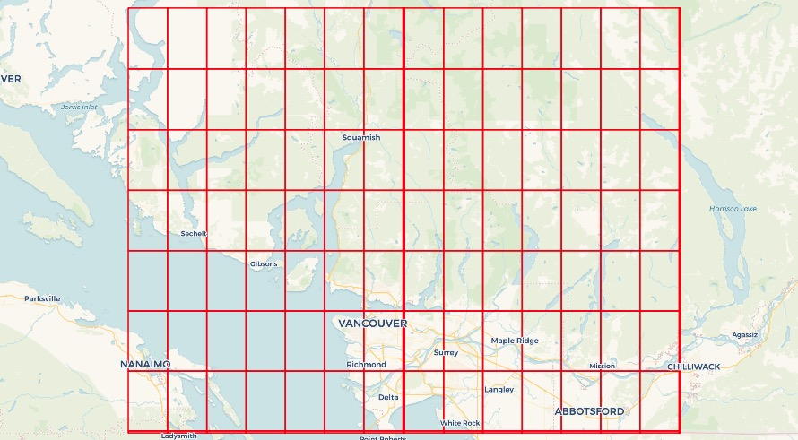
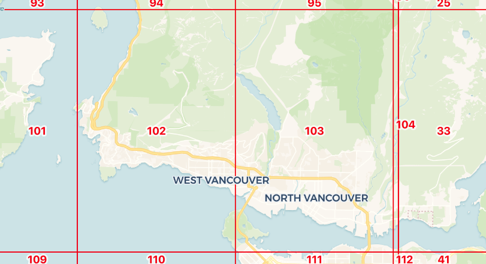
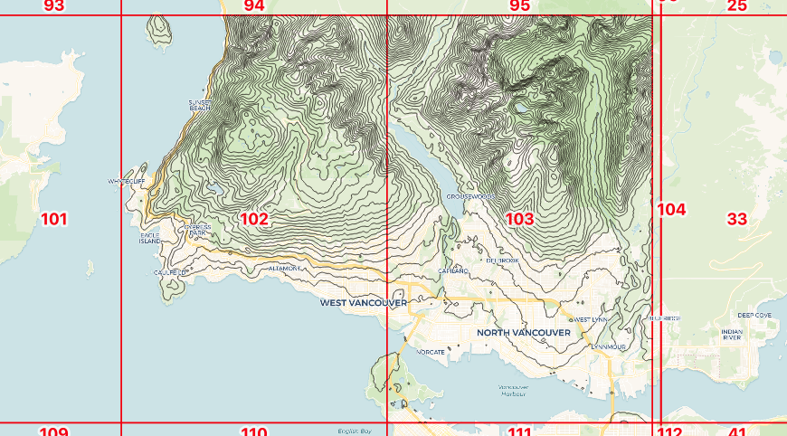
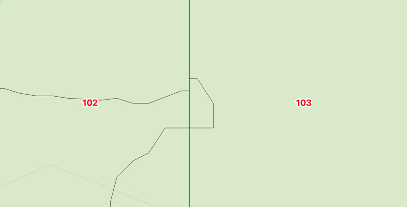
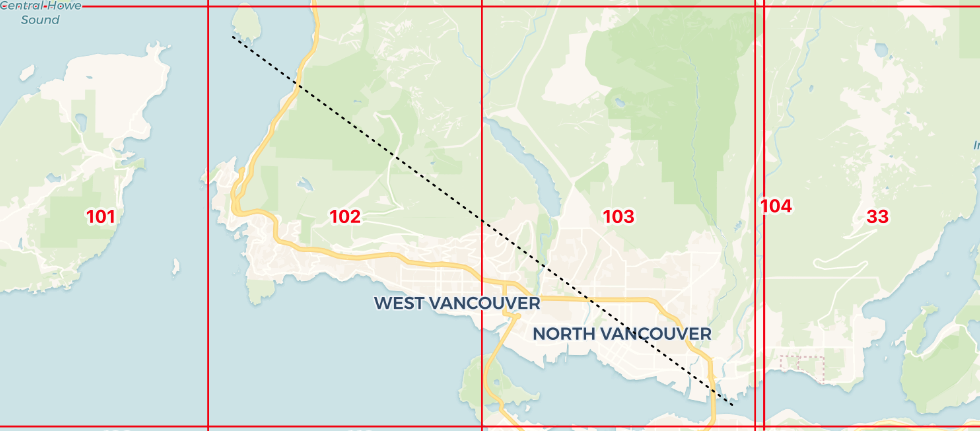
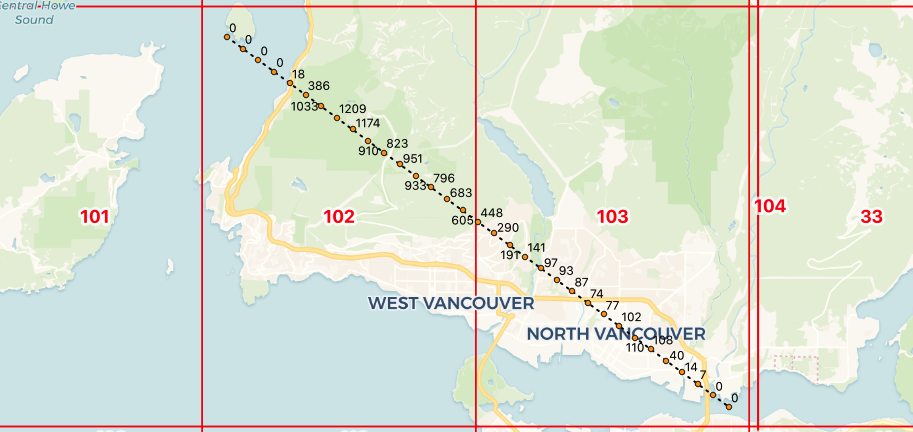

# Waiting for PostGIS 3.2: ST_Contour and ST_SetZ

One theme of the 3.2 release is new analytical functionality in the raster module, and [access to cloud-based rasters](https://blog.crunchydata.com/postgis-raster-and-crunchy-bridge) via the "out-db" option for rasters. Let's explore two new functions and exercise cloud raster support at the same time.


## OpenTopography

Can you believe that there is a complete raster data set of all [SRTM](https://www2.jpl.nasa.gov/srtm/) elevation data online, in [cloud optimized GeoTIFF](https://www.cogeo.org/) format? It's true, there is (and much more), at [OpenTopography](https://www.opentopography.org/)!

The [SRTM data set](https://portal.opentopography.org/raster?opentopoID=OTSRTM.082015.4326.1) is a collection of 14380 files, with a pixel size of one arc-second. Each file has one degree of data, so 3600 by 3600 pixels.

Since the gridding is arc-seconds, the actual on-the-ground resolution varies by latitude, getting finer further north. We are going to be working in the area of Vancouver, Canada, and we can calculate the pixel size for that location.

```sql
WITH coord AS (
  SELECT 49.0 AS lat, -123.0 AS lon
)
SELECT ST_Length(
  ST_MakeLine(
    ST_MakePoint(lon, lat), 
    ST_MakePoint(lon + 1/3600.0, lat + 1/3600.0)
    )::geography)
FROM coord;
```

So we have a pixel size of about **37 meters** at 49 degrees north latitude. 


## Preparing the Database and Data

As we did in our last cloud raster outing, we need to prepare the database (which for this post is named "opentopo") for "out-db" usage.

```sql
-- Enable PostGIS and PostGIS Raster
CREATE EXTENSION postgis;
CREATE EXTENSION postgis_raster;

-- Allow access to external data and formats
ALTER DATABASE opentopo SET postgis.enable_outdb_rasters = true;
ALTER DATABASE opentopo SET postgis.gdal_enabled_drivers TO 'ENABLE_ALL';
```

If we examine the contents of the [SRTM VRT manifest](https://opentopography.s3.sdsc.edu/raster/SRTM_GL1/SRTM_GL1_srtm.vrt) we can find the URL of an individual file and get some metadata about it using `gdalinfo`:

```sh
gdalinfo https://opentopography.s3.sdsc.edu/raster/SRTM_GL1/SRTM_GL1_srtm/N49W123.tif
```

Importantly, this metadata includes the internal tiling (`Block=512x512`) of the COG file, which we will use when generating our own "out-db" tiles in PostGIS.

We load the two files that cover the Greater Vancouver area. The first load command uses "create" mode (`-c`) and the second uses "append" (`-a`).

```sh
url=https://opentopography.s3.sdsc.edu/raster/SRTM_GL1/SRTM_GL1_srtm
raster2pgsql -c -F -Y -s 4326 -t 512x512 -I -R /vsicurl/$url/N49W123.tif dem | psql -d opentopo
raster2pgsql -a -F -Y -s 4326 -t 512x512 -I -R /vsicurl/$url/N49W124.tif dem | psql -d opentopo
```

When the load is finished, we have 128 raster objects loaded in the `dem` table in our database.



If you want to see a map like this one, of the extents of rasters, just create a view that extracts the raster boundaries as geometry.

```
CREATE VIEW dem_rasters AS 
SELECT rid, ST_ConvexHull(rast) AS geom 
FROM dem;
```


## Contouring

We will generate some contours for the "north shore" of Vancouver, where the mountains rise up from the sea. The key in doing raster analysis is to **only pull the data you really need**, because the data are large, and the computations expensive, so we pull only the two raster objects that cover our area of interest.



The [ST_Contour](http://postgis.net/docs/manual-dev/RT_ST_Contour.html) function has a number of parameters to control the starting contour, the distance between contours, and even to exactly fix the values at which contours are generated. Except for the first parameter, the raster itself, all the others are optional and will default to sensible values.

```
ST_Contour(raster rast, 
  integer bandnumber, 
  double precision level_interval, 
  double precision level_base, 
  double precision[] fixed_levels, 
  boolean polygonize);
```

Now we run the  function on the rasters of interest. The [ST_Contour](http://postgis.net/docs/manual-dev/RT_ST_Contour.html) function returns a set of tuple values (geom, id, value), so we can write the results directly into a table structure. 

```sql
CREATE TABLE contours AS
  SELECT (ST_Contour(
    rast, 
    bandnumber => 1, 
    level_interval => 50)).*
  FROM dem
  WHERE rid IN (102, 103)
```

Generating the 378 contour lines takes about 200ms.



These contours have been generated one raster chip at a time, so as you might expect, there are some inconsistencies at the **raster boundaries**.



We can get rid of edge effects by first merging together neighboring rasters with [ST_Union](http://postgis.net/docs/manual-dev/RT_ST_Union.html) before running the contour process on the single unified raster.

```sql
DELETE FROM contours;
INSERT INTO contours
  SELECT (ST_Contour(
    ST_Union(rast), 
    bandnumber => 1, 
    level_interval => 100)).*
  FROM dem
  WHERE rid IN (102, 103);
```


## Reading Values

Once you have access to a cloud raster data set, a common use case is to ask "what is the value of the raster at this point?"

The raster module has long had an [ST_Value](http://postgis.net/docs/manual-dev/RT_ST_Value.html) function to do just that, but for the 3.2 release, it is enhanced with a "resample" parameter to control the algorithm used to calculate the value.

The existing algorithm is just a "nearest neighbor" method: the value returned is the value of the pixel nearest the sample point. Here, we take a "nearest" sample:

```sql
WITH pt AS (
  SELECT ST_GeomFromText('POINT(-123.077048 49.382430)',4326) AS geom
)
SELECT ST_Value(rast, 1, geom) AS value
FROM dem, pt
WHERE ST_Intersects(ST_ConvexHull(rast), geom);
```

The nearest pixel has an elevation of **1082 meters**. What about the "bilinear" method at **exactly** that point? 

```sql
WITH pt AS (
  SELECT ST_GeomFromText('POINT(-123.077048 49.382430)',4326) AS geom
)
SELECT ST_Value(rast, 1, geom, resample => 'bilinear') AS value
FROM dem, pt
WHERE ST_Intersects(ST_ConvexHull(rast), geom);
```

Using [bilinear interpolation](https://en.wikipedia.org/wiki/Bilinear_interpolation), the value is actually **1083.83 meters**.


## Reading Many Values

What if we want to extract not just one value at a point, but an entire elevation profile?



The [ST_SetZ](http://postgis.net/docs/manual-dev/RT_ST_SetZ.html) function allows us to copy values off of a raster, one value for each vertex in the input object, for instance here we copy values onto our elevation profile line.

```sql
WITH transect AS (
    SELECT ST_GeomFromText(
      'LINESTRING(-123.27614 49.42094, -123.01514 49.29564)', 
      4326) AS geom
),
rast AS (
  SELECT ST_Union(dem.rast) AS rast
  FROM dem
  JOIN transect
  ON ST_Intersects(transect.geom, ST_ConvexHull(dem.rast))
)
SELECT ST_AsText(ST_SetZ(rast.rast, transect.geom, resample => 'bilinear')) AS geom
FROM transect, rast;
```

```
LINESTRING Z (-123.27614 49.42094 0,-123.01514 49.29564 0)
```

Unfortunately this just returns the elevation of the **line endpoints**, which are both **zero** since the ends of the line are in the ocean! 

We need to add vertices to our line at regular intervals, to generate a nice elevation profile, and fortunately there is a function to do exactly that, [ST_Segmentize](http://postgis.net/docs/ST_Segmentize.html).

```sql
CREATE TABLE transect AS
WITH transect AS (
  SELECT ST_Segmentize(
    ST_GeogFromText('LINESTRING(-123.27614 49.42094, -123.01514 49.29564)'),
    1000
    )::geometry
  AS geom
),
rast AS (
  SELECT ST_Union(dem.rast) AS rast
  FROM dem
  JOIN transect
  ON ST_Intersects(transect.geom, ST_ConvexHull(dem.rast))
),
z AS (
  SELECT (ST_DumpPoints(ST_SetZ(rast.rast, transect.geom, resample => 'bilinear'))).*
  FROM rast
  CROSS JOIN transect
)
SELECT round(ST_Z(geom)) AS z, geom
FROM z;
```

This is a complex multi-step process, but roughly what happens is:

* The profile line is segmentized every 1000 meters, doing the work in the "geography" type, so we get 100 meter spacing even though we are feeding in a line string in geographic coordinates.
* The profile line is used to find the rasters we need, and those rasters are unioned into a single working raster.
* The elevation values are now copied into the profile line with [ST_SetZ](http://postgis.net/docs/manual-dev/RT_ST_SetZ.html).
* Finally the profile line is dumped into its component vertices so we can easily read out the results, and label them on a map.

The result on a map looks like this:



The elevations could also be turned into a line graph, but we leave that as an exercise to the reader.


## Conclusions

* PostGIS raster has new value reading functions values into geometry vertices, ST_SetZ](http://postgis.net/docs/manual-dev/RT_ST_SetZ.html) and ST_SetM](http://postgis.net/docs/manual-dev/RT_ST_SetM.html).
* All PostGIS value reading functions, including [ST_Value](http://postgis.net/docs/manual-dev/RT_ST_Value.html), support resampling methods, like "nearest", "average" and "bilinear".
* PostGIS raster now supports contour generation with [ST_Contour](http://postgis.net/docs/manual-dev/RT_ST_Contour.html), so any continuous value raster can be converted into a set of isolines.


