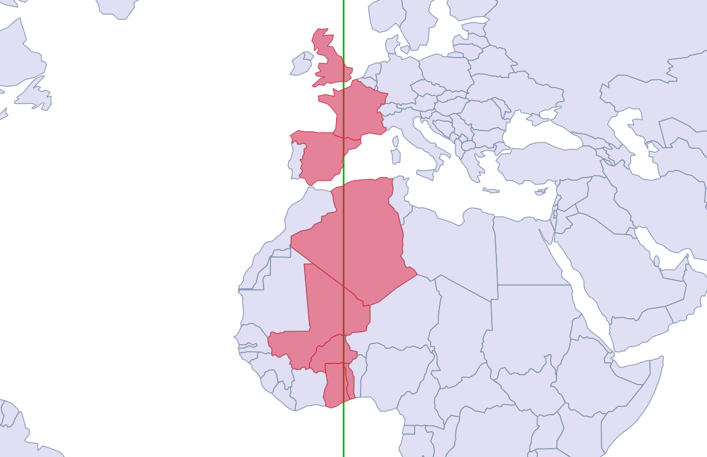

# XKCD Bad Map Projection

Last week, [Randall Munroe](https://en.wikipedia.org/wiki/Randall_Munroe) dropped his latest [XKCD](https://xkcd.com) "Bad Map Projection", number six, "[ABS(Longitude)](https://xkcd.com/2807/)", which looks like this:


Truly this is a bad map projection, on a par with the previous five:

* [Liquid Resize](https://xkcd.com/1784/)
* [Time Zones](https://xkcd.com/1799/)
* [South America](https://xkcd.com/2256/)
* [Greenland Special](https://xkcd.com/2489/)
* [Madagascator](https://xkcd.com/2613/)

The last two are just applications of common map projections with very uncommon projection parameters that accentuate certain areas of the globe, a cartographic version of the classic ["View of the World from 9th Avenue"](https://en.wikipedia.org/wiki/View_of_the_World_from_9th_Avenue).


A colleague asked me if we could recreate [ABS(Longitude)](https://xkcd.com/2807/) and I figured it was worth a try!

## Getting Data

At a minimum, we want a countries layer and some independent place labels to provide context, which is available at the first stop for basic global data, [Natural Earth](https://www.naturalearthdata.com/downloads/110m-cultural-vectors/
).

We have been playing with `ogr2ogr` and weird [remote access tricks](https://www.crunchydata.com/blog/remote-access-anything-from-postgres) lately, so I used `ogr2ogr` to load the data in one step.

```bash
# Load the countries and places directly from the remote
# zip file into the working PostgreSQL database

ogr2ogr \
 -f PostgreSQL \
 -nlt PROMOTE_TO_MULTI \
 -lco OVERWRITE=yes \
 -lco GEOMETRY_NAME=geom \
 postgresql://postgres@localhost/xkcd \
 /vsizip//vsicurl/https://www.naturalearthdata.com/http//www.naturalearthdata.com/download/110m/cultural/ne_110m_admin_0_countries.zip

ogr2ogr \
 -f PostgreSQL \
 -lco OVERWRITE=yes \
 -lco GEOMETRY_NAME=geom \
 postgresql://postgres@localhost/xkcd \
 /vsizip//vsicurl/https://www.naturalearthdata.com/http//www.naturalearthdata.com/download/110m/cultural/ne_110m_populated_places.zip
```

## Preparing the Data

Now we have the data in the database, read to go!


The process we are going to apply will be transforming the shapes one polygon at a time, and the Natural Earth data models the countries with one **MultiPolygon** per country. 


Canada, for example, is one country, but 30 polygons. 

We want a table with just one row for each polygon, so we "dump" all the multi-poygons using [ST_Dump()](https://postgis.net/docs/ST_Dump.html).

```sql
CREATE SEQUENCE country_id;

CREATE TABLE countries AS
  SELECT nextval('country_id') AS id, 
    name, 
    (ST_Dump(geom)).geom::geometry(Polygon, 4326) AS geom
  FROM ne_110m_admin_0_countries;
```

Next, because we are going to be processing western shapes with negative logitude different from eastern shapes we have to solve the problem: what to do with shapes that straddle the [prime meridian](https://en.wikipedia.org/wiki/Prime_meridian)?


The answer: [ST_Split()](https://postgis.net/docs/ST_Split.html)! 

First we create a prime meridian geometry to use as a "splitting blade".

```sql
CREATE TABLE lon_0 AS 
  SELECT ST_SetSrid(
    ST_MakeLine(
      ST_MakePoint(0,90),
      ST_MakePoint(0,-90)),
    4326)::geometry(LineString, 4326) AS geom;
```

Then we apply that blade to all the shapes that full under it.

```sql
CREATE TABLE split_at_0 AS
  SELECT id, name, ST_CollectionHomogenize(
    ST_Split(c.geom, lon_0.geom))::geometry(MultiPolygon, 4326) AS geom
  FROM countries c
  JOIN lon_0 
  ON ST_Intersects(c.geom, lon_0.geom);
```

Surprisingly few countries end up chopped by the meridian. 



The output of the split is, for each input polygon, a multi-polygon of the components. But we want to operate on the shapes one polygon at a time, so again, we must dump the multi-polygon into its components.

A slightly longer query dumps the split shapes, and stores them in a table with the rest of the un-split polygons, labelling each shape depending on whether it is "west" or "east" of the prime meridian.

```sql
CREATE TABLE countries_split AS
WITH split AS (
  SELECT id, name, (ST_Dump(geom)).geom::geometry(Polygon, 4326) AS geom
  FROM split_at_0
)
SELECT c.id, c.name, c.geom, 
  CASE WHEN ST_X(ST_StartPoint(c.geom)) >= 0 THEN 'east' ELSE 'west' END AS side 
FROM countries c
LEFT JOIN split s
USING (id)
WHERE s.id IS NULL
UNION ALL
SELECT s.id, s.name, s.geom,
  CASE WHEN ST_X(ST_StartPoint(s.geom)) >= 0 THEN 'east' ELSE 'west' END AS side 
FROM split s;
```

We have divided the west from the east, and are ready for the final step.


## Flipping the West

Now we are ready to apply a transformation to all the "west" countries, to turn their negative longitudes into positive ones.

To do this, we will use the powerful [ST_Affine()](https://postgis.net/docs/ST_Affine.html) function.

The two-dimensional form of the function looks like this:

```
ST_Affine(geom, a, b, d, e, xoff, yoff)
```

Where the parameter correspond to an affine transformation matrix like this:

```
a  b  xoff
d  e  yoff
0  0     1
```

Or, in equation form:

```
x' = a*x + b*y + xoff
y' = d*x + e*y + yoff
z' = z 
```

From the equation it is pretty clear, we want to negate the input **x** and leave everything else alone.

* a = -1
* b = 0
* d = 0 
* e = 1

In order to get a pretty map, we'd like the output data to be centered on the prime meridian again, so:

* xoff = 90
* yoff = 0

And in SQL like this:

```sql
CREATE TABLE countries_affine AS
  SELECT id, name,
    CASE WHEN SIDE = 'west' 
         THEN ST_Affine(geom, -1, 0, 0, 1, -90, 0)
         ELSE ST_Affine(geom, 1, 0, 0, 1, -90, 0)
    END AS geom
  FROM countries_split;

CREATE TABLE places_affine AS
  SELECT ogc_fid AS id, name,
    CASE WHEN ST_X(geom) < 0
         THEN ST_Affine(geom, -1, 0, 0, 1, -90, 0)
         ELSE ST_Affine(geom, 1, 0, 0, 1, -90, 0)
    END AS geom
  FROM ne_110m_populated_places
  ORDER BY pop_max DESC;
```

And the final result on the map looks like this:


The bad map projections aren't the only cartographic cartoons XKCD explored. If you liked this one, take a look at:

* [Map Projections](https://xkcd.com/977/), all real!
* [World According to Americans](https://xkcd.com/850/)
* [Upside Down](https://xkcd.com/1500/)
* [Map Age Guide](https://xkcd.com/1688/), fascinating history!

